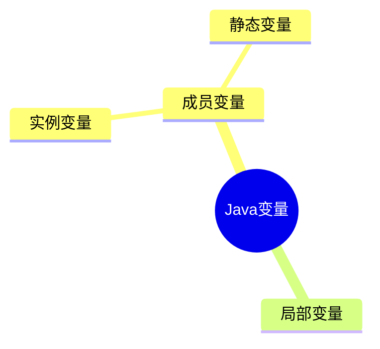

---
分类:
  - "[[01-JavaSE]]"
关联笔记:
描述: Java 基本语法：标识符、关键字、字面量、变量、数据类型、底层存储与进制、运算符等基础要素
排序: 2000
分组:
创建时间: 2026年06月26日
---
# 基本语法
## 标识符

> [!note] 定义
> Java标识符（Identifier）是程序中用来`命名`变量、方法、类、接口、包等元素的`名称`。

```java
--8<-- "code/java/basics/javase-demo/src/main/java/com/luguosong/basicsyntax/identifier/IdentifierOverview.java"
```

### 命名规则和规范

> [!note] 规则 vs 规范
> - **规则**：需要==强制执行==的要求，违反会导致编译不通过。
> - **规范**：良好的习惯和约定，遵守可提升代码可读性，但不强制。

#### 命名规则

由字母、数字、下划线 `_`、美元符号 `$` 组成；不能以数字开头、不能是关键字、区分大小写、长度无限制。其中"字母"指任意国家文字（Java 支持 Unicode）。

```java
--8<-- "code/java/basics/javase-demo/src/main/java/com/luguosong/basicsyntax/identifier/NamingRule.java"
```

#### 命名规范

总则：==见名知意==，采用==驼峰式==命名。各类标识符约定如下：

| 适用对象 | 命名规范 | 示例 |
|---|---|---|
| 类、接口、枚举、注解 | 大驼峰（每个单词首字母大写） | `StudentService`、`UserService` |
| 变量、方法 | 小驼峰（首字母小写，后续单词首字母大写） | `doSome`、`doOther` |
| 常量 | 全大写，单词间用下划线连接 | `LOGIN_SUCCESS`、`SYSTEM_ERROR` |
| 包名 | 全部小写 | `com.luguosong.demo` |

## 关键字

> [!note] 定义
> Java 语言规范预定义的`保留字`，编译器赋予其特殊语义，**不可用作`标识符`**。

其中一部分随 JDK 版本演进而引入的关键字为「上下文关键字」——仅在特定语法位置作为关键字，其它位置仍可作标识符（Java 借此在不破坏既有代码的前提下演进语言）。

下面按用途分类整理，新引入的关键字在括号内标注版本。

> [!note] `true` / `false` / `null` 不是关键字
> 它们看起来像关键字，其实是**字面量**（literals），同样不能作为标识符使用。

**数据类型**

| | | | | |
|---|---|---|---|---|
| `boolean` | `byte` | `char` | `short` | `int` |
| `long` | `float` | `double` | `void` | |

**流程控制**

| | | | | |
|---|---|---|---|---|
| `if` | `else` | `switch` | `case` | `default` |
| `when`（JDK 21，模式匹配守卫） | `for` | `do` | `while` | `break` |
| `continue` | `return` | `yield`（JDK 14，switch 表达式返回值） | `assert`（JDK 1.4 新增） | |

**访问修饰符**

| | | | | |
|---|---|---|---|---|
| `public` | `protected` | `private` | |

**类、接口与对象**

| | | | | |
|---|---|---|---|---|
| `class` | `interface` | `enum`（JDK 5.0 新增） | `record`（JDK 16，记录类） | `value`（JDK 26 预览，值类） |
| `extends` | `implements` | `sealed`（JDK 17，密封类） | `permits`（JDK 17，授权子类型） | `non-sealed`（JDK 17，取消密封） |
| `new` | `this` | `super` | `instanceof` | |

**成员修饰符**

| | | | | |
|---|---|---|---|---|
| `final` | `abstract` | `static` | `native` | `transient` |
| `volatile` | `synchronized` | `strictfp`（JDK 1.2 新增） | | |

**异常处理**

| | | | | |
|---|---|---|---|---|
| `try` | `catch` | `finally` | `throw` | `throws` |

**包与声明**

| | | | | |
|---|---|---|---|---|
| `package` | `import` | `var`（JDK 10，局部变量类型推断） | `_`（JDK 22，未命名变量） | |

**模块系统**（均为 JDK 9 引入）

| | | | | |
|---|---|---|---|---|
| `module` | `open` | `requires` | `transitive` | `exports` |
| `opens` | `to` | `uses` | `provides` | `with` |

**保留未使用**

| | | | | |
|---|---|---|---|---|
| `const` | `goto` | | | |
## 字面量

> [!note] 定义
> `字面量`是源代码中值的直接表示，编译器在编译期即可确定其`类型`和`值`，无需运算或方法调用。

```java
--8<-- "code/java/basics/javase-demo/src/main/java/com/luguosong/basicsyntax/literal/LiteralDemo.java"
```

## 变量

> [!note] 定义
> `变量`是程序在运行期间可以改变其`值`的命名存储单元。
>
> 本质上是：一块`内存空间`的符号化引用。

变量三要素：

- 数据类型
- 变量名
- 变量值

```java
--8<-- "code/java/basics/javase-demo/src/main/java/com/luguosong/basicsyntax/variable/VariableElements.java"
```

```java
--8<-- "code/java/basics/javase-demo/src/main/java/com/luguosong/basicsyntax/variable/VariableDeclare.java"
```

> [!tip] 变量的作用
> - 便于代码的维护
> - 增强代码的可读性

```java
--8<-- "code/java/basics/javase-demo/src/main/java/com/luguosong/basicsyntax/variable/VariableDetail.java"
```

### 作用域

> [!note] 定义
> `作用域`（Scope）是变量在程序中`可见`且`可被访问`的代码区域。变量只在声明它的作用域内有效，出了作用域就不再存在、也无法引用。

```java
--8<-- "code/java/basics/javase-demo/src/main/java/com/luguosong/basicsyntax/variable/ScopeDemo.java"
```
### 变量分类

> [!note] 定义
> Java 变量按`声明位置`分为两大类：`成员变量`（类中、方法外）和`局部变量`（方法 / 代码块内）。`成员变量`又按是否有 `static` 修饰，细分为`实例变量`和`静态变量`。



| 变量类型 | 声明位置 | static | 属于 | 默认值 |
|---|---|---|---|---|
| `局部变量` | 方法体 / 代码块 `{}` | 不可加 | 方法调用 | 无，必须显式初始化 |
| `实例变量` | 类中、方法外 | 无 | 对象实例 | 有（`0` / `null` / `false`） |
| `静态变量` | 类中、方法外 | 有 | 类本身 | 有（`0` / `null` / `false`） |

> [!note] 成员变量 = 实例变量 + 静态变量
> `成员变量`是总称，指所有声明在「类中、方法外」的变量。其中不带 `static` 的是`实例变量`，带 `static` 的是`静态变量`（又称类变量）。三者是**包含关系**，不是并列。

```java
--8<-- "code/java/basics/javase-demo/src/main/java/com/luguosong/basicsyntax/variable/VariableDemo.java"
```
## 数据类型

Java 是==强类型语言==：每个变量在使用前必须声明类型，且类型在编译期就确定。

### 基本数据类型

基本类型（primitive type）共 8 种，==直接存储数值本身==，分配在栈上（局部变量）或对象内（成员变量）。先看一张总表，掌握占用空间、取值范围与默认值：

#### 总表

| 分类  | 类型        | 占用字节 | 取值范围                                       | 默认值        | 说明                    |
| --- | --------- | ---- | ------------------------------------------ | ---------- | --------------------- |
| 整数型 | `byte`    | 1    | -128 ~ 127                                 | `0`        | 最小的整数，常用于节约内存         |
| 整数型 | `short`   | 2    | -32768 ~ 32767                             | `0`        | 很少使用                  |
| 整数型 | `int`     | 4    | -2147483648 ~ 2147483647（约 ±21 亿）          | `0`        | ==整数默认类型==，最常用        |
| 整数型 | `long`    | 8    | -9223372036854775808 ~ 9223372036854775807 | `0L`       | 表示超大整数                |
| 浮点型 | `float`   | 4    | 约 ±3.4E38（6~7 位有效数字）                       | `0.0F`     | 单精度，需加 `F` 后缀         |
| 浮点型 | `double`  | 8    | 约 ±1.8E308（15 位有效数字）                       | `0.0`      | ==浮点数默认类型==           |
| 字符型 | `char`    | 2    | 0 ~ 65535                                  | `'\u0000'` | ==无符号==，存储 Unicode 字符 |
| 布尔型 | `boolean` | —    | `true` / `false`                           | `false`    | 规范未定义位数               |

> [!warning] 默认值
> 只有成员变量才有默认值，局部变量声明不赋值直接使用会报错

> [!note] 取值范围怎么来的
> - ==有符号整数==（byte/short/int/long）：最高位是符号位，n 位的范围是 `-2ⁿ⁻¹ ~ 2ⁿ⁻¹−1`（详见 [[原码反码补码]]）。
> - `char` ==无符号==：16 位全部表示数值，范围 `0 ~ 2¹⁶−1 = 65535`。
> - `float` / `double` 遵循 IEEE 754，范围庞大但精度有限（见下方浮点型小节）。

> [!tip] 常量速查
> 无需死记数字，Java 提供了包装类的常量：`Byte.MAX_VALUE`、`Integer.MIN_VALUE`、`Long.MAX_VALUE` 等，直接打印即可查看。

#### 整数型

`byte`、`short`、`int`、`long` 四种，都是==有符号==的整数（Java 没有 `unsigned` 关键字）。

**整数字面量==默认是 `int`==** —— 这是贯穿下面所有赋值场景的关键事实：字面量先按 `int` 解析，再根据左侧类型决定是直接赋值、自动拓宽，还是需要后缀/强转。

**`int`（默认类型）** —— 直接赋值，超出 ±21 亿即编译报错：

```java
--8<-- "code/java/basics/javase-demo/src/main/java/com/luguosong/basicsyntax/datatype/IntegerIntDemo.java"
```

**`long`（超大整数）** —— 超 `int` 范围必须加 `L` 后缀（小写 `l` 形似数字 `1`，禁用）：

```java
--8<-- "code/java/basics/javase-demo/src/main/java/com/luguosong/basicsyntax/datatype/IntegerLongDemo.java"
```

**`byte` / `short`（节约内存）** —— 仅当右侧是==编译期常量==且在目标范围内，才自动收窄（JLS §5.2）；一旦参与运算就会提升为 `int`：

```java
--8<-- "code/java/basics/javase-demo/src/main/java/com/luguosong/basicsyntax/datatype/ByteShortDemo.java"
```

**日常选型** —— 几乎只用 `int`；数值可能超过 ±21 亿（人口、时间戳毫秒数）才用 `long`；`byte`/`short` 多用于节约内存或 IO/网络协议的字节处理。

> [!tip] 判断口诀
> 看到 `byte/short = ...`，问自己两个问题：**①右侧是不是编译期就能确定的常量？②这个值在不在目标类型范围内？** 两个都"是"才能省掉强转；只要有一个"否"，就得写 `(byte)`/`(short)` 强转（可能丢失精度）。

#### 浮点型

`float`（单精度，精确到7位小数）和 `double`（双精度，精确到15位小数），遵循 IEEE 754 标准。

**默认类型与后缀** —— 浮点字面量==默认是`double`==。声明 `float` 必须加 `F` 后缀：

```java
--8<-- "code/java/basics/javase-demo/src/main/java/com/luguosong/basicsyntax/datatype/FloatTypeDemo.java"
```

底层存储原理：

![[Pasted image 20260711183241.png]]

指数位取值范围 -126 ~ 127。

浮点型参与运算得出的结果是==近似值==，因此==不要用 `==` 对浮点结果做相等比较==：

```java
--8<-- "code/java/basics/javase-demo/src/main/java/com/luguosong/basicsyntax/datatype/FloatCompareDemo.java"
```

```java
--8<-- "code/java/basics/javase-demo/src/main/java/com/luguosong/basicsyntax/datatype/FloatPrecisionDemo.java"
```

> [!warning] 浮点数不能精确表示十进制小数
> 浮点数采用二进制存储，`0.1` 这样的十进制小数在二进制下是无限循环，无法精确表示。因此涉及金额、利率等精度敏感场景，应使用 `java.math.BigDecimal`，避免 `float`/`double` 直接运算。

#### 字符型

`char` 是==无符号==的 16 位整数，存储一个 Unicode 字符，范围 `0 ~ 65535`。

```java
--8<-- "code/java/basics/javase-demo/src/main/java/com/luguosong/basicsyntax/datatype/CharTypeDemo.java"
```

char 的取值范围 `0 ~ 65535` 即 Unicode 基本多文种平面（BMP），各区段分布如下：

（`U+XXXX` 是十六进制 Unicode 码点，即上文 `char c2 = 65`、`'A'` 那个码点的十六进制写法；如 `U+0041` = 十进制 `65` = `'A'`。）

| 字符类别                              | Unicode / 十进制                  | 示例                      |
| --------------------------------- | ------------------------------ | ----------------------- |
| 控制字符                              | U+0000 ~ U+001F（0 ~ 31）        | 换行、制表符（不可打印）            |
| 英文 / 数字 / 基本符号（ASCII）             | U+0020 ~ U+007E（32 ~ 126）      | `A`、`0`、`@`             |
| 控制字符（扩展）                          | U+007F ~ U+009F（127 ~ 159）     | `DEL` 等                 |
| 拉丁字母扩展（西欧 / 越南语 / 拼音）             | U+00A0 ~ U+024F（160 ~ 591）     | `é`、`ü`、`ā`             |
| 音标 / 修饰符 / 组合符号                   | U+0250 ~ U+036F（592 ~ 879）     | `ə`、组合重音                |
| 希腊 / 西里尔字母（俄语等）                   | U+0370 ~ U+04FF（880 ~ 1279）    | `α`、`Ω`、`Д`             |
| 其它语言文字（希伯来 / 阿拉伯 / 泰 / 藏等）        | U+0500 ~ U+1FFF（1280 ~ 8191）   | `ש`、`ا`、`ก`             |
| 各类符号（标点 / 货币 / 数学 / 箭头 / 图形 / 盲文） | U+2000 ~ U+2BFF（8192 ~ 11263）  | `€`、`→`、`★`、`⠿`（盲文）     |
| CJK 部首（康熙 / 补充）/ 历史文字             | U+2C00 ~ U+2FFF（11264 ~ 12287） | `⼀`（康熙部首）               |
| CJK 标点符号                          | U+3000 ~ U+303F（12288 ~ 12351） | `，`、`。`、全角空格            |
| 日文假名（平假名 + 片假名）                   | U+3040 ~ U+30FF（12352 ~ 12543） | `あ`、`ア`                 |
| 韩文兼容字母 / 注音符号                     | U+3100 ~ U+33FF（12544 ~ 13311） | `ㄱ`、`ㄅ`                 |
| CJK 扩展汉字 A / 易经卦象                 | U+3400 ~ U+4DFF（13312 ~ 19967） | `㐀`（生僻字）                |
| CJK 统一汉字（中日韩常用字）                  | U+4E00 ~ U+9FFF（19968 ~ 40959） | `中`、`文`、`字`             |
| 彝文等少数民族文字                         | U+A000 ~ U+ABFF（40960 ~ 44031） | `ꀀ`（彝文）                 |
| 韩文音节（含扩展字母）                       | U+AC00 ~ U+D7FF（44032 ~ 55295） | `가`、`한`                 |
| 代理区 Surrogate（UTF-16 占位，非真实字符）    | U+D800 ~ U+DFFF（55296 ~ 57343） | 无，保留区                   |
| 私用区 PUA（自定义字符）                    | U+E000 ~ U+F8FF（57344 ~ 63743） | 无统一定义                   |
| 兼容汉字 / 各种展示形式（含 BOM `U+FEFF`）     | U+F900 ~ U+FEFF（63744 ~ 65279） | `豈`（兼容字）                |
| 全角 / 半角形式                         | U+FF00 ~ U+FFEF（65280 ~ 65519） | `Ａ`、`１`、`＠`             |
| 特殊区（非字符）                          | U+FFF0 ~ U+FFFF（65520 ~ 65535） | `U+FFFE`、`U+FFFF`（永不分配） |

> [!note] char 与 short/byte 的区别
> 同为 16 位，`short` 是==有符号==（−32768 ~ 32767），`char` 是==无符号==（0 ~ 65535）。`char` 本质上存的是字符的 Unicode 码点，可以和 `int` 互相赋值（char 自动提升为 int 时按无符号处理）。
>
> char 只能表示一个 UTF-16 编码单元，对于超出 U+FFFF 的字符（如部分 emoji），需要用两个 char（代理对）表示。

##### 常见字符编码

`char` 存的是 Unicode 码点，而 Java 的 `char` 定为 16 位，本质就是 **UTF-16 的一个编码单元**。但码点只是「编号」，真正写入文件、传到网络的是**字节序列**——这就需要「字符编码」把编号转换成字节。先区分两个常被混淆的概念：

> [!note] 字符集 vs 字符编码
> - **字符集（Charset）**：给每个字符分配唯一**编号**（码点），只管「编几号」，不管「怎么存」。如 Unicode、ASCII。
> - **字符编码（Encoding）**：把编号转换成**字节序列**的规则，管「怎么存」。如 UTF-8、UTF-16、UTF-32。
> - ASCII、ISO-8859-1 字符少，编号即字节，两者合一；Unicode 字符多，编号与存储分离，于是派生出多种 UTF 编码方案。

常见编码对照如下（「英文」指 ASCII 字母，「常用汉字」指 BMP 内 `U+4E00~U+9FFF`）：

| 编码 | 性质 | 字节长度 | 英文 | 常用汉字 | 说明 |
|---|---|---|---|---|---|
| **ASCII** | 字符集 + 编码 | ==7 位==（存储占 1 字节） | 1 字节 | 不支持 | 128 个字符，最高位空闲 |
| **ISO-8859-1（Latin-1）** | 字符集 + 编码 | 1 字节 | 1 字节 | 不支持 | 扩展 ASCII 至 256 字符，覆盖西欧语言 |
| **GBK**（中文「ANSI」） | 字符集 + 编码 | 1 或 2 字节 | 1 字节 | 2 字节 | 中文 Windows 默认代码页（CP936） |
| **Unicode** | ==字符集（仅编号）== | — | — | — | 码点 `U+0000~U+10FFFF`，约 110 万码位，本身不规定字节长度 |
| **UTF-8** | Unicode 编码 | 1~4 字节变长 | 1 字节 | 3 字节 | Web 最常用，英文省空间 |
| **UTF-16** | Unicode 编码 | 2 或 4 字节变长 | 2 字节 | ==2 字节== | BMP 字符 2 字节；超出 BMP（emoji、生僻字）用代理对占 4 字节 |
| **UTF-32** | Unicode 编码 | 4 字节定长 | 4 字节 | 4 字节 | 每字符固定 4 字节，最占空间 |


中国及港台地区有一套独立的汉字编码标准，按收录范围从小到大演进，开发中文应用、处理历史数据时常会遇到：

| 编码 | 全称 | 收录范围 | 汉字字节 | 演进关系 |
|---|---|---|---|---|
| **GB2312** | 信息交换用汉字编码字符集·基本集 | 6763 汉字 + 682 符号 | 2 字节 | 1980 国标，GBK 前身 |
| **GBK** | 汉字内码扩展规范（==国标扩展==） | 21003 汉字 + 883 符号 | 2 字节 | 兼容 GB2312，覆盖内地常用汉字 |
| **GB18030** | 信息技术 中文编码字符集 | ==全部 Unicode== | 1/2/4 字节变长 | 2005 强制国标，取代 GB2312/GBK |
| **Big5** | 大五码 | 约 13060 繁体汉字 | 2 字节 | 台湾/香港繁体中文专用 |

> [!note] GBK 的 K 是「扩展」
> **GBK** = **G**uo**B**iao **K**uozhan（国标扩展）——GB 是「国标」，K 是「扩展」（Kuozhan）。它在 GB2312 基础上扩大了收录范围，但仍是 2 字节定长，覆盖不了生僻字；要覆盖全部 Unicode，须用变长的 GB18030（1/2/4 字节）。

> [!tip] 实际选型
> - **新项目一律用 UTF-8**，不要再选 GB 系列——跨平台、防乱码。
> - 只有处理**历史数据**或对接**遗留系统**（政务、银行、Windows「另存为 ANSI」）才会遇到 GBK/GB18030，读取时务必显式指定编码，否则按系统默认解码极易乱码。
> - 繁体中文（台湾）场景才用 **Big5**。

> [!warning] 三个高频误区
> - **「Unicode 占 2 或 4 字节」**：把字符集当成了编码。Unicode 只负责编号，字节长度取决于选哪种 UTF 编码——「2 或 4 字节」是 UTF-16 的特征，不是 Unicode 的。
> - **「UTF-16 一个汉字 4 字节」**：常用汉字（BMP）在 UTF-16 中是 ==2 字节==；只有超出 BMP 的字符（部分 emoji、生僻字）才用代理对占 4 字节。
> - **「ANSI 是一种编码」**：ANSI 是 Windows 对系统区域**代码页**的统称，并非具体编码——中文系统是 GBK，日文系统是 Shift-JIS，随系统设置而定。

#### 布尔型

`boolean` 只有两个值：`true` 和 `false`，用于逻辑判断。Java 规范**没有定义它的具体位数**（不像 C 的 `int` 充当布尔）：

```java
--8<-- "code/java/basics/javase-demo/src/main/java/com/luguosong/basicsyntax/datatype/BooleanTypeDemo.java"
```

> [!warning] boolean 不能与整数互转
> 与 C/C++ 不同，Java 的 `boolean` 和 `int` 之间==不能自动转换==。条件判断只能用真正的布尔表达式，避免了 `if (i = 1)` 这类把赋值当条件的隐蔽 bug。

## 运算符

### 算术运算符

> [!note] 定义
> `算术运算符`用于数值的数学运算，操作数与结果都是数值（`+` 还能用于字符串拼接）。

| 运算符 | 运算 | 示例 | 结果 |
|---|---|---|---|
| `+` | 加 / 拼接 | `1 + 2` | `3` |
| `-` | 减 | `3 - 1` | `2` |
| `*` | 乘 | `2 * 3` | `6` |
| `/` | 除 | `7 / 2` | `3` |
| `%` | 取模（取余） | `7 % 2` | `1` |
| `++` | 自增 | `a++` / `++a` | 自身 +1 |
| `--` | 自减 | `a--` / `--a` | 自身 −1 |

**基本四则运算** —— `+` `-` `*` 与常规数学运算一致：

```java
--8<-- "code/java/basics/javase-demo/src/main/java/com/luguosong/basicsyntax/operator/ArithmeticBasicDemo.java"
```

**除法 `/` 与取模 `%`** —— 两个最易踩坑的运算：

```java
--8<-- "code/java/basics/javase-demo/src/main/java/com/luguosong/basicsyntax/operator/DivisionModuloDemo.java"
```

> [!warning] 整数除法是截断，不是四舍五入
> `7 / 2` 得 `3`，既不是 `3.5` 也不是 `4`。两个 `int` 相除结果必为 `int`，直接丢掉小数部分。需要小数结果时，至少让一个操作数为浮点数（如 `7 / 2.0`）。

**`+` 的字符串拼接** —— `+` 两边都是数字则求和；==只要有一边是字符串，就变成拼接==，且按从左到右顺序执行：

```java
--8<-- "code/java/basics/javase-demo/src/main/java/com/luguosong/basicsyntax/operator/StringConcatDemo.java"
```

**自增 `++` 与自减 `--`** —— 变量自身 ±1。单独成句时 `++a` 与 `a++` 完全等价；==参与表达式时区别才显现==：

```java
--8<-- "code/java/basics/javase-demo/src/main/java/com/luguosong/basicsyntax/operator/IncrementDemo.java"
```

### 关系运算符

### 逻辑运算符

### 按位运算符

### 赋值运算符

### 条件运算符

### 其它运算符

```java
// instanceof运算符

// new运算符

// 运算符.
```

### 运算符优先级

注意：运算符有优先级，关于优先级不需要记忆，不确定的添加小括号，添加小括号的优先级高，会先执行


## 控制语句

## 方法
