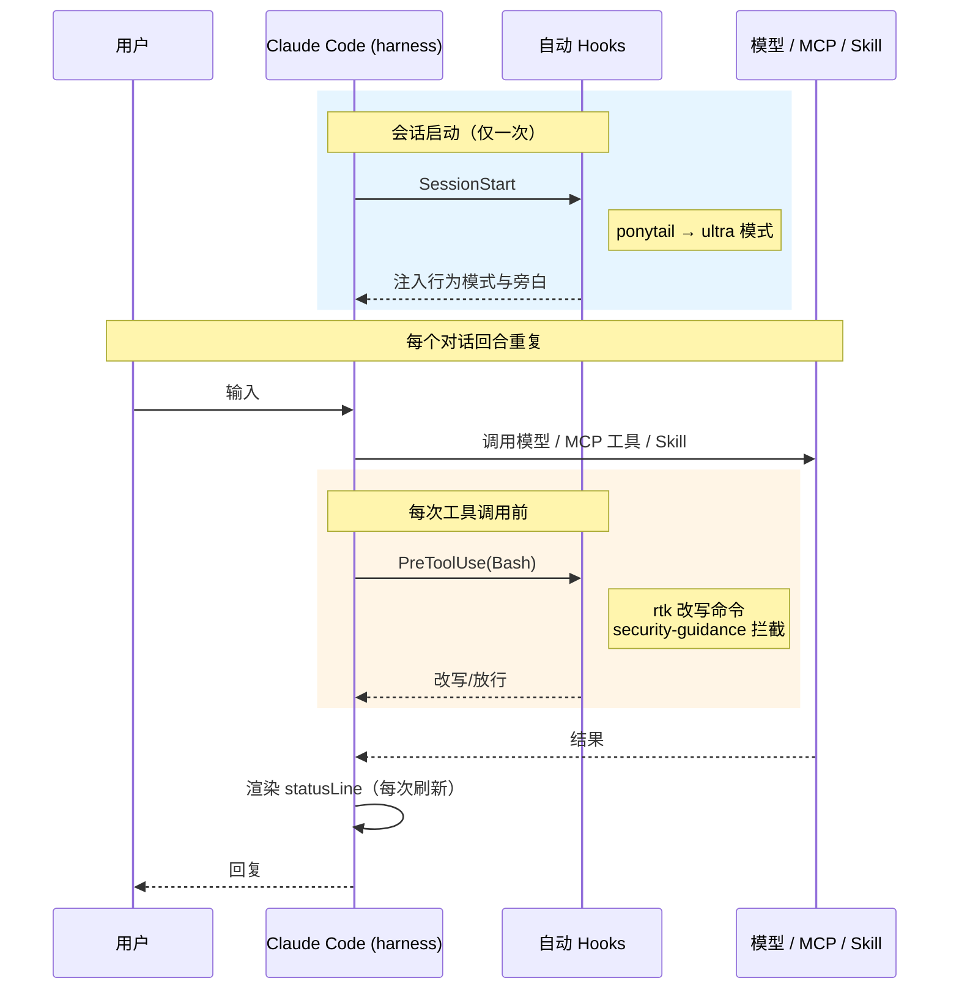

---
分类:
  - "[[Claude Code]]"
关联笔记:
描述: 本机 Windows 环境下 Claude Code 全局扩展（插件 / MCP / Hooks / 模型代理）的来源、版本、能力、触发与配置位置。
排序: 496
分组:
创建时间: 2026年07月02日
---
# 已安装扩展

> [!info] 说明
> 本文记录本机 Windows 环境下 Claude Code **全局**（user scope）扩展——插件 / MCP / Hooks / 模型代理的来源、版本、能力、触发与配置位置。==2026-07-14 核对==：`claude --version` `2.1.207`、`node --version` `v24.18.0`、`rtk --version` `0.43.0`、`~/.claude/plugins/installed_plugins.json`（==8 插件==全启用，本次会话卸载 superpowers / learning-output-style / pua）、`~/.claude/settings.json`（`effortLevel: xhigh`、`theme: dark`）、`~/.claude.json` 顶层 `mcpServers`（4 个）、`~/.claude/skills/`（==22 个 Matt Pocock skills 符号链接==）。仅覆盖全局扩展，不含项目级 `.claude/skills`（如 `defuddle`、`doc-*`、`obsidian-*`）。
> **组织方式**：每个扩展独占一个标题——插件按功能归入 `###` 分类、其下每个插件一个 `####` 标题；手写扩展各占一个 `###`。==用 Obsidian 大纲（TOC）按标题速查==。各插件的斜杠命令明细见 [[斜杠命令]]，本文不重复列举。

## 环境基线

| 项 | 实测值 |
|---|---|
| Claude Code 版本 | `2.1.207` |
| 操作系统 / Shell | Windows 11 + Git Bash (MSYS) |
| Node / npm / npx | `v24.18.0` / `11.16.0` / `11.16.0` |
| 模型 | `glm-5.2[1m]`，经 `ANTHROPIC_BASE_URL=https://open.bigmodel.cn/api/anthropic` 代理（详见 [[#模型代理]]） |
| 全局配置目录 | `~/.claude/`（`settings.json`、`~/.claude.json`、`plugins/`） |
| 运行参数（`settings.json`） | `permissions.defaultMode: bypassPermissions`（免确认，配合 `skipDangerousModePermissionPrompt`）、`effortLevel: xhigh`、`theme: dark`；env 段 `PONYTAIL_DEFAULT_MODE=ultra`（默认 ponytail ultra） |

> [!warning] 无 `~/.claude/agents/`，但 `~/.claude/skills/` **非空**
> 本机**没有**手写的 `~/.claude/agents/` 目录；但 `~/.claude/skills/` 下有 ==22 个 Matt Pocock skills==（符号链接到 `~/.agents/skills/`，全局 user scope 生效），详见 [[#全局手写 Skills（Matt Pocock 全家桶）]]。sub-agents 全部来自插件（hookify 等）或 Claude Code 内置。

## 触发方式总览

| 触发类型 | 含义 | 本机实例 |
|---|---|---|
| **自动触发** | 会话启动或工具事件时由 harness 执行，无需用户输入 | Hooks（`PreToolUse` 等）、`SessionStart`、`statusLine`、各插件事件钩子 |
| **手动触发** | 用户键入 `/命令` 才执行 | 插件提供的斜杠命令（`/ponytail-*`、`/hookify` 等） |
| **按需调用（半自动）** | 工具始终可用，由模型在相关时主动调用，或用户显式 `/` 调用 | skills、MCP 工具、sub-agents |

下图说明自动触发的项**在一个回合里何时**触发（手动斜杠命令由用户决定时机，不在其中）：

## 一、插件（8 个）

> [!tip] 配置位置（所有插件共用）
> - 清单：`~/.claude/plugins/installed_plugins.json`
> - 启用开关：`~/.claude/settings.json` 的 `enabledPlugins`（8 个全部 `true`）
> - 市场源：`~/.claude/plugins/known_marketplaces.json` + `settings.json` 的 `extraKnownMarketplaces`（`claude-plugins-official` 官方、`ponytail`、`kami` 三家），详见 [[官方插件镜像源]]、[[插件]]

### 工作流与行为约束

#### ponytail

> 官方仓库：[DietrichGebert/ponytail](https://github.com/DietrichGebert/ponytail)

- **来源 / 版本**：`ponytail` / v4.8.4
- **提供**：6 skills / 6 cmds / 10 hooks
- **触发**：SessionStart 自动 + 手动
- **作用与用法**："最懒解"编码守则；`/ponytail-help` 查全部命令，`/ponytail-review` 审过度设计，`/ponytail-audit` 全仓库审计，`/ponytail-debt` 汇总 `ponytail:` 注释欠账。

#### hookify

> 官方仓库：[anthropics/claude-plugins-official](https://github.com/anthropics/claude-plugins-official/tree/main/plugins/hookify)

- **来源 / 版本**：`claude-plugins-official` / vunknown
- **提供**：1 skill / 4 cmds / 1 agent / 6 hooks
- **触发**：手动
- **作用与用法**：用对话生成防错 hooks；`/hookify` 从当前会话分析行为并生成规则，`/hookify:list` 查看已配置规则，`/hookify:configure` 启停规则，`/hookify:help` 帮助。
- **提供的 Sub-Agents**：`hookify:conversation-analyzer`。

### 设计与开发辅助

#### frontend-design

> 官方仓库：[anthropics/claude-plugins-official](https://github.com/anthropics/claude-plugins-official/tree/main/plugins/frontend-design)

- **来源 / 版本**：`claude-plugins-official` / vunknown
- **提供**：1 skill
- **触发**：半自动（skill）
- **作用与用法**：构建/重塑 UI 时的视觉设计指导（排版、审美方向、避免模板化）。

#### skill-creator

> 官方仓库：[anthropics/claude-plugins-official](https://github.com/anthropics/claude-plugins-official/tree/main/plugins/skill-creator)

- **来源 / 版本**：`claude-plugins-official` / vunknown
- **提供**：1 skill
- **触发**：半自动（skill）
- **作用与用法**：新建/编辑/评测 skill（跑 eval、基准评测、改触发描述）。

#### claude-md-management

> 官方仓库：[anthropics/claude-plugins-official](https://github.com/anthropics/claude-plugins-official/tree/main/plugins/claude-md-management)

- **来源 / 版本**：`claude-plugins-official` / v1.0.0
- **提供**：1 skill / 1 cmd
- **触发**：手动
- **作用与用法**：`/revise-claude-md` 用本次会话经验更新 CLAUDE.md；`claude-md-improver` skill 审计并改进 CLAUDE.md。

#### kami

> 官方仓库：[tw93/kami](https://github.com/tw93/kami)

- **来源 / 版本**：`kami` / v1.9.3（2026-07-10 安装）
- **提供**：1 skill
- **触发**：半自动（skill）
- **作用与用法**：专业文档排版与落地页制作——简历、一页纸、白皮书、作品集、PPT/slides、landing page；暖羊皮纸 + 墨蓝强调色 + 衬线层级。

### 文档与检索 MCP

> context7 以 **MCP** 形式对外提供工具，命令、依赖、触发工具在标题下讲清。

#### context7

> 官方仓库：[upstash/context7](https://github.com/upstash/context7)

- **来源 / 版本**：`claude-plugins-official` / vunknown
- **提供**：仅 MCP（插件 `.mcp.json` 声明）
- **触发**：按需（MCP）
- **MCP 命令**：`npx -y @upstash/context7-mcp`
- **依赖**：node/npx + 联网
- **工具**：`resolve-library-id` / `get-library-docs` 查第三方库文档

### 会话行为（自动触发）

#### security-guidance

> 官方仓库：[anthropics/claude-plugins-official](https://github.com/anthropics/claude-plugins-official/tree/main/plugins/security-guidance)

- **来源 / 版本**：`claude-plugins-official` / v2.0.6
- **提供**：13 hooks
- **触发**：自动
- **作用与用法**：13 个事件钩子，拦截危险命令/提示注入（如 `PUA Integrity Guard` 提醒）。

> [!note] 非插件、非手写：Claude Code 内置能力
> Claude Code **内置**（非插件、非手写扩展）的斜杠命令（`/code-review` `/simplify` `/security-review` `/init` `/loop` `/verify` 等）与 Sub-Agents（`Explore`、`Plan`、`general-purpose`、`claude-code-guide` 等）另见 [[斜杠命令]]、[[SubAgent]]、[[Agent Teams]]，本文不展开。

## 二、手写扩展（非插件）

> [!tip] 配置位置（所有手写扩展共用）
> 不来自插件市场，手写在 `~/.claude/settings.json` 或 `~/.claude.json` 里，或依赖独立二进制。手写扩展**均不提供斜杠命令**：MCP 暴露**工具**（非命令），模型代理是环境变量，`rtk` / `statusLine` 是 hook / 脚本。

### 全局手写 Skills（Matt Pocock 全家桶）

> 安装由 `setup-matt-pocock-skills` skill 完成；符号链接集中放在 `~/.agents/skills/`

- **配置位置**：`~/.claude/skills/` 下 22 个**符号链接** → `~/.agents/skills/`（user scope，全局对所有项目生效）
- **触发**：半自动（skill），模型在相关场景主动调用，或用户 `/` 显式调用
- **清单（22 个）**：`code-review`、`tdd`、`diagnosing-bugs`、`research`、`prototype`、`grilling`（+ `grill-me` / `grill-with-docs`）、`codebase-design`、`domain-modeling`、`improve-codebase-architecture`、`implement`、`handoff`、`wayfinder`、`to-spec`、`to-tickets`、`triage`、`find-skills`、`writing-great-skills`、`ask-matt`、`teach`、`setup-matt-pocock-skills`。
- **与插件的关系**：原与 superpowers（已卸载）在 `tdd` / `systematic-debugging` / `brainstorming` 上功能重叠；现 superpowers 既去，这些工作流 skill 由 Matt Pocock 全家桶独占。

### 模型代理

- **配置位置**：`~/.claude/settings.json` 的 `env` 段
- **作用**：模型走第三方代理、放大超时与上下文窗口、默认开启 ponytail ultra
- **关键项**：
    - `ANTHROPIC_BASE_URL=https://open.bigmodel.cn/api/anthropic`（智谱代理）
    - `API_TIMEOUT_MS=3000000`（50 min 超时）
    - `CLAUDE_CODE_AUTO_COMPACT_WINDOW=1000000`（放大自动压缩窗口）
    - `CLAUDE_CODE_DISABLE_NONESSENTIAL_TRAFFIC=1`（关闭非必要遥测/流量）
    - `CLAUDE_CODE_ATTRIBUTION_HEADER=0`（关闭归因头）
    - `PONYTAIL_DEFAULT_MODE=ultra`（默认开启 ponytail ultra）
    - 模型映射：`ANTHROPIC_DEFAULT_HAIKU_MODEL=glm-4.5-air`；`ANTHROPIC_DEFAULT_SONNET_MODEL` / `ANTHROPIC_DEFAULT_OPUS_MODEL` / `ANTHROPIC_MODEL` 均为 `glm-5.2[1m]`

### MCP 服务器（`~/.claude.json` 的 `mcpServers`）

共 4 个，其中 3 个走智谱 BigModel（HTTP，`Authorization: Bearer <key>`）：

- **idea**：HTTP `http://127.0.0.1:64342/stream`；依赖 ==JetBrains IDE 运行==（IDE 内置 MCP 插件监听 64342）；工具 `read_file` / `search_symbol` / `analyze_calls` / `lint_files` / 调试器，操作 IDE 工程。
- **zai-mcp-server**：stdio `npx -y @z_ai/mcp-server`，`Z_AI_MODE=ZHIPU`；图像 / 视频 / 截图 / UI / 技术图分析（`analyze_image`、`analyze_video`、`extract_text_from_screenshot`、`ui_to_artifact`、`understand_technical_diagram` 等）。另有智谱网关注入的 `4_5v_mcp`（**GLM-4.5V**，仅 `analyze_image`）与之同源重叠——非本地配置、`/mcp` 不显示，当网关增值工具用，无需清理。
- **web-search-prime**：HTTP `https://open.bigmodel.cn/api/mcp/web_search_prime/mcp`；联网搜索。
- **zread**：HTTP `https://open.bigmodel.cn/api/mcp/zread/mcp`；读 GitHub 仓库结构 / 文件 / 文档（`get_repo_structure`、`read_file`、`search_doc`）。

> [!warning] 浏览器类 MCP 已移除
> 原 `chrome-devtools-mcp`、`playwright` 两个插件（及其捆绑的浏览器 MCP）已从 `installed_plugins.json` 与 `mcpServers` 中==移除==（仅余缓存目录），其冷启动握手问题不再适用。`codebase-memory-mcp` 此前已卸载。

### rtk

- **配置位置**：`~/.claude/settings.json` 的 `hooks.PreToolUse[Bash]` → `rtk hook claude`
- **依赖**：`rtk` 二进制（v0.43.0，`rtk hook` 子命令可用）
- **作用**：每次 Bash 调用自动改写为 `rtk` 令牌优化代理（据 RTK.md 称 60–90% 节省）。

### statusLine 脚本

- **配置位置**：`~/.claude/settings.json` 的 `statusLine` → `bash ~/.claude/statusline-command.sh`
- **作用**：每次渲染状态栏时执行该脚本。

## 现状评估（2026-07-14 核对）

> [!summary] 速查
> - **插件 8 个（全启用）**：ponytail 4.8.4、hookify、frontend-design、skill-creator、claude-md-management 1.0.0、context7、security-guidance 2.0.6、kami 1.9.3。
> - **MCP 5 个**：顶层手写 4（idea、zai-mcp-server、web-search-prime、zread）+ context7 插件 1。
> - **全局手写 skills 22 个**：Matt Pocock 全家桶（符号链接挂载）。
> - **Hooks / 脚本**：PreToolUse[Bash] 仅 `rtk` 改写；SessionStart 含 ponytail；security-guidance 13 事件钩子；statusLine 脚本。

### 冗余

- **搜索**：`web-search-prime`（智谱，国内/中文友好）vs 内置 `WebSearch`（==US-only==）——有差异化，**非纯冗余**；不常搜国内可只留内置。

### 依赖核心（不变）

node 24 / npx 11（驱动所有 npx 型 MCP）、JetBrains IDE 运行（驱动 idea MCP）、`rtk` 二进制（驱动 Bash 代理 hook）、外网到 `open.bigmodel.cn`（驱动模型与 4 个智谱 MCP）。
