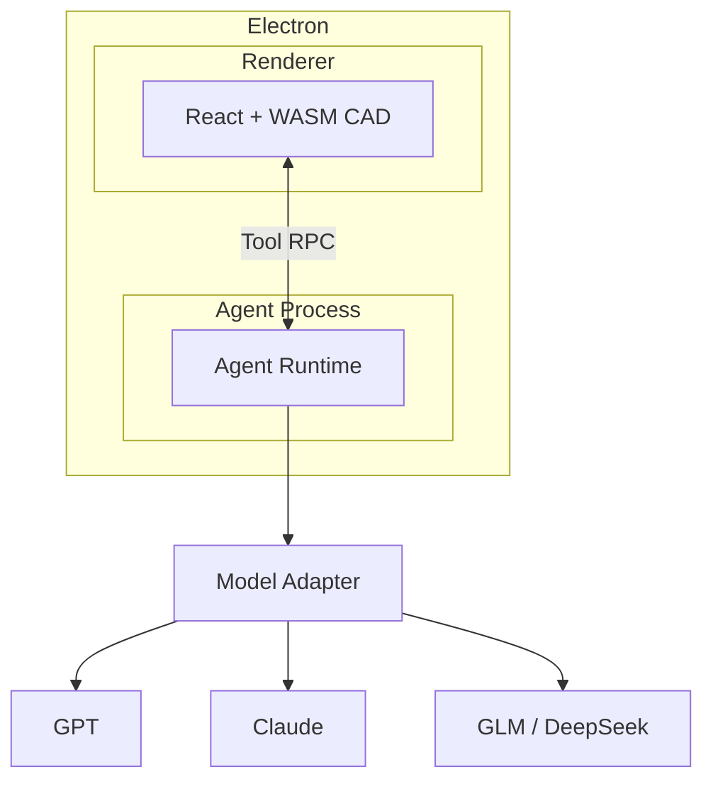

# Agent框架选型

> [!info] 选型目标
> Web/Electron + React + WASM CAD 引擎 + 本地 Tool + 多模型 + 最终商业产品。下文「完整度 / CAD 适配度」均基于该目标的工程判断，信息截至 2026-08-31。底层概念见 [[基础知识]]。

## 全量框架对比（按语言分表）

横轴为框架、纵轴为对比维度，按主要语言分组，避免超宽单表。

### TypeScript 系（5 个）

| 维度               | [Mastra](https://mastra.ai) | [DeepSeek Harness](https://github.com/deepseek-ai/deepseek-harness) | [OpenAI Agents SDK](https://openai.github.io/openai-agents-js/) | [Claude Agent SDK](https://code.claude.com/docs/en/agent-sdk/overview) | [OpenCode](https://opencode.ai/docs/) |
| ---------------- | --------------------------- | ------------------------------------------------------------------- | --------------------------------------------------------------- | ---------------------------------------------------------------------- | ------------------------------------- |
| 定位               | TS 全栈 Agent Framework       | 真正通用 Harness                                                        | 完整轻量 Agent Runtime                                              | Claude Code Harness SDK                                                | Coding Agent Harness                  |
| 主要语言             | TypeScript                  | TypeScript / Node                                                   | TS / Python                                                     | TS / Python                                                            | TypeScript                            |
| Harness 完整度      | ⭐⭐⭐⭐½                       | ⭐⭐⭐⭐⭐                                                               | ⭐⭐⭐⭐⭐                                                           | ⭐⭐⭐⭐⭐                                                                  | ⭐⭐⭐⭐⭐                                 |
| 多模型              | ✅ 很强                        | ✅ Adapter                                                           | ✅ Custom Provider                                               | ❌ 仅 Claude                                                             | ✅ 75+ Provider                        |
| Durable / Resume | ✅                           | ✅                                                                   | ✅ Session / RunState                                            | ✅ Session                                                              | ⚠️ Session                            |
| HITL / 权限        | ✅ Tool Approval             | ✅ 强                                                                 | ✅                                                               | ✅ 很强                                                                   | ✅ allow/ask/deny                      |
| Multi-Agent      | ✅ Supervisor                | ✅                                                                   | ✅ Handoff                                                       | ✅ Subagent                                                             | ✅                                     |
| MCP              | ✅                           | ✅                                                                   | ✅                                                               | ✅                                                                      | ✅                                     |
| Workflow / Graph | ✅ Graph Workflow            | ✅ Plugin                                                            | ⚠️ 轻量编排                                                         | ⚠️ 动态 Agent                                                            | ❌ Coding 导向                           |
| Electron 适合度     | ⭐⭐⭐⭐⭐                       | ⭐⭐⭐⭐⭐                                                               | ⭐⭐⭐⭐⭐                                                           | ⭐⭐⭐⭐⭐                                                                  | ⭐⭐⭐⭐⭐                                 |
| CAD Agent 适合度    | ⭐⭐⭐⭐⭐                       | ⭐⭐⭐⭐½                                                               | ⭐⭐⭐⭐½                                                           | ⭐⭐⭐⭐                                                                   | ⭐⭐⭐½                                  |

### 多语言系（2 个）

| 维度               | [Google ADK 2.0](https://google.github.io/adk-docs/) | [Microsoft Agent Framework](https://learn.microsoft.com/en-us/agent-framework/) |
| ---------------- | ---------------------------------------------------- | ------------------------------------------------------------------------------- |
| 定位               | 完整 Agent Framework + Runtime                         | 企业级 Agent Runtime                                                               |
| 主要语言             | TS / Java / Python / Go / Kotlin                     | C# / Python / Go                                                                |
| Harness 完整度      | ⭐⭐⭐⭐⭐                                                | ⭐⭐⭐⭐⭐                                                                           |
| 多模型              | ✅ 很强                                                 | ✅                                                                               |
| Durable / Resume | ✅ 强                                                  | ✅ 极强                                                                            |
| HITL / 权限        | ✅                                                    | ✅ 极强                                                                            |
| Multi-Agent      | ✅                                                    | ✅ 极强                                                                            |
| MCP              | ✅                                                    | ✅                                                                               |
| Workflow / Graph | ✅ Graph                                              | ✅ Graph                                                                         |
| Electron 适合度     | ⭐⭐⭐⭐⭐                                                | ⭐⭐                                                                              |
| CAD Agent 适合度    | ⭐⭐⭐⭐⭐                                                | ⭐⭐⭐⭐                                                                            |

### Python 系 · 通用 Deep / Runtime（2 个）

| 维度               | [LangChain Deep Agents](https://docs.langchain.com/oss/python/deepagents/overview) | [LangGraph](https://docs.langchain.com/oss/python/langgraph/overview) |
| ---------------- | ---------------------------------------------------------------------------------- | --------------------------------------------------------------------- |
| 定位               | 完整 Deep-Agent Harness                                                              | 低层 Agent Runtime / 状态图                                                |
| 主要语言             | Python 为主                                                                          | Python / TS                                                           |
| Harness 完整度      | ⭐⭐⭐⭐⭐                                                                              | ⭐⭐⭐⭐                                                                  |
| 多模型              | ✅                                                                                  | ✅                                                                     |
| Durable / Resume | ✅ LangGraph                                                                        | ✅ 极强                                                                  |
| HITL / 权限        | ✅                                                                                  | ✅ 极强                                                                  |
| Multi-Agent      | ✅ 强                                                                                | ✅                                                                     |
| MCP              | ✅                                                                                  | ✅                                                                     |
| Workflow / Graph | ✅                                                                                  | ✅ 核心能力                                                                |
| Electron 适合度     | ⭐⭐⭐                                                                                | ⭐⭐⭐⭐                                                                  |
| CAD Agent 适合度    | ⭐⭐⭐⭐                                                                               | ⭐⭐⭐⭐                                                                  |

### Python 系 · 应用型（4 个）

| 维度 | [Pydantic AI](https://ai.pydantic.dev/) | [CrewAI](https://docs.crewai.com/en/introduction) | [Agno](https://docs.agno.com/introduction) | [Letta](https://docs.letta.com/) |
| --- | --- | --- | --- | --- |
| 定位 | Typed Agent Framework | Multi-Agent + Workflow | Agent Platform / Runtime | Stateful / Memory Agent Harness |
| 主要语言 | Python | Python | Python | Python + SDK |
| Harness 完整度 | ⭐⭐⭐⭐½ | ⭐⭐⭐⭐ | ⭐⭐⭐⭐ | ⭐⭐⭐⭐½ |
| 多模型 | ✅ 很强 | ✅ | ✅ | ✅ |
| Durable / Resume | ✅ Temporal/DBOS 等 | ✅ Flow Persistence | ✅ Storage | ✅ Stateful |
| HITL / 权限 | ✅ | ✅ | ✅ Governance | ⚠️ |
| Multi-Agent | ✅ | ✅ 核心能力 | ✅ Teams | ✅ |
| MCP | ✅ | ✅ | ✅ | ✅ |
| Workflow / Graph | ✅ | ✅ Flows | ✅ Workflows | ⚠️ |
| Electron 适合度 | ⭐⭐⭐ | ⭐⭐ | ⭐⭐ | ⭐⭐⭐ |
| CAD Agent 适合度 | ⭐⭐⭐⭐ | ⭐⭐⭐ | ⭐⭐⭐½ | ⭐⭐⭐½ |

### Python 系 · RAG / 轻量（3 个）

| 维度 | [LlamaIndex Agents](https://docs.llamaindex.ai/en/stable/module_guides/deploying/agents/) | [Haystack Agents](https://docs.haystack.deepset.ai/docs/agent) | [smolagents](https://huggingface.co/docs/smolagents) |
| --- | --- | --- | --- |
| 定位 | Data/RAG Agent Framework | RAG / Pipeline Agent | 极简 Agent Framework |
| 主要语言 | Python | Python | Python |
| Harness 完整度 | ⭐⭐⭐½ | ⭐⭐⭐½ | ⭐⭐⭐ |
| 多模型 | ✅ | ✅ | ✅ |
| Durable / Resume | ⚠️ | ⚠️ | ❌ |
| HITL / 权限 | ⚠️ | ✅ | ✅ 基础 |
| Multi-Agent | ✅ AgentWorkflow | ✅ | ✅ |
| MCP | ✅ | ✅ | ⚠️ |
| Workflow / Graph | ✅ Workflow | ✅ Pipeline | ❌ |
| Electron 适合度 | ⭐⭐ | ⭐⭐ | ⭐⭐ |
| CAD Agent 适合度 | ⭐⭐⭐ | ⭐⭐⭐ | ⭐⭐½ |

### Java 系（2 个）

| 维度               | [Spring AI 2.x](https://docs.spring.io/spring-ai/reference/) | [LangChain4j Agentic](https://docs.langchain4j.dev/tutorials/agents/) |
| ---------------- | ------------------------------------------------------------ | --------------------------------------------------------------------- |
| 定位               | Java AI Application Framework                                | Java Agent Framework                                                  |
| 主要语言             | Java                                                         | Java                                                                  |
| Harness 完整度      | ⭐⭐⭐                                                          | ⭐⭐⭐                                                                   |
| 多模型              | ✅ 很强                                                         | ✅ 很强                                                                  |
| Durable / Resume | ⚠️ 自建                                                        | ⚠️ SPI 自建                                                             |
| HITL / 权限        | ⚠️ 自建                                                        | ⚠️                                                                    |
| Multi-Agent      | ⚠️                                                           | ✅                                                                     |
| MCP              | ✅                                                            | ✅                                                                     |
| Workflow / Graph | ⚠️                                                           | ✅ Agentic Patterns                                                    |
| Electron 适合度     | ⭐⭐                                                           | ⭐⭐                                                                    |
| CAD Agent 适合度    | ⭐⭐⭐½                                                         | ⭐⭐⭐½                                                                  |

### 旧方案 / 模型 SDK（3 个）

| 维度 | Semantic Kernel Agent | AutoGen | 智谱 Z.ai SDK |
| --- | --- | --- | --- |
| 定位 | 旧 Microsoft 方案 | 旧 Microsoft Multi-Agent | **模型 SDK，不是 Harness** |
| 主要语言 | C# / Python / Java | Python / .NET | Java / Python 等 |
| Harness 完整度 | ⭐⭐⭐ | ⭐⭐⭐ | ⭐ |
| 多模型 | ✅ | ✅ | GLM 为主 |
| Durable / Resume | ⚠️ | ⚠️ | ❌ |
| HITL / 权限 | ⚠️ | ⚠️ | ❌ |
| Multi-Agent | ✅ | ✅ | ❌ |
| MCP | ✅ | ⚠️ | — |
| Workflow / Graph | ✅ | ⚠️ | ❌ |
| Electron 适合度 | ⭐⭐ | ⭐⭐ | — |
| CAD Agent 适合度 | ⚠️ 不建议新项目 | ⚠️ 不建议新项目 | ❌ 不作为底座 |

> [!note] Microsoft 路线
> 微软已明确提供从 Semantic Kernel / AutoGen 向 **Microsoft Agent Framework** 的[迁移指南](https://learn.microsoft.com/en-us/agent-framework/migration-guide/)，新项目不建议再优先选后两者。

## 按技术路线分层

| 层级 | 代表方案 | 特点 |
| --- | --- | --- |
| **完整 Harness** | DeepSeek Harness、Claude Agent SDK、Deep Agents、OpenCode | Agent Loop、Tool、Context、Session、权限等大量能力直接提供 |
| **完整 Agent Runtime** | Google ADK、OpenAI Agents SDK、Microsoft Agent Framework、Mastra | 最适合真正开发商业 Agent 产品 |
| **低层 Runtime** | LangGraph | 自己控制 State / Graph / Loop，灵活度极高 |
| **应用型 Agent Framework** | Pydantic AI、CrewAI、Agno | 开发效率高 |
| **AI 应用框架** | Spring AI、LangChain4j | 模型/RAG/Tool 集成强，Harness 要自己补 |
| **RAG/Data 导向** | LlamaIndex、Haystack | 知识/RAG 强于通用 Harness |
| **轻量实验** | smolagents | 简单、容易理解 |
| **Coding Harness** | OpenCode | 本地文件/Shell/权限非常成熟，但 Coding 语义较重 |

## 重点候选五强

### Google ADK 2.0：综合能力最完整

已提供完整能力栈：Agent Loop、Session、State、Memory、Context Compression、Tools、MCP、A2A、Human Input、Graph Workflow、Multi-Agent、Resume、Cancel、Evaluation、Observability、Runtime。

- 多语言：TypeScript、Java、Python、Go、Kotlin。
- 模型层不锁 Gemini：官方文档已列出 Claude、OpenAI、Ollama、vLLM、LiteLLM 等接入方式。
- 对 `React + WASM + Electron + TypeScript Agent` 匹配度非常高。

### Mastra：最贴合 TypeScript / Electron 技术栈

若希望 Agent Runtime 与前端整体保持 TypeScript，Mastra 值得重点评估。已提供：Agent、Tool、Memory、MCP、Tool Approval、Workspace、Supervisor、Workflow、Suspend / Resume、Observability、Evals、Model Router；且 Workflow 可持久化后暂停再恢复。

```text
Electron
├─ Renderer
│    ├─ React
│    └─ WASM CAD
└─ Utility Process
     └─ Mastra
          ├─ Agent
          ├─ Memory
          ├─ Tool
          └─ Workflow
```

### DeepSeek Harness：「Everything is a Plugin」

最大特点是可插拔——Agent Loop、LLM Adapter、Tool Registry、Session、Filesystem、Sandbox、Permission、Subagent 本身都是可替换组件。CAD 可以自然做成：

```text
dsh
├─ llm-openai
├─ llm-claude
├─ llm-deepseek
├─ cad-tools
│    ↓
│   WASM
├─ cad-context
├─ cad-memory
└─ cad-verifier
```

==唯一问题==：当前仍是 **Developer Preview**，官方明确警告会有 breaking changes。适合**架构验证 / 原型 / 跟踪发展**，暂不建议完全押注生产底座。

### OpenAI Agents SDK：轻量但完整的 Runtime

同时有 TypeScript 和 Python 版本；模型层抽象为 `Model` / `ModelProvider`，允许接自定义 provider，并非技术上只能用 OpenAI。

已具备：Agent Loop、Session、RunState、Resume、HITL、Guardrails、Tools、MCP、Handoff、Tracing、Sandbox Agent。工具需要审批时的流程：

```text
Agent → Tool Call → Interrupt → 用户批准 → 恢复原 RunState
```

因此它也是非常现实的候选。

### Spring AI：仅在 Java 后端路线下优先

Spring AI 2.0 已有正式的递归 Tool Calling Loop（`LLM → Tool → Tool Result → LLM → …`），并通过 `ToolCallingAdvisor` 控制生命周期。但如果方向已经是 `Electron + 本地 Agent + 本地文件 + WASM CAD`，Spring AI 的优势会明显下降。

## 最终排序：WebCAD 审图 Agent

| 排名  | 方案                      | 原因                                        |
| --- | ----------------------- | ----------------------------------------- |
| 🥇  | **Google ADK 2.0**      | 功能完整、多模型、TS+Java、Graph、Resume、MCP/A2A、生产级 |
| 🥈  | **Mastra**              | 与 React / Electron / TS 技术栈最自然            |
| 🥉  | **DeepSeek Harness**    | Harness 架构最漂亮、可插拔程度最高，但仍是 Preview         |
| 4   | **OpenAI Agents SDK**   | TS、成熟、轻量、Session/HITL/Sandbox 完整          |
| 5   | LangGraph / Deep Agents | Runtime 很强，但 Python / 生态复杂度相对高            |
| 6   | Spring AI               | 保留 Java 后端 Agent 时才优先                     |
| 7   | Claude Agent SDK        | Harness 很强，但模型锁定明显                        |

## 收敛结论：PoC 三选一

产品目标形态：



真正进入 PoC 对比只保留三个：

| 候选 | 一句话理由 |
| --- | --- |
| **Google ADK 2.0** | 要稳定、完整 |
| **Mastra** | 要 TypeScript / Electron 开发体验 |
| **DeepSeek Harness** | 要最大程度掌控 Harness 内核 |

这三者都比 Spring AI 更符合「客户端 CAD Agent Runtime」的方向。
