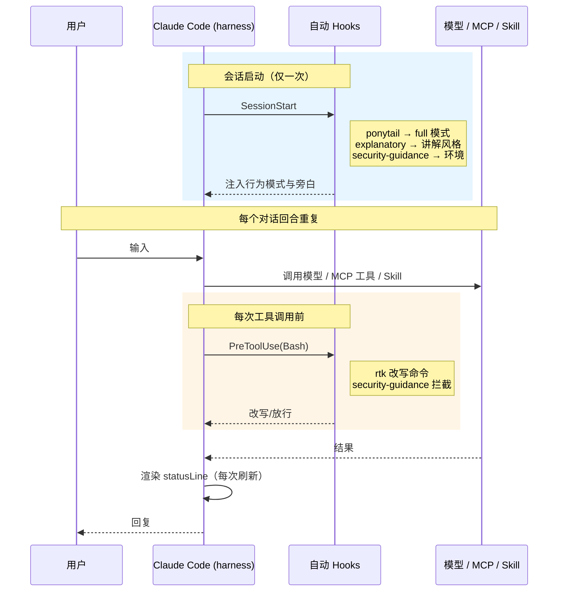

---
描述:
排序: 3000
分组:
分类: "[[Claude Code]]"
创建时间: 2026年07月30日
---
# claude code已安装的扩展和配置

> [!info] 说明
> 本文记录本机 **WSL2 环境**下 Claude Code **全局**（user scope）扩展——插件 / MCP / Hooks / 模型代理的来源、版本、能力、触发与配置位置。==2026-08-23 核对==（开发环境已从 Windows 迁移至 WSL）：`claude --version` `2.1.238`、`node --version` `v24.19.0`、`rtk --version` `0.45.0`、`~/.claude/plugins/installed_plugins.json`（==11 插件==全启用，相比 Windows 末次核对换血：`open-code-review` / `claude-md-management` 已卸载，新增 `mattpocock-skills` v1.2.3 与 `explanatory-output-style` v1.0.0）、`~/.claude/settings.json`（`effortLevel: xhigh`、`language: 中文`）、`~/.claude.json` 顶层 `mcpServers`（==0 个==：zai-mcp-server / zread 已随迁移移除，仅剩智谱网关注入工具）、无 `~/.claude/skills/`（原 23 个符号链接由 `mattpocock-skills` 官方插件取代）。仅覆盖全局扩展，不含项目级 `.claude/skills` 与 project scope 插件（见 [[#现状评估（2026-08-23 核对）]] 尾注）。
> **组织方式**：每个扩展独占一个标题——插件按功能归入 `###` 分类、其下每个插件一个 `####` 标题；手写扩展各占一个 `###`。==用 Obsidian 大纲（TOC）按标题速查==。各插件的斜杠命令明细不在本文重复列举。

## 环境基线

| 项 | 实测值 |
|---|---|
| Claude Code 版本 | `2.1.238` |
| 操作系统 / Shell | WSL2 (Ubuntu) + bash（==2026-08 由 Windows 11 + Git Bash 迁移==，代码目录 `/e/code-base` → `~/code`） |
| Node / npm / npx | `v24.19.0`（Linux 原生） |
| rtk | `0.45.0`（Linux 版二进制） |
| 模型 | `glm-5.3[1m]`（sonnet/opus 映射均为此），经 `ANTHROPIC_BASE_URL=https://open.bigmodel.cn/api/anthropic` 代理（详见 [[#模型代理]]） |
| 全局配置目录 | `~/.claude/`（`settings.json`、`~/.claude.json`、`plugins/`） |
| 运行参数（`settings.json`） | `permissions.defaultMode: bypassPermissions`（免确认，配合 `skipDangerousModePermissionPrompt: true`）、`effortLevel: xhigh`、`language: 中文`、`editorMode: normal`；env 段仅剩超时/压缩窗口/遥测开关 + `PYTHONUTF8=1`（==模型代理与模型映射已迁至 `~/.bashrc`==，见 [[#模型代理]]） |

> [!warning] `~/.claude/agents/` 与 `~/.claude/skills/` 均不存在
> 本机**没有**手写的 `~/.claude/agents/` 目录；`~/.claude/skills/` 也**不再存在**——原 23 个 Matt Pocock skills 符号链接已随 WSL 迁移废弃，全家桶改由官方市场插件 `mattpocock-skills` 提供（见 [[#mattpocock-skills]]）。sub-agents 全部来自插件（hookify 等）或 Claude Code 内置。

## 触发方式总览

| 触发类型 | 含义 | 本机实例 |
|---|---|---|
| **自动触发** | 会话启动或工具事件时由 harness 执行，无需用户输入 | Hooks（`PreToolUse` 等）、`SessionStart`、`statusLine`、各插件事件钩子 |
| **手动触发** | 用户键入 `/命令` 才执行 | 插件提供的斜杠命令（`/ponytail-*`、`/hookify` 等） |
| **按需调用（半自动）** | 工具始终可用，由模型在相关时主动调用，或用户显式 `/` 调用 | skills、MCP 工具、sub-agents |

下图说明自动触发的项**在一个回合里何时**触发（手动斜杠命令由用户决定时机，不在其中）：

## 一、插件（11 个）

> [!tip] 配置位置（所有插件共用）
> - 清单：`~/.claude/plugins/installed_plugins.json`（v2 格式，含 installPath / gitCommitSha / 安装时间）
> - 启用开关：`~/.claude/settings.json` 的 `enabledPlugins`（11 个全部 `true`）
> - 市场源：`~/.claude/plugins/known_marketplaces.json` + `settings.json` 的 `extraKnownMarketplaces`（==四家==：`claude-plugins-official` 官方、`ponytail`、`ui-ux-pro-max-skill`、`diagram-design`；`open-code-review` 市场已随插件卸载移除）。后两家目前仅有 project scope 安装（见文末尾注），user scope 未装。

### 工作流与行为约束

#### ponytail

> 官方仓库：[DietrichGebert/ponytail](https://github.com/DietrichGebert/ponytail)

- **来源 / 版本**：`ponytail` / v4.9.0
- **提供**：6 skills / 6 cmds / hooks（SessionStart 自动激活 full 模式）
- **触发**：SessionStart 自动 + 手动
- **作用与用法**："最懒解"编码守则；`/ponytail-help` 查全部命令，`/ponytail-review` 审过度设计，`/ponytail-audit` 全仓库审计，`/ponytail-debt` 汇总 `ponytail:` 注释欠账。

#### hookify

> 官方仓库：[anthropics/claude-plugins-official](https://github.com/anthropics/claude-plugins-official/tree/main/plugins/hookify)

- **来源 / 版本**：`claude-plugins-official` / vunknown
- **提供**：1 skill / 4 cmds / 1 agent / 6 hooks
- **触发**：手动
- **作用与用法**：用对话生成防错 hooks；`/hookify` 从当前会话分析行为并生成规则，`/hookify:list` 查看已配置规则，`/hookify:configure` 启停规则，`/hookify:help` 帮助。
- **提供的 Sub-Agents**：`hookify:conversation-analyzer`。

#### mattpocock-skills

> 官方仓库：[mattpocock/skills](https://github.com/mattpocock/skills)

- **来源 / 版本**：`claude-plugins-official` / v1.2.3（==WSL 迁移时以官方插件取代原 23 个符号链接 skills==，见 [[#全局手写 Skills（Matt Pocock 全家桶）→ 已插件化]]）
- **提供**：按 `engineering` / `productivity` / `misc` 等目录组织的 skills 全家桶（`tdd`、`diagnosing-bugs`、`code-review`、`grilling`、`domain-modeling`、`codebase-design`、`research`、`prototype`、`resolving-merge-conflicts`、`wizard`、`writing-for-agents` 等）
- **触发**：半自动（skill，调用名带 `mattpocock-skills:` 前缀）
- **作用与用法**：真实工程工作流——TDD、spec/ticket 流、领域建模、代码审查双轴（标准/规格）、质询（grilling）等。
- **与其它「代码审查」的区分**：Matt Pocock `code-review` skill（标准 / 规格双轴审查）≠ Claude Code 内置 `/code-review`。==alibaba `open-code-review` 插件已随 WSL 迁移卸载==。

> [!note] `open-code-review` / `claude-md-management` 已卸载
> 两个插件（alibaba OCR diff 审查、`/revise-claude-md`）不在 WSL 环境的 `enabledPlugins` 中；OCR 的市场源也已移除。需要时用 `claude plugin install` 重装。

### 设计与开发辅助

#### frontend-design

> 官方仓库：[anthropics/claude-plugins-official](https://github.com/anthropics/claude-plugins-official/tree/main/plugins/frontend-design)

- **来源 / 版本**：`claude-plugins-official` / vunknown
- **提供**：1 skill
- **触发**：半自动（skill）
- **作用与用法**：构建/重塑 UI 时的视觉设计指导（排版、审美方向、避免模板化）。

#### skill-creator

> 官方仓库：[anthropics/claude-plugins-official](https://github.com/anthropics/claude-plugins-official/tree/main/plugins/skill-creator)

- **来源 / 版本**：`claude-plugins-official` / vunknown
- **提供**：1 skill
- **触发**：半自动（skill）
- **作用与用法**：新建/编辑/评测 skill（跑 eval、基准评测、改触发描述）。

### 语言服务器（LSP）集成

> 三个 LSP 插件（2026-08-18 WSL 迁移后重装）为对应语言接入语言服务器，驱动内置 `LSP` 工具的 `goToDefinition` / `findReferences` / `hover` / `documentSymbol` / `prepareCallHierarchy` 等代码智能能力。==按需调用==：模型在对应语言文件上主动用 `LSP` 工具，或用户显式引导。

#### jdtls-lsp

> 官方仓库：[anthropics/claude-plugins-official](https://github.com/anthropics/claude-plugins-official/tree/main/plugins/jdtls-lsp)

- **来源 / 版本**：`claude-plugins-official` / v1.0.0
- **提供**：Java 语言服务器（Eclipse JDT.LS）
- **触发**：按需（LSP，`.java` 文件）
- **依赖**：JDK 17+
- **WSL 实况**：本机用 wrapper 启动并注入 Lombok；`definition`/`references` 受 harness 限制不可用，`documentSymbol`/`hover` 可用。根仓 `.gitignore` 已加 Eclipse 元数据（`.project`/`.classpath`/`.settings`）兜底。

#### typescript-lsp

> 官方仓库：[anthropics/claude-plugins-official](https://github.com/anthropics/claude-plugins-official/tree/main/plugins/typescript-lsp)

- **来源 / 版本**：`claude-plugins-official` / v1.0.0
- **提供**：TypeScript / JavaScript 语言服务器
- **触发**：按需（LSP，`.ts` / `.tsx` / `.js` 等）

#### pyright-lsp

> 官方仓库：[anthropics/claude-plugins-official](https://github.com/anthropics/claude-plugins-official/tree/main/plugins/pyright-lsp)

- **来源 / 版本**：`claude-plugins-official` / v1.0.0
- **提供**：Python 语言服务器（Pyright，含类型检查）
- **触发**：按需（LSP，`.py` 文件）

### 文档与检索 MCP

> context7 以 **MCP** 形式对外提供工具，命令、依赖、触发工具在标题下讲清。

#### context7

> 官方仓库：[upstash/context7](https://github.com/upstash/context7)

- **来源 / 版本**：`claude-plugins-official` / vunknown
- **提供**：仅 MCP（插件 `.mcp.json` 声明）
- **触发**：按需（MCP）
- **MCP 命令**：`npx -y @upstash/context7-mcp`
- **依赖**：node/npx + 联网
- **工具**：`resolve-library-id` / `get-library-docs` 查第三方库文档

### 会话行为（自动触发）

#### explanatory-output-style

> 官方仓库：[anthropics/claude-plugins-official](https://github.com/anthropics/claude-plugins-official/tree/main/plugins/explanatory-output-style)

- **来源 / 版本**：`claude-plugins-official` / v1.0.0（==WSL 迁移后新增==）
- **提供**：1 hook（SessionStart）
- **触发**：自动
- **作用与用法**：会话启动时注入「Explanatory 输出风格」——要求模型在写代码前后附 `★ Insight` 教学性说明块，偏讲解型协作。

#### security-guidance

> 官方仓库：[anthropics/claude-plugins-official](https://github.com/anthropics/claude-plugins-official/tree/main/plugins/security-guidance)

- **来源 / 版本**：`claude-plugins-official` / v2.0.7
- **提供**：4 事件钩子（SessionStart / UserPromptSubmit / PostToolUse / Stop）
- **触发**：自动
- **作用与用法**：模式化安全提醒——编辑与 git 操作（commit/push）时注入安全审查提示；v2.0.7 引入 `asyncRewake` 异步审查：git commit/push 后在后台跑 LLM 安全审查，发现问题再「唤醒」会话提醒，不阻塞主流程。

> [!note] 非插件、非手写：Claude Code 内置能力
> Claude Code **内置**（非插件、非手写扩展）的斜杠命令（`/code-review` `/simplify` `/security-review` `/init` `/loop` `/verify` 等）与 Sub-Agents（`Explore`、`Plan`、`general-purpose`、`claude-code-guide` 等）本文不展开。

## 二、手写扩展（非插件）

> [!tip] 配置位置（所有手写扩展共用）
> 不来自插件市场，手写在 `~/.claude/settings.json` 或 `~/.claude.json` 里，或依赖独立二进制。手写扩展**均不提供斜杠命令**：MCP 暴露**工具**（非命令），模型代理是环境变量，`rtk` / `statusLine` 是 hook / 脚本。

### 全局手写 Skills（Matt Pocock 全家桶）→ 已插件化

> ==2026-08-23 核对==：WSL 环境下 `~/.claude/skills/` 目录**已不存在**，原「23 个符号链接 → `~/.agents/skills/`」的安装方式（由 `setup-matt-pocock-skills` skill 完成）已废弃。

- **现状**：全家桶改由官方市场插件 **`mattpocock-skills` v1.2.3** 提供（user scope，见 [[#mattpocock-skills]]），skills 按 `engineering` / `productivity` / `misc` 等目录组织，调用名带 `mattpocock-skills:` 前缀。
- **收益**：插件化后由 Claude Code 统一管理版本与更新（`installed_plugins.json` 记录 gitCommitSha），不再依赖手工符号链接与源目录。

### 模型代理

- **配置位置**：==`~/.bashrc` 的 `export` 段==（WSL 迁移时从 `settings.json` 的 `env` 段迁出，含两组账号切换条目；`settings.json` env 段仅保留与账号无关的超时/窗口/遥测项）
- **作用**：模型走第三方代理、放大超时与上下文窗口
- **关键项**：
    - `ANTHROPIC_BASE_URL=https://open.bigmodel.cn/api/anthropic`（智谱代理）+ `ANTHROPIC_AUTH_TOKEN`（在 `.bashrc`，勿入 `settings.json`）
    - `settings.json` env 段保留：`API_TIMEOUT_MS=3000000`（50 min 超时）、`CLAUDE_CODE_AUTO_COMPACT_WINDOW=1000000`（放大自动压缩窗口）、`CLAUDE_CODE_DISABLE_NONESSENTIAL_TRAFFIC=1`（关闭非必要遥测/流量）、`CLAUDE_CODE_ATTRIBUTION_HEADER=0`（关闭归因头）、`PYTHONUTF8=1`（==WSL 新增==，防 statusline 中文输出乱码）
    - 模型映射（`.bashrc`）：`ANTHROPIC_DEFAULT_HAIKU_MODEL=glm-4.7`；`ANTHROPIC_DEFAULT_SONNET_MODEL` / `ANTHROPIC_DEFAULT_OPUS_MODEL` 均为 `glm-5.3[1m]`（==从 `glm-5.2[1m]` 升级==）

### MCP 服务器（`~/.claude.json` 的 `mcpServers`）

==0 个==——原手写的 `zai-mcp-server`（stdio npx 图像/视频分析）与 `zread`（HTTP 读 GitHub 仓库）已随 WSL 迁移**全部移除**（再往前 `idea` / `web-search-prime` / `chrome-devtools-mcp` / `playwright` 也已移除）。

当前会话实际可用的 MCP 工具：

- **context7 插件 MCP**：见 [[#context7]]（唯一的本地配置 MCP）。
- **智谱网关注入**（非本地配置、`/mcp` 不显示，当网关增值工具用，无需清理）：`4_5v_mcp`（**GLM-4.5V**，仅 `analyze_image`）、`web_reader`（`webReader` 网页抓取）。

> [!warning] 原 zai-mcp-server 的分析能力缺口
> 移除后本地不再有 `analyze_video` / `extract_text_from_screenshot` / `ui_to_artifact` 等工具，图像分析仅剩网关注入的 `analyze_image`。需要完整能力时 `claude mcp add` 重配。

### rtk

- **配置位置**：`~/.claude/settings.json` 的 `hooks.PreToolUse[Bash]` → `rtk hook claude`
- **依赖**：`rtk` 二进制（==v0.45.0，Linux 版==，`rtk hook` 子命令可用）
- **作用**：每次 Bash 调用自动改写为 `rtk` 令牌优化代理（据 RTK.md 称 60–90% 节省）。注意 228 部署实测：`grep -c` 对 minified JS 会假阴性，rtk 过滤输出时留意此类误判。

### statusLine 脚本

- **配置位置**：`~/.claude/settings.json` 的 `statusLine` → `python3 /home/luguosong/.claude/statusline.py`（==WSL 迁移时由 Windows 的 PowerShell 脚本 `statusline.ps1` 改为 Python 脚本 `statusline.py`==，摆脱 pwsh 依赖）
- **作用**：每次渲染状态栏时执行该脚本；配合 `PYTHONUTF8=1` 保证中文正常。

## 现状评估（2026-08-23 核对）

> [!summary] 速查
> - **插件 11 个（user scope 全启用）**：ponytail 4.9.0、hookify、mattpocock-skills 1.2.3（==新==）、frontend-design、skill-creator、context7、security-guidance 2.0.7、jdtls-lsp 1.0.0、typescript-lsp 1.0.0、pyright-lsp 1.0.0、explanatory-output-style 1.0.0（==新==）；==`open-code-review`、`claude-md-management` 已卸载==。
> - **MCP**：本地手写 ==0 个==（zai-mcp-server / zread 已移除）+ context7 插件 1 + 网关注入（`4_5v_mcp` / `web_reader`）。
> - **全局手写 skills**：==0 个==（原 23 个 Matt Pocock 符号链接由官方插件取代）。
> - **Hooks / 脚本**：PreToolUse[Bash] 仅 `rtk` 改写（v0.45.0）；SessionStart 含 ponytail + explanatory-output-style；security-guidance 4 事件钩子（v2.0.7 含 git commit/push 后台异步审查）；statusLine 为 `python3 statusline.py`。
> - **project scope 插件**（非全局，备查）：`ui-ux-pro-max` 2.13.0（仅 `~/code/personal/chrome-tab`）、`diagram-design` 2.6.5（仅 `thinkpad-ubuntu` / `diagram-design` 两项目）。

### 冗余

- **图像分析**：本地配置已清零，仅剩智谱网关注入的 `4_5v_mcp`（`analyze_image`），无重叠但能力变窄（见上文 warning）。
- **联网**：内置 `WebSearch`（==US-only==）与网关注入的 `web_reader`（网页抓取）互补，非纯冗余。

### 依赖核心

node 24（驱动 npx 型 MCP，如 context7）、JDK 17+（驱动 jdtls-lsp Java 语言服务器）、python3（驱动 statusline）、`rtk` 二进制（驱动 Bash 代理 hook）、外网到智谱开放平台 / `open.bigmodel.cn`（驱动模型代理与网关注入工具）。
