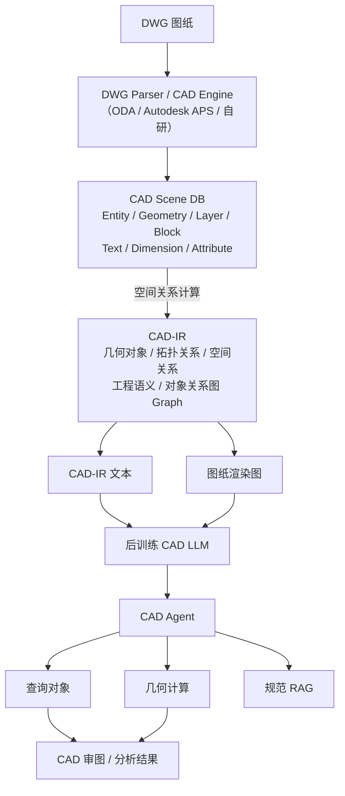
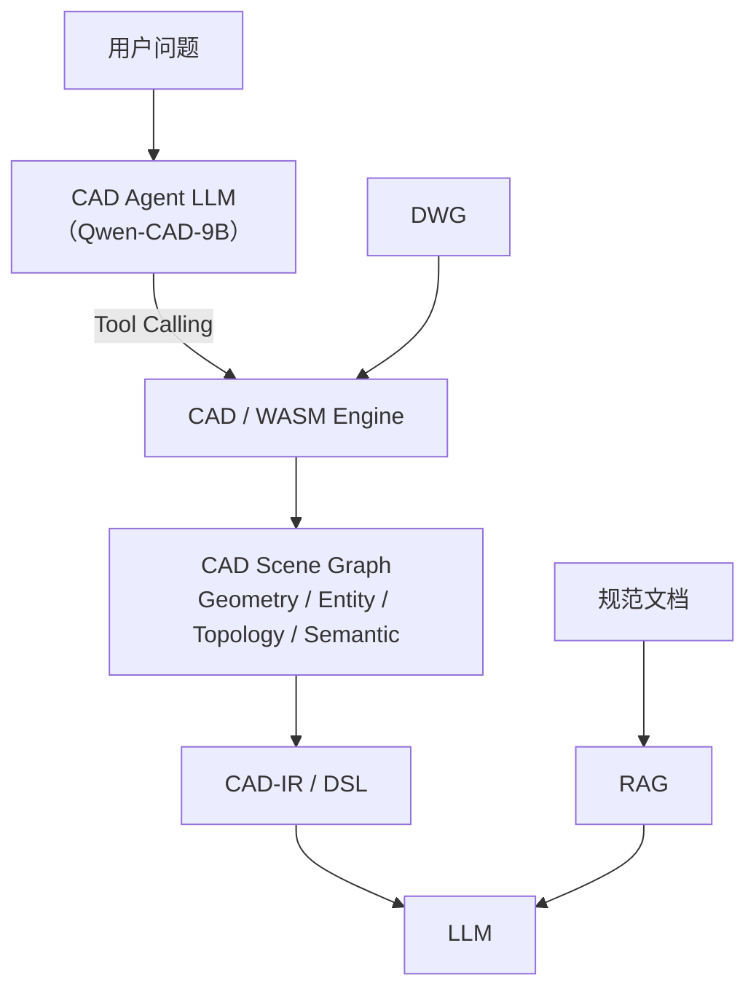
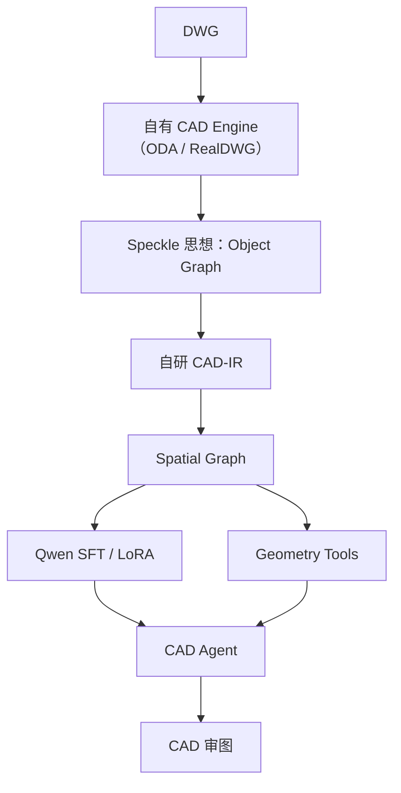

# CAD空间理解

对小公司来说，不要走「**把 DWG 直接喂给 LLM、通过后训练让它学会 DWG**」这条路线——DWG 是复杂的二进制 CAD 数据结构。真正适合的方案是：

> **DWG → CAD-IR 空间语义表示 → LLM 后训练 → CAD Agent + 几何工具验证**

也就是让 LLM 学会「**理解 CAD 世界**」，而不是学会「解析 DWG 文件格式」。

姊妹篇：[[Agent框架选型]]（同一项目的 Agent 框架选型与 PoC 收敛）。

## 推荐总体架构



> [!tip] DWG 层交给确定性解析器，不让神经网络学
> **ODA Drawings SDK** 可直接访问 DWG 的对象、属性、图层、块、几何和扩展数据，适合作为底层确定性解析器；**Autodesk APS Model Derivative** 也可以提取对象层级、属性和几何信息。
>
> - [ODA Drawings SDK](https://www.opendesign.com/products/drawings)

## 核心：设计一套 CAD-IR

这是整个方案中最重要的部分。

原始 DWG 里的东西：

```text
LINE
POLYLINE
INSERT
TEXT
ARC
HATCH
DIMENSION
```

对 LLM 来说仍然只是低级 CAD primitives，应该进一步转换成：

```text
SPACE R101 type=ROOM
boundary=P123
area=35.27

WALL W12
from=(0,0)
to=(6000,0)

DOOR D17
width=900
on=W12
connects=[R101,R102]

WINDOW WN03
width=1500
on=W15

RELATION
R101 adjacent R102
R101 connected_to R102 via D17
D17 located_on W12
W12 perpendicular W15
```

甚至可以进一步压缩成专门的 **CAD DSL**：

```text
ROOM R1 AREA 35.27
ROOM R2 AREA 18.42

DOOR D1 WIDTH 900
CONNECT D1 R1 R2

ADJ R1 R2
DIST D1 W3 1260
PARALLEL W1 W3
PERP W1 W2
```

相比 JSON，更值得自研这种紧凑 DSL。原因很简单——走 JSON 这条路，上下文会爆炸：

```text
DWG
↓
数十万 Entity
↓
JSON
↓
几十万甚至几百万 Token
```

不可行。而 CAD DSL + 空间子图，可以把上下文压缩一个数量级。

## CAD-IR 的四个层次

| 层次 | 内容 | 例子 |
|---|---|---|
| Geometry | 基础几何 | point、line、polyline、circle、bbox |
| Entity | CAD 对象 | block、text、dimension、layer |
| Topology | 空间拓扑 | contains、intersects、adjacent |
| Semantic | 工程语义 | room、wall、door、column、pipe |

尤其需要重点构建 **Spatial Relation Graph**：

```text
Room
 │
 ├──contains──> Door
 │
 ├──adjacent──> Room
 │
 └──bounded_by──> Wall

Door
 │
 ├──located_on──> Wall
 └──connects──> Room
```

关系建议至少包括：

```text
contains
inside
intersects
touches
overlaps
adjacent
connects
crosses
parallel
perpendicular
aligned
above
below
left_of
right_of
near
far
distance
clearance
```

> [!tip] 空间理解 = 把连续几何问题转成符号推理问题
> 这样一来，"空间理解"就从神经网络很难精确学习的连续几何问题，转成了 LLM 很擅长的 **符号推理问题**。

## 后训练训练什么

不要训练：

```text
DWG bytes → 答案
```

而训练：

```text
CAD-IR + 问题
        ↓
空间推理
        ↓
工具调用
        ↓
答案
```

训练任务可以形成如下 curriculum：

| Level | 能力 | 示例 |
|---|---|---|
| L1 | CAD 对象理解 | 哪些对象属于门 |
| L2 | 几何理解 | 两根梁是否平行 |
| L3 | 拓扑理解 | 房间 A 与哪些房间相邻 |
| L4 | 空间推理 | 从 A 到 B 需要经过哪些门 |
| L5 | 工程语义 | 哪些墙可能属于防火分区边界 |
| L6 | 规则检查 | 门前净空是否满足要求 |
| L7 | 综合审图 | 找出这一层平面潜在设计问题 |

例如训练样本：

```text
<CAD>

ROOM R101
ROOM R102

DOOR D1 width=900
CONNECT D1 R101 R102

DOOR D2 width=800
CONNECT D2 R102 R103

</CAD>

QUESTION:
从 R101 到 R103 是否存在连通路径？
```

目标输出不要主要训练长篇自然语言 Chain-of-Thought，而训练 **可执行 Action Trace**：

```text
query_connections(R101)
→ D1 → R102

query_connections(R102)
→ D2 → R103

RESULT:
R101 -> D1 -> R102 -> D2 -> R103

ANSWER:
存在连通路径。
```

这比训练模型"凭感觉推理"可靠很多。

## 小公司的后训练路线

```text
基础模型
   ↓
SFT
   ↓
Tool-use SFT
   ↓
Verifier / Reward
   ↓
少量 RL
```

而不是一开始做大规模预训练。

### 第一阶段：SFT

训练：

```text
CAD-IR → CAD理解
CAD-IR → 空间关系判断
CAD-IR → 工程问题回答
```

可以采用 QLoRA：Hugging Face 的 PEFT 当前支持 LoRA/QLoRA，只更新少量 adapter 参数，非常适合资源有限的团队（[PEFT LoRA 文档](https://huggingface.co/docs/peft/main/package_reference/lora)）。

### 第二阶段：Tool-use SFT

训练模型调用：

```text
get_entity()
get_bbox()
get_neighbors()
find_containing_polygon()

distance()
angle()
intersect()

is_parallel()
is_perpendicular()

find_path()
check_clearance()
```

例如：

```text
用户：
A房间距离最近的安全出口多远？

LLM：
find_nearest_exit(room="A")

Tool：
exit=E03
distance=24.62m

LLM：
A房间距离最近安全出口约24.62m。
```

> [!important] 关键原则：LLM 负责推理，Geometry Engine 负责计算
> 不要让 LLM 自己算复杂坐标。

## 为什么 CAD 领域适合做 RL

CAD 相比普通文本领域有一个很大的优势：**大量问题都有确定的 Ground Truth**。

```text
两条线是否相交
距离是多少
房间面积是多少
是否相邻
是否连通
是否碰撞
净距是否 ≥ 1200
路径是否存在
```

都可以由 CAD Engine 自动计算，所以可以自动生成 Reward：

```text
模型答案
   ↓
CAD Engine
   ↓
Verifier
   ↓
正确 +1
错误 0/-1
```

这样可以生成大量无需人工标注的训练数据——这是 **CAD + 后训练最有价值的地方**。

## 训练数据：自动数据工厂

小公司最大的难题其实不是 GPU，而是数据。可以建立自动数据工厂：

```text
10000张 DWG
      ↓
自动解析
      ↓
CAD-IR
      ↓
Geometry Engine 自动产生问题
      ↓
自动计算 Ground Truth
      ↓
LLM生成自然语言问题
      ↓
Verifier验证
      ↓
训练集
```

例如程序随机生成：

```text
Room A adjacent ?
Room A contains ?
Door D connects ?
distance(A,B)?
intersect(A,B)?
parallel(A,B)?
shortestPath(A,B)?
```

一张 DWG 很容易产生几十甚至几百条训练样本。因此现实目标可以是：

```text
5,000～20,000 张图纸

        ↓

100,000～500,000 条
高质量空间推理样本
```

真正需要人工标注的只需要集中在：

```text
工程语义
审图经验
复杂设计问题
规范判断
```

## 模型选择

截至 2026 年 9 月，小公司从 [Qwen3.5-9B](https://huggingface.co/Qwen/Qwen3.5-9B) 开始：Apache-2.0、9B 参数、原生支持 image-text 输入，既可以读取 CAD-IR，也可以把局部图纸截图作为辅助视觉信息。

```text
CAD-IR
+
局部图纸截图
+
用户问题
       ↓
Qwen3.5-9B-CAD
```

如果后期证明 9B 推理能力成为瓶颈，再升级 [Qwen3.8-27B](https://huggingface.co/Qwen/Qwen3.8-27B)——同样是原生视觉语言模型，并强化了长程 Agent 和工具执行能力。但第一阶段不直接上 27B。

## 硬件与工程选型

| 项目 | 建议 |
|---|---|
| Base Model | 9B |
| Training | QLoRA |
| GPU | 租用 48GB/80GB GPU |
| 推理 | INT4/INT8 |
| Serving | vLLM |
| CAD Engine | C++ / WASM / Java |
| Agent | LangGraph / 自研 Agent Loop |
| Vector DB | 只用于规范/知识 |
| Spatial DB | 自研 Scene Graph |

> [!warning] 不要购买训练服务器起步
> 开发期按需租 GPU 即可。

## RAG、后训练、CAD Engine 的分工

这里非常容易做错，三者的边界：

| 系统 | 解决什么 |
|---|---|
| RAG | 建筑规范、企业规范、设计标准、项目说明、历史审图意见 |
| 后训练 | 理解 CAD-IR、空间推理、CAD 专业语义、工具调用策略、审图工作流 |
| CAD Engine | 几何计算、空间查询、拓扑计算、碰撞检测、距离/面积计算、路径搜索 |

**三者不要混在一起。**

## 最终系统形态



## 最值得投入的技术壁垒

如果按 **100% 的研发资源**分配，主要精力反而不该投入模型训练，而是：

```text
CAD解析 + CAD-IR + Spatial Graph    ★★★★★
自动训练数据生成                    ★★★★★
Geometry Tool / Verifier            ★★★★☆
CAD Benchmark                        ★★★★☆
SFT / RL                             ★★★
基础模型研究                         ★
```

模型以后可以从 Qwen3.5 换 Qwen3.8、DeepSeek 或其他模型，但：

> [!tip] 壁垒不在模型
> **DWG → CAD-IR → Spatial Graph → Verifier** 这套东西不会因为基础模型更新而失效。

因此对一个希望做 **CAD 审图 Agent** 的小公司，最合理的定位不是训练"CAD 大模型"，而是构建一个 **CAD Spatial Reasoning Model + CAD Agent**——真正形成壁垒的是 **CAD-IR、自动数据工厂、空间工具链和可验证的后训练数据闭环**，模型本身反而是可替换组件。

## 开源项目盘点

有可参考的开源项目，但**截至 2026 年 9 月，没有一个成熟开源项目完整覆盖**全链路：

```text
DWG → CAD结构化语义 → 空间关系图 → LLM后训练 → CAD审图Agent
```

目前更现实的是把几个项目组合起来：

| 项目 | 能力 | 与目标匹配度 |
|---|---|--:|
| **AutoCAD-MCP Pro** | LLM 查询/修改 CAD、精确几何查询、校验、DXF/AutoCAD 双后端 | ⭐⭐⭐⭐⭐ |
| **ifcMCP + IfcOpenShell** | LLM 查询建筑空间、构件、墙洞、空间边界 | ⭐⭐⭐⭐⭐ |
| **Speckle** | 将 CAD/BIM 转成结构化 Object Graph | ⭐⭐⭐⭐⭐ |
| **LibreDWG** | 原生 DWG 解析 | ⭐⭐⭐⭐ |
| **Engineering Drawing AI RAG** | 图纸→检测/OCR→KG→LLM问答 | ⭐⭐⭐⭐ |
| **CAD-MLLM** | 多模态模型 + CAD 数据集/后训练研究 | ⭐⭐⭐ |
| **CADFusion** | LLM CAD 后训练 + 视觉反馈/DPO | ⭐⭐⭐ |
| **CAD-Recode / DeepCAD** | 学习 CAD 参数/结构表示 | ⭐⭐ |

### AutoCAD-MCP Pro：目前最值得研究

已经实现非常接近目标设想的链路：

```text
LLM
 ↓
Tool Calling
 ↓
CAD Engine
 ↓
精确几何查询
 ↓
Verifier
```

它支持 AutoCAD COM，同时支持基于 `ezdxf` 的 headless 模式，并提供大量 CAD 查询、几何、尺寸、公差和验证工具（[U-C4N/Autocad-MCP](https://github.com/U-C4N/Autocad-MCP)）。

它**没有解决后训练和 CAD-IR**，但非常适合作为未来 `CAD Agent Tool Layer` 的参考。

### ifcMCP：架构上和目标最像

清华相关团队开源的 **ifcMCP** 值得重点看，它已经允许 LLM 查询：

```text
get_entities()
get_entity_location()
get_entities_in_spatial()
get_openings_on_wall()
get_space_boundaries()
```

也就是：

```text
IFC
 ↓
IfcOpenShell
 ↓
结构化建筑语义
 ↓
MCP Tools
 ↓
LLM
```

这实际上就是 **CAD Engine → Spatial Semantic → Agent** 思路，只不过数据源是 IFC，而不是 DWG（[smartaec/ifcMCP](https://github.com/smartaec/ifcmcp)、[IfcOpenShell](https://github.com/IfcOpenShell/IfcOpenShell)）。

**建议重点研究这个项目的架构，而不是直接使用。**

### Speckle：非常接近 CAD-IR / Object Graph

Speckle 本质上就是：

```text
AutoCAD
Revit
Rhino
IFC
Civil3D
  ↓
统一对象模型
  ↓
Object Graph
```

AutoCAD 数据进入 Speckle 后，会按以下结构组织，而不是继续保持 DWG 文件形式（[Speckle](https://github.com/specklesystems)）：

```text
File
 └─ Layer
     ├─ Geometry
     ├─ Instance
     ├─ Group
     └─ Definition
```

这和 **DWG → CAD Scene → CAD-IR → Spatial Graph** 的设想非常接近。但 Speckle 的 Object Graph **还不是空间推理图谱**，还需要继续生成：

```text
Room --adjacent--> Room
Door --connects--> Room
Wall --bounds--> Room
Pipe --crosses--> Wall
Beam --parallel--> Beam
```

这一层正好可以成为自己的核心壁垒。

### LibreDWG：开源 DWG Parser

GNU 官方开源 DWG 实现，可以：

```text
DWG → Entity
DWG → DXF
DWG → JSON
DWG → SVG
```

并且支持读取大部分 DWG 版本（[LibreDWG](https://github.com/LibreDWG/libredwg)）。

> [!warning] GPL-3.0
> 做商业闭源 CAD 产品需要认真评估 license。所以商业项目很多最终还是选择 ODA、Autodesk RealDWG 或自有 CAD 内核，而不是直接把 LibreDWG 链进产品。

### Engineering Drawing AI RAG：知识图谱设计参考

和"图纸理解"方向非常接近：

```text
工程图
 ↓
Object Detection
 ↓
OCR
 ↓
Object-Text Linking
 ↓
JSON
 ↓
Knowledge Graph
 ↓
Multimodal RAG
 ↓
LLM QA
```

甚至定义了这种关系结构：

```json
{
  "source": "PU001",
  "target": "P001",
  "relation": "CONNECTED_TO"
}
```

（[Lee-haerang/engineering-drawing-ai-rag](https://github.com/Lee-haerang/engineering-drawing-ai-rag)）

不过它目前还是**早期研究原型**，而且主要走 `Drawing Image → CV/OCR` 路线；而本项目应该优先 `DWG Native Data → Geometry / Topology`。所以它更适合作为 **Knowledge Graph 设计参考**。

### CAD-MLLM：CAD 多模态后训练研究

如果重点研究"怎么让基础模型获得 CAD 能力"，那么重点看 CAD-MLLM。它做的是：

```text
Text
Image
Point Cloud
CAD
   ↓
MLLM
   ↓
CAD Generation
```

并发布了 Omni-CAD 数据集，包含 JSON、STEP、Point Cloud、Image、Text 等多模态表示（[CAD-MLLM](https://github.com/CAD-MLLM/CAD-MLLM)）。

它与本项目的区别在于任务方向：CAD-MLLM 是「理解输入 → 生成 CAD」，而本项目是「理解现有 CAD → 空间推理 → 发现设计问题」。所以**训练方法值得借鉴，但任务完全不同**。

### CADFusion：CAD 后训练 + 自动反馈闭环

Microsoft 开源的 ICML 2025 工作，非常值得研究 **CAD 后训练方法**：

```text
LLM SFT
 ↓
生成CAD
 ↓
CAD Renderer
 ↓
视觉反馈
 ↓
DPO
 ↓
继续训练
```

也就是建立 **模型 → CAD执行 → 自动验证 → 反馈模型** 的训练闭环（[microsoft/CADFusion](https://github.com/microsoft/CADFusion)）。

这与未来「LLM 判断两个对象相交 → Geometry Engine 给出 Ground Truth → 产生 Reward」的思路高度一致，所以 **CADFusion 是建议重点阅读的训练代码之一**。

### CAD-Recode：结构化表示 + 普通 LLM 后训练

CAD-Recode 更有意思的一点是：它没有发明复杂 CAD Token，而是让模型直接输出 CadQuery Python Code。模型基于 Qwen2-1.5B，并使用百万级程序化 CAD 数据训练（[filaPro/cad-recode](https://github.com/filaPro/cad-recode)）。

它证明了一件很重要的事情：

> **CAD 领域不一定需要重新设计模型架构，可以通过结构化表示 + 普通 LLM 后训练获得专业 CAD 能力。**

## 建议借鉴的开源组合

第一版不必 fork 某个现成项目，而是组合：



其中值得重点拆 5 个仓库：

| 仓库 | 拆什么 |
|---|---|
| ifcMCP | 学习 LLM 如何查询工程模型 |
| Speckle | 学习 CAD Object Graph |
| AutoCAD-MCP | 学习 CAD Agent Tool 设计 |
| CADFusion | 学习 CAD 后训练 + 自动反馈 |
| CAD-MLLM | 学习 CAD 多模态数据集设计 |

目前真正缺失的开源项目，恰恰就是中间这块：

```text
DWG
 ↓
CAD Semantic IR
 ↓
Spatial Relation Graph
 ↓
Spatial Reasoning Dataset
 ↓
CAD Spatial Reasoning LLM
```

这反而意味着这条路线目前仍有较大的产品和技术壁垒，而不是已经被某个成熟开源项目做完了。
