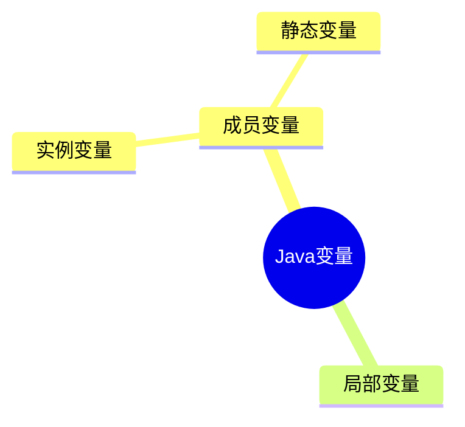
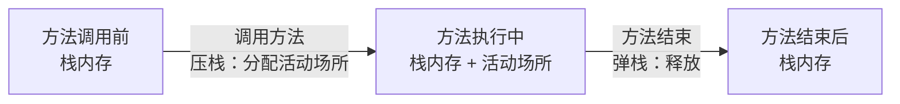

---
描述:
排序: 3000
分组:
分类: "[[JavaSE]]"
创建时间: 2026年07月30日
---
# Java基础语法

## 词法基础

Java 源代码由一连串==词法元素==（token）构成，其中最基础的三类是`标识符`、`关键字`与`字面量`——分别是「自己命名的」「语言保留的」和「直接写出的值」。

### 标识符

> [!note] 定义
> Java标识符（Identifier）是程序中用来`命名`变量、方法、类、接口、包等元素的`名称`。

```java
--8<-- "code/java/basics/javase-demo/src/main/java/com/luguosong/basicsyntax/identifier/IdentifierOverview.java"
```

#### 命名规则和规范

> [!note] 规则 vs 规范
> - **规则**：需要==强制执行==的要求，违反会导致编译不通过。
> - **规范**：良好的习惯和约定，遵守可提升代码可读性，但不强制。

##### 命名规则

由字母、数字、下划线 `_`、美元符号 `$` 组成；不能以数字开头、不能是关键字、区分大小写、长度无限制。其中"字母"指任意国家文字（Java 支持 Unicode）。

```java
--8<-- "code/java/basics/javase-demo/src/main/java/com/luguosong/basicsyntax/identifier/NamingRule.java"
```

##### 命名规范

总则：==见名知意==，采用==驼峰式==命名。各类标识符约定如下：

| 适用对象 | 命名规范 | 示例 |
|---|---|---|
| 类、接口、枚举、注解 | 大驼峰（每个单词首字母大写） | `StudentService`、`UserService` |
| 变量、方法 | 小驼峰（首字母小写，后续单词首字母大写） | `doSome`、`doOther` |
| 常量 | 全大写，单词间用下划线连接 | `LOGIN_SUCCESS`、`SYSTEM_ERROR` |
| 包名 | 全部小写 | `com.luguosong.demo` |

### 关键字

> [!note] 定义
> Java 语言规范预定义的`保留字`，编译器赋予其特殊语义，**不可用作`标识符`**。

其中一部分随 JDK 版本演进而引入的关键字为「上下文关键字」——仅在特定语法位置作为关键字，其它位置仍可作标识符（Java 借此在不破坏既有代码的前提下演进语言）。

下面按用途分类整理，新引入的关键字在括号内标注版本。

> [!note] `true` / `false` / `null` 不是关键字
> 它们看起来像关键字，其实是**字面量**（literals），同样不能作为标识符使用。

**数据类型**

| | | | | |
|---|---|---|---|---|
| `boolean` | `byte` | `char` | `short` | `int` |
| `long` | `float` | `double` | `void` | |

**流程控制**

| | | | | |
|---|---|---|---|---|
| `if` | `else` | `switch` | `case` | `default` |
| `when`（JDK 21，模式匹配守卫） | `for` | `do` | `while` | `break` |
| `continue` | `return` | `yield`（JDK 14，switch 表达式返回值） | `assert`（JDK 1.4 新增） | |

**访问修饰符**

| | | | | |
|---|---|---|---|---|
| `public` | `protected` | `private` | |

**类、接口与对象**

| | | | | |
|---|---|---|---|---|
| `class` | `interface` | `enum`（JDK 5.0 新增） | `record`（JDK 16，记录类） | `value`（JDK 28 预览，值类） |
| `extends` | `implements` | `sealed`（JDK 17，密封类） | `permits`（JDK 17，授权子类型） | `non-sealed`（JDK 17，取消密封） |
| `new` | `this` | `super` | `instanceof` | |

**成员修饰符**

| | | | | |
|---|---|---|---|---|
| `final` | `abstract` | `static` | `native` | `transient` |
| `volatile` | `synchronized` | `strictfp`（JDK 1.2 新增） | | |

**异常处理**

| | | | | |
|---|---|---|---|---|
| `try` | `catch` | `finally` | `throw` | `throws` |

**包与声明**

| | | | | |
|---|---|---|---|---|
| `package` | `import` | `var`（JDK 10，局部变量类型推断） | `_`（JDK 22，未命名变量） | |

**模块系统**（均为 JDK 9 引入）

| | | | | |
|---|---|---|---|---|
| `module` | `open` | `requires` | `transitive` | `exports` |
| `opens` | `to` | `uses` | `provides` | `with` |

**保留未使用**

| | | | | |
|---|---|---|---|---|
| `const` | `goto` | | | |

### 字面量

> [!note] 定义
> `字面量`是源代码中值的直接表示，编译器在编译期即可确定其`类型`和`值`，无需运算或方法调用。

```java
--8<-- "code/java/basics/javase-demo/src/main/java/com/luguosong/basicsyntax/literal/LiteralDemo.java"
```

## 变量

> [!note] 定义
> `变量`是程序在运行期间可以改变其`值`的命名存储单元。
>
> 本质上是：一块`内存空间`的符号化引用。

变量三要素：

- 数据类型
- 变量名
- 变量值

```java
--8<-- "code/java/basics/javase-demo/src/main/java/com/luguosong/basicsyntax/variable/VariableElements.java"
```

```java
--8<-- "code/java/basics/javase-demo/src/main/java/com/luguosong/basicsyntax/variable/VariableDeclare.java"
```

> [!tip] 变量的作用
> - 便于代码的维护
> - 增强代码的可读性

```java
--8<-- "code/java/basics/javase-demo/src/main/java/com/luguosong/basicsyntax/variable/VariableDetail.java"
```

### 作用域

> [!note] 定义
> `作用域`（Scope）是变量在程序中`可见`且`可被访问`的代码区域。变量只在声明它的作用域内有效，出了作用域就不再存在、也无法引用。

```java
--8<-- "code/java/basics/javase-demo/src/main/java/com/luguosong/basicsyntax/variable/ScopeDemo.java"
```

### 变量分类

> [!note] 定义
> Java 变量按`声明位置`分为两大类：`成员变量`（类中、方法外）和`局部变量`（方法 / 代码块内）。`成员变量`又按是否有 `static` 修饰，细分为`实例变量`和`静态变量`。



| 变量类型 | 声明位置 | static | 属于 | 默认值 |
|---|---|---|---|---|
| `局部变量` | 方法体 / 代码块 `{}` | 不可加 | 方法调用 | 无，必须显式初始化 |
| `实例变量` | 类中、方法外 | 无 | 对象实例 | 有（`0` / `null` / `false`） |
| `静态变量` | 类中、方法外 | 有 | 类本身 | 有（`0` / `null` / `false`） |

> [!note] 成员变量 = 实例变量 + 静态变量
> `成员变量`是总称，指所有声明在「类中、方法外」的变量。其中不带 `static` 的是`实例变量`，带 `static` 的是`静态变量`（又称类变量）。三者是**包含关系**，不是并列。

```java
--8<-- "code/java/basics/javase-demo/src/main/java/com/luguosong/basicsyntax/variable/VariableDemo.java"
```

## 数据类型

Java 是==强类型语言==：每个变量在使用前必须声明类型，且类型在编译期就确定。

### 基本数据类型

基本类型（primitive type）共 8 种，==直接存储数值本身==，分配在栈上（局部变量）或对象内（成员变量）。先看一张总表，掌握占用空间、取值范围与默认值：

#### 总表

| 分类  | 类型        | 占用字节 | 取值范围                                       | 默认值        | 说明                    |
| --- | --------- | ---- | ------------------------------------------ | ---------- | --------------------- |
| 整数型 | `byte`    | 1    | -128 ~ 127                                 | `0`        | 最小的整数，常用于节约内存         |
| 整数型 | `short`   | 2    | -32768 ~ 32767                             | `0`        | 很少使用                  |
| 整数型 | `int`     | 4    | -2147483648 ~ 2147483647（约 ±21 亿）          | `0`        | ==整数默认类型==，最常用        |
| 整数型 | `long`    | 8    | -9223372036854775808 ~ 9223372036854775807 | `0L`       | 表示超大整数                |
| 浮点型 | `float`   | 4    | 约 ±3.4E38（6~7 位有效数字）                       | `0.0F`     | 单精度，需加 `F` 后缀         |
| 浮点型 | `double`  | 8    | 约 ±1.8E308（15 位有效数字）                       | `0.0`      | ==浮点数默认类型==           |
| 字符型 | `char`    | 2    | 0 ~ 65535                                  | `'\u0000'` | ==无符号==，存储 Unicode 字符 |
| 布尔型 | `boolean` | —    | `true` / `false`                           | `false`    | 规范未定义位数               |

> [!warning] 默认值
> 只有成员变量才有默认值，局部变量声明不赋值直接使用会报错

> [!note] 取值范围怎么来的
> - ==有符号整数==（byte/short/int/long）：最高位是符号位，n 位的范围是 `-2ⁿ⁻¹ ~ 2ⁿ⁻¹−1`（详见 [[原码反码补码]]）。
> - `char` ==无符号==：16 位全部表示数值，范围 `0 ~ 2¹⁶−1 = 65535`。
> - `float` / `double` 遵循 IEEE 754，范围庞大但精度有限（见下方浮点型小节）。

> [!tip] 常量速查
> 无需死记数字，Java 提供了包装类的常量：`Byte.MAX_VALUE`、`Integer.MIN_VALUE`、`Long.MAX_VALUE` 等，直接打印即可查看。

#### 整数型

`byte`、`short`、`int`、`long` 四种，都是==有符号==的整数（Java 没有 `unsigned` 关键字）。

**整数字面量==默认是 `int`==** —— 这是贯穿下面所有赋值场景的关键事实：字面量先按 `int` 解析，再根据左侧类型决定是直接赋值、自动拓宽，还是需要后缀/强转。

**`int`（默认类型）** —— 直接赋值，超出 ±21 亿即编译报错：

```java
--8<-- "code/java/basics/javase-demo/src/main/java/com/luguosong/basicsyntax/datatype/IntegerIntDemo.java"
```

**`long`（超大整数）** —— 超 `int` 范围必须加 `L` 后缀（小写 `l` 形似数字 `1`，禁用）：

```java
--8<-- "code/java/basics/javase-demo/src/main/java/com/luguosong/basicsyntax/datatype/IntegerLongDemo.java"
```

**`byte` / `short`（节约内存）** —— 仅当右侧是==编译期常量==且在目标范围内，才自动收窄（JLS §5.2）；一旦参与运算就会提升为 `int`：

```java
--8<-- "code/java/basics/javase-demo/src/main/java/com/luguosong/basicsyntax/datatype/ByteShortDemo.java"
```

**日常选型** —— 几乎只用 `int`；数值可能超过 ±21 亿（人口、时间戳毫秒数）才用 `long`；`byte`/`short` 多用于节约内存或 IO/网络协议的字节处理。

> [!tip] 判断口诀
> 看到 `byte/short = ...`，问自己两个问题：**①右侧是不是编译期就能确定的常量？②这个值在不在目标类型范围内？** 两个都"是"才能省掉强转；只要有一个"否"，就得写 `(byte)`/`(short)` 强转（可能丢失精度）。

#### 浮点型

`float`（单精度，6~7 位有效数字）和 `double`（双精度，15 位有效数字），遵循 IEEE 754 标准。

**默认类型与后缀** —— 浮点字面量==默认是`double`==。声明 `float` 必须加 `F` 后缀：

```java
--8<-- "code/java/basics/javase-demo/src/main/java/com/luguosong/basicsyntax/datatype/FloatTypeDemo.java"
```

底层存储原理：

![[Pasted image 20260711183241.png]]

指数位取值范围 -126 ~ 127。

浮点型参与运算得出的结果是==近似值==，因此==不要用 `==` 对浮点结果做相等比较==：

```java
--8<-- "code/java/basics/javase-demo/src/main/java/com/luguosong/basicsyntax/datatype/FloatCompareDemo.java"
```

```java
--8<-- "code/java/basics/javase-demo/src/main/java/com/luguosong/basicsyntax/datatype/FloatPrecisionDemo.java"
```

> [!warning] 浮点数不能精确表示十进制小数
> 浮点数采用二进制存储，`0.1` 这样的十进制小数在二进制下是无限循环，无法精确表示。因此涉及金额、利率等精度敏感场景，应使用 `java.math.BigDecimal`，避免 `float`/`double` 直接运算。

#### 字符型

`char` 是==无符号==的 16 位整数，存储一个 Unicode 字符，范围 `0 ~ 65535`。

```java
--8<-- "code/java/basics/javase-demo/src/main/java/com/luguosong/basicsyntax/datatype/CharTypeDemo.java"
```

char 的取值范围 `0 ~ 65535` 即 Unicode 基本多文种平面（BMP），各区段分布如下：

（`U+XXXX` 是十六进制 Unicode 码点，即上文 `char c2 = 65`、`'A'` 那个码点的十六进制写法；如 `U+0041` = 十进制 `65` = `'A'`。）

| 字符类别                              | Unicode / 十进制                  | 示例                      |
| --------------------------------- | ------------------------------ | ----------------------- |
| 控制字符                              | U+0000 ~ U+001F（0 ~ 31）        | 换行、制表符（不可打印）            |
| 英文 / 数字 / 基本符号（ASCII）             | U+0020 ~ U+007E（32 ~ 126）      | `A`、`0`、`@`             |
| 控制字符（扩展）                          | U+007F ~ U+009F（127 ~ 159）     | `DEL` 等                 |
| 拉丁字母扩展（西欧 / 越南语 / 拼音）             | U+00A0 ~ U+024F（160 ~ 591）     | `é`、`ü`、`ā`             |
| 音标 / 修饰符 / 组合符号                   | U+0250 ~ U+036F（592 ~ 879）     | `ə`、组合重音                |
| 希腊 / 西里尔字母（俄语等）                   | U+0370 ~ U+04FF（880 ~ 1279）    | `α`、`Ω`、`Д`             |
| 其它语言文字（希伯来 / 阿拉伯 / 泰 / 藏等）        | U+0500 ~ U+1FFF（1280 ~ 8191）   | `ש`、`ا`、`ก`             |
| 各类符号（标点 / 货币 / 数学 / 箭头 / 图形 / 盲文） | U+2000 ~ U+2BFF（8192 ~ 11263）  | `€`、`→`、`★`、`⠿`（盲文）     |
| CJK 部首（康熙 / 补充）/ 历史文字             | U+2C00 ~ U+2FFF（11264 ~ 12287） | `⼀`（康熙部首）               |
| CJK 标点符号                          | U+3000 ~ U+303F（12288 ~ 12351） | `，`、`。`、全角空格            |
| 日文假名（平假名 + 片假名）                   | U+3040 ~ U+30FF（12352 ~ 12543） | `あ`、`ア`                 |
| 韩文兼容字母 / 注音符号                     | U+3100 ~ U+33FF（12544 ~ 13311） | `ㄱ`、`ㄅ`                 |
| CJK 扩展汉字 A / 易经卦象                 | U+3400 ~ U+4DFF（13312 ~ 19967） | `㐀`（生僻字）                |
| CJK 统一汉字（中日韩常用字）                  | U+4E00 ~ U+9FFF（19968 ~ 40959） | `中`、`文`、`字`             |
| 彝文等少数民族文字                         | U+A000 ~ U+ABFF（40960 ~ 44031） | `ꀀ`（彝文）                 |
| 韩文音节（含扩展字母）                       | U+AC00 ~ U+D7FF（44032 ~ 55295） | `가`、`한`                 |
| 代理区 Surrogate（UTF-16 占位，非真实字符）    | U+D800 ~ U+DFFF（55296 ~ 57343） | 无，保留区                   |
| 私用区 PUA（自定义字符）                    | U+E000 ~ U+F8FF（57344 ~ 63743） | 无统一定义                   |
| 兼容汉字 / 各种展示形式（含 BOM `U+FEFF`）     | U+F900 ~ U+FEFF（63744 ~ 65279） | `豈`（兼容字）                |
| 全角 / 半角形式                         | U+FF00 ~ U+FFEF（65280 ~ 65519） | `Ａ`、`１`、`＠`             |
| 特殊区（非字符）                          | U+FFF0 ~ U+FFFF（65520 ~ 65535） | `U+FFFE`、`U+FFFF`（永不分配） |

> [!note] char 与 short/byte 的区别
> 同为 16 位，`short` 是==有符号==（−32768 ~ 32767），`char` 是==无符号==（0 ~ 65535）。`char` 本质上存的是字符的 Unicode 码点，可以和 `int` 互相赋值（char 自动提升为 int 时按无符号处理）。
>
> char 只能表示一个 UTF-16 编码单元，对于超出 U+FFFF 的字符（如部分 emoji），需要用两个 char（代理对）表示。

##### 常见字符编码

`char` 存的是 Unicode 码点，而 Java 的 `char` 定为 16 位，本质就是 **UTF-16 的一个编码单元**。但码点只是「编号」，真正写入文件、传到网络的是**字节序列**——这就需要「字符编码」把编号转换成字节。先区分两个常被混淆的概念：

> [!note] 字符集 vs 字符编码
> - **字符集（Charset）**：给每个字符分配唯一**编号**（码点），只管「编几号」，不管「怎么存」。如 Unicode、ASCII。
> - **字符编码（Encoding）**：把编号转换成**字节序列**的规则，管「怎么存」。如 UTF-8、UTF-16、UTF-32。
> - ASCII、ISO-8859-1 字符少，编号即字节，两者合一；Unicode 字符多，编号与存储分离，于是派生出多种 UTF 编码方案。

常见编码对照如下（「英文」指 ASCII 字母，「常用汉字」指 BMP 内 `U+4E00~U+9FFF`）：

| 编码 | 性质 | 字节长度 | 英文 | 常用汉字 | 说明 |
|---|---|---|---|---|---|
| **ASCII** | 字符集 + 编码 | ==7 位==（存储占 1 字节） | 1 字节 | 不支持 | 128 个字符，最高位空闲 |
| **ISO-8859-1（Latin-1）** | 字符集 + 编码 | 1 字节 | 1 字节 | 不支持 | 扩展 ASCII 至 256 字符，覆盖西欧语言 |
| **GBK**（中文「ANSI」） | 字符集 + 编码 | 1 或 2 字节 | 1 字节 | 2 字节 | 中文 Windows 默认代码页（CP936） |
| **Unicode** | ==字符集（仅编号）== | — | — | — | 码点 `U+0000~U+10FFFF`，约 110 万码位，本身不规定字节长度 |
| **UTF-8** | Unicode 编码 | 1~4 字节变长 | 1 字节 | 3 字节 | Web 最常用，英文省空间 |
| **UTF-16** | Unicode 编码 | 2 或 4 字节变长 | 2 字节 | ==2 字节== | BMP 字符 2 字节；超出 BMP（emoji、生僻字）用代理对占 4 字节 |
| **UTF-32** | Unicode 编码 | 4 字节定长 | 4 字节 | 4 字节 | 每字符固定 4 字节，最占空间 |

中国及港台地区有一套独立的汉字编码标准，按收录范围从小到大演进，开发中文应用、处理历史数据时常会遇到：

| 编码 | 全称 | 收录范围 | 汉字字节 | 演进关系 |
|---|---|---|---|---|
| **GB2312** | 信息交换用汉字编码字符集·基本集 | 6763 汉字 + 682 符号 | 2 字节 | 1980 国标，GBK 前身 |
| **GBK** | 汉字内码扩展规范（==国标扩展==） | 21003 汉字 + 883 符号 | 2 字节 | 兼容 GB2312，覆盖内地常用汉字 |
| **GB18030** | 信息技术 中文编码字符集 | ==全部 Unicode== | 1/2/4 字节变长 | 2005 强制国标，取代 GB2312/GBK |
| **Big5** | 大五码 | 约 13060 繁体汉字 | 2 字节 | 台湾/香港繁体中文专用 |

> [!note] GBK 的 K 是「扩展」
> **GBK** = **G**uo**B**iao **K**uozhan（国标扩展）——GB 是「国标」，K 是「扩展」（Kuozhan）。它在 GB2312 基础上扩大了收录范围，但仍是 2 字节定长，覆盖不了生僻字；要覆盖全部 Unicode，须用变长的 GB18030（1/2/4 字节）。

> [!tip] 实际选型
> - **新项目一律用 UTF-8**，不要再选 GB 系列——跨平台、防乱码。
> - 只有处理**历史数据**或对接**遗留系统**（政务、银行、Windows「另存为 ANSI」）才会遇到 GBK/GB18030，读取时务必显式指定编码，否则按系统默认解码极易乱码。
> - 繁体中文（台湾）场景才用 **Big5**。

> [!warning] 三个高频误区
> - **「Unicode 占 2 或 4 字节」**：把字符集当成了编码。Unicode 只负责编号，字节长度取决于选哪种 UTF 编码——「2 或 4 字节」是 UTF-16 的特征，不是 Unicode 的。
> - **「UTF-16 一个汉字 4 字节」**：常用汉字（BMP）在 UTF-16 中是 ==2 字节==；只有超出 BMP 的字符（部分 emoji、生僻字）才用代理对占 4 字节。
> - **「ANSI 是一种编码」**：ANSI 是 Windows 对系统区域**代码页**的统称，并非具体编码——中文系统是 GBK，日文系统是 Shift-JIS，随系统设置而定。

#### 布尔型

`boolean` 只有两个值：`true` 和 `false`，用于逻辑判断。Java 规范**没有定义它的具体位数**（不像 C 的 `int` 充当布尔）：

```java
--8<-- "code/java/basics/javase-demo/src/main/java/com/luguosong/basicsyntax/datatype/BooleanTypeDemo.java"
```

> [!warning] boolean 不能与整数互转
> 与 C/C++ 不同，Java 的 `boolean` 和 `int` 之间==不能自动转换==。条件判断只能用真正的布尔表达式，避免了 `if (i = 1)` 这类把赋值当条件的隐蔽 bug。

## 运算符

### 算术运算符

> [!note] 定义
> `算术运算符`用于数值的数学运算，操作数与结果都是数值（`+` 还能用于字符串拼接）。

| 运算符 | 运算 | 示例 | 结果 |
|---|---|---|---|
| `+` | 加 / 拼接 | `1 + 2` | `3` |
| `-` | 减 | `3 - 1` | `2` |
| `*` | 乘 | `2 * 3` | `6` |
| `/` | 除 | `7 / 2` | `3` |
| `%` | 取模（取余） | `7 % 2` | `1` |
| `++` | 自增 | `a++` / `++a` | 自身 +1 |
| `--` | 自减 | `a--` / `--a` | 自身 −1 |

#### 基本四则运算

`+` `-` `*` 与常规数学运算一致：

```java
--8<-- "code/java/basics/javase-demo/src/main/java/com/luguosong/basicsyntax/operator/ArithmeticBasicDemo.java"
```

#### 除法 / 与取模 %

两个最易踩坑的运算：

```java
--8<-- "code/java/basics/javase-demo/src/main/java/com/luguosong/basicsyntax/operator/DivisionModuloDemo.java"
```

> [!warning] 整数除法是截断，不是四舍五入
> `7 / 2` 得 `3`，既不是 `3.5` 也不是 `4`。两个 `int` 相除结果必为 `int`，直接丢掉小数部分。需要小数结果时，至少让一个操作数为浮点数（如 `7 / 2.0`）。

#### + 的字符串拼接

`+` 两边都是数字则求和；==只要有一边是字符串，就变成拼接==，且按从左到右顺序执行：

```java
--8<-- "code/java/basics/javase-demo/src/main/java/com/luguosong/basicsyntax/operator/StringConcatDemo.java"
```

#### 自增 ++ 与自减 --

变量自身 ±1。单独成句时 `++a` 与 `a++` 完全等价；==参与表达式时区别才显现==：

```java
--8<-- "code/java/basics/javase-demo/src/main/java/com/luguosong/basicsyntax/operator/IncrementDemo.java"
```

> [!question] 经典面试题：`i = i++` 的结果是多少？
> 后缀 `i++` 表达式的值是自增**前**的旧值，而赋值发生在自增之后——旧值会覆盖掉刚才的自增。对比前缀 `j = ++j` 看差异：

```java
--8<-- "code/java/basics/javase-demo/src/main/java/com/luguosong/basicsyntax/operator/IncrementPitfallDemo.java"
```

### 关系运算符

> [!note] 定义
> `关系运算符`（又称比较运算符）比较两个操作数，判断大小或是否相等，运算结果一定是 `boolean`（`true` / `false`），常用于条件判断与循环。

| 运算符 | 运算 | 示例 | 结果 |
|---|---|---|---|
| `>` | 大于 | `7 > 3` | `true` |
| `<` | 小于 | `7 < 3` | `false` |
| `>=` | 大于等于 | `7 >= 3` | `true` |
| `<=` | 小于等于 | `7 <= 3` | `false` |
| `==` | 等于 | `7 == 3` | `false` |
| `!=` | 不等于 | `7 != 3` | `true` |

```java
--8<-- "code/java/basics/javase-demo/src/main/java/com/luguosong/basicsyntax/operator/RelationalDemo.java"
```

> [!warning] `==` 是比较，`=` 是赋值
> 最常见的笔误是把「判断相等」写成「赋值」——==判断相等用两个等号 `==`，一个 `=` 是赋值==。另外 `>=`、`<=` 的顺序固定，不能写成 `=>`、`=<`。

> [!note] 比较基本类型与引用类型的区别
> `==` 对==基本类型==比较的是`值`本身；对==引用类型==（对象、字符串）比较的是`引用地址`而非内容，判断内容是否相等要用 `.equals()`。此外浮点数存在精度误差，==不要用 `==` 直接比较==（见上文 [[#浮点型]] 小节）。

### 逻辑运算符

> [!note] 定义
> `逻辑运算符`把多个布尔表达式组合成一个判断——两边的操作数和运算结果都必须是 `boolean`。

| 运算符    | 名称   | 说明                                 | 口诀   |
| ------ | ---- | ---------------------------------- | ---- |
| `&`    | 逻辑与  | 两边都为 `true` 才为 `true`              | 并且   |
| <code>&#124;</code> | 逻辑或 | 有一边为 `true` 就为 `true` | 或者 |
| `!`    | 逻辑非  | 取反：`!true → false`、`!false → true` | 相反   |
| `^`    | 逻辑异或 | 两边==不一样==才为 `true`                 | 不同为真 |
| `&&`   | 短路与  | 结果同 `&`，但会短路                       | 高效的与 |
| <code>&#124;&#124;</code> | 短路或 | 结果同 <code>&#124;</code>，但会短路 | 高效的或 |

```java
--8<-- "code/java/basics/javase-demo/src/main/java/com/luguosong/basicsyntax/operator/LogicalDemo.java"
```

> [!tip] 短路 `&&` `||` 与非短路 `&` `|` 的区别
> 短路版的运算结果和非短路版==完全相同==，区别只在执行过程：
> - `&&`：左边为 `false` 时，右边==直接跳过不执行==（结果已必为 `false`）。
> - `||`：左边为 `true` 时，右边==直接跳过不执行==（结果已必为 `true`）。
>
> ==开发中优先用短路版==：效率更高，还能借短路规避右边的副作用，例如 `obj != null && obj.foo()` 可防止空指针。非短路 `&` / `|` 仅用于「无论如何都要让两边都执行」的少数场景。

### 按位运算符

> [!note] 定义
> `按位运算符`在整数的==二进制位==层面直接运算。操作数必须是整数类型（`byte` / `short` / `int` / `long` / `char`），用于浮点数会编译报错。

| 运算符 | 名称 | 说明 |
|---|---|---|
| `<<` | 左移 | 各位左移，低位补 0 |
| `>>` | 右移（有符号） | 各位右移，高位补==符号位== |
| `>>>` | 无符号右移 | 各位右移，高位补 0 |
| `&` | 按位与 | 对应位==都为 1==才为 1 |
| <code>&#124;</code> | 按位或 | 对应位==有一个为 1==就为 1 |
| `^` | 按位异或 | 对应位==不同==为 1 |
| `~` | 按位取反 | 逐位取反：0↔1（含符号位） |

#### 左移

左移 `<<` 把二进制的所有位整体向左移动 n 位，==低位补 0==。三条规律：

1. **左移 n 位 ≈ 乘以 2ⁿ**：`0b1011`（11）左移 2 位得 `0b101100`（44）= 11 × 2² = 44。
2. **高位移出即丢弃（溢出截断）**：超出类型宽度的高位直接舍去。
3. **移位不做符号扩展，但符号可能改变**：左移只是右补 0，不像 `>>` 按符号位补位；可一旦有效位被移进最高位（符号位），结果符号就会翻转——如 `1 << 31` 得到 `Integer.MIN_VALUE`（负数）。

```java
--8<-- "code/java/basics/javase-demo/src/main/java/com/luguosong/basicsyntax/operator/LeftShiftDemo.java"
```

#### 右移

右移 `>>`（有符号右移）把二进制的所有位整体向右移动 n 位，==高位补符号位==（正数补 0、负数补 1），因此==符号不变==。三条规律：

1. **右移 n 位 ≈ 除以 2ⁿ**：`0b101100`（44）右移 2 位得 `0b1011`（11）= 44 ÷ 2² = 11。
2. **高位补符号位，保持正负**：正数左边补 0，负数左边补 1，零右移仍是零——符号位始终不变。
3. **移出的低位直接丢弃**：右边移出的低位被舍去（这正是右移等价于整除取整的原因——丢掉的低位相当于余数）。

```java
--8<-- "code/java/basics/javase-demo/src/main/java/com/luguosong/basicsyntax/operator/RightShiftDemo.java"
```

> [!warning] 负数右移是「向下取整」，不完全等于 `/`
> `>>` 向==负无穷==方向取整，而 Java 的 `/` 向==零==取整，对负数二者可能不同：`-7 >> 1` 得 `-4`（向下），但 `-7 / 2` 得 `-3`（向零）。正数则一致。

#### 无符号右移

无符号右移 `>>>`（逻辑右移）把二进制的所有位整体向右移动 n 位，==高位一律补 0==，不管符号位。三条规律：

1. **对正数 ≈ 除以 2ⁿ；对负数则变成大正数**：正数与 `>>` 效果相同；负数因符号位也被当普通位、高位补 0，会变成一个很大的正数——如 `-1 >>> 1` 得 `2147483647`（`Integer.MAX_VALUE`），并非除法。
2. **结果一定非负**：高位补 0 使最高位（符号位）恒为 0，所以任何数无符号右移后都是非负数。
3. **移出的低位直接丢弃**：右边移出的低位被舍去。

```java
--8<-- "code/java/basics/javase-demo/src/main/java/com/luguosong/basicsyntax/operator/UnsignedRightShiftDemo.java"
```

> [!note] `>>` 与 `>>>` 的区别
> 两者都右移，区别只在高位补什么：`>>` 补==符号位==（保持正负），`>>>` 一律补 ==0==（结果非负）。对正数二者相同；对负数天差地别——`-1 >> 1` 仍是 `-1`，`-1 >>> 1` 却是 `2147483647`。（Java 没有无符号左移 `<<<`，因为左移低位本就补 0，有无符号没区别。）

#### 按位与

按位与 `&` 把两个整数的二进制==逐位==做与运算：对应位==都为 1==才得 1，否则为 0。

```text
  00100000   (32)
& 00011001   (25)
----------------
  00000000   (0)
```

```java
--8<-- "code/java/basics/javase-demo/src/main/java/com/luguosong/basicsyntax/operator/BitwiseAndDemo.java"
```

> [!tip] 应用：`n & 1` 判断奇偶
> 奇数的二进制最低位一定是 `1`，偶数一定是 `0`。所以 `n & 1` 得 `1` 是奇数、得 `0` 是偶数——比 `n % 2` 更贴近底层，是位运算最常见的用途之一。

#### 按位或

按位或 `|` 把两个整数的二进制==逐位==做或运算：对应位==只要有一个为 1==就得 1，都为 0 才为 0。

```text
  00100000   (32)
| 00011001   (25)
----------------
  00111001   (57)
```

```java
--8<-- "code/java/basics/javase-demo/src/main/java/com/luguosong/basicsyntax/operator/BitwiseOrDemo.java"
```

> [!tip] 应用：用 `|` 把指定位「置 1」
> `flag | (1 << n)` 能在不影响其它位的前提下，把第 n 位（从 0 起算）置为 1——常用于权限、开关等标志位的设置。

#### 按位异或

按位异或 `^` 把两个整数的二进制==逐位==做异或运算：对应位==不同==得 1、==相同==得 0。

```text
  01100100   (100)
^ 11001000   (200)
----------------
  10101100   (172)
```

```java
--8<-- "code/java/basics/javase-demo/src/main/java/com/luguosong/basicsyntax/operator/BitwiseXorDemo.java"
```

> [!tip] 自反性：`a ^ b ^ b == a`
> 一个数对同一个数异或==两次==会还原成它自己。基于这个特性，异或可做==简单加解密==：明文 `^` 密钥得密文，密文再 `^` 同一密钥即还原明文——密码学里应用广泛。

#### 按位取反

按位取反 `~` 是==单目==运算符，把整数二进制的每一位取反（含==符号位==）：0 变 1、1 变 0。

由于 Java 用==补码==表示整数，取反有一条简洁规律：==`~n == -(n + 1)`==。以 `~100` 为例：

```text
 100 的补码： ...00000000 01100100
~100 的补码： ...11111111 10011011   → -101
```

```java
--8<-- "code/java/basics/javase-demo/src/main/java/com/luguosong/basicsyntax/operator/BitwiseNotDemo.java"
```

> [!tip] 应用：位清除 `value & ~(1 << n)`
> `~(1 << n)` 得到「第 n 位为 0、其余全为 1」的掩码，再与 `value` 按位与，就能在不动其它位的前提下把第 n 位==清 0==——与按位或的「置 1」正好互补。

### 赋值运算符

#### 基本赋值运算符

基本赋值 `=` 把右边表达式的值赋给左边变量——==先求值右边，再赋给左边==。

#### 扩展赋值运算符

扩展赋值（复合赋值）把「运算 + 赋值」并成一步，`i += 3` 就是 `i = i + 3` 的简写。共 11 个：算术类 `+=` `-=` `*=` `/=` `%=`，位运算类 `&=` `|=` `^=` `<<=` `>>=` `>>>=`。

```java
--8<-- "code/java/basics/javase-demo/src/main/java/com/luguosong/basicsyntax/operator/AssignmentDemo.java"
```

> [!warning] 扩展赋值隐含强制转换，不改变左侧类型
> `x op= y` 实际等价于 `x = (x的类型)(x op y)`——编译器==自动补一次强制转换==。所以 `byte b = 10; b += 5;` 合法，而 `b = b + 5;` 反而编译报错（`b + 5` 是 `int`，不能直接赋给 `byte`）。即使精度损失（如 `short s = 10; s *= 1.5;` 得 `15`），结果类型也不变。

### 条件运算符

> [!note] 定义
> `条件运算符`是 Java 唯一的==三元运算符==（接受三个操作数），语法：`布尔表达式 ? 表达式1 : 表达式2`。布尔表达式为 `true` 取==表达式1==，为 `false` 取==表达式2==——常用来简化简单的 `if-else`。

```java
--8<-- "code/java/basics/javase-demo/src/main/java/com/luguosong/basicsyntax/operator/TernaryDemo.java"
```

> [!tip] 三元 vs `if-else`
> 三元运算符是一个==有返回值的表达式==，能直接嵌进赋值或方法参数；`if-else` 是语句、本身没有值。简单的「二选一赋值」用三元更紧凑，但嵌套过深会难读，复杂分支还是用 `if-else`。

### 其它运算符

除了前面的算术、关系、逻辑、位、赋值、条件运算符，还有几个与对象打交道的运算符（在[[面向对象]]部分会详细展开，这里先认个脸）：

| 运算符 | 名称 | 作用 |
|---|---|---|
| `new` | 创建 | 创建对象或数组实例，如 `new int[3]`、`new Student()` |
| `.` | 成员访问 | 访问对象的字段 / 方法，如 `obj.name`、`obj.study()` |
| `instanceof` | 类型判断 | 判断对象是否某类型的实例，返回 `boolean` |

`instanceof` 从 JDK 16 起支持==模式匹配==——判断成立的同时把对象绑定到新变量，省去一次强制转换：

```java
--8<-- "code/java/basics/javase-demo/src/main/java/com/luguosong/basicsyntax/operator/InstanceofDemo.java"
```

### 运算符优先级

运算符有优先级，==不确定时加小括号==最稳妥——括号优先级最高、先执行，也让代码更易读。下表**无需死记**，有个印象即可（从高到低）：

| 层级 | 运算符 |
|---|---|
| 最高 | `()` `[]` `.`（括号、下标、成员访问） |
| ↓ | 一元 `!` `~` `++` `--` `+`（正）`-`（负） |
| ↓ | `*` `/` `%` |
| ↓ | `+` `-` |
| ↓ | 移位 `<<` `>>` `>>>` |
| ↓ | 关系 `<` `>` `<=` `>=` `instanceof` |
| ↓ | 相等 `==` `!=` |
| ↓ | 按位 `&` → `^` → <code>&#124;</code> |
| ↓ | 逻辑 `&&` → <code>&#124;&#124;</code> |
| ↓ | 三元 `? :` |
| 最低 | 赋值 `=` `+=` `-=` … |

> [!tip] 记不住就加括号
> 除了「乘除高于加减」「关系高于逻辑」这些直觉，其它优先级不必硬记——用小括号显式表达运算意图，既避免踩坑又提升可读性。

## 控制语句

> [!note] 定义
> `控制语句`用于控制程序的执行流程，改变语句默认「从上往下逐行执行」的次序。按作用分为三类：

| 分类 | 语句 | 作用 |
|---|---|---|
| 分支（选择） | `if`、`switch` | 按条件选择执行哪一段代码 |
| 循环 | `for`、`while`、`do-while` | 满足条件时重复执行某段代码 |
| 跳转 | `break`、`continue` | 中断循环或跳过本次循环 |

### if语句

> [!note] 定义
> `if语句`根据==布尔表达式==的真假决定是否执行某段代码，是最基础的分支语句。共有四种写法。

**① 单分支**：布尔表达式为 `true` 才执行分支，为 `false` 则整块跳过。

```java
if (布尔表达式) {
    分支;
}
```

**② 双分支 `if-else`**：`true` 执行分支 1，`false` 执行分支 2，两者==必执行其一==。

```java
if (布尔表达式) {
    分支1;
} else {
    分支2;
}
```

**③ 多分支 `if-else if`**：从上往下依次判断，命中第一个 `true` 就执行对应分支、整个 if 立即结束；若全为 `false`，则==一个分支都不执行==。

```java
if (布尔表达式1) {
    分支1;
} else if (布尔表达式2) {
    分支2;
} else if (布尔表达式3) {
    分支3;
}
```

**④ 多分支带 `else` 兜底**：在③基础上补一个最后的 `else`——前面条件全为 `false` 时执行它，因此==一定会命中某个分支==。

```java
if (布尔表达式1) {
    分支1;
} else if (布尔表达式2) {
    分支2;
} else {
    分支3;
}
```

完整可运行示例（按成绩评级）：

```java
--8<-- "code/java/basics/javase-demo/src/main/java/com/luguosong/basicsyntax/controlflow/IfDemo.java"
```

> [!tip] 大括号别省
> 单条分支语句语法上可省略 `{}`（如 `if (x > 0) foo();`），但==建议始终写 `{}`==：日后往分支里加第二行时，漏加括号会让新行脱离 if 控制，是新手常见 bug。

### switch语句

> [!note] 定义
> `switch语句`根据==表达式的值==匹配对应的 `case` 分支执行，适合对==离散的固定值==做多分支选择。

基本格式：匹配到某个 `case` 就从那里开始执行，`break` 跳出整个 switch，`default` 兜底处理所有 case 都不匹配的情况。

```java
switch (表达式) {
    case 值1:
        分支1;
        break;
    case 值2:
        分支2;
        break;
    default: // 与所有 case 都不匹配时执行
        兜底分支;
}
```

`switch` 后表达式支持 `byte`、`short`、`char`、`int` 及其包装类、`String`（JDK 7 起）、枚举；`case` 后只能跟==编译期常量==（字面量或 `final` 常量，不能是普通变量），且类型要与表达式一致或能自动转换。

> [!tip] switch 还是 if？
> `switch` 能做的 `if` 都能做，反之不一定。**`switch` 更适合判断某个离散值，`if` 更适合判断范围 / 区间。**

**case 穿透**：`case` 分支不写 `break`，程序会「击穿」继续执行后面的 `case`，直到遇到 `break` 或 switch 结束——漏写 `break` 是常见 bug，而「有意的穿透」正好用来做 **case 合并**（多个值共用一段逻辑）。

下面的示例涵盖传统写法的 `break`、case 穿透、case 合并与 `default`：

```java
--8<-- "code/java/basics/javase-demo/src/main/java/com/luguosong/basicsyntax/controlflow/SwitchDemo.java"
```

> [!warning] 使用注意
> 1. `case` 后的值必须是==编译期常量==（字面量或 `final` 常量），不能是普通变量。
> 2. `case` 值的类型要与 `switch` 表达式一致，或能自动转换。
> 3. 传统写法中每个 `case` 分支通常以 `break` 结尾，避免意外的 case 穿透。
> 4. 建议保留 `default` 分支处理特殊情况（省略也不会编译报错）。
> 5. `default` 可放在 switch 块任意位置，但通常放在所有 `case` 最后，可读性更好。

#### JDK 14 新语法

switch 箭头写法 `case 值 -> ...` 经 JDK 12–13 两轮预览后在 JDK 14 转正：==分支不会穿透、无需 `break`==，可用逗号合并多个值、用 `{}` 包裹多条语句，代码更简洁。

```java
--8<-- "code/java/basics/javase-demo/src/main/java/com/luguosong/basicsyntax/controlflow/SwitchArrowDemo.java"
```

### for语句

> [!note] 定义
> `for语句`是最常用的循环语句，用「初始化、条件判断、更新」三段式控制循环，适合==循环次数明确==的场景。

语法结构：

```java
for (初始化表达式; 条件表达式; 更新表达式) {
    循环体;
}
```

三个部分各司其职：

| 组成 | 执行时机 | 说明 |
|---|---|---|
| 初始化表达式 | ==最先执行，且只执行 1 次== | 通常用来定义并初始化循环变量 |
| 条件表达式 | 每轮循环体执行前判断 | 结果必须是 `boolean`；`true` 执行循环体，`false` 终止循环 |
| 更新表达式 | 每轮循环体执行后 | 通常更新循环变量——==只有变量被更新，条件才有机会变 `false`==，否则死循环 |

执行顺序：初始化 →（判断条件为 `true`）→ 循环体 → 更新 → 再判断条件 → …… 直到条件为 `false` 才结束。

> [!tip] 三个表达式都可省略
> `for` 小括号里的三个表达式都不是必须的。全部省掉的 `for (;;) {}` 就是一个==死循环==（等价于 `while (true)`）。

完整可运行示例（普通计数、死循环写法、循环变量作用域）：

```java
--8<-- "code/java/basics/javase-demo/src/main/java/com/luguosong/basicsyntax/controlflow/ForDemo.java"
```

> [!warning] 循环变量的作用域
> 在初始化表达式中声明的变量（如 `for (int i = 0; ...)` 里的 `i`）作用域==仅限于 for 循环内部==，循环结束后无法再使用；若需要在循环外访问该变量，应把它的声明提到 `for` 之前。

### while语句

> [!note] 定义
> `while语句`先判断条件、再决定是否执行循环体，适合==循环次数不固定==、由条件动态控制的场景。

语法结构：

```java
while (布尔表达式) {
    循环体;
}
```

执行原理：先判断布尔表达式，为 `true` 就执行一次循环体，然后==回到开头重新判断==，如此往复，直到表达式为 `false` 才结束。

> [!tip] while 与 for 怎么选
> 两者可以互相改写。习惯上 **`for` 用于循环次数已知/固定**（如遍历 0~9），**`while` 用于循环次数不确定**（如「读到文件末尾为止」）。while 循环体的执行次数是 ==0 ~ n 次==——条件一开始就为 `false` 时，一次都不执行。

完整可运行示例：

```java
--8<-- "code/java/basics/javase-demo/src/main/java/com/luguosong/basicsyntax/controlflow/WhileDemo.java"
```

#### do-while语句

> [!note] 定义
> `do-while语句`是 while 的变体：==先执行一次循环体、再判断条件==，因此不管条件是否成立，循环体==至少执行一次==。

语法结构（注意 `while (...)` 后要加分号）：

```java
do {
    循环体;
} while (布尔表达式);
```

执行原理：先无条件执行一次循环体，再判断布尔表达式，为 `true` 则继续循环，直到为 `false` 结束。循环体的执行次数是 ==1 ~ n 次==。

> [!tip] 什么时候用 do-while
> 适合「不管条件是否成立，第一次都必须执行」的场景——典型如==先弹一次菜单/提示，再根据用户输入决定是否重复==。

完整可运行示例（对比相同 `false` 条件下 while 与 do-while 的执行次数）：

```java
--8<-- "code/java/basics/javase-demo/src/main/java/com/luguosong/basicsyntax/controlflow/DoWhileDemo.java"
```

### 跳转语句

> [!note] 定义
> `跳转语句`在循环 / switch 的执行过程中直接改变流程走向：`break` ==终止==循环，`continue` ==跳过==本次循环、直接进入下一次。

#### break语句

| 用法 | 作用 |
|---|---|
| switch 中的 `break` | 终止整个 switch 语句（见 [[#switch语句]]） |
| 循环中的 `break;` | 终止==离它最近==的一层循环 |
| `break 标签名;` | 终止==标签指定==的那层循环 |

完整可运行示例（终止最近一层、嵌套中只跳内层、带标签跳出指定循环）：

```java
--8<-- "code/java/basics/javase-demo/src/main/java/com/luguosong/basicsyntax/controlflow/BreakDemo.java"
```

##### break语句与return语句

| 语句 | 终止范围 |
|---|---|
| `break;` | 只终止==循环==，循环后面的代码仍会执行 |
| `return;` | 终止==整个方法==，循环后面的代码不再执行 |

完整可运行示例（两个方法条件相同，对比循环后代码的执行差异）：

```java
--8<-- "code/java/basics/javase-demo/src/main/java/com/luguosong/basicsyntax/controlflow/BreakVsReturnDemo.java"
```

#### continue语句

| 用法 | 作用 |
|---|---|
| `continue;` | 终止==本次==循环，直接进入离它==最近==循环的下一次 |
| `continue 标签名;` | 终止本次循环，直接进入==标签指定==循环的下一次 |

完整可运行示例（跳过本次、嵌套中只作用内层、带标签跳到指定循环）：

```java
--8<-- "code/java/basics/javase-demo/src/main/java/com/luguosong/basicsyntax/controlflow/ContinueDemo.java"
```

## 方法

> [!note] 定义
> `方法`（Method）是一段可以被重复利用的代码片段，通常对应一个独立的功能。在 C 语言中称为`函数`（Function）。

### 如果不使用方法存在的问题

先看一段不用方法的代码——两次求和逻辑相同，却各写了一遍：

```java
--8<-- "code/java/basics/javase-demo/src/main/java/com/luguosong/basicsyntax/method/NoMethodDemo.java"
```

> [!warning] 问题
> 代码复用性差：相同功能写了一遍又一遍，冗余且难以维护。

### 方法的作用

把重复的求和逻辑封装成一个方法，一次定义、多次调用：

```java
--8<-- "code/java/basics/javase-demo/src/main/java/com/luguosong/basicsyntax/method/SumMethodDemo.java"
```

> [!tip] 方法的价值
> 方法把可复用的代码封装成独立的功能单元：需要时直接调用，改逻辑也只需改一处。

### 方法的定义与调用

**语法格式**如下——修饰符列表、返回值类型、方法名、形参列表、方法体五部分：

```java
[修饰符列表] 返回值类型 方法名(形式参数列表) {
    方法体;
}
```

各组成部分说明：

| 组成部分 | 说明 |
|---|---|
| 修饰符列表 | 可选；目前统一写 `public static`（后续章节展开） |
| 返回值类型 | 任意数据类型（基本 / 引用，如 `int`、`String`），或 `void` 表示无返回值——**不能空着不写** |
| 方法名 | 合法标识符即可，小驼峰命名，一般为动词、见名知意，如 `sum`、`login`、`logout`、`deleteUser` |
| 形式参数列表 | 简称==形参==，0~N 个，多个用逗号隔开；形参是局部变量，起决定作用的是==类型==（形参名随意） |
| 方法体 | 大括号内的 Java 语句，遵循==自上而下==的执行顺序 |

> [!note] 返回值与 return
> - 返回值类型**不是** `void` 时，方法结束前必须用 `return 值;` 返回数据；接收返回值的变量类型要与返回值==一致==（或可自动 / 强制转换）。
> - 返回值类型**是** `void` 时，不能写 `return 值;`；可以写 `return;` 提前终止方法，也可以不写（视业务而定）。
> - 只要 `return` 执行，方法立即结束。
> - 对有返回值的方法，调用者可以选择接收，也可以不接收。

**方法的调用**：当方法带 `static` 修饰时，通过`类名.方法名(实际参数列表)`调用。实参（==实际参数==）与形参必须==一一对应==：

- 类型一一对应
- 个数一一对应

### 方法执行内存分析

方法==只定义、不调用，不会分配内存空间==。方法真正占用内存发生在调用的瞬间：

- **方法调用**：在栈（stack）内存中为该方法分配活动场所，此时发生==压栈==。
- **方法结束**：释放该方法占用的内存空间，此时发生==弹栈==。



> [!note] 方法的字节码存在哪
> 从 Java 8 开始，方法的字节码指令存储在==元空间==（Metaspace）中，元空间使用的是本地内存。

### 方法重载

方法重载（overload）是==编译阶段==的一种机制（静态多态）：同一个类中允许多个同名方法，编译期即根据参数列表确定调用哪一个。

> [!note] 构成方法重载的条件
> 需同时满足：
> 1. 在同一个类中
> 2. 方法名相同
> 3. 参数列表不同——类型不同、个数不同、顺序不同，任一即可

完整可运行示例（参数类型不同、个数不同、顺序不同，编译期各自绑定到对应版本）：

```java
--8<-- "code/java/basics/javase-demo/src/main/java/com/luguosong/basicsyntax/method/OverloadDemo.java"
```

> [!warning] 与返回值类型无关
> 仅返回值类型不同、参数列表相同，==不构成==重载，编译报错——编译期无法仅凭返回值区分该调用哪个方法。

> [!tip] 何时用 & 好处
> 同一个类中，多个功能相似的方法建议用重载（同名）。好处：简化调用、便于维护、代码美观。

### 方法递归

> [!tip] 使用要点
> - 递归必须有明确的==结束条件==，否则会无限递归。
> - 递归和循环都能实现时，==优先选择循环==——递归更耗费内存。

> [!question] 待深入
> - 什么是方法的递归调用？
> - 递归时内存是如何变化的？
> - 递归有结束条件，就一定不会栈内存溢出吗？
> - 实际开发中使用递归发生栈内存溢出，该怎么办？

## 包（package）和import

### 包（package）

> [!note] 定义
> `包`（package）是 Java 的类管理机制：不同的类放在不同的包下，==便于管理、便于维护==。

**语法格式**——package 语句只能写==1 行==，且必须写在 java 源码的==第一行==（有效代码行，注释除外）：

```java
package 包名;
```

**定义包之后的编译与运行**：

| 操作 | 命令 | 说明 |
|---|---|---|
| 带包编译 | `javac -d . PackageTest01.java` | 语法：`javac -d 生成目录 源文件路径`，`.` 表示当前目录，编译器自动按包名创建目录结构 |
| 带包运行 | `java org.apache.struts.PackageTest01` | 必须使用==完整类名==（包名 + 类名） |

> [!warning] 完整类名带包名
> 一旦定义了 package，类的完整类名 = ==包名 + 类名==。运行时必须带包名，否则找不到类。

也可以不带 `-d` 编译后手动创建目录、移动 class 文件——麻烦，不推荐。

> [!note] 包命名规范
> - 所有包名全部==小写==
> - 公司域名倒序 + 项目名 + 模块名 + 功能名，如 `com.powernode.oa.epmgt.service`

### 包对方法调用的影响

同一个包的类：直接用 `类名.方法名(实参)` 调用；不同包的类：不用 import 时，必须写==完整类名==。

完整可运行示例（同包直接用类名、跨包用完整类名调用）：

```java
--8<-- "code/java/basics/javase-demo/src/main/java/com/luguosong/basicsyntax/pkg/PackageCallDemo.java"
```

### import

A 类中使用 B 类，A 类和 B 类==不在同一个包==下时，就需要在 A 类中用 `import` 语句引入 B 类；引入后用简单类名调用，不必再写完整类名。

> [!note] import 语法规则
> - 位置：只能出现在==package 语句之下、class 定义之前==
> - import 语句可以编写多个
> - `java.lang` 包下的类（如 `System`、`String`）编译器==自动引入==，不需要手动引入
> - 支持模糊导入（通配符）：`import java.util.*;`
> - 支持静态导入：`import static java.lang.System.*;`——导入静态成员后，调用时可不写类名

完整可运行示例（import 后用简单类名调用、java.lang 自动引入、静态导入省略类名）：

```java
--8<-- "code/java/basics/javase-demo/src/main/java/com/luguosong/basicsyntax/pkg/ImportDemo.java"
```

