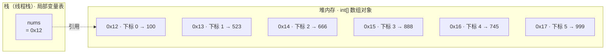
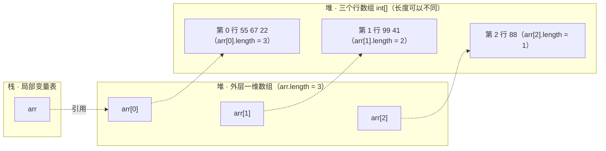

# 数组

## 概述

数组（array）是 Java 中最基本的数据结构：一个用于存储==多个相同数据类型==元素的==容器==。本节按「是什么 → 怎么分类 → 元素在内存中如何存储 → 由此带来的优缺点」的顺序，先建立对数组的整体认识。

### 什么是数组

> [!note] 核心思想
> 数组（array）：一种用于存储==多个相同数据类型==元素的==容器==，是一种==引用数据类型==。

声明数组变量时，`元素类型[]` 就表示「该类型元素的数组」：

```java
// 存储整数的数组（基本类型数组）
int[] nums = {100, 200, 300};

// 存储字符串的数组（引用类型数组）
String[] names = {"jack", "lucy", "lisi"};
```

关于数组的三个基本事实：

| | 说明 |
|---|---|
| ==引用数据类型== | 数组不属于 8 种基本类型（数据类型划分见 [[Java基础语法#数据类型]]），数组变量中保存的是引用（内存地址） |
| ==隐式继承 Object== | 任何数组都隐式继承 Object，==可以调用 Object 类中的方法==（如 `toString()`，见 [[面向对象#Object类]]） |
| ==存储在堆内存== | ==数组对象在堆中开辟空间==，栈中的变量只保存它的引用（内存图见 [[#数组存储元素的特点]]） |

完整可运行示例（定义 `int` 数组与 `String` 数组并逐个打印元素；直接打印数组变量，输出的是 Object 的 `toString()` 默认形式，而不是元素内容）：

```java
--8<-- "code/java/basics/javase-demo/src/main/java/com/luguosong/array/ArrayOverviewDemo.java"
```

### 数组的分类

| 分类维度 | 分类结果 |
|---|---|
| 按维数分 | ==一维数组==、二维数组、三维数组、多维数组 |
| 按元素类型分 | ==基本类型数组==（如 `int[]`）、==引用类型数组==（如 `String[]`） |
| 按初始化方式分 | ==静态初始化==数组、==动态初始化==数组（两种写法见 [[#一维数组]]） |

### 数组存储元素的特点

数组的 6 条存储特点——它们是后面一切优缺点的根源：

| | 特点 |
|---|---|
| ① | 数组==长度一旦确定，不可改变== |
| ② | 数组中元素==数据类型一致==，每个元素占用空间大小相同 |
| ③ | 每个元素在空间存储上==内存地址连续== |
| ④ | 每个元素有==索引（下标）==：首元素索引 ==0==，以 1 递增 |
| ⑤ | 以==首元素的内存地址==作为数组对象在堆内存中的地址 |
| ⑥ | 所有数组对象都有 ==length 属性==用来获取数组元素个数；末尾元素下标 ==length - 1== |

内存原理：以 `int[] nums = {100, 523, 666, 888, 745, 999};` 为例（假设 `nums` 是局部变量）——`nums` 保存在栈的==局部变量表==中（JVM 运行时内存区域见 [[JVM概述]]），值是引用 `0x12`；数组对象在==堆==中，从 `0x12` 开始==连续==开辟 6 个等大的 `int` 空间，==首元素的内存地址就是数组对象的地址==：



完整可运行示例（`length` 属性、下标访问、末尾元素下标 `length - 1`；给 `length` 重新赋值编译报错）：

```java
--8<-- "code/java/basics/javase-demo/src/main/java/com/luguosong/array/ArrayFeatureDemo.java"
```

### 数组的优点

==根据下标查询某个元素的效率极高==：数组中有 100 个元素和有 100 万个元素，按下标查询的效率相同——不管数组长短，耗费时间是固定不变的，时间复杂度为 ==O(1)==。

> [!tip] 时间复杂度 O(1) 与 O(n)
> - ==O(1)==（常数阶）：耗时是一个==固定值==，与数据规模 n 无关
> - ==O(n)==（线性阶）：耗时随规模 n ==线性增长==，n 越大，算法的执行效率越低

效率高的原因：知道==首元素内存地址==（特点⑤），元素内存地址又==连续==（特点③），每个元素占用空间大小==相同==（特点②）——只要知道下标，就可以通过数学表达式直接计算出目标元素的内存地址，无需遍历：

```
目标元素地址 = 首元素地址 + 下标 × 每个元素占用的空间大小
```

### 数组的缺点

- ==随机增删元素的效率较低==：随机增删时，为了保证数组元素的内存地址连续（特点③），需要移动后续元素，时间复杂度 ==O(n)==（不过==对数组末尾元素的增删不受影响==——不会引起其它元素位移）
- ==无法存储大量数据==：数组需要一整块==连续==的内存空间，数据量非常大时，内存中很难找到这么大的一块连续区域

> [!note] 优点与缺点同源
> 优缺点来自同一组特点：==地址连续 + 元素等大==既造就了 O(1) 的下标查询，也带来了增删要位移、大块连续内存难找的代价。数组「长度不可变」等限制，正是后续学习集合框架（如 `ArrayList`）的动机。

## 一维数组

一维数组是==线性结构==；二维数组、三维数组等多维数组是非线性结构。

### 如何静态初始化一维数组？

静态初始化：==创建数组时直接写出全部元素值==，数组的==长度由元素个数自动决定==——适合已知全部数据的场景。两种写法：

```java
// 第一种：完整格式 —— new 数据类型[]{元素1, 元素2, ...}
int[] arr = new int[]{55, 67, 22};

// 第二种：简化格式 —— 声明的同时直接给出元素列表（省略 new int[]，最常用）
int[] arr2 = {55, 67, 22};
```

- 两种写法==效果完全相同==，长度都由元素个数决定；简化格式更简洁，是最常用的写法
- C 风格声明 `int arr[] = {55, 67, 22};` 也合法（沿袭 C 语言），但 Java 惯用 `int[] arr`——把「`int` 数组」看作一个完整类型

> [!warning] 两个易错点
> - **简化格式只能在声明的同时初始化**：`int[] arr; arr = {55, 67, 22};` ==编译报错「非法的表达式开始」==——声明与赋值拆开时，只能用完整格式 `arr = new int[]{55, 67, 22};`
> - **完整格式不能同时指定长度**：`new int[3]{55, 67, 22}` ==编译报错「同时使用维表达式和初始化创建数组是非法的」==——`[]` 内不能写长度，长度只能由元素个数决定

完整可运行示例：

```java
--8<-- "code/java/basics/javase-demo/src/main/java/com/luguosong/array/ArrayStaticInitDemo.java"
```

### 如何动态初始化一维数组？

动态初始化：==创建数组时只指定长度==，==数组中每个元素采用系统分配的默认值==——适合已知元素个数、具体值稍后才能确定的场景：

```java
// new 数据类型[长度] —— 长度在创建时确定
int[] arr = new int[4];
Object[] objs = new Object[5];
```

- 长度一旦确定不可改变（特点①）
- 每个元素采用==默认值==：`int` 数组默认 ==0==，引用类型数组默认 ==null==（默认值规则与实例变量一致，见 [[面向对象#实例变量与默认值]]）

两种初始化方式对照：

| | 静态初始化（见上文） | 动态初始化 |
|---|---|---|
| 写法 | `new int[]{...}` / `{...}` | `new int[长度]` |
| 长度 | 由元素个数自动决定 | 创建时手动指定 |
| 元素值 | 直接写出全部元素 | 系统分配默认值 |

完整可运行示例（动态初始化 `int[4]` 与 `Object[5]`，逐个打印元素观察默认值）：

```java
--8<-- "code/java/basics/javase-demo/src/main/java/com/luguosong/array/ArrayDynamicInitDemo.java"
```

### 如何访问数组中的元素？

通过==下标==访问：`数组名[下标]`，下标范围 ==0 ~ length - 1==（特点④⑥，见 [[#数组存储元素的特点]]）：

```java
// 读取指定下标的元素
System.out.println(arr[0]);              // 首元素
System.out.println(arr[arr.length - 1]); // 末尾元素

// 通过下标也可以修改元素
arr[1] = 88;
```

> [!warning] 注意 ArrayIndexOutOfBoundsException（数组下标越界异常）
> 下标超出 ==0 ~ length - 1== 的范围时，==编译不报错==，==运行时==抛出 `java.lang.ArrayIndexOutOfBoundsException`，程序立即终止——按下标访问前，先确认边界。

完整可运行示例（下标读取与修改；最后一条语句故意越界，演示异常的发生）：

```java
--8<-- "code/java/basics/javase-demo/src/main/java/com/luguosong/array/ArrayAccessDemo.java"
```

### 如何遍历数组？

| 遍历方式 | 写法 | 优点 | 缺点 |
|---|---|---|---|
| 普通 for 循环 | 通过下标 `arr[i]` 访问，`i` 从 `0` 到 `length - 1` | ==能拿到下标== | 写法较繁琐 |
| for-each（增强 for） | `for (元素类型 变量 : 数组)` | ==代码简洁== | ==拿不到下标== |

普通 for 循环——下标 `i` 从 `0` 递增到 `length - 1`，通过 `arr[i]` 逐个访问元素：

```java
for (int i = 0; i < arr.length; i++) {
    // arr[i] 就是当前元素，i 就是当前下标
}
```

完整可运行示例（同一个数组分别用两种方式各遍历一遍）：

```java
--8<-- "code/java/basics/javase-demo/src/main/java/com/luguosong/array/ArrayIterateDemo.java"
```

#### for-each（增强 for 循环）

for-each（enhanced for，==增强 for 循环==）是 Java 5 引入的遍历语法：==不借助下标==，直接「逐个取出元素」——数组能用，后续集合框架（如 `ArrayList`）也能用。

语法——冒号左边声明一个变量接收元素，右边是要遍历的数组：

```java
for (元素类型 变量 : 数组) {
    // 每次循环，变量中就是当前元素
}
```

**本质是语法糖**：编译器会把数组上的 for-each 翻译成按下标的普通 for 循环：

```java
// for (int x : arr) { ... } 大致等价于：
for (int i = 0; i < arr.length; i++) {
    int x = arr[i];  // 每次循环，先把元素值赋给变量 x，再执行循环体
}
```

> [!warning] 给循环变量赋值，改的不是数组
> 循环变量是元素值的==副本==：基本类型数组中 `x = x * 2` 只修改副本，数组元素==不受影响==（普通 for 中的 `arr[i] = arr[i] * 2` 才会写入数组）；引用类型数组中变量与元素==指向同一个对象==，通过变量调用方法会作用到对象本身，但给变量赋新值同样改不了数组元素。

**选用原则**（两种方式对比见上文表格）：==只逐个读取元素==时优先 for-each；==需要下标==（按位置修改、倒序、跳步遍历）时用普通 for。

完整可运行示例（for-each 基本用法；演示循环内给变量赋值后数组元素不变）：

```java
--8<-- "code/java/basics/javase-demo/src/main/java/com/luguosong/array/ForEachDemo.java"
```

#### 练一练：学生成绩统计

获取 10 个学生成绩保存在数组中，遍历数组求==总分==和==平均分==：

```java
--8<-- "code/java/basics/javase-demo/src/main/java/com/luguosong/array/StudentScoreDemo.java"
```

### 什么是可变参数？

定义方法时（方法的定义与调用见 [[Java基础语法#方法的定义与调用]]）常常遇到==参数个数不确定==的情况——比如「求任意个整数之和」，为 2 个、3 个参数分别写重载，既繁琐又永远写不全。可变参数（varargs）是 Java 5 引入的语法（与 for-each 同期）：一次声明，调用时传 ==0 个、1 个或多个==实参都可以。

> [!note] 核心思想
> 可变参数（varargs）：形参列表中用 ==`数据类型... 参数名`== 声明的参数——调用时实参个数任意（含 0 个），方法体内==可以当做数组来看待==。

以「求任意个整数之和」为例：

```java
// 语法格式：修饰符 返回值类型 方法名(数据类型... 参数名)
public static int sum(int... nums) {
    int total = 0;
    for (int n : nums) {  // nums 当数组遍历（for-each 见上文）
        total += n;
    }
    return total;
}
```

三条规则：

| | 规则 |
|---|---|
| ① 语法格式 | `数据类型...参数名`——`...` 是语法的一部分，==只能写在类型和参数名之间== |
| ② 个数与位置 | 一个形参列表中可变参数==最多只能有一个==，并且只能出现在==参数列表的末尾== |
| ③ 本质 | ==可以当做数组来看待==：方法体内 `nums.length`、`nums[i]`、for-each 遍历都合法 |

调用时实参个数任意，也可以直接传一个数组：

```java
sum();               // 传 0 个实参：nums 是长度为 0 的数组，返回 0
sum(10);             // 传 1 个
sum(10, 20, 30);     // 传多个——编译器把散着的实参自动打包成数组

int[] arr = {1, 2, 3, 4};
sum(arr);            // 直接传数组也合法：可变参数本质就是数组参数
```

普通参数与可变参数可以混用，可变参数==必须在最后==——例如 `printScores(String name, int... scores)`：姓名固定，成绩个数任意（完整示例见下文）。

> [!warning] 可变参数必须是形参列表的最后一个参数
> `static void f(int... nums, String name)` ==编译报错「varargs 参数必须是最后一个参数」==——散着传参时，编译器无法判断实参从哪里截断分给谁。「最多只能有一个」与「必须在末尾」是同一条规则的两面：只有末尾那一个位置允许放可变参数，自然最多只有一个（写两个可变参数也是同一条报错）。

**本质就是数组参数**：`int... nums` 编译后按 ==`int[] nums`== 处理，所以 `sum(int... nums)` 与 `sum(int[] nums)` 是==同一个方法签名==，不能同时声明——==编译报错「无法在 X 中同时声明 sum(int[]) 和 sum(int...)」==（X 为所在类名）。这也是「可变参数可以当做数组来看待」的最直接证据。

JDK 中随处可见可变参数：`System.out.printf(String format, Object... args)`（格式化打印）、`String.format(String format, Object... args)`、`Arrays.asList(T... a)`（数组转 List，集合框架篇展开）。

完整可运行示例（0/1/多个实参、直接传数组、普通参数在前可变参数在后）：

```java
--8<-- "code/java/basics/javase-demo/src/main/java/com/luguosong/array/VarargsDemo.java"
```

### 一维数组如何扩容？

数组==长度一旦确定，不可改变==（特点①，见 [[#数组存储元素的特点]]）——装满了还想继续装，怎么办？Java 数组==没有原地扩容==这回事：只能==创建一个更大的新数组，把原数组中的数据全部拷贝过去==，再让变量指向新数组。

**扩容思路（两步）**：

```java
int[] arr = {55, 67, 22};        // 长度 3，已装满

int[] bigger = new int[6];       // 第一步：创建更大的新数组（3 → 6）
for (int i = 0; i < arr.length; i++) {
    bigger[i] = arr[i];          // 第二步：把原数据逐个拷贝到新数组
}
arr = bigger;                    // 变量改指新数组；旧数组无人引用，等待垃圾回收
```

逐个拷贝的循环可以直接换成 JDK 提供的 `System.arraycopy()`——native 方法，效率高于手写循环。五个参数按顺序是「源数组、源起始下标、目标数组、目标起始下标、拷贝个数」：

```java
// 整体拷贝：从 arr 的下标 0 起，拷 arr.length 个元素，到 bigger 的下标 0 起
int[] bigger = new int[6];
System.arraycopy(arr, 0, bigger, 0, arr.length);

// 三个下标参数不必从 0 开始：
// 从 src 的下标 3 起拷 10 个元素，放到 dest 的下标 1 起（落入 dest[1] ~ dest[10]）
System.arraycopy(src, 3, dest, 1, 10);
```

起始下标 + 拷贝个数超出源或目标数组的边界时，运行时同样抛 `ArrayIndexOutOfBoundsException`（编译不报错，见 [[#如何访问数组中的元素？]]）。

> [!tip] Arrays.copyOf()：一步完成「新建 + 拷贝」
> `java.util.Arrays` 工具类把「新建数组 + arraycopy」封装成一步，是扩容最常用的写法：`int[] bigger = Arrays.copyOf(arr, 6);`——内部就是 `new int[6]` + `System.arraycopy`，多出的位置同样填==默认值==。

> [!warning] 扩容的代价：能不扩就不扩
> 每次扩容都要==新建数组 + 整体拷贝==，时间复杂度 ==O(n)==（O(1)/O(n) 见 [[#数组的优点]]），影响程序执行效率。因此应==尽可能预测数据量==，创建时就接近所需数量，==减少扩容次数==；确实需要频繁、不定量的增删时，该用能自动扩容的集合 `ArrayList`——它的内部就是「数组 + 自动扩容」（见 [[#数组的缺点]]）。

完整可运行示例（手写循环与 `System.arraycopy` 两种写法结果相同；扩容后继续写入新元素）：

```java
--8<-- "code/java/basics/javase-demo/src/main/java/com/luguosong/array/ArrayExpandDemo.java"
```

## 二维数组

二维数组本质上是「==数组的数组==」：一个特殊的一维数组，它的每个元素又是一个一维数组。因此一维数组的长度不可变、默认值、下标、`length` 等规则（见 [[#数组存储元素的特点]]）可以==全部平移==到二维数组上，只是多了一层——先用 `arr[i]` 取出行（一维数组），再用 `arr[i][j]` 取行内元素。

以 `int[][] arr = {{55, 67, 22}, {99, 41}, {88}}` 为例的引用结构（栈/堆与引用的画法同 [[#数组存储元素的特点]]）：



> [!note] 核心思想
> 二维数组 = 「元素为一维数组的一维数组」：`arr` 指向外层数组；`arr[i]` 是第 i 行，类型 ==`int[]`==；`arr[i][j]` 才是 `int` 元素。`System.out.println(arr[0])` 打印出的是 Object 的 `toString()` 默认形式（概述见 [[#什么是数组]]），不是元素内容——恰好印证 `arr[0]` 是一个一维数组对象。

两层写法对照——两个 `length` 各管一层：

| 写法 | 含义 | 类型 |
|---|---|---|
| `arr` | 外层数组的引用 | `int[][]` |
| `arr.length` | 行数（外层数组的长度） | `int` |
| `arr[i]` | 第 i 行（一个一维数组的引用） | `int[]` |
| `arr[i].length` | 第 i 行的长度（列数） | `int` |
| `arr[i][j]` | 第 i 行第 j 列的元素 | `int` |

### 如何静态初始化二维数组？

与一维数组一样两种写法（对照 [[#如何静态初始化一维数组？]]），只是外层的元素换成了一维数组：

```java
// 第一种：完整格式 —— new int[][]{{...}, {...}, ...}
int[][] arr = new int[][]{{55, 67, 22}, {99, 41}, {88}};

// 第二种：简化格式 —— 声明的同时直接给出（省略 new int[][]，最常用）
int[][] arr2 = {{55, 67, 22}, {99, 41}, {88}};
```

- 两种写法==效果完全相同==：行数由外层元素个数决定（3 行）
- 每行长度由==该行==元素个数决定（3、2、1 ==可以不同==）——各行本来就是独立的一维数组，长度互不相干，这种每行不等长的数组称为==锯齿数组==

完整可运行示例（两种写法效果相同；打印行数与各行长度；直接打印某行观察「数组对象」的输出形式）：

```java
--8<-- "code/java/basics/javase-demo/src/main/java/com/luguosong/array/TwoDimArrayStaticInitDemo.java"
```

### 如何动态初始化二维数组？

分==等长==与==不等长==（锯齿）两种写法：

```java
// 等长：new int[行数][列数] —— 行、列同时确定，每个元素取默认值 0
int[][] arr = new int[3][4];

// 不等长（锯齿数组）：new int[行数][] —— 先只确定行数，每行暂时是 null
int[][] nums = new int[3][];
nums[0] = new int[]{1, 3, 3, 4};  // 之后逐行创建，各行长度可以不同
nums[1] = new int[]{2, 3, 4};
nums[2] = new int[5];             // 每行用静态、动态初始化都行
```

| | 等长 | 不等长（锯齿） |
|---|---|---|
| 写法 | `new int[3][4]` | `new int[3][]` + 逐行赋值 |
| 创建时确定 | 行数和列数 | 只确定行数 |
| 元素默认值 | `0`（`int` 的默认值） | 每行赋值前是 `null` |
| 一次创建的数组 | ==4 个==：1 个外层 + 3 个行数组 | ==1 个==：只有外层，行随后各自创建 |

> [!warning] 不等长写法访问未创建的行：NullPointerException
> `new int[3][]` 只创建了外层数组，它的 3 个元素都是默认值 `null`——此时访问 `nums[0][0]` ==编译不报错、运行时抛 `NullPointerException`==（`nums[0]` 是 `null`，谈不上取下标）。必须先把某行 `new` 出来，才能访问它的元素。

完整可运行示例（等长数组的行数、列数与默认值；不等长数组逐行创建后打印各行长度）：

```java
--8<-- "code/java/basics/javase-demo/src/main/java/com/luguosong/array/TwoDimArrayDynamicInitDemo.java"
```

### 如何访问和修改二维数组的元素？

下标访问规则与一维数组一致（见 [[#如何访问数组中的元素？]]），只是分两级：`arr[行下标][列下标]`，可以拆成两步理解：

```java
// arr[0][0] 的两步分解：
int[] firstRow = arr[0];   // 第一步：arr[0] 取出第 0 行（一维数组）
int first = firstRow[0];   // 第二步：再取该行下标 0 的元素

int first2 = arr[0][0];    // 通常合并写成一步
```

边界元素——两层下标==各用各的 `length`==：

```java
// 最后一行的最后一个元素
arr[arr.length - 1][arr[arr.length - 1].length - 1]
```

修改也分两级——改单个元素，或整行替换：

```java
arr[0][1] = 88;                // 改单个元素：直接给 arr[行下标][列下标] 赋值
arr[1] = new int[]{7, 7, 7};   // 整行替换：arr[1] 是一维数组的引用，重新指向即可
```

> [!warning] 行、列下标各查各的边界
> 行下标范围 ==0 ~ arr.length - 1==，列下标范围 ==0 ~ arr[i].length - 1==——锯齿数组各行长度不同，不能拿 `arr[0].length` 想当然；越界同样==编译不报错、运行时==抛 `ArrayIndexOutOfBoundsException`。

完整可运行示例（两步分解与合并写法、边界元素、修改单个元素与整行替换）：

```java
--8<-- "code/java/basics/javase-demo/src/main/java/com/luguosong/array/TwoDimArrayAccessDemo.java"
```

### 如何遍历二维数组？

==嵌套循环==：外层遍历行（`arr[i]` 是一维数组），内层遍历行内元素（普通 for 的基本写法见 [[#如何遍历数组？]]）：

```java
for (int i = 0; i < arr.length; i++) {          // 外层：i 是行下标，arr[i] 是第 i 行
    for (int j = 0; j < arr[i].length; j++) {   // 内层：j 遍历该行，边界用 arr[i].length
        System.out.print(arr[i][j] + " ");
    }
    System.out.println();                       // 每打完一行换行
}
```

内层边界==必须用 `arr[i].length`==：锯齿数组各行长度不同，写死任何一个数（或想当然用 `arr[0].length`）都会越界或漏掉元素。

for-each 也能嵌套（语法见 [[#如何遍历数组？]]）——外层变量的类型是 ==`int[]`==（取一整行），内层才是元素值：

```java
for (int[] row : arr) {      // 外层：每次取出一行（一维数组）
    for (int x : row) {      // 内层：遍历该行元素
        System.out.print(x + " ");
    }
    System.out.println();
}
```

完整可运行示例（锯齿数组用嵌套普通 for 与嵌套 for-each 各遍历一遍）：

```java
--8<-- "code/java/basics/javase-demo/src/main/java/com/luguosong/array/TwoDimArrayIterateDemo.java"
```

