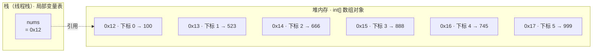

# 数组

## 概述

数组（array）是 Java 中最基本的数据结构：一个用于存储==多个相同数据类型==元素的==容器==。本节按「是什么 → 怎么分类 → 元素在内存中如何存储 → 由此带来的优缺点」的顺序，先建立对数组的整体认识。

### 什么是数组

> [!note] 核心思想
> 数组（array）：一种用于存储==多个相同数据类型==元素的==容器==，是一种==引用数据类型==。

声明数组变量时，`元素类型[]` 就表示「该类型元素的数组」：

```java
// 存储整数的数组（基本类型数组）
int[] nums = {100, 200, 300};

// 存储字符串的数组（引用类型数组）
String[] names = {"jack", "lucy", "lisi"};
```

关于数组的三个基本事实：

| | 说明 |
|---|---|
| ==引用数据类型== | 数组不属于 8 种基本类型（数据类型划分见 [[Java基础语法#数据类型]]），数组变量中保存的是引用（内存地址） |
| ==隐式继承 Object== | 任何数组都隐式继承 Object，==可以调用 Object 类中的方法==（如 `toString()`，见 [[面向对象#Object类]]） |
| ==存储在堆内存== | ==数组对象在堆中开辟空间==，栈中的变量只保存它的引用（内存图见 [[#数组存储元素的特点]]） |

完整可运行示例（定义 `int` 数组与 `String` 数组并逐个打印元素；直接打印数组变量，输出的是 Object 的 `toString()` 默认形式，而不是元素内容）：

```java
--8<-- "code/java/basics/javase-demo/src/main/java/com/luguosong/array/ArrayOverviewDemo.java"
```

### 数组的分类

| 分类维度 | 分类结果 |
|---|---|
| 按维数分 | ==一维数组==、二维数组、三维数组、多维数组 |
| 按元素类型分 | ==基本类型数组==（如 `int[]`）、==引用类型数组==（如 `String[]`） |
| 按初始化方式分 | ==静态初始化==数组、==动态初始化==数组（两种写法见 [[#一维数组]]） |

### 数组存储元素的特点

数组的 6 条存储特点——它们是后面一切优缺点的根源：

| | 特点 |
|---|---|
| ① | 数组==长度一旦确定，不可改变== |
| ② | 数组中元素==数据类型一致==，每个元素占用空间大小相同 |
| ③ | 每个元素在空间存储上==内存地址连续== |
| ④ | 每个元素有==索引（下标）==：首元素索引 ==0==，以 1 递增 |
| ⑤ | 以==首元素的内存地址==作为数组对象在堆内存中的地址 |
| ⑥ | 所有数组对象都有 ==length 属性==用来获取数组元素个数；末尾元素下标 ==length - 1== |

内存原理：以 `int[] nums = {100, 523, 666, 888, 745, 999};` 为例（假设 `nums` 是局部变量）——`nums` 保存在栈的==局部变量表==中（JVM 运行时内存区域见 [[JVM概述]]），值是引用 `0x12`；数组对象在==堆==中，从 `0x12` 开始==连续==开辟 6 个等大的 `int` 空间，==首元素的内存地址就是数组对象的地址==：



完整可运行示例（`length` 属性、下标访问、末尾元素下标 `length - 1`；给 `length` 重新赋值编译报错）：

```java
--8<-- "code/java/basics/javase-demo/src/main/java/com/luguosong/array/ArrayFeatureDemo.java"
```

### 数组的优点

==根据下标查询某个元素的效率极高==：数组中有 100 个元素和有 100 万个元素，按下标查询的效率相同——不管数组长短，耗费时间是固定不变的，时间复杂度为 ==O(1)==。

> [!tip] 时间复杂度 O(1) 与 O(n)
> - ==O(1)==（常数阶）：耗时是一个==固定值==，与数据规模 n 无关
> - ==O(n)==（线性阶）：耗时随规模 n ==线性增长==，n 越大，算法的执行效率越低

效率高的原因：知道==首元素内存地址==（特点⑤），元素内存地址又==连续==（特点③），每个元素占用空间大小==相同==（特点②）——只要知道下标，就可以通过数学表达式直接计算出目标元素的内存地址，无需遍历：

```
目标元素地址 = 首元素地址 + 下标 × 每个元素占用的空间大小
```

### 数组的缺点

- ==随机增删元素的效率较低==：随机增删时，为了保证数组元素的内存地址连续（特点③），需要移动后续元素，时间复杂度 ==O(n)==（不过==对数组末尾元素的增删不受影响==——不会引起其它元素位移）
- ==无法存储大量数据==：数组需要一整块==连续==的内存空间，数据量非常大时，内存中很难找到这么大的一块连续区域

> [!note] 优点与缺点同源
> 优缺点来自同一组特点：==地址连续 + 元素等大==既造就了 O(1) 的下标查询，也带来了增删要位移、大块连续内存难找的代价。数组「长度不可变」等限制，正是后续学习集合框架（如 `ArrayList`）的动机。

## 一维数组

一维数组是线性结构。二维数组，三维数组，多维数组是非线性结构。如何静态初始化一维数组？ 1. 第—种： int[] arr = {55,67,22}；或者 int arr[] = {55,67,22}; 2. 第二种： int[] arr = new int[] {55,67,22};+如何访问数组中的元素？ 1. 通过下标来访问。 2. 注意ArrayIndexOut0fBoundsException异常的发生。如何遍历数组？ 1. 普通for循环遍历 2. for-each遍历（优点是代码简洁。缺点是没有下标。） 3. 练一练：获取10个学生成绩，然后把成绩保存在数组中，接着遍历数组获得学生成绩，最后计算总分和平均分。如何动态初始化一维数组？ 1. int[] arr = new int[4]; 2. Object[] objs = new Object[5]; 3. 数组动态初始化的时候，确定长度，并且数组中每个元素采用默认值。

线性的

