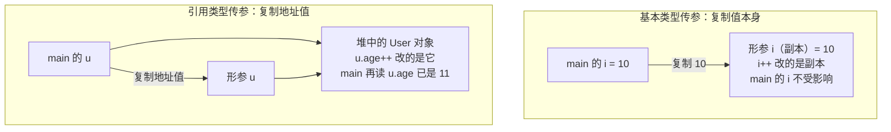
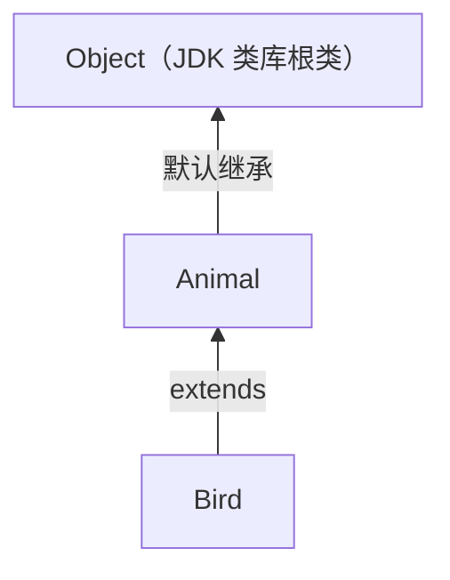
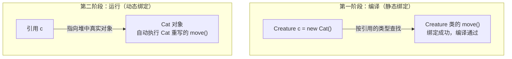

---
描述:
排序: 4000
分组:
分类: "[[JavaSE]]"
创建时间: 2026年08月19日
---
# 面向对象

## 面向对象和面向过程

面向过程与面向对象是两种不同的软件开发思想：前者关注==实现功能的步骤==，后者关注==需要哪些对象的参与==。

### 面向过程

> [!note] 核心思想
> `面向过程`（==PO==，Procedure Oriented）：分析出解决问题所需要的`步骤`，然后用函数把这些步骤一步一步实现，使用的时候一个一个依次调用。

- 关注点：实现功能的**步骤**
- 代表语言：C 语言

举例：

- 开汽车：启动 → 踩离合 → 挂挡 → 松离合 → 踩油门 → 车走了
- 装修房子：做水电 → 刷墙 → 贴地砖 → 做柜子和家具 → 入住

> [!tip] 适用场景
> 对于`简单`的流程适合使用面向过程的方式；`复杂`的流程不适合面向过程的开发方式。

完整可运行示例（面向过程方式开汽车，把开车拆解成依次调用的步骤函数）：

```java
--8<-- "code/java/basics/javase-demo/src/main/java/com/luguosong/oop/ProcedureDriveDemo.java"
```

### 面向对象

> [!note] 核心思想
> `面向对象`（==OO==，Object Oriented）：分析出解决这个问题都需要哪些`对象`的参与，然后让对象与对象之间协作起来形成一个系统。

- 关注点：实现功能需要哪些**对象**的参与
- 代表语言：Java、C#、Python 等

面向对象方法包括三个方面：

| 缩写 | 全称 | 中文 |
|------|------|------|
| OOA | Object Oriented Analysis | 面向对象分析 |
| OOD | Object Oriented Design | 面向对象设计 |
| OOP | Object Oriented Programming | 面向对象编程 |

> [!note] 为什么面向对象更容易处理复杂问题
> 人类本身就是以面向对象的方式认知世界的（人、汽车、房子……都是一个个"对象"），所以采用面向对象的思想更加容易处理复杂的问题。

举例：

- 开汽车：需要`汽车对象`和`司机对象`。司机对象有一个驾驶的行为，司机对象驾驶汽车对象。
- 装修房子：需要`水电工对象`、`油漆工对象`、`瓦工对象`、`木工对象`。每个对象都有自己的行为动作，对象之间协作最终完成装修。

完整可运行示例（面向对象方式开汽车，汽车对象与司机对象协作）：

```java
--8<-- "code/java/basics/javase-demo/src/main/java/com/luguosong/oop/ObjectDriveDemo.java"
```

### 两者对比

| | 面向过程 | 面向对象 |
|---|---|---|
| 关注点 | 实现功能的步骤 | 需要哪些对象的参与 |
| 组织方式 | 函数依次调用 | 对象之间协作 |
| 代表语言 | C | Java、C#、Python 等 |
| 适用场景 | 简单流程 | 复杂流程 |
| 耦合度与扩展性 | 耦合度高，扩展能力弱 | 耦合度低，扩展能力强 |

> [!example] 生产电脑的例子
> - `面向过程`生产一台电脑：按照电脑的工作流程一次成型，不会分 CPU、内存和硬盘——硬盘容量不够时难以单独更换。
> - `面向对象`生产一台电脑：CPU 是一个对象，内存条是一个对象，硬盘是一个对象——觉得硬盘容量小，后期很容易更换，这就是==扩展性==。

## 类与对象

类与对象是面向对象中最基本的一对概念：==类是模板，对象是实例==。

### 类

> [!note] 核心思想
> `类`：把现实世界中事物的==共同特征==（状态和行为）提取出来形成的一个==模板==。类实际上是人类大脑思考总结出来的，是一个抽象的概念。

现实世界的特征在程序中的对应关系：

| 现实世界 | 程序中 | 表示方式 |
|----------|--------|----------|
| 状态 | 属性 | 变量 |
| 行为 | 方法 | 方法 |

即：**类 = 属性 + 方法**。

举例：刘德华和梁朝伟都有姓名、身份证号、身高等状态，都有吃、跑、跳等行为，将这些共同的状态和行为提取出来，就形成了"明星类"。

### 对象

> [!note] 核心思想
> `对象`：==实际存在的个体==，又称为`实例`（instance）。通过类这个模板可以实例化 n 个对象。

- 例如通过"明星类"可以创造出"刘德华对象"和"梁朝伟对象"
- 明星类中有一个属性姓名：`String name;`。两个对象由于都是通过明星类造出来的，所以都有 name 属性，但==值是不同的==——这种属性被称为==实例变量==

### 类和对象的关系

| | 类 | 对象 |
|---|---|---|
| 本质 | 模板（抽象概念） | 实际存在的个体（实例） |
| 数量关系 | 一个类 | 可实例化 n 个对象 |
| 举例 | 明星类 | 刘德华对象、梁朝伟对象 |

完整可运行示例（把明星的共同特征提取为 Star 类模板，实例化两个对象并观察实例变量的值各不相同）：

```java
--8<-- "code/java/basics/javase-demo/src/main/java/com/luguosong/oop/ClassAndObjectDemo.java"
```

## 定义类

定义类的语法格式：

```java
[修饰符列表] class 类名 {
    // 类体 = 属性 + 方法
    // 属性（实例变量）：描述的是状态
    // 方法：描述的是行为动作
}
```

> [!note] 为什么要定义类
> 因为要通过类实例化对象。有了对象，才能让对象与对象之间协作起来形成一个系统。一个类可以实例化多个 Java 对象。

### 对象的创建

类定义好之后，通过 `new` 关键字创建对象，这个过程称为==实例化==：

```java
类名 对象名 = new 类名();
```

| 组成部分 | 说明 |
|----------|------|
| `new` | 关键字，在==堆==内存中开辟空间并创建对象 |
| `类名()` | 根据类模板创建出一个具体的对象 |
| `类名 对象名` | 声明一个引用变量，保存对象的内存地址 |

- 每执行一次 `new`，就会创建一个==新的对象==：一个类可以实例化 n 个对象
- 对象名中保存的是对象的地址，后续通过对象名来操作这个对象

完整可运行示例（一个类 new 出两个对象，直接打印对象名可看到两个对象的地址不同）：

```java
--8<-- "code/java/basics/javase-demo/src/main/java/com/luguosong/oop/CreateObjectDemo.java"
```

### 实例变量的访问与修改

创建对象后，通过 `对象名.属性名` 访问对象的属性：

| 操作 | 语法 | 示例 |
|------|------|------|
| 读取属性 | `对象名.属性名` | `p.name` |
| 修改属性 | `对象名.属性名 = 值;` | `p.name = "华为手机";` |

完整可运行示例（先修改商品对象的属性，再读取打印）：

```java
--8<-- "code/java/basics/javase-demo/src/main/java/com/luguosong/oop/PropertyAccessDemo.java"
```

### 实例变量与默认值

实例变量==一个对象一份==：比如创建 3 个学生对象，每个学生对象中都有独立的 name 变量，给一个对象的 name 赋值不会影响其它对象。实例变量属于==成员变量==，成员变量如果没有手动赋值，系统会赋默认值：

| 数据类型 | 默认值 |
|----------|--------|
| byte、short、int、long | `0` |
| float | `0.0f` |
| double | `0.0` |
| boolean | `false` |
| char | `'\u0000'` |
| 引用数据类型 | `null` |

完整可运行示例（两个对象各有一份实例变量，s2 未手动赋值时读取到系统默认值）：

```java
--8<-- "code/java/basics/javase-demo/src/main/java/com/luguosong/oop/InstanceVariableDemo.java"
```

### 实例方法

方法描述对象的==行为动作==。实例方法是==必须通过对象调用==的方法——之所以叫"实例"方法，是因为调用离不开实例（对象）。

定义实例方法的语法格式：

```java
[修饰符列表] 返回值类型 方法名(形式参数列表) {
    方法体;
}
```

| 组成部分 | 说明 |
|----------|------|
| 修饰符列表 | 可有可无，可以有多个 |
| 返回值类型 | 方法执行结束后返回结果的数据类型，没有返回值时用 `void` |
| 方法名 | 行为动作的标识，遵循方法命名规范 |
| 形式参数列表 | 局部变量，接收调用者传进来的数据，可以有 0~n 个 |
| 方法体 | 由 Java 语句构成，描述行为动作的具体实现 |

实例方法不能脱离对象单独调用，必须通过==对象==调用：

```java
对象名.方法名(实际参数列表);
```

- 实例方法中==可以直接访问实例变量==：通过哪个对象调用方法，方法中访问的就是哪个对象的实例变量
- 实例方法（字节码）==一个类一份==，所有对象共享；实例变量==一个对象一份==

| | 实例变量 | 实例方法 |
|---|---|---|
| 描述 | 状态 | 行为动作 |
| 份数 | 一个对象一份 | 一个类一份，所有对象共享 |
| 访问/调用方式 | `对象名.属性名` | `对象名.方法名(实参)` |

完整可运行示例（定义 Dog 类的 eat 和 sleep 两个实例方法，两个对象各自调用，观察实例方法直接访问实例变量）：

```java
--8<-- "code/java/basics/javase-demo/src/main/java/com/luguosong/oop/InstanceMethodDemo.java"
```

### 方法调用参数传递问题⭐

方法调用时，实参传递给形参只有一种方式：==值传递==（Pass by Value）——形参拿到的是实参保存的==值的副本==。Java 中==没有引用传递==（Pass by Reference）。

| 实参类型 | 复制给形参的内容 | 方法内修改的影响 |
|----------|------------------|------------------|
| 基本数据类型 | 数据值本身（如 `10`） | 改的是副本，调用者的变量==不受影响== |
| 引用数据类型 | 对象的地址值 | 形参和实参指向==同一个对象==，通过形参修改对象内容会影响外部 |

**基本类型传参**：`add(i)` 把 i 的值 `10` 复制给形参，方法内 `i++` 改的是副本，main 中的 i 仍是 10。

完整可运行示例（int 传参：方法内改的是副本，main 中的 i 不变）：

```java
--8<-- "code/java/basics/javase-demo/src/main/java/com/luguosong/oop/PrimitiveParameterDemo.java"
```

**引用类型传参**：`increase(u)` 把 u 中保存的==地址值==复制给形参，两个引用变量指向堆中==同一个 User 对象==，方法内 `u.age++` 后，main 中再读 `u.age` 变成 11。

完整可运行示例（User 传参：形参与实参指向同一个对象，main 中读到修改后的 11）：

```java
--8<-- "code/java/basics/javase-demo/src/main/java/com/luguosong/oop/ReferenceParameterDemo.java"
```

两个场景的内存示意——基本类型复制值后改副本互不影响；引用类型复制地址值后，两个引用共同指向堆中==同一个对象==：



> [!warning] 引用类型传参 ≠ 引用传递
> 复制的内容是"引用"，但机制仍是值传递：形参只是一个新变量。方法内若让形参重新指向新对象（`u = new User()`），实参的指向不会变——能影响外部的只有两边共同指向的那个对象的==内容==。

## this关键字

### this指向当前对象

> [!note] 核心思想
> `this`：当前对象的==引用==（reference），本质是一个保存==当前对象内存地址==的引用，表示“调用当前方法/构造器的那个对象”，通俗理解就是“我自己”。

- ==谁调用方法，this 就指向谁==：`p1.study()` 执行时，study() 方法中的 this 就是 p1 指向的对象；换成 `p2.study()`，同一个方法中的 this 就是 p2 指向的对象
- 实例方法==一个类一份==、所有对象共享，方法内部正是靠 this 来区分“这次是哪个对象在调用”
- 通过 `this.` 既可以访问实例变量（`this.name`），也可以调用实例方法（`this.study()`）

完整可运行示例（两个学生对象调用同一个 study()，this 分别指向各自对象，输出各自的姓名）：

```java
--8<-- "code/java/basics/javase-demo/src/main/java/com/luguosong/oop/ThisReferenceDemo.java"
```

### 为什么 this 不能出现在静态方法中

实例方法被调用时，当前对象的引用会作为==隐式参数==传入，存放在该方法==栈帧的局部变量表的第 0 个槽位==上——this 就从这里来，每个实例方法天生“自带”一个 this。

静态方法（见 [[#静态方法]]）则完全不同：它通过==类名直接调用==，调用时==不需要对象==，也就没有“当前对象”可以传入——栈帧的局部变量表里根本没有 this。所以 this ==不能出现在静态方法中==，出现即==编译报错==。

### this的省略规则

实例方法中访问实例变量时，`this.` 通常可以省略：直接写 `name`，编译器会自动补上 `this.`，两种写法编译出的字节码完全相同。裸写变量名时，编译器的查找顺序：

1. 先找**局部变量**（形参、方法内声明的变量）
2. 找不到，再找当前对象的**实例变量**，此时自动等价于 `this.name`

| 情况 | 裸写 `name` 解析到 | `this.` 能否省略 |
|------|--------------------|------------------|
| 无同名局部变量 | 实例变量（自动补 `this.`） | ==可以省略== |
| 与局部变量重名 | 局部变量（==遮蔽==成员变量） | ==不能省略== |

因此==必须显式写 this 的场景==：形参（或局部变量）与实例变量重名——最典型的是 setter 和构造器：

```java
void setName(String name) {  // 形参 name 与实例变量 name 重名
    this.name = name;        // this.name 是成员变量，裸写的 name 是形参
}
```

> [!warning] 重名时写成 `name = name` 是一个隐蔽 bug
> 编译通过、运行不报错，但只是把形参赋给了它自己，成员变量没有被赋值，读取时仍是 `null`。

完整可运行示例（Book 类的两个赋值方法：形参不重名时省略 this，重名时必须写 this）：

```java
--8<-- "code/java/basics/javase-demo/src/main/java/com/luguosong/oop/ThisOmissionDemo.java"
```

## 封装性

### 什么是封装

> [!note] 核心思想
> `封装`：把对象的==状态（属性）==和==行为（方法）==统一包装到一个类中，使之成为一个独立的实体；==隐藏内部实现细节==，对外只提供==有限的访问接口==，以实现对对象的保护和隔离。

### 封装的好处

封装通过限制外部对对象内部的==直接访问和修改==：

- 保证数据的==安全性==
- 提高代码的==可维护性==
- 提高代码的==可复用性==

### 不使用封装的问题

属性不加限制地对外暴露时非常不安全：外部程序可以通过 `对象名.属性名` ==随意访问和修改==对象的属性。比如年龄——现实世界中 age 不可能是负数，但外部把 `-100` 赋给 age 时程序==毫无拦截==，数据已经失真。

完整可运行示例（age 未受保护：外部直接读到默认值 0、随意改成 50，甚至改成 -100 程序也不报错）：

```java
--8<-- "code/java/basics/javase-demo/src/main/java/com/luguosong/oop/EncapsulationProblemDemo.java"
```

### 封装的实现

为了让属性既==安全==又==不失访问能力==，封装分两步实现：

| 步骤 | 做法 | 作用 |
|------|------|------|
| 第一步：属性私有化 | 用 `private` 修饰属性 | 禁止外部随意访问——被 `private` 修饰的成员==只能在本类中访问== |
| 第二步：对外提供 getter / setter | 提供公开的读、改方法 | 外部仍能访问属性，但访问被收口到==可控的入口== |

getter / setter 的命名格式（以 age 属性为例）：

| 访问方式 | 方法格式 | 示例 |
|----------|----------|------|
| 读（getter） | `public 数据类型 get属性名()` | `public int getAge()` |
| 改（setter） | `public void set属性名(属性类型 属性名)` | `public void setAge(int age)` |

- getter 只读取、不修改属性，天然安全
- setter 是修改属性的唯一入口，在赋值前编写==拦截过滤==代码，把非法值挡在外面
- setter 形参与实例变量重名，`this.age = age` 中的 `this.` 不能省略（见 [[#this的省略规则]]）

完整可运行示例（private + getter/setter：非法年龄 -100 被拦截、属性保持 0，合法年龄 50 正常赋值）：

```java
--8<-- "code/java/basics/javase-demo/src/main/java/com/luguosong/oop/EncapsulationDemo.java"
```

## 构造方法

构造方法（Constructor，构造器）是类中一类特殊的方法：实例方法描述对象的==行为动作==，构造方法则负责==对象的创建==与==对象的初始化==。

### 构造方法的作用

构造方法的执行分为两个阶段：==对象的创建==和==对象的初始化==。这两个阶段不能颠倒，也不可分割：

| 阶段 | 时机 | 说明 |
|------|------|------|
| 对象的创建 | 执行 `new` 时 | 在==堆==内存中开辟空间，创建出新的对象 |
| 对象的初始化 | 执行构造方法体时 | 给对象的属性赋值，对象才算就绪 |

使用 `new` 时对象已在内存中创建出来，但还没有被初始化；初始化是在执行构造方法体时进行的。

完整可运行示例（new Phone() 时构造方法体自动执行：给属性赋初值，new 结束后属性已就绪）：

```java
--8<-- "code/java/basics/javase-demo/src/main/java/com/luguosong/oop/ConstructorDemo.java"
```

### 构造方法的定义与调用

定义构造方法的语法格式：

```java
[修饰符列表] 构造方法名(形式参数列表) {
    构造方法体;
}
```

| 组成部分 | 说明 |
|----------|------|
| 修饰符列表 | 可有可无，如 `public` |
| 构造方法名 | ==必须与类名完全相同== |
| 形式参数列表 | 与普通方法一样，可以有 0~n 个 |

与实例方法相比，构造方法有两个特殊之处：

- ==没有返回值类型==（连 `void` 都不写）
- ==只能通过 `new` 调用==，不能用 `对象名.方法名()` 的方式调用

调用构造方法的语法：

```java
new 构造方法名(实际参数列表);
```

完整可运行示例（Computer 类定义带参构造方法，new 时传入实参完成初始化）：

```java
--8<-- "code/java/basics/javase-demo/src/main/java/com/luguosong/oop/ConstructorCallDemo.java"
```

### 无参数构造方法

如果一个类==没有显式定义==任何构造方法，系统会默认提供一个==无参数构造方法==，也被称为==缺省构造器==：

| 类中的情况 | `new 类名()` 能否使用 |
|----------|--------------------|
| 未显式定义任何构造方法 | 可以——系统自动提供缺省构造器 |
| 显式定义了构造方法（无论有参无参） | ==不可以==——缺省构造器不再提供 |

> [!warning] 显式定义构造方法后缺省构造器消失
> 只要显式定义了任何一个构造方法（哪怕是有参的），系统就不再提供缺省构造器，此时再写 `new 类名()` 会==编译报错==。

> [!tip] 建议把无参数构造方法手动写出来
> 为了让对象的创建更加方便（既支持 `new 类名()` 又支持 `new 类名(实参)`），建议将无参数构造方法显式地定义出来。

> [!note] 缺省构造器是编译器为本类生成的，不是直接调用 Object 的无参构造
> 未显式定义构造方法时，编译器会为本类自动生成一个方法体基本为空的构造方法。Java 规定==任何构造方法的第一行==要么是 `this(...)` 调用本类其它构造方法（见 [[#this(实参)调用本类其它构造方法]]），要么是隐式的 `super()` 调用父类无参构造（不写就自动补）。因此自动生成的缺省构造器实际等价于：
>
> ```java
> 类名() {
>     super();  // 隐式：调用父类的无参构造，沿继承链最终到达 Object()
> }
> ```
>
> 即：缺省构造器是本类==自己的==构造方法，它通过隐式 `super()` 沿继承链最终调到 `Object()`，而不是"直接使用 Object 的无参构造"。由此还能解释一个坑：如果父类只显式定义了有参构造（父类的无参构造消失），子类即使什么都不写也会==编译报错==——缺省构造器里的隐式 `super()` 找不到可调用的父类无参构造。（`super()` 的详细规则在 [[继承]] 章节展开）

完整可运行示例（Employee 类显式定义无参构造，new Employee() 正常创建并初始化对象）：

```java
--8<-- "code/java/basics/javase-demo/src/main/java/com/luguosong/oop/DefaultConstructorDemo.java"
```

### 构造方法重载

一个类中可以定义==多个构造方法==——它们方法名都与类名相同、参数列表不同，自动构成方法的重载（==overload==）。调用时根据 `new` 后传入的==实参列表==决定执行哪个构造方法。

完整可运行示例（Rectangle 的无参与两参构造构成重载，两种方式分别创建对象）：

```java
--8<-- "code/java/basics/javase-demo/src/main/java/com/luguosong/oop/ConstructorOverloadDemo.java"
```

### this(实参)调用本类其它构造方法

构造方法重载后，多个构造方法之间容易出现重复的初始化代码。`this(实参)` 语法让一个构造方法去调用本类中其它的构造方法，把初始化逻辑==收口到一处==，作用是==代码复用==：

```java
[修饰符] 类名(形参列表) {
    this(实参列表);  // 只能在第一行：调用本类中匹配的其它构造方法
    // 其它语句
}
```

| 规则 | 说明 |
|------|------|
| 位置 | ==只能出现在构造方法的第一行==，不在第一行直接==编译报错== |
| 次数 | 一个构造方法中==最多写一次==（第一行只有一行） |
| 限制 | 调用的是==本类==的构造方法，且不能与 `super()` 共存（super 的规则见 [[继承]]） |
| 作用 | 复用其它构造方法的初始化代码，避免重复 |

> [!warning] this(...) 之间不能形成环
> A 构造调用 B、B 又回头调用 A，编译器检测到==递归构造调用==同样直接==编译报错==。

完整可运行示例（Point 的无参构造通过 `this(0, 0)` 复用两参构造：先执行完两参构造的初始化，再回来执行无参构造的剩余代码）：

```java
--8<-- "code/java/basics/javase-demo/src/main/java/com/luguosong/oop/ThisConstructorCallDemo.java"
```

### 构造代码块与初始化顺序⭐

类体中直接用 `{ }` 括起来的代码块称为==构造代码块==：==每次 new 对象时都会执行==，且先于构造方法体执行。

对象的创建和初始化完整顺序：

| 步骤 | 动作 |
|------|------|
| ① | `new` 时在堆内存中开辟空间，给所有属性赋==默认值== |
| ② | 执行==构造代码块==进行初始化 |
| ③ | 执行==构造方法体==进行初始化 |
| ④ | 构造方法执行结束，对象初始化完毕 |

完整可运行示例（Machine 的构造代码块先于构造方法体执行，且代码块执行时属性仍处于默认值状态）：

```java
--8<-- "code/java/basics/javase-demo/src/main/java/com/luguosong/oop/ConstructorBlockDemo.java"
```

#### 构造代码块的意义

> [!question] 构造方法体里就能写初始化代码，为什么还需要构造代码块？
> 核心价值是==抽取多个构造方法的公共逻辑==：构造方法可以重载，若每个构造方法都要执行一段相同的初始化，就得逐个重复写；放进构造代码块则只写一次，它==先于每一个构造方法体执行==。

- **去重的语法糖**：构造代码块并不是独立的执行机制——编译后它的代码会被==复制进本类每一个构造方法体的开头==（在 `super()` 之后），这也是为什么它对每个构造方法都生效
- **日常开发很少用**：简单的赋值初始化直接写在字段声明处更直观（`double price = 4999.0;`，字段初始化同样是每个对象都执行）；只有当初始化逻辑需要多条语句且要被多个构造方法共享时，构造代码块才有明显优势
- **匿名内部类是特例**：匿名类没有类名、写不了构造方法，实例初始化块是它表达初始化逻辑的唯一途径

一句话总结：构造代码块 = ==多个构造方法的公共初始化逻辑的去重手段==；简单场景优先用字段初始化。

#### 为什么不用公共方法代替构造代码块

> [!question] 把公共逻辑抽成一个方法，在每个构造方法里调用，不也能去重吗？
> 能，而且实际开发中很常用（通常声明为 `private` 初始化方法）。但两者有关键差异，构造代码块在三点上不可替代：

| | 构造代码块 | 每个构造方法里调用公共方法 |
|---|---|---|
| 执行保证 | 编译器保证==所有构造方法必然先执行==（含后期新增的重载构造） | 靠手动在每个构造方法里写调用，==漏写一个就是隐蔽 bug== |
| 给 `final` 字段赋值 | ✅ 可以 | ❌ `final` 字段==只能在构造方法/初始化块中赋值==，不能在普通方法中赋值 |
| 匿名内部类 | ✅ 可用 | ❌ 匿名类写不了构造方法，没有调用入口 |

> [!warning] 构造方法没执行完，公共方法能调吗——能，但别调用可被重写的方法
> 构造方法体执行时对象==早已存在==（`new` 第一阶段已开辟空间、属性已是默认值），`this` 有效，调用实例方法完全合法。真正的坑是：父类构造方法执行时==子类的字段还没初始化==，而方法调用具有多态性——实际执行的是子类重写后的版本，其中读到的子类字段全是默认值：
>
> ```java
> class Parent {
>     Parent() {
>         init();               // 多态：实际执行 Sub 重写的 init()
>     }
>     void init() {}
> }
>
> class Sub extends Parent {
>     String name = "已初始化";
>     @Override
>     void init() {
>         System.out.println(name);  // 打印 null！此时 Sub 的字段初始化还没执行
>     }
> }
> ```
>
> 因此规范建议：构造方法中只调用 `private`、`final` 或 `static` 方法（不可能被重写，不存在时序问题）。

### 构造方法赋值与 setter 的分工

> [!question] 构造方法中已经给属性赋值了，为什么还需要单独定义 set 方法？
> 构造方法中的赋值发生在==对象第一次创建时==，此后不会再执行；而 set 方法可以在==后期随时调用==，完成属性值的修改——两者服务于不同的时机，缺一不可。

| | 构造方法赋值 | setter 赋值 |
|---|---|---|
| 执行时机 | `new` 创建对象时，==仅执行一次== | 对象创建后==可随时多次调用== |
| 定位 | 对象的==初始==状态 | 对象属性的==后期修改== |

以手机涨价为例：`new Phone("华为", 4999.0)` 确定出厂价格；上市后调价，只能再调用 `phone.setPrice(5299.0)` 修改——总不能为了改个价格重新 new 一个对象。

## static关键字

`static` 是一个关键字，翻译为“==静态的==”。之前学的实例变量、实例方法都属于==对象级别==：必须先 new 出对象，再通过对象访问；`static` 的作用是把成员从对象级别提升到==类级别==——随==类的加载==而初始化，不依赖任何对象。

static 可以修饰的三类成员：

| static 修饰 | 名称 | 本质 |
|---|---|---|
| 变量 | 静态变量 | 类级别属性，类加载时初始化，==全类只有一份== |
| 方法 | 静态方法 | 类级别行为，通过 `类名.` 调用，方法中==没有 this== |
| 代码块 | 静态代码块 | ==类加载时刻==执行的代码，只执行一次 |

> [!note] 统一使用「类名.」访问静态成员
> 静态变量和静态方法统一使用 ==`类名.`== 调用。语法上也允许用 `引用.` 访问，但实际运行时==和对象无关==——即使引用是 `null`，也不会出现==空指针异常==（编译阶段按引用的==类型==定位静态成员，而不是按引用指向的对象）。正因为这样写容易让阅读的人误以为“该成员与对象有关”，==不建议==通过 `引用.` 访问静态成员。

### 静态变量

> [!note] 核心思想
> `静态变量`（static 修饰的变量）：属于==类级别==的变量，==类加载时初始化==（开辟空间），内存中==只有一份==，所有对象共享。

**使用场景**：当==所有对象的某个属性值都相同==时（例如所有中国人的国籍都是“中国”），就没必要在每个对象里重复存一份——建议将该属性定义为静态变量，==节省内存开销==。这种类级别的属性不需要 new 对象，直接通过 `类名.` 访问。

与实例变量的对比：

| | 实例变量 | 静态变量 |
|---|---|---|
| 级别 | 对象级别 | 类级别 |
| 份数 | 一个对象一份 | 一个类一份，所有对象共享 |
| 初始化时机 | `new` 创建对象时 | ==类加载时== |
| 内存位置（JDK8+） | 堆中，随对象创建 | ==堆==中，随类加载 |
| 访问方式 | `对象名.`（必须先 new 对象） | `类名.`（==不需要 new 对象==） |

**存储位置**：JDK8 之后，静态变量存储在==堆内存==中，随类加载时初始化。内存原理图（JDK8+）如下：类加载时，`Chinese` 类的静态变量 `country` 随类在==堆（Heap）==中开辟空间，全类只有一份；类本身的结构信息存放在==方法区==（JDK8 起由 Metaspace 实现）。

![[静态变量内存原理图.canvas]]

完整可运行示例（不创建对象即可通过类名访问静态变量；通过类名修改一次，全类共享的这一份同时变化）：

```java
--8<-- "code/java/basics/javase-demo/src/main/java/com/luguosong/oop/StaticVariableDemo.java"
```

### 静态方法

> [!note] 核心思想
> `静态方法`（static 修饰的方法）：属于==类级别==的方法，通过 ==`类名.`== 调用，==不需要创建对象==。

静态方法中==没有 this==（原理见 [[#为什么 this 不能出现在静态方法中]]），因此：

- ==无法直接访问实例变量==、==无法直接调用实例方法==——静态方法调用时没有对象，实例成员无从谈起
- ==可以直接访问静态变量==、调用其它静态方法——大家都是类级别成员，随类加载已就绪
- 确实要在静态方法中操作实例成员时，只能先 `new` 一个对象，再通过该对象访问（`main` 方法就是这么干的）

静态方法与实例方法的对比：

| | 实例方法 | 静态方法 |
|---|---|---|
| 级别 | 对象级别 | 类级别 |
| 调用方式 | `对象名.方法名(实参)`（必须先 new） | `类名.方法名(实参)`（无需对象） |
| this | 有，指向当前对象 | ==没有== |
| 直接访问实例成员 | ✅ | ❌（没有当前对象） |
| 直接访问静态成员 | ✅ | ✅ |

完整可运行示例（静态方法通过类名调用、方法内访问实例成员会编译报错；`引用.` 调用与 null 引用调用均不报错）：

```java
--8<-- "code/java/basics/javase-demo/src/main/java/com/luguosong/oop/StaticMethodDemo.java"
```

### 静态代码块

语法：写在类体中，`static` 后跟一对 `{ }`：

```java
static {
    // 类加载时执行的代码
}
```

> [!note] 核心思想
> `静态代码块`：代表==类加载时刻==的代码——==类加载时执行，并且只执行一次==。

规则：

- ==类加载时执行==且==只执行一次==（一个类只加载一次）：先于 `main` 方法，也先于一切对象创建
- 一个类中可以编写==多个静态代码块==，遵循==自上而下==的顺序依次执行
- 静态代码块中==可以访问静态变量==，但要注意声明顺序：静态变量的初始化与静态代码块按==声明顺序==依次执行，写在代码块==之后==声明的静态变量在代码块执行时还没有初始化，直接用简单名访问会==编译报错==（非法前向引用）
- 静态代码块中==无法访问实例变量==、无法调用实例方法——类加载时刻==还没有任何对象==，实例成员根本不存在

> [!tip] 什么时候用静态代码块
> 静态代码块代表了==类加载时刻==：如果有一段代码需要“在类加载的时候执行一次”（如记录初始化日志、读取配置文件、加载数据库驱动），就可以把它放到静态代码块中。例如需求“请在类加载时记录日志”，那么记录日志的代码就可以编写到静态代码块当中。

与构造代码块的对比（构造代码块见 [[#构造代码块与初始化顺序⭐]]）：

| | 静态代码块 | 构造代码块 |
|---|---|---|
| 语法 | `static { }` | `{ }` |
| 执行时机 | ==类加载时== | `new` 创建对象时（在构造方法体之前） |
| 执行次数 | 一个类==只执行一次== | ==每次 new== 都执行 |
| 能否访问实例成员 | ❌（没有对象） | ✅（对象已开辟空间） |

完整可运行示例（第一次 new 触发类加载，两个静态代码块自上而下各执行一次；第二次 new 不再执行）：

```java
--8<-- "code/java/basics/javase-demo/src/main/java/com/luguosong/oop/StaticBlockDemo.java"
```


## 继承性

继承（inheritance）是面向对象的==三大特征==之一（封装、继承、多态，见 [[#封装性]] 与 [[#多态]]）：

| 作用 | 说明 |
|------|------|
| ==基本作用==：代码复用 | 子类继承父类后，直接拥有父类中可继承的成员，==不必重复编写== |
| ==重要作用==：多态的基础 | 有了继承，才有了==方法覆盖==和==多态机制==（见 [[#方法覆盖]]、[[#多态]]） |

### 基础语法

继承在 Java 中的实现语法：

```java
[修饰符列表] class 子类名 extends 父类名 {
    // 子类特有的属性和方法
}
```

`extends` 翻译为「==扩展==」：子类继承父类后，子类是对父类的==扩展==——在父类已有成员的基础上，增加自己特有的属性和方法。

继承相关的术语（当 B 类继承 A 类时）：

| 类 | 中文称呼 | 英文 |
|---|---|---|
| A 类 | 父类、超类、基类 | superclass |
| B 类 | 子类、派生类 | subclass |

**规则①：Java 只支持单继承**——一个类==只能直接继承一个类==。

> [!warning] 为什么 Java 不支持多继承
> 若允许一个类同时继承两个父类，两个父类中存在同名方法时就无法确定继承哪一个，产生==二义性==。Java 用「单继承」从语言层面规避了这种冲突。

**规则②：不支持多继承，但支持==多重继承==（多层继承）**——`C extends B`、`B extends A`，C 便间接拥有 A 中可继承的成员。

**规则③：子类继承父类后，==除私有的和构造方法==，其它全部继承**：

| 父类成员 | 能否被继承 | 说明 |
|---|---|---|
| 非私有的属性和方法 | ✅ | 子类中==直接使用== |
| ==私有的==属性和方法（`private`） | ❌ | 子类中不能直接访问 |
| ==构造方法== | ❌ | 构造方法名==必须与类名相同==，父类构造方法名 ≠ 子类类名，天生无法继承 |

> [!tip] 私有成员虽不被继承，但可以间接访问
> 父类的私有属性子类拿不到，但子类可以调用==继承来的公有方法==（如 getter / setter）间接操作它——方法体运行在父类内部，访问的是父类自己的私有属性。

一个类没有==显式继承==任何类时，==默认继承 `java.lang.Object` 类==（见 [[#Object类]]）。

完整可运行示例（`Bird extends Animal`：子类对象直接使用继承来的 `name`、`eat()`、`sleep()`，再扩展出自己的 `wingLength`、`fly()`；父类对象无法调用子类扩展的成员）：

```java
--8<-- "code/java/basics/javase-demo/src/main/java/com/luguosong/oop/InheritanceDemo.java"
```

### Object类

java 语言中，一个类没有==显式继承==任何类时，==默认继承 `java.lang.Object`==——Object 是「老祖宗」，是 JDK 类库中的==根类==。JDK 官方文档对 Object 的描述：

> 类 `Object` 是类层次结构的根。每个类都有 `Object` 作为其超类。所有对象（包括数组）都实现该类的方法。

不同写法的类直接父类不同，但沿继承链==向上追溯最终都到达 Object==：

| 类定义写法 | 直接父类 |
|---|---|
| `class Animal { }` | ==Object==（不写 `extends` 时编译器默认补上） |
| `class Bird extends Animal { }` | Animal（Animal 自己又默认继承 Object） |



Object 类中的常用方法——每个类都因此拥有它们（具体行为在后续章节展开）：

| 方法 | 作用 |
|---|---|
| `toString()` | 返回对象的字符串表示，==直接打印对象时自动调用== |
| `equals(Object obj)` | 判断两个对象是否相等，默认比较==内存地址== |
| `hashCode()` | 返回对象的哈希值 |

完整可运行示例（类体为空的 Gadget 什么成员都没定义，依然能调用 toString()/hashCode()/equals()——它们全部继承自 Object）：

```java
--8<-- "code/java/basics/javase-demo/src/main/java/com/luguosong/oop/ObjectRootDemo.java"
```

### 方法覆盖

> [!note] 核心思想
> `方法覆盖`（==override==，又称==方法重写== / overwrite）：当从父类中继承过来的方法==无法满足当前子类的业务需求==时，子类把该方法的实现==重新编写==。

构成方法覆盖的条件（缺一不可）：

| 序号 | 条件 |
|---|---|
| ① | 发生在具有==继承关系==的父子类之间 |
| ② | ==方法名相同== |
| ③ | ==形参列表相同==（类型、个数、顺序） |
| ④ | 返回值类型相同；若为引用数据类型，也可以是父类方法返回值类型的==子类型== |
| ⑤ | 访问权限==不能变低，可以变高==（父类 `public` 的方法，重写时不能改成 `private`） |
| ⑥ | 抛出异常==不能变多，可以变少== |

覆盖之后的效果：子类将父类方法覆盖之后，将来==子类对象调用该方法时，一定执行重写之后的方法==。

不能覆盖的情况：

| 情况 | 原因 |
|---|---|
| 私有方法 | 私有方法==不能继承==，所以不能覆盖 |
| 构造方法 | 构造方法==不能继承==，所以不能覆盖 |
| 静态方法 | 静态方法==不存在方法覆盖==——方法覆盖针对的是==实例方法==（与多态的关系见 [[#多态]]） |
| 实例变量 | 方法覆盖只发生在方法上，和==实例变量无关== |

完整可运行示例（Shape 的 draw() 只会画"图形"，满足不了 Circle 的需求——Circle 用 @Override 重写 draw()，子类对象调用时执行重写后的版本）：

```java
--8<-- "code/java/basics/javase-demo/src/main/java/com/luguosong/oop/OverrideDemo.java"
```

#### @Override注解

`@Override` 注解是 JDK5 引入的，用来==标注方法==：被标注的方法==必须是重写父类的方法==，如果实际上不是重写（方法名拼错、形参列表不一致等），编译器会==直接报错==。该注解只在==编译阶段==有用，和==运行期==无关。

#### 重载与重写的区别

回顾方法重载（overload）：在==同一个类==中，功能相似的方法使用==相同的方法名==、==不同的参数列表==（类型、个数、顺序），目的是==代码美观、方便编程==；重载机制属于==编译阶段==的功能（是给编译器看的），编译器根据实参列表在编译期就能确定调用哪个方法。方法覆盖（重写）与它名字相近，极易混淆：

| | 方法重载 overload | 方法覆盖/重写 override |
|---|---|---|
| 发生位置 | ==同一个类==中 | 具有==继承关系==的父子类之间 |
| 方法名 | 相同 | 相同 |
| 参数列表 | ==必须不同==（类型、个数、顺序） | ==必须相同== |
| 返回值类型 | 无要求 | 相同（或父类返回值类型的==子类型==） |
| 访问权限 | 无要求 | ==不能变低，可以变高== |
| 抛出异常 | 无要求 | ==不能变多，可以变少== |
| 机制归属 | ==编译阶段==的功能（给编译器看） | ==运行阶段==体现：执行的是堆内存中==真实对象==的版本（见 [[#多态]]） |
| 目的 | 功能相似的方法共用一个名字 | 父类方法不满足子类需求时重新实现 |

#### 实例变量不会被覆盖

> [!question] 子类声明了与父类同名的实例变量，这算覆盖吗？
> 不算。==方法覆盖只针对实例方法==（见上文不能覆盖情况表），实例变量==没有覆盖一说==：子类声明的同名实例变量只是==重新定义了一个属于自己的新变量==，把从父类继承来的那份==藏了起来==，这叫==变量隐藏==（field hiding）——本质是==两份独立的变量同时存在==，而不是"一个成员的两个版本"。

变量隐藏与方法覆盖的关键区别在==解析依据==上：

| | 实例方法 | 实例变量 |
|---|---|---|
| 子类同名成员的性质 | ==覆盖 / 重写== | ==隐藏==（父子两份独立存在） |
| 解析依据 | ==运行阶段==按==堆中真实对象==的版本执行（动态绑定） | ==编译阶段==就按==引用的类型==解析，运行时不再改变（静态绑定） |
| 口诀 | ==运行看右边== | ==永远看左边== |

经典对比场景（`Parent p = new Child();`）：

- `p.show()` → 执行的是==子类重写后的方法==——运行看右边
- `p.name` → 读到的是==父类的变量==——堆中明明是 Child 对象，变量却按引用类型 Parent 解析
- `((Child) p).name` → 转成子类型引用后，按 Child 类型解析，读到的才是子类的变量

> [!tip] 内存视角
> `new Child()` 在堆中创建的子类对象里，==父子两份同名变量都存在==：子类自己声明的一份 + 从父类继承的一份。子类的方法体中裸写 `name` 解析到子类自己的那份；想访问被隐藏的父类那份需要 `super.name`（super 的详细规则在 [[继承]] 章节展开）。正因为实例变量没有"按真实对象执行"的动态绑定，==多态只体现在实例方法上==（见 [[#什么是多态]]），实例变量不存在多态。

完整可运行示例（`Parent p = new Child()`：`p.name` 读到父类的变量、`p.show()` 执行子类重写的方法、强转后才能读到子类的变量）：

```java
--8<-- "code/java/basics/javase-demo/src/main/java/com/luguosong/oop/FieldHidingDemo.java"
```

## 多态

多态（polymorphism）是面向对象的==三大特征==之一（封装、继承、多态），建立在==继承==与==方法覆盖==之上（见 [[#继承性]]、[[#方法覆盖]]）。

### 向上转型和向下转型

Java 允许具有==继承关系==的父子类型之间进行类型转换：

| 转型 | 方向 | 写法 | 说明 |
|---|---|---|---|
| 向上转型 upcasting | 子 → 父 | `父类型 引用 = new 子类型();` | 等同看做==自动类型转换==，不需要强转符 |
| 向下转型 downcasting | 父 → 子 | `子类型 引用 = (子类型) 父类型引用;` | ==必须加强制类型转换符== |

- 无论是向上转型还是向下转型，前提条件都是：两种类型之间必须存在==继承关系==，这样编译器才能编译通过
- 向上转型之后，父类型引用==无法直接调用子类特有的方法==；需要时再向下转型转回来

> [!warning] 向下转型有风险
> 编译阶段只检查两种类型之间是否存在继承关系；如果运行时堆内存中的==真实对象==并不是要转成的那个类型，会抛出==类型转换异常 ClassCastException==。如何防护见 [[#instanceof运算符]]。

完整可运行示例（Truck 对象向上转型为 Vehicle 引用；再加强转符转回 Truck，调用子类特有的 load()）：

```java
--8<-- "code/java/basics/javase-demo/src/main/java/com/luguosong/oop/CastingDemo.java"
```

#### instanceof运算符

先看向下转型的坑——`(Bird) x` 这样的强转：

- ==为什么编译能通过？==编译阶段只检查语法：x 是 Animal 类型，Animal 和 Bird 之间存在==继承关系==，语法没问题，所以编译通过
- ==为什么运行时出现 ClassCastException（类型转换异常）？==因为运行时堆中的==真实对象是 Cat 对象==，Cat 无法转换成 Bird，出现类型转换异常

`instanceof` 运算符的出现，就是为了解决 ClassCastException 异常。语法规则：

| 规则 | 说明 |
|---|---|
| 结果 | 一定是 ==true / false== |
| 语法格式 | `(引用 instanceof 类型)`，例如 `(a instanceof Cat)` |
| true | 表示 a 引用指向的对象是 Cat 类型 |
| false | 表示 a 引用指向的对象不是 Cat 类型 |

==做向下转型之前，为了避免 ClassCastException 的发生==，一般建议先用 instanceof 进行判断：

```java
if (x instanceof Bird) {
    Bird b = (Bird) x;  // 判断通过再强转，安全
}
```

完整可运行示例（Device 引用真实指向 Printer：不做判断强转 Copier 会抛 ClassCastException——见注释；instanceof 判断通过后再转型则安全）：

```java
--8<-- "code/java/basics/javase-demo/src/main/java/com/luguosong/oop/InstanceOfDemo.java"
```

### 什么是多态

> [!note] 核心思想
> `多态`：==多种形态==。==父类型引用指向子类对象==（如 `Creature c = new Cat();`）时，==编译阶段一种形态，运行阶段另一种形态==，因此得名：多态。

一个 Java 程序的方法调用包括两个重要的阶段，两个阶段各绑定一次：

| 阶段            | 依据            | 过程                                                                | 别称               |
| ------------- | ------------- | ----------------------------------------------------------------- | ---------------- |
| 第一阶段：==编译阶段== | ==引用的类型==     | 编译器只知道 c 是 Creature 类型，去 Creature 类中找 move()，找到之后绑定上去——绑定成功表示编译通过 | ==静态绑定==         |
| 第二阶段：==运行阶段== | ==堆内存中的真实对象== | 堆内存中真实的 Java 对象是 Cat，move() 的行为一定是 Cat 对象发生的，自动调用 Cat 对象的 move()  | ==运行期绑定 / 动态绑定== |



> [!tip] 一句话记忆
> ==编译看左边==（引用的类型决定能调用哪些方法），==运行看右边==（堆中的真实对象决定实际执行谁的行为）。

多态与[[#方法覆盖]]的关系：运行阶段之所以能执行「另一个版本」的方法，靠的正是子类对父类方法的==重写==。

完整可运行示例（Creature 引用分别指向 Cat、Fish 对象：编译阶段都绑定 Creature 的 move()，运行阶段各自动执行真实对象重写后的 move()）：

```java
--8<-- "code/java/basics/javase-demo/src/main/java/com/luguosong/oop/PolymorphismDemo.java"
```

### 软件开发七大原则（简介）

软件开发原则旨在引导从业者在代码设计和开发过程中遵循一些基本原则，以达到==高质量、易维护、易扩展、安全性强==等目标。它与具体的编程语言无关，属于==软件设计==方面的知识：

| # | 原则 | 核心含义 |
|---|---|---|
| 1 | ==开闭原则==（Open-Closed Principle，OCP） | 对==扩展==开放、对==修改==关闭：在不修改原有代码的基础上，通过==添加新的代码==来扩展功能。==最基本的原则==，其它原则都是为这个原则服务的 |
| 2 | 单一职责原则 | 一个类只负责单一的职责，即一个类只有一个引起它变化的原因 |
| 3 | 里氏替换原则 | 子类对象可以替换其基类对象出现的任何地方，并且保证原有程序的正确性 |
| 4 | 接口隔离原则 | 客户端不应该依赖它不需要的接口 |
| 5 | 依赖倒置原则 | 高层模块不应该依赖底层模块，它们都应该依赖于==抽象接口==——换言之，面向接口编程 |
| 6 | 迪米特法则 | 一个对象应该对其它对象保持==最少的了解==，即对自己需要耦合或调用的类知道得最少 |
| 7 | 合成复用原则 | 尽量使用对象==组合 / 聚合==而不是==继承==来达到复用的目的：组合聚合是运行时关联，继承是编译时关联 |

与多态的联系：[[#多态的作用|多态]]正是实现「对扩展开放、对修改关闭」的重要手段（见 [[#多态的作用]]）。

### 多态的作用

多态的作用：==降低程序的耦合度，提高程序的扩展力==。开发建议：==能用多态尽量使用多态==，==面向抽象编程，不要面向具体编程==。

**反面例子：不使用多态**——主人类为每种宠物各写一个专用重载（`feed(Cat)`、`feed(Dog)`……）。缺陷：功能的扩展建立在==修改 Master 类==的基础之上，==不符合开闭原则 OCP==（见 [[#软件开发七大原则（简介）]]）——OCP 倡导：进行功能扩展时==最好不要修改原有代码==，以新增代码来完成扩展（对修改关闭、对扩展开放）。

**正面例子：使用多态**——主人只写一个 `feed(Pet p)`，面向抽象 Pet 编程。将来新增任何宠物子类，主人类==一行代码都不用改==，只需新增子类即可完成扩展——这正是[[#什么是多态|多态]]的动态绑定在起作用。

完整可运行示例（反面 Master 为每种宠物写重载、新增宠物就要改类；正面 PolymorphicMaster 只认抽象 Pet，扩展零修改）：

```java
--8<-- "code/java/basics/javase-demo/src/main/java/com/luguosong/oop/MasterFeedDemo.java"
```


## 抽象类和抽象方法

