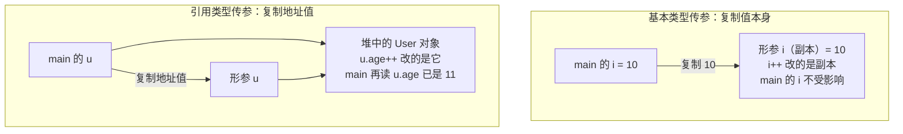
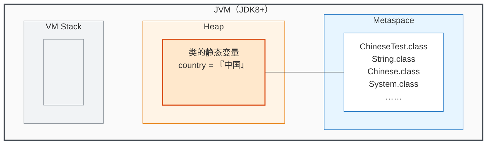

---
描述:
排序: 4000
分组:
分类: "[[JavaSE]]"
创建时间: 2026年08月19日
---
# 面向对象

## 面向对象和面向过程

面向过程与面向对象是两种不同的软件开发思想：前者关注==实现功能的步骤==，后者关注==需要哪些对象的参与==。

### 面向过程

> [!note] 核心思想
> `面向过程`（==PO==，Procedure Oriented）：分析出解决问题所需要的`步骤`，然后用函数把这些步骤一步一步实现，使用的时候一个一个依次调用。

- 关注点：实现功能的**步骤**
- 代表语言：C 语言

举例：

- 开汽车：启动 → 踩离合 → 挂挡 → 松离合 → 踩油门 → 车走了
- 装修房子：做水电 → 刷墙 → 贴地砖 → 做柜子和家具 → 入住

> [!tip] 适用场景
> 对于`简单`的流程适合使用面向过程的方式；`复杂`的流程不适合面向过程的开发方式。

完整可运行示例（面向过程方式开汽车，把开车拆解成依次调用的步骤函数）：

```java
--8<-- "code/java/basics/javase-demo/src/main/java/com/luguosong/oop/ProcedureDriveDemo.java"
```

### 面向对象

> [!note] 核心思想
> `面向对象`（==OO==，Object Oriented）：分析出解决这个问题都需要哪些`对象`的参与，然后让对象与对象之间协作起来形成一个系统。

- 关注点：实现功能需要哪些**对象**的参与
- 代表语言：Java、C#、Python 等

面向对象方法包括三个方面：

| 缩写 | 全称 | 中文 |
|------|------|------|
| OOA | Object Oriented Analysis | 面向对象分析 |
| OOD | Object Oriented Design | 面向对象设计 |
| OOP | Object Oriented Programming | 面向对象编程 |

> [!note] 为什么面向对象更容易处理复杂问题
> 人类本身就是以面向对象的方式认知世界的（人、汽车、房子……都是一个个"对象"），所以采用面向对象的思想更加容易处理复杂的问题。

举例：

- 开汽车：需要`汽车对象`和`司机对象`。司机对象有一个驾驶的行为，司机对象驾驶汽车对象。
- 装修房子：需要`水电工对象`、`油漆工对象`、`瓦工对象`、`木工对象`。每个对象都有自己的行为动作，对象之间协作最终完成装修。

完整可运行示例（面向对象方式开汽车，汽车对象与司机对象协作）：

```java
--8<-- "code/java/basics/javase-demo/src/main/java/com/luguosong/oop/ObjectDriveDemo.java"
```

### 两者对比

| | 面向过程 | 面向对象 |
|---|---|---|
| 关注点 | 实现功能的步骤 | 需要哪些对象的参与 |
| 组织方式 | 函数依次调用 | 对象之间协作 |
| 代表语言 | C | Java、C#、Python 等 |
| 适用场景 | 简单流程 | 复杂流程 |
| 耦合度与扩展性 | 耦合度高，扩展能力弱 | 耦合度低，扩展能力强 |

> [!example] 生产电脑的例子
> - `面向过程`生产一台电脑：按照电脑的工作流程一次成型，不会分 CPU、内存和硬盘——硬盘容量不够时难以单独更换。
> - `面向对象`生产一台电脑：CPU 是一个对象，内存条是一个对象，硬盘是一个对象——觉得硬盘容量小，后期很容易更换，这就是==扩展性==。

## 类与对象

类与对象是面向对象中最基本的一对概念：==类是模板，对象是实例==。

### 类

> [!note] 核心思想
> `类`：把现实世界中事物的==共同特征==（状态和行为）提取出来形成的一个==模板==。类实际上是人类大脑思考总结出来的，是一个抽象的概念。

现实世界的特征在程序中的对应关系：

| 现实世界 | 程序中 | 表示方式 |
|----------|--------|----------|
| 状态 | 属性 | 变量 |
| 行为 | 方法 | 方法 |

即：**类 = 属性 + 方法**。

举例：刘德华和梁朝伟都有姓名、身份证号、身高等状态，都有吃、跑、跳等行为，将这些共同的状态和行为提取出来，就形成了"明星类"。

### 对象

> [!note] 核心思想
> `对象`：==实际存在的个体==，又称为`实例`（instance）。通过类这个模板可以实例化 n 个对象。

- 例如通过"明星类"可以创造出"刘德华对象"和"梁朝伟对象"
- 明星类中有一个属性姓名：`String name;`。两个对象由于都是通过明星类造出来的，所以都有 name 属性，但==值是不同的==——这种属性被称为==实例变量==

### 类和对象的关系

| | 类 | 对象 |
|---|---|---|
| 本质 | 模板（抽象概念） | 实际存在的个体（实例） |
| 数量关系 | 一个类 | 可实例化 n 个对象 |
| 举例 | 明星类 | 刘德华对象、梁朝伟对象 |

完整可运行示例（把明星的共同特征提取为 Star 类模板，实例化两个对象并观察实例变量的值各不相同）：

```java
--8<-- "code/java/basics/javase-demo/src/main/java/com/luguosong/oop/ClassAndObjectDemo.java"
```

## 定义类

定义类的语法格式：

```java
[修饰符列表] class 类名 {
    // 类体 = 属性 + 方法
    // 属性（实例变量）：描述的是状态
    // 方法：描述的是行为动作
}
```

> [!note] 为什么要定义类
> 因为要通过类实例化对象。有了对象，才能让对象与对象之间协作起来形成一个系统。一个类可以实例化多个 Java 对象。

### 对象的创建

类定义好之后，通过 `new` 关键字创建对象，这个过程称为==实例化==：

```java
类名 对象名 = new 类名();
```

| 组成部分 | 说明 |
|----------|------|
| `new` | 关键字，在==堆==内存中开辟空间并创建对象 |
| `类名()` | 根据类模板创建出一个具体的对象 |
| `类名 对象名` | 声明一个引用变量，保存对象的内存地址 |

- 每执行一次 `new`，就会创建一个==新的对象==：一个类可以实例化 n 个对象
- 对象名中保存的是对象的地址，后续通过对象名来操作这个对象

完整可运行示例（一个类 new 出两个对象，直接打印对象名可看到两个对象的地址不同）：

```java
--8<-- "code/java/basics/javase-demo/src/main/java/com/luguosong/oop/CreateObjectDemo.java"
```

### 实例变量的访问与修改

创建对象后，通过 `对象名.属性名` 访问对象的属性：

| 操作 | 语法 | 示例 |
|------|------|------|
| 读取属性 | `对象名.属性名` | `p.name` |
| 修改属性 | `对象名.属性名 = 值;` | `p.name = "华为手机";` |

完整可运行示例（先修改商品对象的属性，再读取打印）：

```java
--8<-- "code/java/basics/javase-demo/src/main/java/com/luguosong/oop/PropertyAccessDemo.java"
```

### 实例变量与默认值

实例变量==一个对象一份==：比如创建 3 个学生对象，每个学生对象中都有独立的 name 变量，给一个对象的 name 赋值不会影响其它对象。实例变量属于==成员变量==，成员变量如果没有手动赋值，系统会赋默认值：

| 数据类型 | 默认值 |
|----------|--------|
| byte、short、int、long | `0` |
| float | `0.0f` |
| double | `0.0` |
| boolean | `false` |
| char | `'\u0000'` |
| 引用数据类型 | `null` |

完整可运行示例（两个对象各有一份实例变量，s2 未手动赋值时读取到系统默认值）：

```java
--8<-- "code/java/basics/javase-demo/src/main/java/com/luguosong/oop/InstanceVariableDemo.java"
```

### 实例方法

方法描述对象的==行为动作==。实例方法是==必须通过对象调用==的方法——之所以叫"实例"方法，是因为调用离不开实例（对象）。

定义实例方法的语法格式：

```java
[修饰符列表] 返回值类型 方法名(形式参数列表) {
    方法体;
}
```

| 组成部分 | 说明 |
|----------|------|
| 修饰符列表 | 可有可无，可以有多个 |
| 返回值类型 | 方法执行结束后返回结果的数据类型，没有返回值时用 `void` |
| 方法名 | 行为动作的标识，遵循方法命名规范 |
| 形式参数列表 | 局部变量，接收调用者传进来的数据，可以有 0~n 个 |
| 方法体 | 由 Java 语句构成，描述行为动作的具体实现 |

实例方法不能脱离对象单独调用，必须通过==对象==调用：

```java
对象名.方法名(实际参数列表);
```

- 实例方法中==可以直接访问实例变量==：通过哪个对象调用方法，方法中访问的就是哪个对象的实例变量
- 实例方法（字节码）==一个类一份==，所有对象共享；实例变量==一个对象一份==

| | 实例变量 | 实例方法 |
|---|---|---|
| 描述 | 状态 | 行为动作 |
| 份数 | 一个对象一份 | 一个类一份，所有对象共享 |
| 访问/调用方式 | `对象名.属性名` | `对象名.方法名(实参)` |

完整可运行示例（定义 Dog 类的 eat 和 sleep 两个实例方法，两个对象各自调用，观察实例方法直接访问实例变量）：

```java
--8<-- "code/java/basics/javase-demo/src/main/java/com/luguosong/oop/InstanceMethodDemo.java"
```

### 方法调用参数传递问题⭐

方法调用时，实参传递给形参只有一种方式：==值传递==（Pass by Value）——形参拿到的是实参保存的==值的副本==。Java 中==没有引用传递==（Pass by Reference）。

| 实参类型 | 复制给形参的内容 | 方法内修改的影响 |
|----------|------------------|------------------|
| 基本数据类型 | 数据值本身（如 `10`） | 改的是副本，调用者的变量==不受影响== |
| 引用数据类型 | 对象的地址值 | 形参和实参指向==同一个对象==，通过形参修改对象内容会影响外部 |

**基本类型传参**：`add(i)` 把 i 的值 `10` 复制给形参，方法内 `i++` 改的是副本，main 中的 i 仍是 10。

完整可运行示例（int 传参：方法内改的是副本，main 中的 i 不变）：

```java
--8<-- "code/java/basics/javase-demo/src/main/java/com/luguosong/oop/PrimitiveParameterDemo.java"
```

**引用类型传参**：`increase(u)` 把 u 中保存的==地址值==复制给形参，两个引用变量指向堆中==同一个 User 对象==，方法内 `u.age++` 后，main 中再读 `u.age` 变成 11。

完整可运行示例（User 传参：形参与实参指向同一个对象，main 中读到修改后的 11）：

```java
--8<-- "code/java/basics/javase-demo/src/main/java/com/luguosong/oop/ReferenceParameterDemo.java"
```

两个场景的内存示意——基本类型复制值后改副本互不影响；引用类型复制地址值后，两个引用共同指向堆中==同一个对象==：



> [!warning] 引用类型传参 ≠ 引用传递
> 复制的内容是"引用"，但机制仍是值传递：形参只是一个新变量。方法内若让形参重新指向新对象（`u = new User()`），实参的指向不会变——能影响外部的只有两边共同指向的那个对象的==内容==。

## this关键字

### this指向当前对象

> [!note] 核心思想
> `this`：当前对象的==引用==（reference），本质是一个保存==当前对象内存地址==的引用，表示“调用当前方法/构造器的那个对象”，通俗理解就是“我自己”。

- ==谁调用方法，this 就指向谁==：`p1.study()` 执行时，study() 方法中的 this 就是 p1 指向的对象；换成 `p2.study()`，同一个方法中的 this 就是 p2 指向的对象
- 实例方法==一个类一份==、所有对象共享，方法内部正是靠 this 来区分“这次是哪个对象在调用”
- 通过 `this.` 既可以访问实例变量（`this.name`），也可以调用实例方法（`this.study()`）

完整可运行示例（两个学生对象调用同一个 study()，this 分别指向各自对象，输出各自的姓名）：

```java
--8<-- "code/java/basics/javase-demo/src/main/java/com/luguosong/oop/ThisReferenceDemo.java"
```

### 为什么 this 不能出现在静态方法中

实例方法被调用时，当前对象的引用会作为==隐式参数==传入，存放在该方法==栈帧的局部变量表的第 0 个槽位==上——this 就从这里来，每个实例方法天生“自带”一个 this。

静态方法（[[static关键字]]，待整理）则完全不同：它通过==类名直接调用==，调用时==不需要对象==，也就没有“当前对象”可以传入——栈帧的局部变量表里根本没有 this。所以 this ==不能出现在静态方法中==，出现即==编译报错==。

### this的省略规则

实例方法中访问实例变量时，`this.` 通常可以省略：直接写 `name`，编译器会自动补上 `this.`，两种写法编译出的字节码完全相同。裸写变量名时，编译器的查找顺序：

1. 先找**局部变量**（形参、方法内声明的变量）
2. 找不到，再找当前对象的**实例变量**，此时自动等价于 `this.name`

| 情况 | 裸写 `name` 解析到 | `this.` 能否省略 |
|------|--------------------|------------------|
| 无同名局部变量 | 实例变量（自动补 `this.`） | ==可以省略== |
| 与局部变量重名 | 局部变量（==遮蔽==成员变量） | ==不能省略== |

因此==必须显式写 this 的场景==：形参（或局部变量）与实例变量重名——最典型的是 setter 和构造器：

```java
void setName(String name) {  // 形参 name 与实例变量 name 重名
    this.name = name;        // this.name 是成员变量，裸写的 name 是形参
}
```

> [!warning] 重名时写成 `name = name` 是一个隐蔽 bug
> 编译通过、运行不报错，但只是把形参赋给了它自己，成员变量没有被赋值，读取时仍是 `null`。

完整可运行示例（Book 类的两个赋值方法：形参不重名时省略 this，重名时必须写 this）：

```java
--8<-- "code/java/basics/javase-demo/src/main/java/com/luguosong/oop/ThisOmissionDemo.java"
```

## 封装性

### 什么是封装

> [!note] 核心思想
> `封装`：把对象的==状态（属性）==和==行为（方法）==统一包装到一个类中，使之成为一个独立的实体；==隐藏内部实现细节==，对外只提供==有限的访问接口==，以实现对对象的保护和隔离。

### 封装的好处

封装通过限制外部对对象内部的==直接访问和修改==：

- 保证数据的==安全性==
- 提高代码的==可维护性==
- 提高代码的==可复用性==

### 不使用封装的问题

属性不加限制地对外暴露时非常不安全：外部程序可以通过 `对象名.属性名` ==随意访问和修改==对象的属性。比如年龄——现实世界中 age 不可能是负数，但外部把 `-100` 赋给 age 时程序==毫无拦截==，数据已经失真。

完整可运行示例（age 未受保护：外部直接读到默认值 0、随意改成 50，甚至改成 -100 程序也不报错）：

```java
--8<-- "code/java/basics/javase-demo/src/main/java/com/luguosong/oop/EncapsulationProblemDemo.java"
```

### 封装的实现

为了让属性既==安全==又==不失访问能力==，封装分两步实现：

| 步骤 | 做法 | 作用 |
|------|------|------|
| 第一步：属性私有化 | 用 `private` 修饰属性 | 禁止外部随意访问——被 `private` 修饰的成员==只能在本类中访问== |
| 第二步：对外提供 getter / setter | 提供公开的读、改方法 | 外部仍能访问属性，但访问被收口到==可控的入口== |

getter / setter 的命名格式（以 age 属性为例）：

| 访问方式 | 方法格式 | 示例 |
|----------|----------|------|
| 读（getter） | `public 数据类型 get属性名()` | `public int getAge()` |
| 改（setter） | `public void set属性名(属性类型 属性名)` | `public void setAge(int age)` |

- getter 只读取、不修改属性，天然安全
- setter 是修改属性的唯一入口，在赋值前编写==拦截过滤==代码，把非法值挡在外面
- setter 形参与实例变量重名，`this.age = age` 中的 `this.` 不能省略（见 [[#this的省略规则]]）

完整可运行示例（private + getter/setter：非法年龄 -100 被拦截、属性保持 0，合法年龄 50 正常赋值）：

```java
--8<-- "code/java/basics/javase-demo/src/main/java/com/luguosong/oop/EncapsulationDemo.java"
```

## 构造方法

构造方法（Constructor，构造器）是类中一类特殊的方法：实例方法描述对象的==行为动作==，构造方法则负责==对象的创建==与==对象的初始化==。

### 构造方法的作用

构造方法的执行分为两个阶段：==对象的创建==和==对象的初始化==。这两个阶段不能颠倒，也不可分割：

| 阶段 | 时机 | 说明 |
|------|------|------|
| 对象的创建 | 执行 `new` 时 | 在==堆==内存中开辟空间，创建出新的对象 |
| 对象的初始化 | 执行构造方法体时 | 给对象的属性赋值，对象才算就绪 |

使用 `new` 时对象已在内存中创建出来，但还没有被初始化；初始化是在执行构造方法体时进行的。

完整可运行示例（new Phone() 时构造方法体自动执行：给属性赋初值，new 结束后属性已就绪）：

```java
--8<-- "code/java/basics/javase-demo/src/main/java/com/luguosong/oop/ConstructorDemo.java"
```

### 构造方法的定义与调用

定义构造方法的语法格式：

```java
[修饰符列表] 构造方法名(形式参数列表) {
    构造方法体;
}
```

| 组成部分 | 说明 |
|----------|------|
| 修饰符列表 | 可有可无，如 `public` |
| 构造方法名 | ==必须与类名完全相同== |
| 形式参数列表 | 与普通方法一样，可以有 0~n 个 |

与实例方法相比，构造方法有两个特殊之处：

- ==没有返回值类型==（连 `void` 都不写）
- ==只能通过 `new` 调用==，不能用 `对象名.方法名()` 的方式调用

调用构造方法的语法：

```java
new 构造方法名(实际参数列表);
```

完整可运行示例（Computer 类定义带参构造方法，new 时传入实参完成初始化）：

```java
--8<-- "code/java/basics/javase-demo/src/main/java/com/luguosong/oop/ConstructorCallDemo.java"
```

### 无参数构造方法

如果一个类==没有显式定义==任何构造方法，系统会默认提供一个==无参数构造方法==，也被称为==缺省构造器==：

| 类中的情况 | `new 类名()` 能否使用 |
|----------|--------------------|
| 未显式定义任何构造方法 | 可以——系统自动提供缺省构造器 |
| 显式定义了构造方法（无论有参无参） | ==不可以==——缺省构造器不再提供 |

> [!warning] 显式定义构造方法后缺省构造器消失
> 只要显式定义了任何一个构造方法（哪怕是有参的），系统就不再提供缺省构造器，此时再写 `new 类名()` 会==编译报错==。

> [!tip] 建议把无参数构造方法手动写出来
> 为了让对象的创建更加方便（既支持 `new 类名()` 又支持 `new 类名(实参)`），建议将无参数构造方法显式地定义出来。

> [!note] 缺省构造器是编译器为本类生成的，不是直接调用 Object 的无参构造
> 未显式定义构造方法时，编译器会为本类自动生成一个方法体基本为空的构造方法。Java 规定==任何构造方法的第一行==要么是 `this(...)` 调用本类其它构造方法（见 [[#this(实参)调用本类其它构造方法]]），要么是隐式的 `super()` 调用父类无参构造（不写就自动补）。因此自动生成的缺省构造器实际等价于：
>
> ```java
> 类名() {
>     super();  // 隐式：调用父类的无参构造，沿继承链最终到达 Object()
> }
> ```
>
> 即：缺省构造器是本类==自己的==构造方法，它通过隐式 `super()` 沿继承链最终调到 `Object()`，而不是"直接使用 Object 的无参构造"。由此还能解释一个坑：如果父类只显式定义了有参构造（父类的无参构造消失），子类即使什么都不写也会==编译报错==——缺省构造器里的隐式 `super()` 找不到可调用的父类无参构造。（`super()` 的详细规则在 [[继承]] 章节展开）

完整可运行示例（Employee 类显式定义无参构造，new Employee() 正常创建并初始化对象）：

```java
--8<-- "code/java/basics/javase-demo/src/main/java/com/luguosong/oop/DefaultConstructorDemo.java"
```

### 构造方法重载

一个类中可以定义==多个构造方法==——它们方法名都与类名相同、参数列表不同，自动构成方法的重载（==overload==）。调用时根据 `new` 后传入的==实参列表==决定执行哪个构造方法。

完整可运行示例（Rectangle 的无参与两参构造构成重载，两种方式分别创建对象）：

```java
--8<-- "code/java/basics/javase-demo/src/main/java/com/luguosong/oop/ConstructorOverloadDemo.java"
```

### this(实参)调用本类其它构造方法

构造方法重载后，多个构造方法之间容易出现重复的初始化代码。`this(实参)` 语法让一个构造方法去调用本类中其它的构造方法，把初始化逻辑==收口到一处==，作用是==代码复用==：

```java
[修饰符] 类名(形参列表) {
    this(实参列表);  // 只能在第一行：调用本类中匹配的其它构造方法
    // 其它语句
}
```

| 规则 | 说明 |
|------|------|
| 位置 | ==只能出现在构造方法的第一行==，不在第一行直接==编译报错== |
| 次数 | 一个构造方法中==最多写一次==（第一行只有一行） |
| 限制 | 调用的是==本类==的构造方法，且不能与 `super()` 共存（super 的规则见 [[继承]]） |
| 作用 | 复用其它构造方法的初始化代码，避免重复 |

> [!warning] this(...) 之间不能形成环
> A 构造调用 B、B 又回头调用 A，编译器检测到==递归构造调用==同样直接==编译报错==。

完整可运行示例（Point 的无参构造通过 `this(0, 0)` 复用两参构造：先执行完两参构造的初始化，再回来执行无参构造的剩余代码）：

```java
--8<-- "code/java/basics/javase-demo/src/main/java/com/luguosong/oop/ThisConstructorCallDemo.java"
```

### 构造代码块与初始化顺序⭐

类体中直接用 `{ }` 括起来的代码块称为==构造代码块==：==每次 new 对象时都会执行==，且先于构造方法体执行。

对象的创建和初始化完整顺序：

| 步骤 | 动作 |
|------|------|
| ① | `new` 时在堆内存中开辟空间，给所有属性赋==默认值== |
| ② | 执行==构造代码块==进行初始化 |
| ③ | 执行==构造方法体==进行初始化 |
| ④ | 构造方法执行结束，对象初始化完毕 |

完整可运行示例（Machine 的构造代码块先于构造方法体执行，且代码块执行时属性仍处于默认值状态）：

```java
--8<-- "code/java/basics/javase-demo/src/main/java/com/luguosong/oop/ConstructorBlockDemo.java"
```

#### 构造代码块的意义

> [!question] 构造方法体里就能写初始化代码，为什么还需要构造代码块？
> 核心价值是==抽取多个构造方法的公共逻辑==：构造方法可以重载，若每个构造方法都要执行一段相同的初始化，就得逐个重复写；放进构造代码块则只写一次，它==先于每一个构造方法体执行==。

- **去重的语法糖**：构造代码块并不是独立的执行机制——编译后它的代码会被==复制进本类每一个构造方法体的开头==（在 `super()` 之后），这也是为什么它对每个构造方法都生效
- **日常开发很少用**：简单的赋值初始化直接写在字段声明处更直观（`double price = 4999.0;`，字段初始化同样是每个对象都执行）；只有当初始化逻辑需要多条语句且要被多个构造方法共享时，构造代码块才有明显优势
- **匿名内部类是特例**：匿名类没有类名、写不了构造方法，实例初始化块是它表达初始化逻辑的唯一途径

一句话总结：构造代码块 = ==多个构造方法的公共初始化逻辑的去重手段==；简单场景优先用字段初始化。

#### 为什么不用公共方法代替构造代码块

> [!question] 把公共逻辑抽成一个方法，在每个构造方法里调用，不也能去重吗？
> 能，而且实际开发中很常用（通常声明为 `private` 初始化方法）。但两者有关键差异，构造代码块在三点上不可替代：

| | 构造代码块 | 每个构造方法里调用公共方法 |
|---|---|---|
| 执行保证 | 编译器保证==所有构造方法必然先执行==（含后期新增的重载构造） | 靠手动在每个构造方法里写调用，==漏写一个就是隐蔽 bug== |
| 给 `final` 字段赋值 | ✅ 可以 | ❌ `final` 字段==只能在构造方法/初始化块中赋值==，不能在普通方法中赋值 |
| 匿名内部类 | ✅ 可用 | ❌ 匿名类写不了构造方法，没有调用入口 |

> [!warning] 构造方法没执行完，公共方法能调吗——能，但别调用可被重写的方法
> 构造方法体执行时对象==早已存在==（`new` 第一阶段已开辟空间、属性已是默认值），`this` 有效，调用实例方法完全合法。真正的坑是：父类构造方法执行时==子类的字段还没初始化==，而方法调用具有多态性——实际执行的是子类重写后的版本，其中读到的子类字段全是默认值：
>
> ```java
> class Parent {
>     Parent() {
>         init();               // 多态：实际执行 Sub 重写的 init()
>     }
>     void init() {}
> }
>
> class Sub extends Parent {
>     String name = "已初始化";
>     @Override
>     void init() {
>         System.out.println(name);  // 打印 null！此时 Sub 的字段初始化还没执行
>     }
> }
> ```
>
> 因此规范建议：构造方法中只调用 `private`、`final` 或 `static` 方法（不可能被重写，不存在时序问题）。

### 构造方法赋值与 setter 的分工

> [!question] 构造方法中已经给属性赋值了，为什么还需要单独定义 set 方法？
> 构造方法中的赋值发生在==对象第一次创建时==，此后不会再执行；而 set 方法可以在==后期随时调用==，完成属性值的修改——两者服务于不同的时机，缺一不可。

| | 构造方法赋值 | setter 赋值 |
|---|---|---|
| 执行时机 | `new` 创建对象时，==仅执行一次== | 对象创建后==可随时多次调用== |
| 定位 | 对象的==初始==状态 | 对象属性的==后期修改== |

以手机涨价为例：`new Phone("华为", 4999.0)` 确定出厂价格；上市后调价，只能再调用 `phone.setPrice(5299.0)` 修改——总不能为了改个价格重新 new 一个对象。

## static关键字

static关键字国 O ①static是一个关键字，翻译为：静态的。 ②static修饰的变量叫做静态变量。当所有对象的某个属性的值是相同的，建议将该属性定义为静态变量，来节省内存的开销。 ③静态变量在类加载时初始化，存储在堆中。 ④static修饰的方法叫做静态方法。 ⑤所有静态变量和静态方法，统一使用“类名.”调用。虽然可以使用“引用.”来调用，但实际运行时和对象无关，所以不建议这样写，因为这样写会给其他人造成疑惑。 ⑥使用“引用.”访问静态相关的，即使引用为nul，也不会出现空指针异常。 ⑦静态方法中不能使用this关键字。因此无法直接访问实例变量和调用实例方法。 ⑧静态代码块在类加载时执行，一个类中可以编写多个静态代码块，遵循自上而下的顺序依次执行。 ⑨静态代码块代表了类加载时刻，如果你有代码需要在此时刻执行，可以将该代码放到静态代码块中。

### 静态变量

当一个属性是类级别的（所有对象都有这个属性，并且这个属性的值是一样的），建议将其定义为静态变量，在内存空间上只有一份。节省内存开销。这种类级别的属性，不需要new对象，直接通过类名访问。

静态变量存储在哪里？静态变量在什么时候初始化?(什么时候开辟空间)JDK8之后：静态变量存储在堆内存当中。类加载时初始化。

内存原理图（JDK8+）如下：类加载时，`Chinese` 类的静态变量 `country` 随类在==堆（Heap）==中开辟空间，全类只有一份；类本身的结构信息存放在==方法区==（JDK8 起由 Metaspace 实现）。



Canvas 版（盒子位置按原图手工摆放，可与上面 Mermaid 版对比）：

![[静态变量内存原理图.canvas]]


