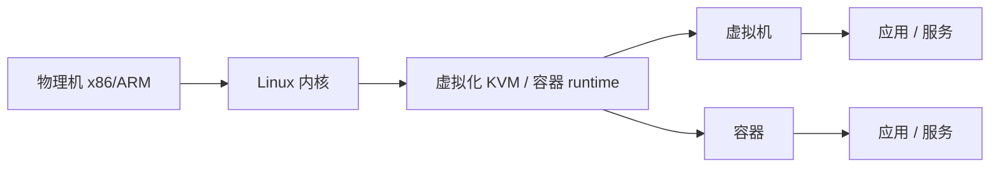

# 第一章 Linux是什么与如何学习

> [!info] 关于本章
> 本章以鸟哥《Linux 私房菜 — 基础学习篇》第一章（CentOS 7 版）为骨架，已更新到 **当前（2026）状态**：内核主线已演进至 **6.x**；CentOS 7 已于 **2024-06-30 停止维护（EOL）**，RHEL 系的社区继承者为 **Rocky Linux / AlmaLinux 9**；桌面图形协议从 X Window System（X11）过渡到 **Wayland**（多数发行版默认）；云端与容器已成为 Linux 的主力场景。术语统一为大陆通行写法。

## 1.1 Linux 是什么

Linux 是一套操作系统。严格地说，Linux 指的是**内核（kernel）**——管理与驱动硬件、提供系统调用接口的那一层；应用程序并不属于 Linux 本身。

![[vbird-3f72bf2f914e9337.gif]]
*图：操作系统的角色（内核位于硬件与应用之间）*

> [!note] 内核与硬件强绑定
> 内核直接依据硬件规格编写，同一操作系统不能跨硬件架构运行（x86 版 Windows 不能直接跑在 ARM 上，除非有针对该架构的版本）。但 Linux 是开源的，源码可被修改以适配各种机器，这种能力称为**可移植性（portability）**——这是 Linux 能从 x86 扩展到 ARM、Power、RISC-V 等几乎所有架构的关键。

### 1.1.1 Linux 之前：Unix 的历史

Linux 的原型是 1991 年 Linus Torvalds 写出的，但要理解它为何诞生，需回顾 Unix 的历史。

| 年份 | 事件 |
|---|---|
| 1965 | 贝尔实验室（Bell）、MIT、GE 共同发起 **Multics** 计划，目标让大型主机支持 300+ 终端 |
| 1969 | Multics 进度落后，Bell 退出；**Ken Thompson** 在 DEC PDP-7 上用汇编写出 Unics（Unix 原型），含一个小文件系统 |
| 1973 | **Dennis Ritchie** 发明 C 语言，并用 C 重写 Unix——这使 Unix 具备可移植性，正式发布 |
| 1977 | 加州伯克利的 **Bill Joy** 发布 **BSD（Berkeley Software Distribution）**，Unix 的重要分支；Bill Joy 后创办 Sun Microsystems |
| 1979 | AT&T 推出 **System V** 第七版，支持 x86，但严控版权（"不可对学生提供源码"）；此后 System V 与 BSD 并称"纯种 Unix" |
| 1984 | **Andrew Tanenbaum** 为教学编写 **Minix**（mini-Unix，附源码，用于 x86）；同年 **Richard Stallman** 发起 **GNU** 计划 |
| 1985 | Stallman 起草 **GPL**（通用公共许可证），成立 **FSF**（自由软件基金会） |
| 1991 | Linus Torvalds 在 `comp.os.minix` 发布 Linux 内核 0.02 |

![[vbird-13ba5cafc76881d4.webp]]
*图：早期主机与终端机的关系（终端机仅负责输入/输出，运算全在主机）*

> [!tip] 两个影响深远的设计理念
> Thompson 的早期 Unix 确立了两条原则，后来被 Linux 继承：
> 1. **一切皆文件**：程序、设备都以文件形式访问；
> 2. **程序只做一件事并做好**：小程序通过组合完成复杂任务（这是后来 Unix 哲学与管道的根基）。

### 1.1.2 GNU 计划、自由软件与开放源代码

**GNU 与自由软件**

1984 年 Richard Stallman 发起 **GNU**（GNU's Not Unix，递归缩写）计划，目标是建立一套自由、开放的类 Unix 操作系统。GNU 的核心精神是**自由软件（Free Software）**——"free" 指自由（liberty），不是免费（free beer）：

> "Free software" is a matter of liberty, not price. To understand the concept, you should think of "free speech", not "free beer".

用户对自由软件享有四项自由：运行、复制、再发行、研究修改与改进，为此源码必须公开。GNU 先后产出了 **GCC**（编译器）、**Emacs**（编辑器）、**glibc**（C 库）、**Bash**（shell）等基础工具，但一直缺少可用的内核（GNU 自己的内核 Hurd 进展缓慢）——直到 Linux 出现。

**GPL 授权**

为防止自由软件被改为专利软件，Stallman 与律师起草了 **GPL（General Public License）**，称 copyleft（对应 copyright）。GPL 软件的特点：

- 可自由取得软件与源码、复制、修改、再发行；
- 修改后的版本必须继续以 GPL 授权（**传染性 / copyleft**）；
- 不可单纯贩卖软件本身（但可结合服务、手册、支持收费）。

> [!note] GPL 仍可商业
> Red Hat、SUSE、Canonical 等公司以 GPL 软件构建了成功的商业模式——它们卖的不是软件本身（仍可免费下载），而是**订阅、支持、咨询、认证与集成服务**。GPL 完全允许商业行为。

Linux 内核采用 **GPLv2**（至今未升级到 GPLv3）。

**开放源代码（Open Source）**

由于 "free" 在英文中既指"自由"又指"免费"，让商业公司困惑，1998 年成立的**开放源代码促进会（OSI）**提出 **Open Source** 一词，强调"源码开放"的实务特征，淡化了自由软件的政治意涵。开源授权比 GPL 宽松——允许闭源衍生（如 MIT、BSD、Apache）。GPL 是开源授权的一种，但最严格。

**闭源 / 专有软件（closed source）**只发布二进制，不公开源码。常见的还有：

| 类型 | 说明 | 例子 |
|---|---|---|
| **Freeware** | 免费使用，但**不公开源码**（不是自由软件） | 许多免费小工具 |
| **Shareware** | 试用期免费，到期须付费 | 试用版软件 |

> [!warning] 别混淆
> Free software（自由软件，开源、受 GPL 类授权保护）≠ Freeware（免费软件，通常闭源）。来历不明的免费软件常暗藏窃取用户数据的风险，不要随便安装。

## 1.2 Torvalds 的 Linux 发展

### 1.2.1 从 Minix 到 Linux 0.02

Linus Torvalds（1969 年生，芬兰赫尔辛基大学学生）通过外祖父接触了汇编语言，大学期间用上 Unix 但终端机资源紧张。得知 Tanenbaum 的 Minix 可在 Intel 386 上运行并附带源码后，他购买了 386 个人电脑并安装 Minix 学习内核设计。

**多任务测试**

当时 x86 的多任务能力被人质疑。Torvalds 为验证 386 的多任务性能，写了三个小程序：一个持续输出 A、一个持续输出 B、一个在两者间切换。同时运行后，屏幕上稳定出现 `ABABAB……`——他确认 386 能顺畅地进行多任务切换。

![[vbird-d7077e0b0cc6d09b.gif]]
*图：386 多任务测试*

> [!note] 多任务（multitasking）
> CPU 一个时刻只处理一个任务，通过在多个任务间快速切换（时间片轮转），让用户感觉它们"同时"运行。这既需要 CPU 硬件支持，也需要操作系统调度。多任务环境下，每个任务被授予一个最大 CPU 时间片，用完后被挂起、重新排队等待下一次被调度。

**Linux 0.02 释出**

Torvalds 借助 GNU 的 bash 与 gcc，参考 Minix 设计理念，结合 386 硬件特性写出内核。1991 年他在 `comp.os.minix` 发布：

```text
Hello everybody out there using minix-
I'm doing a (free) operating system (just a hobby,
won't be big and professional like gnu) for 386(486) AT clones.

I've currently ported bash (1.08) and gcc (1.40), and things seem to work. ...
```

他把内核放在 FTP 站点，目录名为 `linux`，于是大家便称之为 **Linux**。为兼容 Unix 软件，他选择**遵循 POSIX 标准**——由 IEEE 制定的可移植操作系统接口。这使 Linux 体质自起步就优良，Unix 软件易于移植。

### 1.2.2 Linux 的发展：虚拟团队与内核版本

**虚拟团队**

Linux 早期由 Torvalds 一人维护。他把内核放在 FTP 上、公开征集反馈，使用者回报问题、志愿者贡献驱动与补丁。Torvalds 务实地"先求能跑，再求改良"——只要补丁通过测试就并入主线。后来贡献者增多，**Alan Cox** 等副手分层负责子系统的测试与整并。这群素未谋面、遍布全球的开发者构成了**虚拟团队**，并建立了 [kernel.org](https://www.kernel.org/) 作为官方站点。1994 年发布 1.0，1996 年发布 2.0 并确定企鹅 **Tux** 为吉祥物。

为便于维护，Linux 内核逐渐发展出**模块化**机制——把驱动、协议等独立成可在运行时加载的模块，避免每加一个功能就重编整个内核。

**内核版本演进**

```text
6.10.0-xxx.x86_64
主版本.次版本.释出版本-修改版本
```

- 2.6 之前：奇数版为开发版（development）、偶数版为稳定版（stable）。
- 3.0 之后：废弃奇偶制，改用**主线版本（mainline）**滚动推进，每 2–3 个月发布一个新主线。
- 旧版本要么 **EOL**（停止维护），要么成为**长期支持版（LTS/longterm）**，由指定维护者持续打补丁——服务器场景应优先选 LTS。

> [!info] 当前内核状态（2026）
> 主线已演进至 **6.x** 系列（如 6.10）。LTS 版本每年挑选，通常维护 2–6 年。可在 [kernel.org](https://www.kernel.org/) 查看当前主线、稳定版与 LTS 列表。用 `uname -r` 查看本机内核版本。

> [!tip] 内核版本 ≠ 发行版版本
> "我的 Linux 是 9.x" 指的是**发行版**（distribution）版本，不是内核版本。提问时应说明发行版及版本，如"我使用 Rocky Linux 9.3，内核 6.6"。

### 1.2.3 Linux 发行版（distributions）

Torvalds 维护的只是内核与少量工具，早期只有工程师能从源码安装。为了让普通用户也能用上 Linux，社区与商业公司把**内核 + 自由软件 + 管理工具 + 安装程序**打包成可一键安装的整套系统，称为 **Linux distribution（发行版）**。

![[vbird-2012566341c3336d.gif]]
*图：Linux 发行版的组成*

各发行版都用 kernel.org 的内核，软件也高度重合（Apache、Postfix、Samba、BIND 等），并通过 **LSB**（Linux Standard Base）与 **FHS**（文件系统层级标准）规范目录结构。主要差异在**包管理**与厂商自带工具。按包管理分两大阵营：

| 包管理 | 商业代表 | 社区代表 |
|---|---|---|
| **RPM 系**（`dnf`/`rpm`） | RHEL（Red Hat / IBM）、SUSE Linux Enterprise | Rocky Linux、AlmaLinux、Fedora、openSUSE |
| **DPKG 系**（`apt`/`dpkg`） | Ubuntu（Canonical） | Debian |
| 其他 | — | Arch（pacman）、Gentoo（源码编译） |

> [!info] CentOS 的去向
> CentOS 7 已于 **2024-06-30 停止维护（EOL）**；CentOS 8 更早已于 2021 年底终止。Red Hat 将 CentOS 项目转向滚动发布的 **CentOS Stream**（RHEL 的上游）。原本"重建 RHEL 二进制兼容"的生态由 **Rocky Linux** 与 **AlmaLinux** 接棒，二者均提供与 RHEL 9 二进制兼容的社区发行版，成为 CentOS 用户的常规迁移目标。本书后续以 **Rocky/AlmaLinux 9** 为示例环境。

> [!tip] 选哪个
> - **企业 / 服务器**：RHEL、SUSE（有商业支持），或 Rocky / AlmaLinux（免费、兼容 RHEL 9）。
> - **桌面尝鲜**：Fedora、Ubuntu、openSUSE Tumbleweed。
> - **想深入理解**：Debian（严谨）或 Arch（DIY、文档佳）。
>
> 入门选定一个发行版**学透**，再迁移其它会非常快。各发行版浏览可参考 [DistroWatch](https://distrowatch.com/)。

## 1.3 Linux 当前应用的角色

Linux 内核小巧，既能在低资源的嵌入式设备上运行，也能驱动全球最大的超算与云。

### 1.3.1 企业环境与关键任务

- **网络服务器**：承袭 Unix 的稳定性，Linux 是 Web（Nginx / Apache）、邮件（Postfix）、文件（Samba）、数据库（PostgreSQL / MySQL）服务器的首选。云厂商（AWS、阿里云、Azure、Google Cloud）的默认镜像中 Linux 占绝对主流。
- **关键任务**：金融、电信、大型企业的核心数据库与中间件大量迁到 x86 + Linux，省去专用 Unix 小型机的高昂成本。
- **高性能计算（HPC）**：[Top500](https://www.top500.org/) 榜单中几乎所有超算都运行 Linux；**集群（cluster）**并行计算是主流形态——把大任务拆分到多节点运算再汇总结果。

### 1.3.2 个人、移动与嵌入式

- **桌面**：Linux 桌面占有率仍较低，但 **KDE / GNOME** 已相当成熟；LibreOffice、Firefox、Thunderbird、VS Code、Chromium 等覆盖日常办公与开发。**Wayland** 已取代沿用三十多年的 X Window System（X11），成为 Fedora、Ubuntu、RHEL 9 等的默认显示协议。
- **移动**：**Android** 基于 Linux 内核，是全球用户量最大的操作系统；手机、平板、电视盒子的底层几乎都是 Linux。
- **嵌入式**：路由器、防火墙、NAS（群晖、威联通）、交换机、智能家电、工业控制、机器人、IoT 设备大量运行精简的 Linux；树莓派（Raspberry Pi）等单板计算机让嵌入式 Linux 学习成本极低。

### 1.3.3 云端与容器

云端（cloud）与容器是 Linux 当前最大的增长点：

- **虚拟化**：在一台物理机上用 KVM / Xen 等跑多台独立虚拟机，提升资源利用率；公有云（AWS EC2、阿里云 ECS）底层即基于此。
- **容器**：Docker / Podman / containerd 把应用与依赖打包成可移植的镜像；**Kubernetes** 在集群上调度容器——这套技术栈几乎全跑在 Linux 上，催生了云原生（cloud native）浪潮。
- **端设备**：运算集中到云后，终端可更轻量——手机、平板、瘦客户端、树莓派通过网络取用云端资源即可办公。



> [!note] 虚拟化（virtualization）
> 在一台物理主机上模拟出多个逻辑上完全独立的硬件，每个"假"主机可安装一套独立运行的操作系统（非多重开机）。多数 ISP 通过售卖虚拟机的使用权来盈利——这些虚拟机的底层与内部，常常都是 Linux。

## 1.4 如何学习 Linux

> [!tip] 为什么强调命令行
> X-Window / Wayland 图形界面只是 Linux 上的一套**软件**，不是内核本身。系统管理、服务器运维、远程排障（SSH）、自动化（脚本）几乎都靠**命令行（shell）**完成——图形界面在服务器上甚至通常不安装（既占资源又增大攻击面）。要深入 Linux，命令行是必经之路。

### 1.4.1 学习路径建议

1. **计算机概论与硬件基础**（[[第零章 计算机概论]] 已讲）：不必精通，但要"听过、有概念"。
2. **安装与基本命令**：先装好一套发行版（如 Rocky Linux），熟悉文件、目录、命令行操作。
3. **操作系统基础**：用户与组、权限、**进程**的概念——权限是安全的核心。
4. **`vi` 编辑器**：所有 Unix-like 系统都有 `vi` / `vim`，许多工具会调用它。
5. **Shell 与 Shell Script**：正则表达式、管道、重定向；编写脚本以自动化运维。
6. **包管理**：`dnf` / `apt`、Tarball 安装。
7. **网络基础**：IP、路由、TCP/IP。
8. **服务搭建**：上述都通过后再学 Web、邮件、文件服务器。

### 1.4.2 实作与问题处理

- **反复动手**：Linux 是"做"出来的，只听不练永远学不会。装一台虚拟机（VirtualBox / VMware / KVM）随手实验。
- **发生问题时**，按以下顺序排查：
    1. **查本机文档**：`/usr/share/doc` 下的说明；命令的 `man` 手册；官方文档。
    2. **看错误信息**：命令行输出的错误往往已经明示问题；服务问题查 `/var/log/` 下的**日志**（如 `journalctl`、`/var/log/messages`）。
    3. **搜索引擎**：把错误信息原样贴进搜索（附上发行版与版本号），通常能找到解决方案。
    4. **提问的智慧**：到论坛 / 邮件列表提问时，附全发行版版本、内核版本、已做的尝试与完整错误信息；先搜索再发问；不要在多个版面重复发帖。

> [!note] Netman 的几条经验
> - 系统设计要规整：文件目录分类清晰，便于日后维护。
> - 养成**记录**习惯：遇到的问题、错误信息、原因、解决方法归类存档。
> - 作为用户，人迁就机器；作为开发者，让机器迁就人。
> - 学写脚本的关键是"会偷——会改——会变——通"。

> [!tip] 学习动力
> 长期坚持 Linux 的两个原动力是**兴趣**与**成就感**。深入玩一个有趣课题、写心得分享、在社区帮新手回答问题、参与技术讨论，都会反过来推动自己学得更深。职业上，企业需要的是整体环境的"Total Solution"，所以不要存"门户之见"——多接触、不排斥任何学习机会。

## 1.5 重点回顾

- 操作系统的核心作用：管理内存、设备、进程、文件系统，并提供系统调用。能让硬件"就绪（ready）"即是一个最小操作系统。
- Unix：1969 年由 Ken Thompson 用汇编写出，1973 年 Dennis Ritchie 用 C 语言重写并命名 Unix——C 语言让 Unix 具备可移植性。
- 1977 年 BSD 发布；1979 年 System V 第七版收紧版权。
- 1984 年两件大事：Tanenbaum 编写 Minix；Stallman 发起 GNU 计划，倡导自由软件，提出 GPL。
- 1991 年 Linus Torvalds 发布 Linux 内核。Linux 成功的关键：Minix（Unix 亲和）、GNU（gcc / bash 等工具）、Internet（快速传播）、POSIX（兼容 Unix）、虚拟团队（全球协作）。
- Linux 内核采用 **GPLv2**；3.0 起废弃奇偶版本制，改用主线 + LTS。当前主线为 6.x。
- 开源授权：Apache / BSD / GPL / MIT / LGPL 等，GPL 最严格（传染性）。
- Linux 发行版 = 内核 + 自由软件 + 管理工具 + 安装程序；按包管理分 RPM 系与 DPKG 系。CentOS 7 已 EOL，社区继承者为 Rocky / AlmaLinux 9。
- 学习 Linux：命令行为本，基础为先，反复实作，先查日志与文档再提问。

## 1.6 本章习题

**简答题**：

1. 操作系统至少要控制硬件的哪些单元？
   答：输入输出控制、设备控制、进程管理、文件管理。
2. 同一款游戏，Windows 版与 Mac 版互不通用，为什么？
   答：应用程序依赖操作系统提供的开发接口（系统调用），而不同操作系统（甚至同系统不同架构）接口不一致；除非软件厂商做了**移植**。
3. 我在主机上加装一张网卡，硬件本身正常，但系统无法使用，可能原因？
   答：内核不自带该网卡的驱动。解决：到网卡厂商网站下载并安装适配本系统的驱动，或换用受支持的型号。
4. 什么是 POSIX？为什么 Linux 遵循 POSIX 对发展有利？
   答：POSIX 是 IEEE 制定的操作系统接口标准。符合 POSIX 的程序可在任何符合 POSIX 的系统上运行——Linux 遵循它，使得大量 Unix 软件可直接移植，加速了生态扩张。
5. 什么是多人多任务（multi-user, multitasking）？
   答：多人指允许多个用户同时登录、各自独立环境；多任务指系统同时执行多个任务，CPU 在任务间快速切换、资源分配较公平。
6. 简述 GPL 与 Open Source 的精神。
   答：GPL 强调用户对软件的自由（运行、复制、修改、再发行），修改后必须保持 GPL 授权，源码须公开；Open Source 强调源码开放的实务特征，授权更宽松，允许闭源衍生。
7. Linux 各发行版之间的相同与不同？
   答：相同——都用 kernel.org 的内核，都遵循 FHS / LSB 标准，使用大量相同的自由软件（gcc、bash、Apache 等）。不同——内核与软件版本选择不同，厂商工具不同，**包管理**不同（RPM 系 vs DPKG 系）。

**实作题**：

- 用 `uname -r` 查看本机内核版本，到 [kernel.org](https://www.kernel.org/) 对照它是否为 LTS 版本。
- 调查 Android 与 Linux 内核的关系（提示：Android 基于 Linux 内核，但维护自己的通用内核分支，参见 [Android — Wikipedia](https://en.wikipedia.org/wiki/Android_(operating_system))）。

## 延伸阅读

- [Linux kernel — Wikipedia](https://en.wikipedia.org/wiki/Linux_kernel)
- [kernel.org 官方站点与版本说明](https://www.kernel.org/)
- [Unix — Wikipedia](https://en.wikipedia.org/wiki/Unix)
- [GNU Project — Wikipedia](https://en.wikipedia.org/wiki/GNU_Project)
- [GNU General Public License — Wikipedia](https://en.wikipedia.org/wiki/GNU_General_Public_License)
- [Comparison of Linux distributions — Wikipedia](https://en.wikipedia.org/wiki/Comparison_of_Linux_distributions)
- [Linus Torvalds 1991 年在 comp.os.minix 的原始发文](https://groups.google.com/g/comp.os.minix/c/dlNtH7RRrGA/m/SwRavCzVE7gJ)
