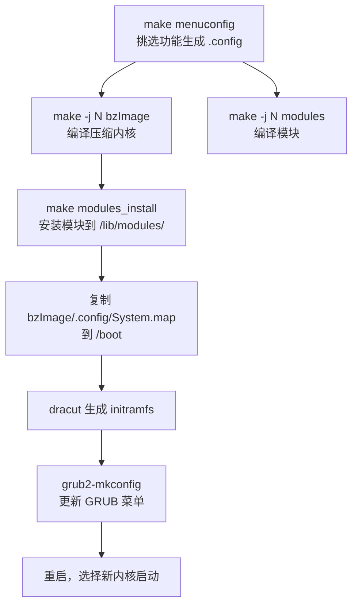

# 第二十四章 Linux内核编译与管理

> [!info] 关于本章
> 本章以鸟哥《Linux 私房菜 — 基础学习篇》第二十四章为骨架，已将原基于 **CentOS 7（内核 3.10）** 的内容更新至 **2026 年当前状态**：以 **Rocky/AlmaLinux 9**（内核 5.14 LTS）为示例发行版，**RHEL/Rocky 10**（内核 6.x）与新机主流作对照；关键现代化点包括 `yum`→`dnf`、init 已由 **systemd** 取代、当前主线内核约 **7.x**、长期维护版（LTS）为 **6.x**。术语统一为大陆通行写法。

我们常说的 "Linux"，严格说就是指**内核（kernel）**。内核控制主机所有硬件并提供系统的核心功能。开机时，引导加载程序（bootloader）将内核加载到内存，内核侦测硬件并加载相应驱动后，系统才能正常运行。

> [!note] 现代视角：一般不需要自编译内核
> 现代发行版已配备海量预编译模块，并在线推送内核更新；**除非有特殊需求（新硬件驱动、嵌入式移植、开启/关闭特定功能），否则不建议自行编译内核**。本篇属进阶内容，对系统移植无兴趣可略过。

## 24.1 编译前的任务：认识内核与取得内核源码

内核是操作系统的最底层，负责驱动所有硬件，并提供防火墙、LVM、Quota、文件系统等核心功能。若内核不认识某个新硬件，该硬件便无法被驱动。

### 24.1.1 什么是内核 (Kernel)

电脑真正在工作的其实是硬件——CPU 负责运算、硬盘存储数据、显卡输出图像、声卡发声、网卡联网。**控制这些硬件的就是内核的职责**。你想让电脑完成的任何工作，都必须"内核支持"才行；内核没有提供的功能，无法通过任何上层软件绕开。

内核本质上只是系统上的**一个文件**，其中包含硬件侦测程序与驱动模块。这个文件通常放在 `/boot/vmlinuz-xxx`。一台主机可同时存放多个内核文件，开机时只选择其中一个加载。系统读完固件（UEFI/BIOS）并加载引导程序后，将内核读入内存；内核侦测硬件、挂载根目录、加载驱动模块，然后调用 **systemd** 依序启动各项服务。

**内核模块（kernel module）的用途**

硬件更新极快，若旧内核不认识新硬件，难道每次都要重编内核？为此 Linux 早已采用**模块化设计**：把不常用的驱动独立编译成模块，内核在运行中按需加载模块即可驱动新硬件，无需改动内核本身。模块统一放在 `/lib/modules/$(uname -r)/kernel/` 下。

> [!tip] 驱动开发：厂商责任还是内核责任？
> 某硬件在 Linux 上驱动滞后，并非 Linux 之过——Windows 上的新硬件驱动同样由厂商提供。想让某硬件在 Linux 上跑得好，应向硬件厂商施压、要求其提供 Linux 驱动（最好直接回馈主线内核）。

### 24.1.2 更新内核的目的

编译内核的重点在于 **"你要你的 Linux 做什么？"**——没必要编译进内核的功能就不要加，内核越小越稳定。Linux 内核的特点是：可随时按个人喜好改动、版本更新频繁；但除非有特殊需求，一次编译成功即可，不必追逐最新版。发行版已为一般用户预编译了合适且大量模块化的内核，**普通用户基本无需重编内核**。

**编译内核的可能目的**

| 目的 | 说明 |
|---|---|
| 新功能需求 | 某功能仅在新内核中才有（如新防火墙机制、新主板芯片组支持） |
| 内核过于臃肿 | 追求极致稳定，重编以裁剪多余功能 |
| 与硬件搭配的稳定性 | 默认内核未必最优匹配你的 CPU/硬件，重编可取得正确模块 |
| 其他需求 | 嵌入式系统需要小而精的内核 |

> [!note] 为稳定而非为性能
> 重编内核对硬件的微调对整体性能影响很小；若为"性能"编译内核，效益不大。**真正的理由通常是系统稳定性**。系统若已稳定运行且不增冷门硬件，则不必重编。

### 24.1.3 内核的版本

| 来源 | 版本系列 | 备注 |
|---|---|---|
| RHEL / Rocky / AlmaLinux **9** | **5.14.x**（el9） | 整个大版本生命周期内不跨主线 |
| RHEL / Rocky / AlmaLinux **10** | **6.x**（如 6.11.x） | 2025 年起发布 |
| 主线（mainline） | 约 **7.x**（2026 年） | 每 9–10 周一个版本 |
| 长期维护版（LTS） | **6.x**（如 6.18 LTS） | 服务器优先选 LTS |

> [!tip] 选哪个版本升级？
> 服务器场景应优先用本发行版 LTS 系列的最新点版本，而非追主线最新版——因为 qemu、容器、虚拟化、安全模块等软件与内核版本有搭配关系。除非确需某主线新功能（如鸟哥当年为研究 VFIO VGA passthrough，曾把 CentOS 7 的 3.10 升到 4.2.3），否则后果自负。

### 24.1.4 内核源码的取得方式

主要有两种来源：

**发行版提供的内核源码（SRPM）**

各发行版发布产品时已附源码，含其默认配置参数，便于在熟悉的基础上微调：

- Rocky Linux：`https://download.rockylinux.org/`
- AlmaLinux：`https://repo.almalinux.org/`
- RHEL：`https://www.redhat.com/`（源码可见性受订阅与 GPL 再分发条款约束）
- 历史 CentOS 归档：`https://vault.centos.org/`

**上游主线源码（kernel.org）**

由 Linus Torvalds 团队维护，可拿到最新稳定版与 LTS 版：`https://www.kernel.org/`。源码包已相当大（6.x/7.x 版本约 200+ MB），可使用镜像加速。

**利用 patch 升级源码**

每个内核版本释出时，除完整压缩包，也会释出与上一版本的 patch 文件。patch 仅针对相邻版本，跨版本升级需依序逐个应用。第三方驱动也常以 patch 形式释出，须注意其适用的内核版本，否则易出错。

### 24.1.5 内核源码的解压缩与目录结构

无论从 SRPM 还是 kernel.org 取得，最终都得到一份 tarball 源码。建议解压到 `/usr/src/kernels/`：

```bash
tar -Jxvf linux-6.18.tar.xz -C /usr/src/kernels/
```

源码目录下的主要子目录：

| 子目录 | 内容 |
|---|---|
| `arch` | 硬件平台相关（x86、arm64、riscv、Xen 等） |
| `block` | 块设备层、I/O 调度器 |
| `crypto` | 加密算法（SHA、AES 等） |
| `Documentation` | 内核说明文档（深挖必读） |
| `drivers` | 硬件驱动（显卡、网卡、PCI 等） |
| `firmware` | 旧硬件的固件微代码 |
| `fs` | 文件系统（ext4、xfs、btrfs、nfs 等） |
| `include` | 头文件定义 |
| `init` | 内核初始化、挂载、systemd 调用 |
| `ipc` | 进程间通信 |
| `kernel` | 进程、内核状态、线程、调度、信号 |
| `lib` | 内核内部函数库 |
| `mm` | 内存管理（swap、虚拟内存） |
| `net` | 网络协议栈、Netfilter 防火墙模块 |
| `security` | SELinux 等安全框架 |
| `sound` | 音频子系统 |
| `virt` | 虚拟化（KVM） |

## 24.2 内核编译的前处理与功能选择

内核编译的核心工作就是**"挑选你想要的功能"**。编译前须先摸清主机硬件与未来任务。

### 24.2.1 硬件环境检视与内核功能要求

先在现有系统上观察硬件（虚拟机示例）：

```bash
cat /proc/cpuinfo    # CPU 信息
lspci                # PCI 设备
lsblk                # 块设备
```

明确主机用途（如小型服务器：需 I/O 性能、防火墙、WWW、FTP、虚拟化等），据此决定要编进内核的功能。

### 24.2.2 保持干净源码：make mrproper 与 make clean

首次编译前，清除源码中残留的目标文件与配置文件：

```bash
cd /usr/src/kernels/linux-6.18/
make mrproper   # 同时删除 *.o 目标文件与配置文件（含 .config）
```

> [!warning] mrproper 与 clean 的区别
> - `make mrproper`：删除目标文件**及配置文件**（含 `.config`），几乎只在首次编译前用。
> - `make clean`：仅删除编译中间产物（目标文件等），**保留配置文件**。
>
> 若已复制好 `.config`，**切勿再用 `make mrproper`**，否则配置会被一并删掉。

### 24.2.3 开始挑选内核功能：make XXconfig

`/boot/` 下通常有 `config-xxx` 文件，就是当前内核的功能列表。功能挑选最终生成源码目录下的 `.config`。常用方法：

| 命令 | 说明 |
|---|---|
| `make menuconfig` | **最常用**，文本模式下类图形菜单，无需 X Window |
| `make oldconfig` | 以现有 `.config` 为默认，仅就新版新增选项逐条询问，适合升级 |
| `make xconfig` | 基于 Qt 的图形界面（需 X，KDE 友好） |
| `make gconfig` | 基于 GTK 的图形界面（需 X，GNOME 友好） |
| `make config` | 最老旧，逐条列出，不推荐 |

**以发行版配置为底微调**：发行版已提供成熟的 `.config`，直接复用并微调即可：

```bash
cp /boot/config-$(uname -r) .config
make menuconfig
```

![[vbird-28b9e879997a4a2e.webp]]
*图：`make menuconfig` 内核功能挑选菜单*

菜单操作要点：方向键移动光标、空格选择、回车进入；`[*]` 或 `<*>` 表示编进内核、`<M>` 表示编成模块；带 `--->` 表示有子项。

> [!tip] 功能选择三原则
> 1. **肯定要用**的功能 → 直接编进内核；
> 2. **可能用到**的功能 → 编成模块；
> 3. **看不懂**的 → 保留默认或编成模块。
>
> 内核保持小而美，其余功能尽量做成模块，并**预留未来扩展**（例如网卡驱动多留几个常用型号的模块，以免日后换卡时无法识别）。

### 24.2.4 内核功能细项选择

以下仅列出较重要的类别与典型选项（以发行版默认配置为底，按需微调）。更多细节请善用菜单中的 `<Help>`。

**General setup**：核心版本附加名、压缩方式、initramfs 支持等。

```text
(vbird) Local version - append to kernel release   # 附加到内核版本号后
[*] Automatically append version information to the version string
    Kernel compression mode (Bzip2) --->            # 压缩方式，xz/bzip2 压缩率高
<M> Kernel .config support                          # 可把 .config 写进内核镜像
[*] Initial RAM filesystem and RAM disk (initramfs/initrd) support  # 必选
```

**可加载模块与块层**：模块加载、分区表类型、I/O 调度器。

```text
[*] Enable loadable module support
  [*] Module unloading
  [*] Module versioning support
  [*] Module signature verification
-*- Enable the block layer
      Partition Types --->    # 至少勾选 MSDOS、GPT(EFI GUID)、Mac 等
      IO Schedulers --->
  <*> Deadline I/O scheduler  # 服务器建议用 mq-deadline（或 bfq/kyber 按场景）
```

**CPU 类型与特性**（Processor type and features）：按主机实际 CPU 选择，开启虚拟化客户机支持。

```text
[*] Linux guest support --->
  [*] Enable paravirtualization code
  [*] KVM Guest support (including kvmclock)
    Processor family (Generic-x86-64) --->   # 现代 x86_64 选 Generic 即可
    Preemption Model (No Forced Preemption (Server)) --->   # 服务器选 Server
    Timer frequency (300 HZ) --->            # 服务器 300 Hz；桌面可调到 1000 Hz
```

**电源管理**（Power management and ACPI options）：ACPI、CPU 频率调节策略。

```text
[*] ACPI Support
    CPU Frequency scaling --->
        Default CPUFreq governor (ondemand) --->   # 现代多用 ondemand / schedutil
-*- 'performance' governor
<*> 'powersave' governor
```

**总线选项**（Bus options）：PCI、PCIe 必选。

```text
[*] PCI support
[*]   PCI Express support
<*>   PCI Stub driver   # 玩虚拟化 passthrough 建议编进内核
```

**可执行文件格式**（Executable file formats）：ELF、脚本、32 位模拟。

```text
-*- Kernel support for ELF binaries
<*> Kernel support for scripts starting with #!
[*] IA32 Emulation      # 64 位系统建议保留 32 位兼容（运行旧软件）
```

**网络功能**（Networking support）：含 Netfilter 防火墙框架。

```text
[*] Network packet filtering framework (Netfilter) --->   # 防火墙核心，细项尽量做成模块
[*] QoS and/or fair queueing --->
<M> Bluetooth subsystem support --->
[*] Wireless --->
```

**设备驱动**（Device Drivers）：按主机硬件勾选。

```text
<M> Serial ATA and Parallel ATA drivers --->    # SATA/PATA 磁盘
[*] Multiple devices driver support (RAID and LVM) --->   # RAID/LVM
-*- Network device support --->
    <M> Bonding driver support                  # 网卡聚合
    <M> Virtio network driver                   # 虚拟化网卡
[*] USB support --->
    <*> xHCI HCD (USB 3.0) support
[*] Virtualization drivers --->
    Virtio drivers --->
[*] IOMMU Hardware Support --->                # 与虚拟化 passthrough 相关
```

**文件系统**（Filesystems）：按需勾选，务必包含 ext4、xfs、Quota、NFS/CIFS。

```text
<M> The Extended 4 (ext4) filesystem
<M> XFS filesystem support
[*]   XFS Quota support
<M> Btrfs filesystem support
[*] Quota support
<*> Quota format vfsv0 and vfsv1 support
<M> FUSE (Filesystem in Userspace) support
    DOS/FAT/NT Filesystems --->
        <M> VFAT (Windows-95) fs support
        <M> NTFS file system support
        [*]   NTFS write support
    Network File Systems --->
        <M>   NFS client support
        <M>   NFS server support
        <M>   CIFS support
```

**安全与密码学**：`Security Options` 保留默认（务必把 NSA SELinux 编进内核）；`Cryptographic API` 现已默认编入全部常用算法（SHA 系列为现代默认），一般无需额外修改。

**虚拟化**（Virtualization）：KVM。

```text
[*] Virtualization --->
  <M> Kernel-based Virtual Machine (KVM) support
  <M>   KVM for Intel processors support
  <M>   KVM for AMD processors support
```

挑选完毕，在菜单底部选 `<Save>` 保存为 `.config`，然后退出，准备编译。

## 24.3 内核的编译与安装



### 24.3.1 编译内核与内核模块

`make help` 可列出全部编译目标。常用：

| 目标 | 产物 |
|---|---|
| `make vmlinux` | 未压缩内核 |
| `make bzImage` | **压缩后的内核镜像**（即 `/boot/vmlinuz` 来源） |
| `make modules` | 编译所有配置为模块的部分 |
| `make all` | 上述全部 |

实际操作（`-j N` 用 N 个 CPU 并行加速，N 取 CPU 核心数含超线程）：

```bash
make -j 8 clean          # 先清除中间文件
make -j 8 bzImage        # 编译内核
make -j 8 modules        # 编译模块
```

> [!warning] 注意 bzImage 拼写
> 是 `bzImage`（第三字母大写 I），不是 `bzimage`。编译耗时较长（视功能与 CPU 而异，可能数十分钟到数小时）。若报错，多半是功能选项不当，回 `make menuconfig` 调整；或先复制发行版 `.config` 再微调。

编译完成的内核镜像在 `arch/x86/boot/bzImage`。

### 24.3.2 实际安装模块

模块安装到 `/lib/modules/$(uname -r)`。若同一版本反复编译会冲突，建议在 `General setup` 的 `Local version` 中加后缀（如 `vbird`）以区分目录名：

```bash
make modules_install
ls /lib/modules/
# 会看到新建的内核模块目录，如 6.18.0vbird
```

### 24.3.3 安装新内核与多重内核菜单 (GRUB)

> [!tip] 为何保留旧内核？
> 新内核虽编译成功，但未必完全适配硬件，可能出现无法驱动或无法开机的情形。**保留旧内核作为兜底**——新内核测试不通过就用旧内核启动。

**复制内核相关文件到 /boot**：

```bash
cp arch/x86/boot/bzImage /boot/vmlinuz-6.18.0vbird
cp .config /boot/config-6.18.0vbird
chmod a+x /boot/vmlinuz-6.18.0vbird
cp System.map /boot/System.map-6.18.0vbird
gzip -c Module.symvers > /boot/symvers-6.18.0vbird.gz
restorecon -Rv /boot     # 恢复 SELinux 上下文
```

**生成 initramfs**（根文件系统驱动以模块形式存在时必须）：

```bash
dracut -v /boot/initramfs-6.18.0vbird.img 6.18.0vbird
```

**更新 GRUB 菜单**（GRUB 2 不要手改 `grub.cfg`，用工具自动侦测）：

```bash
# RHEL/Rocky/AlmaLinux 系（BIOS 模式）
grub2-mkconfig -o /boot/grub2/grub.cfg
# UEFI 模式输出路径可能为 /boot/efi/EFI/<distro>/grub.cfg
# Debian/Ubuntu 系
update-grub
```

较新内核会排在菜单最前成为默认项，确认输出中第一个被发现的是新内核。

**重启验证**：

```bash
uname -a   # 应显示新内核版本号
```

## 24.4 额外（单一）内核模块编译

内核功能分两类：直接编进内核的、外挂模块（可简单理解为驱动）。模块按版本放在 `/lib/modules/$(uname -r)/kernel/`，硬件驱动在 `kernel/drivers/`。若忘编某驱动、或要用厂商提供的新驱动，不必重编整个内核——可单独编译模块。

### 24.4.1 编译前注意事项

硬件厂商针对内核接口开发驱动模块，因此编译模块需要内核提供的**头文件（header）与函数库**——这正是"编译模块必须有内核源码/头文件"的原因。

内核源码位置通过两个符号链接定位（自 2.6 起不再硬编码 `/usr/src/linux/`）：

```bash
ls -l /lib/modules/$(uname -r)/
# build  -> 指向当前内核构建目录
# source -> 指向内核源码目录
```

`modules.dep` 记录模块依赖关系，`modprobe` 据此加载模块。要新增/重编模块，除 `make`、`gcc` 外，还须安装 **`kernel-devel`** 包：

```bash
dnf install kernel-devel kernel-headers gcc make
```

### 24.4.2 单一模块编译

**厂商提供的额外驱动模块**：从厂商官网下载驱动源码，解压后编译，放入模块目录并生成依赖：

```bash
# 1. 解压并编译（厂商驱动通常自带 Makefile，自动调用内核 build 链接）
cd /root/raidcard
tar -zxvf RR64xl_Linux_Src_v1.3.9.tar.gz
cd rr64xl-linux-src-v1.3.9/product/rr64xl/linux/
make                        # 产生 rr640l.ko

# 2. 放到正确位置并建立依赖
cp rr640l.ko /lib/modules/$(uname -r)/kernel/drivers/scsi/
depmod -a                   # 重建 modules.dep
modprobe rr640l             # 测试加载（无对应硬件会报 No such device，正常）

# 3. 若开机即需加载，须打入 initramfs
dracut --force --add-drivers rr640l /boot/initramfs-$(uname -r).img $(uname -r)
```

> [!warning] 内核更新后必须重编模块
> 自编模块只针对当前内核版本。**发行版在线更新内核后，自编模块会失效，必须针对新内核重新编译。**

**用内核源码补编遗漏模块**：在源码目录用 `make menuconfig` 把目标功能设为模块，然后只编该子目录：

```bash
make fs/ntfs/    # 只编译 NTFS 模块，产出 ntfs.ko
cp fs/ntfs/ntfs.ko /lib/modules/$(uname -r)/kernel/fs/ntfs/
depmod -a
```

### 24.4.3 内核模块管理

内核、内核模块、驱动模块、内核源码头文件彼此强相关——这正是"编译驱动总要内核源码"与"内核更新后自编模块失效"的根因。模块加载相关命令（`modprobe`、`lsmod`、`insmod`、`rmmod` 等）与开机模块定义文件（`/etc/modprobe.d/*.conf`）请参阅第十九章。

## 24.5 以 ELRepo SRPM 编译最新内核

若确需主线最新内核（如开启 VFIO VGA passthrough 等特定功能），可借助 **ELRepo** 提供的 `kernel-lt`（长期版）/`kernel-ml`（主线版）包，或其 SRPM 重新打包，避免手动逐项复制文件。

最便捷的方式是直接装 ELRepo 预编译包：

```bash
# 以 Rocky/AlmaLinux 9 为例
dnf install elrepo-release
dnf --enablerepo=elrepo-kernel install kernel-lt   # 或 kernel-ml
reboot
uname -a    # 验证新内核
```

若需自定义功能（如打开 `CONFIG_VFIO_PCI_VGA`），可用 SRPM 重新打包：

1. 从 ELRepo 下载 SRPM 并 `rpm -ivh` 安装；
2. 从 [kernel.org](https://www.kernel.org/) 下载对应内核源码放入 `rpmbuild/SOURCES/`；
3. 修改 `config-*` 调整功能开关，并按需修改 `.spec` 中的 `Source0`；
4. `rpmbuild -bb kernel-*.spec` 重新打包生成 RPM；
5. `dnf install` 安装新内核 RPM，重启即生效。

> [!note] 现代 RHEL 系的边界
> RHEL/Rocky/AlmaLinux **9.x** 整个生命周期锁定 **5.14.x** 内核；想要 **6.x** 内核须升级到 **10.x**。ELRepo 的 `kernel-lt`/`kernel-ml` 可在旧发行版上提供更新内核，但自行升级主线内核有软件搭配风险（虚拟化、容器、安全模块等），生产环境慎用。

## 24.6 重点回顾

- "Linux" 严格指**内核**——系统上的一个文件，含硬件侦测程序与驱动模块；
- 内核模块放在 `/lib/modules/$(uname -r)/kernel/`；驱动开发主要是**硬件厂商的责任**；
- 普通用户基本无需编译内核；发行版已预编译好适合大多数场景的内核；
- 编译目的：新功能、裁剪臃肿、硬件稳定性、嵌入式等；**为稳定而非为性能**；
- 编译前先摸清硬件与主机用途；`make mrproper` 清配置与目标文件、`make clean` 仅清中间产物；
- 挑选功能：`menuconfig`/`oldconfig`/`xconfig`/`gconfig`；三原则——肯定用编进内核、可能用做模块、不懂留默认；
- 编译流程：`make bzImage` + `make modules` → `make modules_install` → 复制内核文件到 `/boot` → `dracut` 生成 initramfs → `grub2-mkconfig` 更新菜单；
- 可单独编译厂商或遗漏的驱动模块（`.ko`），用 `depmod -a` 建依赖、`modprobe` 加载；**内核更新后自编模块须重编**。

## 24.7 本章习题

1. **简述内核编译的主要步骤**。
   - 取得源码（kernel.org 或发行版 SRPM），解压到 `/usr/src/kernels/`；
   - `make mrproper` 清除旧数据；
   - `make menuconfig`（或 `oldconfig`/`gconfig`）挑选功能；
   - `make clean` 清中间文件；
   - `make bzImage`、`make modules` 编译；
   - `make modules_install` 安装模块；
   - `make install` 或手动复制内核文件到 `/boot`；
   - `dracut` 生成 initramfs；
   - `grub2-mkconfig` 更新 `/boot/grub2/grub.cfg`。

2. **新内核不稳定，如何移除？**
   - 用旧稳定内核重启；
   - 删除新内核模块目录：`rm -rf /lib/modules/6.18.0vbird`；
   - 删除 `/boot` 下新内核文件：`rm /boot/vmlinuz-6.18.0vbird /boot/initramfs-6.18.0vbird.img`；
   - 重建 GRUB 菜单：`grub2-mkconfig -o /boot/grub2/grub.cfg`。

## 延伸阅读

- [The Linux Kernel Archives（kernel.org）](https://www.kernel.org/)
- [Linux kernel — Wikipedia](https://en.wikipedia.org/wiki/Linux_kernel)
- [ELRepo](http://elrepo.org/)
- [Linux Kernel Newbies](https://kernelnewbies.org/)
- [kernel.org Releases 与 LTS 说明](https://www.kernel.org/category/releases.html)
- [Rocky Linux 文档](https://docs.rockylinux.org/)
