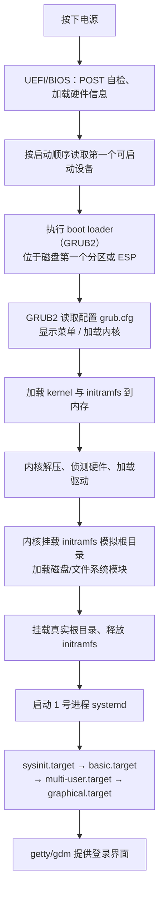
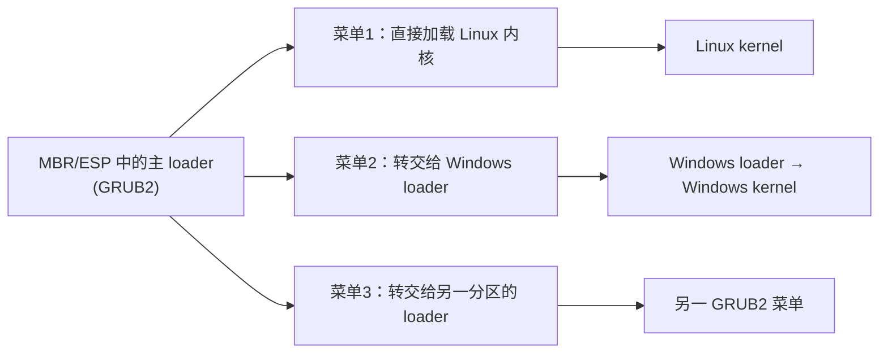

# 第十九章 开机流程、模块管理与Loader

> [!info] 关于本章
> 本章以鸟哥《Linux 私房菜 — 基础学习篇》第十九章（CentOS 7 版）为骨架，已更新到当前 **Rocky/AlmaLinux 9 / RHEL 9** 状态：内核 **5.14.x**、固件默认 **UEFI + Secure Boot**、分区表默认 **GPT**、默认文件系统 **XFS**、初始化系统 **systemd**、镜像构建工具 **dracut**。术语统一为大陆通行写法（核心→内核、模组→模块、登入→登录、程式→程序/进程按语境区分）。

开机是一项复杂的流程：内核要侦测硬件并加载驱动，再调用用户空间的第一个程序准备好运行环境，最后才交给用户登录。理解开机流程，才能在系统无法启动时快速修复，也才能配置多重操作系统的多重开机。本章关键工具是 **GRUB2**（开机管理程序）与内核模块管理命令。

## 19.1 Linux 的开机流程分析

忘记 root 密码怎么救援？默认图形界面如何在开机时强制进入纯文本模式？`/etc/fstab` 写错导致根目录无法挂载，如何不重装就修复？这些都要先搞清楚开机流程。

### 19.1.1 开机流程一览

以 x86 个人电脑为例，从按下电源到出现登录界面，大致经历以下阶段：



> [!note] 名词约定
> - **BIOS**：本章泛指固件，既包含传统 BIOS 也包含 **UEFI**；当前主流已是 UEFI。
> - **MBR / boot sector**：传统 MBR 分区表里存放 boot loader 的第一个扇区；**GPT** 为了兼容也保留了一块类似区域。本章用「MBR / boot sector」泛指「磁盘上可安装 boot loader 的最前区块」。

### 19.1.2 UEFI/BIOS、boot loader 与 kernel 加载

**第一阶段：固件自检**

开机后系统先加载固件（UEFI 或传统 BIOS），读取 CMOS 中的硬件设置（CPU 与外设通信频率、启动设备顺序、硬盘信息、系统时间、I/O 地址、IRQ 中断等），并执行 **POST（Power-on Self Test，开机自检）**，再做硬件初始化与 PnP 设备枚举，最后按设置顺序读取第一个可启动设备。

**第二阶段：boot loader**

固件本身只认识设备的最前几个扇区，并不懂文件系统格式。因此需要一个叫 **boot loader** 的程序，由它去识别文件系统、找到内核文件并加载。boot loader 安装在启动设备的第一个扇区（传统 MBR 或 GPT 的兼容区块 / UEFI 的 ESP 分区）。

> [!tip] 固件如何读 MBR？
> 传统 BIOS 通过硬件 **INT 13 中断**读取第一扇区——只要 BIOS 能识别该磁盘（无论 SATA、SAS、NVMe），就能读出其中的 boot loader。UEFI 则更直接：它原生识别 **FAT 格式的 ESP（EFI System Partition）**，从 ESP 中读取 `.efi` 程序执行。所以 UEFI 不再依赖 INT 13，而是直接读文件。

**boot loader 的三大功能**

- **提供菜单**：让用户选择不同的开机项（多重开机的核心功能）。
- **加载内核文件**：直接指向可启动的内核映像并启动操作系统。
- **转交控制权（chainload）**：将开机管理权转交给其他 boot loader。



![[vbird-4a1f575c2535f60b.gif]]
*图：boot loader 安装在 MBR / boot sector 与操作系统的关系*

![[vbird-51441d2f5d6dc293.gif]]
*图：开机管理程序的菜单与控制权转交功能*

> [!warning] 为什么多重开机要「先装 Windows 再装 Linux」
> Windows 的 loader 默认**不具有转交控制权**的功能，会直接覆盖 MBR/ESP 中已有的 loader。而 Linux 的 GRUB2 既能加载自己的内核，也能通过 chainload 把控制权交给 Windows。所以先装 Windows、再装 Linux，最终 MBR/ESP 里留下的是 GRUB2，才能在菜单里同时选择两者。

**第三阶段：加载内核与 initramfs**

boot loader 把内核文件加载到内存并解压执行，内核开始接管系统，重新侦测硬件并加载驱动。内核文件位于 `/boot/` 下，命名为 `/boot/vmlinuz-<版本>`：

```bash
ls --format=single-column -F /boot
# config-5.14.0-284.el9.x86_64          内核编译时的功能与模块配置
# grub2/                                GRUB2 相关文件目录
# initramfs-5.14.0-284.el9.x86_64.img   正常开机的虚拟文件系统
# initramfs-0-rescue-*.img              救援用的虚拟文件系统
# System.map-5.14.0-284.el9.x86_64      内核符号与内存地址对应表
# vmlinuz-5.14.0-284.el9.x86_64         内核文件本身（最重要）
```

**为什么需要 initramfs？**

内核模块放在 `/lib/modules/<版本>/kernel/` 下，必须挂载根目录后才能读取。但如果内核本身不认识根目录所在磁盘（如 SATA/NVMe/RAID/LVM 的驱动是模块），就陷入了「要加载磁盘驱动必须先挂载根目录、要挂载根目录必须先有磁盘驱动」的死循环。

**initramfs（Initial RAM Filesystem）** 解决了这个问题：它由 boot loader 加载到内存，解压后模拟成一个临时根目录，里面预置了开机必需的内核模块（磁盘接口、文件系统、RAID、LVM、加密等）。内核挂载这个临时根目录、加载所需驱动后，再切换到真实的根目录。

![[vbird-d0ac22deffb161b1.webp]]
*图：UEFI/BIOS、boot loader 与内核加载流程*

> [!note] 现代 XFS 已编入内核
> RHEL 9 / Rocky 9 中 **XFS 文件系统驱动是直接编入内核的**（非模块），所以根目录若是 XFS，本身不会有问题；但磁盘控制器驱动（NVMe、SATA、RAID 卡）、LVM、LUKS 等仍需通过 initramfs 加载。无论如何，现代发行版默认都会生成 initramfs，没有它几乎无法正常开机。

可以用 `lsinitrd` 查看 initramfs 内容：

```bash
lsinitrd /boot/initramfs-$(uname -r).img | head -40
# 输出开头是早期 CPIO 镜像（含 CPU 微码 microcode），
# 之后是 dracut 模块列表（bash、systemd init 等），
# 最后是完整的文件清单，其中关键链接：
#   init -> usr/lib/systemd/systemd
```

从输出可以看到，initramfs 是一个微型根目录，其中的 `init` 指向 `systemd`，开机过程也由 systemd 通过 `initrd.target` 驱动，加载基本模块后再 `switch_root` 到真正的根目录。

内核完整加载后，就开始启动用户空间的第一个进程：**systemd**。

### 19.1.3 第一个程序 systemd 与 default.target

内核完成硬件侦测和驱动加载后，会主动启动第一个用户空间进程 **systemd**（PID = 1）。systemd 的任务是准备软件运行环境：主机名、网络、语系、文件系统、各项服务。所有动作通过默认启动目标 `/etc/systemd/system/default.target` 统一编排。systemd 已不再使用 SystemV 时代的 runlevel 概念，但为兼容保留了对应映射。

**target 与 runlevel 对应**

| SystemV runlevel | systemd target | 含义 |
|---|---|---|
| 0 | `poweroff.target` | 关机 |
| 1 | `rescue.target` | 单用户救援模式 |
| 2、3、4 | `multi-user.target` | 多用户文本模式 |
| 5 | `graphical.target` | 多用户图形模式 |
| 6 | `reboot.target` | 重启 |

常用切换命令对照：

| SystemV | systemd 等价 |
|---|---|
| `init 0` | `systemctl poweroff` |
| `init 1` | `systemctl rescue` |
| `init 3` | `systemctl isolate multi-user.target` |
| `init 5` | `systemctl isolate graphical.target` |
| `init 6` | `systemctl reboot` |

**systemd 的处理流程**

取得 `default.target`（通常是 `graphical.target` 或 `multi-user.target`）后，systemd 会读取两处 wants 目录决定要加载的 unit：

- `/etc/systemd/system/<target>.target.wants/`：管理员自行启用（enable）的 unit
- `/usr/lib/systemd/system/<target>.target.wants/`：发行版默认加载的 unit

```ini
# /usr/lib/systemd/system/graphical.target 节选
[Unit]
Description=Graphical Interface
Requires=multi-user.target
After=multi-user.target
Conflicts=rescue.target
Wants=display-manager.service
AllowIsolate=yes
```

这说明 `graphical.target` 必须在 `multi-user.target` 完成之后才能进行，并且最终还要启动 `display-manager.service`（如 `gdm`）。

> [!tip] 查看完整启动依赖树
> `systemctl list-dependencies graphical.target` 会递归列出该 target 启动所需的所有服务，是理解 systemd 启动流程最直观的命令。

### 19.1.4 systemd 执行 sysinit.target 与 basic.target

`sysinit.target` 负责系统初始化，几乎所有操作环境都要经过它，主要工作包括：

- **特殊文件系统挂载**：`dev-hugepages.mount`、`dev-mqueue.mount` 等，挂载后会在 `/dev` 下生成对应目录。
- **特殊文件系统启用**：RAID、iSCSI、LVM、multipath 等在此检测与激活。
- **开机动画与消息**：`plymouthd` + `plymouth`（图形启动动画）。
- **日志服务**：`systemd-journald`。
- **加载额外内核模块**：依据 `/etc/modules-load.d/*.conf`。
- **应用内核参数**：依据 `/etc/sysctl.conf` 与 `/etc/sysctl.d/*.conf`。
- **乱数生成器**：`systemd-random-seed`，供加密运算使用。
- **console 字体设置**。
- **动态设备管理**：启动 `systemd-udevd`（设备命名与热插拔的核心服务）。

`basic.target` 接在 sysinit 之后，构建最基础的操作系统环境，主要内容：

- **音频驱动**：ALSA 相关。
- **防火墙**：`firewalld`（RHEL 9 默认；底层是 **nftables**，不再是 iptables）。
- **CPU 微码加载**：`microcode.service`。
- **SELinux 安全上下文**：从 disable 切到 enable、或要求重新打标时在此阶段处理。
- **开机信息落盘**：将启动日志写入 `/var/log/dmesg`。
- **加载管理员自定义模块**：`/etc/sysconfig/modules/*.modules` 与 `/etc/rc.modules`。
- **timer 单元**：systemd 原生定时任务。

完成 basic.target 后，系统已具备基本运行能力，接下来加载各类服务。

### 19.1.5 systemd 启动 multi-user.target 下的服务

服务器与网络服务大多挂在 `multi-user.target` 下。unit 文件分布在两个目录：

- `/usr/lib/systemd/system/`：发行版自带的服务单元
- `/etc/systemd/system/`：管理员自定义或覆盖的单元

通过 `systemctl enable/disable` 实际就是在 `/etc/systemd/system/<target>.target.wants/` 下创建或删除符号链接：

```bash
systemctl disable vsftpd.service
# rm '/etc/systemd/system/multi-user.target.wants/vsftpd.service'

systemctl enable vsftpd.service
# Created symlink /etc/systemd/system/multi-user.target.wants/vftpd.service -> /usr/lib/systemd/system/vsftpd.service
```

> [!note] 多数服务并行启动
> systemd 会根据 unit 之间的 `Requires=` / `After=` 关系并行启动服务，而不是 SystemV 时代严格的串行启动。这就是 systemd 启动速度快得多的根本原因。

**兼容 SystemV 的 rc-local.service**

过去把开机要执行的命令写入 `/etc/rc.d/rc.local` 即可。systemd 推荐改写为独立的 unit 并 `systemctl enable`，但仍然兼容 `rc-local.service`：只要 `/etc/rc.d/rc.local` **具有可执行权限**（`chmod a+x`），服务就会自动启用。

```bash
chmod a+x /etc/rc.d/rc.local
systemctl daemon-reload
systemctl list-dependencies multi-user.target | grep rc-local
# └─rc-local.service   # 已纳入启动流程
```

**提供 tty 与登录服务**

`multi-user.target` 下还包含 `getty.target`（虚拟终端 tty1~tty6）以及 `systemd-logind.service`、`systemd-user-sessions.service` 等登录相关服务。

> [!tip] 开机后输入正确账密却登不进？
> 因为服务是并行启动的，有时候 `getty` 先就绪、屏幕已经出现 tty1 提示登录，但 `systemd-logind` / `systemd-user-sessions` 还没起来。这时即使输入正确密码也会被拒绝，等十几秒后再试就能进。

### 19.1.6 systemd 启动 graphical.target 下的服务

`default.target` 若是 `multi-user.target` 则跳过本步。若是 `graphical.target`，systemd 会额外启动图形会话管理器（Display Manager），如 **`gdm.service`**（GNOME）、`sddm`（KDE）、`lightdm` 等，提供图形登录界面。

```bash
systemctl list-dependencies graphical.target
# 比起 multi-user.target，主要多了：
#   ├─accounts-daemon.service   账号管理
#   ├─gdm.service               图形登录管理器（执行文件 /usr/sbin/gdm）
#   └─rtkit-daemon.service      实时调度授权
```

要在两者之间临时切换：`systemctl isolate multi-user.target`（图形→文本）或 `systemctl isolate graphical.target`（文本→图形）。

### 19.1.7 开机过程用到的主要配置文件

**模块相关**

| 路径 | 作用 |
|---|---|
| `/etc/modules-load.d/*.conf` | 仅指定要加载的模块名，每行一个 |
| `/etc/modprobe.d/*.conf` | 给模块附加参数，例如 `options nf_conntrack_ftp ports=555` |

```bash
# 让 nf_conntrack_ftp 模块开机自动加载
echo "nf_conntrack_ftp" > /etc/modules-load.d/vbird.conf

# 因为改用了非标准端口 555，附加参数
cat > /etc/modprobe.d/vbird.conf <<'EOF'
options nf_conntrack_ftp ports=555
EOF

# 立即生效（不必重启）
systemctl restart systemd-modules-load.service
lsmod | grep nf_conntrack_ftp
```

**/etc/sysconfig/ 下常见文件**

| 文件 | 说明 |
|---|---|
| `authconfig` | 用户身份验证机制（本地 `/etc/shadow` 的加密算法、是否用 NIS/LDAP）。**不要手动改**，用 `authselect` 命令（RHEL 9 已用 authselect 取代旧版 authconfig-tui） |
| `cpupower` | `cpupower.service` 读取此文件配置 CPU 调频策略 |
| `firewalld` | firewalld 启动参数 |
| `network-scripts/` | 旧式网卡配置（ifcfg-*）；RHEL 9 默认使用 **NetworkManager**（`nmcli` / `nmtui`），ifcfg 仅作兼容 |

## 19.2 内核与内核模块

内核（kernel）是开机流程中负责驱动硬件的核心。内核一般是压缩映像，使用前要先解压加载内存。为了应对不断更新的硬件，现代内核都支持**模块化**：把驱动编译成 `.ko` 文件（kernel object），按需加载，不必重编整个内核。

**内核与模块的位置**

| 内容 | 路径 |
|---|---|
| 内核本身 | `/boot/vmlinuz` 或 `/boot/vmlinuz-<版本>` |
| 内核解压所需 RAM Disk | `/boot/initramfs-<版本>.img` |
| 内核模块 | `/lib/modules/<版本>/kernel/` |
| 内核源码（默认不装） | `/usr/src/kernels/` |

**内核运行时信息**

| 内容 | 路径 |
|---|---|
| 内核版本 | `/proc/version` |
| 内核功能参数 | `/proc/sys/kernel/` |

遇到内核不认识的新硬件，两条路：① 重新编译内核把驱动编进去（重，下章讨论）；② 让厂商提供 `.ko` 模块，开机时加载。本章只讲如何加载**已存在**的模块。

### 19.2.1 内核模块与相依性

内核模块位于 `/lib/modules/$(uname -r)/kernel/`，常见子目录：

| 目录 | 内容 |
|---|---|
| `arch/` | 与硬件平台相关（CPU 架构等） |
| `crypto/` | 加密算法（md5、aes、sha 等） |
| `drivers/` | 硬件驱动（显卡、网卡、PCI 设备等） |
| `fs/` | 文件系统（vfat、nfs、ext4 等） |
| `lib/` | 通用函数库 |
| `net/` | 网络协议栈、netfilter/nftables 模块 |
| `sound/` | 音频模块 |

模块之间存在依赖（A 用到 B 的符号，必须先加载 B）。手工维护不现实，于是有了依赖关系数据库 `/lib/modules/$(uname -r)/modules.dep`，由 **`depmod`** 命令生成：

```bash
depmod [-Ane]
# 无参数：扫描所有模块，重建 modules.dep
# -A：只搜索比 modules.dep 更新的模块
# -n：不写入，输出到屏幕
# -e：显示不可执行的模块名

# 范例：自编网卡驱动 a.ko 放入标准目录后更新依赖
cp a.ko /lib/modules/$(uname -r)/kernel/drivers/net
depmod
```

> [!note] 模块文件后缀
> 内核模块一律以 `.ko`（或压缩形式 `.ko.xz` / `.ko.zst`）结尾。`modules.dep` 记录每个模块及其依赖链，是 `modprobe` 工作的基础——务必在新增模块后执行 `depmod`。

### 19.2.2 内核模块的观察

**lsmod：列出已加载的模块**

```bash
lsmod
# Module                  Size  Used by
# nf_conntrack_ftp       18638  0
# nf_conntrack          105702  1 nf_conntrack_ftp     ← 被 ftp 模块使用
# drm                   311588  4 qxl,ttm,drm_kms_helper
```

输出三列：模块名、大小、被哪些模块使用（Used by）——可见模块确有依赖关系。

**modinfo：查看模块详情**

```bash
modinfo [-F field] [module_name|filename]
# -F：指定字段（author/description/license/parm/depends/alias）
# -a：仅作者  -d：仅描述  -l：仅授权  -n：仅完整路径

modinfo drm
# filename:    /lib/modules/5.14.0-284.el9.x86_64/kernel/drivers/gpu/drm/drm.ko
# license:     GPL and additional rights
# description: DRM shared core routines
# depends:     i2c-core
# signer:      Rocky Enterprise Software Foundation
# ...
```

`modinfo` 既能查已加载的模块，也能直接看某个 `.ko` 文件，对自编模块很有用。

### 19.2.3 内核模块的加载与移除

加载方式有两种，**推荐 `modprobe`**：

| 命令 | 行为 |
|---|---|
| `insmod <完整路径/模块.ko>` | 手工加载，**不处理依赖**；必须给出完整文件名 |
| `modprobe <模块名>` | 自动查 `modules.dep` 解决依赖后加载，只需模块名 |
| `rmmod <模块名>` | 移除模块（不处理依赖） |
| `modprobe -r <模块名>` | 移除模块（连同依赖） |

```bash
# insmod 必须给完整路径，且不解决依赖
insmod /lib/modules/$(uname -r)/kernel/fs/fat/fat.ko
lsmod | grep fat        # 成功
rmmod fat

# vfat 依赖 fat，直接 insmod 会失败：
insmod /lib/modules/$(uname -r)/kernel/fs/fat/vfat.ko.xz
# insmod: ERROR: could not insert module ... Unknown symbol in module

# modprobe 自动处理依赖，且不需要知道路径
modprobe vfat           # 一次成功
modprobe -r vfat        # 移除
```

**例题**：用 `modprobe` 加载 `cifs` 并观察它依赖哪些模块。

```bash
modprobe cifs
lsmod | grep cifs
# cifs                  456500  0
# dns_resolver           13140  1 cifs     ← 还用到了 dns_resolver
modprobe -r cifs
```

### 19.2.4 内核模块的额外参数

如需给模块附加参数，写一个 `.conf` 到 `/etc/modprobe.d/`，语法 `options <模块> <参数>=<值>`，详见 [19.1.7](#1917-开机过程用到的主要配置文件)。

## 19.3 Boot Loader：GRUB2

boot loader 是加载内核的关键工具。当前主流 Linux 发行版（含 RHEL / Rocky / AlmaLinux / Fedora / Ubuntu / Debian）都使用 **GRUB2**。本节聚焦 GRUB2 的配置与维护。

### 19.3.1 boot loader 的两个阶段

MBR 或 ESP 分区容纳的扇区空间非常小（MBR 里 boot loader 部分只有 446 字节），放不下完整的 loader 代码与配置。因此 GRUB2 分两阶段工作：

| 阶段 | 位置 | 任务 |
|---|---|---|
| **Stage 1** | MBR 或 ESP（`.efi` 程序） | 安装最小主程序，仅负责把 Stage 2 加载进来 |
| **Stage 2** | 文件系统内（`/boot/grub2/`） | 读取配置文件 `grub.cfg`、文件系统定义与各种模块 |

`/boot/grub2/` 关键内容：

| 文件 / 目录 | 说明 |
|---|---|
| `grub.cfg` | **主配置文件，最重要**（自动生成，不要手改） |
| `grubenv` | 环境变量块（如上次启动项） |
| `device.map` | 设备映射 |
| `fonts/` `themes/` `locale/` | 字体、主题、语系 |
| `i386-pc/`（BIOS）或 `x86_64-efi/`（UEFI） | 平台相关模块（`.mod`） |

每个 `.mod` 提供一种能力：`ext2.mod`、`xfs.mod` 是文件系统模块；`part_gpt.mod`、`part_msdos.mod` 是分区表模块；`chain.mod` 用于 chainload。GRUB2 按需 `insmod` 加载这些模块。

### 19.3.2 GRUB2 的配置文件 grub.cfg

GRUB2 的优点：识别大量文件系统、菜单可在线编辑（类似 bash 命令行）、修改 `grub.cfg` 后下次开机即生效（不必重装主程序）。

**GRUB2 的磁盘代号**

GRUB2 对磁盘的命名与 Linux 完全不同：

```
(hd0,1)         通用写法，自动判断分区格式
(hd0,msdos1)    MBR 分区
(hd0,gpt1)      GPT 分区
```

规则要点：

- 用小括号 `( )` 包起来
- 磁盘以 `hd` 开头，编号**从 0 开始**（按 BIOS/UEFI 检测顺序）
- 分区编号**从 1 开始**（与旧版 grub 不同，旧版也从 0 开始）
- 同一颗磁盘可写成 `(hd0)`，第一个分区写成 `(hd0,1)`

| 检测顺序 | GRUB2 代号示例 |
|---|---|
| 第 1 颗（MBR） | `(hd0)` `(hd0,msdos1)` `(hd0,msdos2)` … |
| 第 2 颗（GPT） | `(hd1)` `(hd1,gpt1)` `(hd1,gpt2)` … |
| 第 3 颗 | `(hd2)` `(hd2,1)` `(hd2,2)` … |

> [!warning] 磁盘编号会随启动顺序变化
> `(hdN)` 的 N 取决于固件检测顺序——在 UEFI 设置里调整启动顺序后，N 可能改变。配置时务必留意。

**grub.cfg 结构（不要手改，只需看懂）**

```bash
# grub.cfg 由 /etc/grub.d/ 下脚本拼装而成，节选关键段：
### BEGIN /etc/grub.d/00_header ###
set timeout_style=menu
set timeout=5
### END /etc/grub.d/00_header ###

### BEGIN /etc/grub.d/10_linux ###
menuentry 'Rocky Linux 9.3, with Linux 5.14.0-284.el9.x86_64' ... {
    load_video
    set gfxpayload=keep
    insmod gzio
    insmod part_gpt
    insmod xfs
    set root='hd0,gpt2'
    search --no-floppy --fs-uuid --set=root 94ac5f77-cb8a-495e-...
    linux16 /vmlinuz-5.14.0-284.el9.x86_64 root=/dev/mapper/rl-root ro \
            rd.lvm.lv=rl/root rd.lvm.lv=rl/swap crashkernel=auto \
            resume=/dev/mapper/rl-swap rhgb quiet
    initrd16 /initramfs-5.14.0-284.el9.x86_64.img
}
### END /etc/grub.d/10_linux ###
```

每个 `menuentry` 块里三个关键行：

- **`set root='hd0,gpt2'`**：GRUB2 的根——指 `grub.cfg` 与内核文件所在的分区，**不是** Linux 的根目录。如果 `/boot` 是独立分区，则指向 `/boot` 分区。
- **`linux16 /vmlinuz-... root=/dev/mapper/rl-root ...`**：内核文件路径 + 内核命令行参数。后面的 `root=` 才是 Linux 的根目录设备（可以是设备名、UUID 或 LABEL）。

> [!note] `linux16` 还是 `linuxefi`？
> 在传统 BIOS 系统上，GRUB2 用 `linux16` / `initrd16` 加载内核；在 **UEFI 系统**上改用 `linuxefi` / `initrdefi`（或较新版本统一为 `linux` / `initrd`）。`grub2-mkconfig` 会根据平台自动选择，不必手改。

> [!tip] `/boot` 是否独立分区影响路径
> 若 `/boot` 是独立分区，内核文件相对该分区就是 `/vmlinuz-xxx`；若未独立分区（`/boot` 只是根目录下的子目录），则相对根分区是 `/boot/vmlinuz-xxx`。`linux` 行的路径要与 `set root` 搭配才是完整的绝对路径。

### 19.3.3 GRUB2 配置维护：/etc/default/grub 与 /etc/grub.d

`grub.cfg` 内容庞大复杂，官方**不建议手改**。正确做法是修改两处来源后用 `grub2-mkconfig` 重新生成。

**主环境配置：`/etc/default/grub`**

```bash
cat /etc/default/grub
GRUB_TIMEOUT=5                    # 菜单倒数秒数（0 不等；-1 强制选择）
GRUB_DISTRIBUTOR="$(sed 's, release .*$,,g' /etc/redhat-release)"
GRUB_DEFAULT=saved                # 默认启动项：saved / 数字 / --id 名
GRUB_DISABLE_SUBMENU=true         # 是否隐藏子菜单
GRUB_TERMINAL_OUTPUT="console"    # 输出终端：console / serial / gfxterm
GRUB_CMDLINE_LINUX="rd.lvm.lv=rl/root rd.lvm.lv=rl/swap crashkernel=auto \
                    resume=/dev/mapper/rl-swap rhgb quiet"
GRUB_DISABLE_RECOVERY="true"      # 是否禁用救援菜单
```

常用项：

| 变量 | 作用 |
|---|---|
| `GRUB_TIMEOUT` | 菜单等待秒数；填 `0` 不等待，`-1` 必须手动选择 |
| `GRUB_TIMEOUT_STYLE` | `menu`（默认，显示菜单）/ `countdown`（显示倒数）/ `hidden`（隐藏） |
| `GRUB_DEFAULT` | 默认启动项；可填数字（从 0 编号）、`--id` 字符串，或 `saved`（配合 `grub2-set-default`） |
| `GRUB_CMDLINE_LINUX` | 内核命令行附加参数；例如追加 `elevator=deadline` 切换 I/O 调度器 |

**例题**：希望菜单等待 40 秒、默认用第一个菜单、菜单显示出来、给内核附加 `elevator=deadline`。

```bash
vim /etc/default/grub
# GRUB_TIMEOUT=40
# GRUB_DEFAULT=0
# GRUB_TIMEOUT_STYLE=menu
# GRUB_CMDLINE_LINUX="... rhgb quiet elevator=deadline"

# 重新生成 grub.cfg（注意路径！）
grub2-mkconfig -o /boot/grub2/grub.cfg

# 验证
grep -E 'timeout|default|linux' /boot/grub2/grub.cfg
```

> [!warning] grub2-mkconfig 的输出路径分平台
> 在 **BIOS** 系统和 **Rocky/RHEL 9** 的 UEFI 系统上，规范路径都是 `/boot/grub2/grub.cfg`。但在较旧的 RHEL 7/8 与某些发行版上，UEFI 系统的规范路径是 `/boot/efi/EFI/<distro>/grub.cfg`（`<distro>` 为 `rocky`、`almalinux`、`redhat`、`centos` 等）。执行 `grub2-mkconfig` 前请先 `ls /boot/grub2/grub.cfg /boot/efi/EFI/*/grub.cfg` 确认。

**菜单生成脚本：`/etc/grub.d/*`**

`grub2-mkconfig` 会按文件名数字顺序执行 `/etc/grub.d/` 下的脚本，把它们输出拼成 `grub.cfg`：

| 脚本 | 作用 |
|---|---|
| `00_header` | 初始化设置（环境、超时、菜单是否隐藏），读取 `/etc/default/grub` 中的变量 |
| `10_linux` | 扫描 `/boot`，为每个内核生成一个启动菜单 |
| `30_os-prober` | 探测其他分区中的操作系统（Windows 等）生成菜单；可用 `GRUB_DISABLE_OS_PROBER=true` 关闭 |
| `40_custom` | 管理员自定义菜单，手动添加 |

**直接指定内核开机**

直接给 Linux 内核追加参数的自定义菜单，复制 `grub.cfg` 里现成的 `menuentry` 到 `40_custom`，再修改即可。例如强制图形界面启动：

```bash
vim /etc/grub.d/40_custom
menuentry 'My graphical Rocky, with Linux 5.14.0-284.el9.x86_64' \
    --class rocky --class gnu-linux --class gnu --class os \
    --unrestricted --id 'mygraphical' {
    load_video
    set gfxpayload=keep
    insmod gzio
    insmod part_gpt
    insmod xfs
    set root='hd0,gpt2'
    search --no-floppy --fs-uuid --set=root 94ac5f77-cb8a-495e-...
    linux16 /vmlinuz-5.14.0-284.el9.x86_64 root=/dev/mapper/rl-root ro \
            rd.lvm.lv=rl/root rd.lvm.lv=rl/swap crashkernel=auto rhgb quiet \
            systemd.unit=graphical.target
    initrd16 /initramfs-5.14.0-284.el9.x86_64.img
}

grub2-mkconfig -o /boot/grub2/grub.cfg
```

> [!tip] 关键参数 `systemd.unit=<target>`
> 在内核命令行追加 `systemd.unit=graphical.target`（或 `rescue.target` / `multi-user.target`），可强制本次启动进入指定目标，无视 `default.target` 链接。这是开机菜单在线修改时最常用的参数。

**通过 chainloader 转交控制权**

chainloader 不需要认识内核文件，只是把控制权交给下一个分区的 boot sector：

```bash
menuentry "Windows" {
    insmod chain
    insmod ntfs
    set root=(hd0,1)      # Windows 所在分区
    chainloader +1        # 跳到该分区第一扇区执行 loader
}
```

### 19.3.4 initramfs 的重建：dracut

需要 initramfs 的典型场景：根目录在 SATA/NVMe/USB/SCSI 等接口磁盘、使用 LVM/RAID/LUKS、或根目录是非内核内建支持的文件系统。

> [!note] 现代 XFS 已内建
> RHEL 9 / Rocky 9 把 XFS 驱动直接编进内核，所以纯 XFS 根目录本身不依赖 initramfs；但 NVMe/RAID/LVM 等仍要靠 initramfs。发行版默认都会生成 initramfs，所以平时不必关心。

需要重建 initramfs 时，用 **`dracut`**（RHEL 9 推荐；`mkinitrd` 仍保留作兼容）：

```bash
dracut [-fv] [--add-drivers 模块列表] [--filesystems 列表] \
       [initramfs文件名] [内核版本]
# -f：覆盖已存在的 initramfs
# -v：显示详细过程
# --add-drivers：追加额外的内核模块
# --filesystems：追加文件系统支持

# 范例一：按默认重建一个测试镜像
dracut -v initramfs-test.img $(uname -r)

# 范例二：加入 e1000e 网卡驱动与 ext4/nfs 文件系统
dracut -v --add-drivers "e1000e" --filesystems "ext4 nfs" \
       initramfs-new.img $(uname -r)
lsinitrd initramfs-new.img | grep -E '(e1000|ext4|nfs)'
# 验证新增模块已打包进 initramfs
```

> [!tip] 内核升级后自动重建
> 通过 `dnf update` 升级内核时，post-install 脚本会自动调用 `dracut` 生成对应版本的 initramfs，无需手动处理。手动重建的常见场景：改了根目录位置（迁移到 LVM/RAID）、添加了特殊的硬件驱动、或 `initramfs` 文件损坏。

### 19.3.5 安装 GRUB2：grub2-install

系统原本就用 GRUB2 时，平时不需要重装。从其它 loader 迁移过来、或修复损坏的 GRUB2，才需要用 `grub2-install`：

```bash
grub2-install [--boot-directory=DIR] INSTALL_DEVICE
# INSTALL_DEVICE 写整盘（如 /dev/vda、/dev/sda、/dev/nvme0n1）→ 安装到 MBR 或 ESP
# 写单个分区（如 /dev/vda2）→ 安装到该分区的 boot sector

# 装到主磁盘（最常见的修复操作）
grub2-install /dev/sda
# Installation finished. No error reported.
```

> [!warning] UEFI 系统用 grub2-install 需谨慎
> 在 UEFI 系统上通常无需（也不建议）手动跑 `grub2-install`，应使用 `grub2-install --target=x86_64-efi` 并确保已挂载 ESP。修复 UEFI 启动更稳妥的做法是用安装介质进入救援模式后 `chroot`，再重装 `grub2-efi` 包：`dnf reinstall grub2-efi* grub2-common shim`。

**完整重装流程**

1. 若从其它 loader 迁移，先用 `grub2-install` 把主程序装到 MBR/ESP；
2. 编辑 `/etc/default/grub` 和 `/etc/grub.d/*`；
3. 用 `grub2-mkconfig -o /boot/grub2/grub.cfg` 生成配置文件。

### 19.3.6 开机菜单的在线编辑

GRUB2 最实用的功能之一是**在线编辑菜单参数**：在菜单界面按 `e` 进入编辑模式，可用方向键移动光标，直接修改 `linux` / `initrd` 行的参数，按 `Ctrl+X` 用修改后的参数启动，按 `Esc` 或 `Ctrl+C` 放弃返回。

修改只是临时生效（不写回 `grub.cfg`），重启后失效。这非常适合排查启动问题——比如让本次启动进入救援模式：在 `linux` 行末尾追加 `systemd.unit=rescue.target`，然后 `Ctrl+X`。

> [!warning] 救援模式也需要 root 密码
> systemd 时代的 `rescue.target` / `emergency.target` 与早期 SystemV 的 runlevel 1 不同：**默认要求输入 root 密码才能进入**。如果正是忘了 root 密码，要用下文 [19.4.1](#1941-忘记-root-密码rd-break) 的 `rd.break` 方式。

### 19.3.7 图形化开机画面

默认 `GRUB_TERMINAL_OUTPUT="console"` 是纯文本菜单。改成图形模式可在菜单显示中文（`gfxterm`），适合做带公司 logo 的定制启动画面：

```bash
vim /etc/default/grub
# GRUB_TERMINAL=gfxterm
# GRUB_GFXMODE=1024x768x24        # 分辨率×色深
# GRUB_GFXPAYLOAD_LINUX=keep      # 进入系统后保留图形模式

grub2-mkconfig -o /boot/grub2/grub.cfg
```

### 19.3.8 为菜单设置密码

GRUB2 支持两种身份：

| 身份 | 权限 |
|---|---|
| **superusers** | 可修改任意菜单参数、可启动任意菜单。一旦在配置里设置了 superusers，**所有菜单默认都需要认证** |
| **users**（普通） | 仅能启动授权给该用户的菜单，不能修改参数 |

每个 `menuentry` 可附加：

- `--unrestricted`：任何人都能启动（不需密码）
- `--users <用户名>`：仅指定用户（及 superusers）能启动
- 都不加：仅 superusers 能启动

**密码配置位置**

不要手改 `grub.cfg`，密码要写入 `/etc/grub.d/01_users`（注意：`/etc/grub.d/` 下是**可执行脚本**，要用 `cat` 输出内容；密码应使用 PBKDF2 加密形式）：

```bash
# 1. 生成加密密码
grub2-mkpasswd-pbkdf2
# 输入两次密码，复制输出中的 grub.pbkdf2.sha512.10000.xxx 整行

# 2. 写入脚本
cat > /etc/grub.d/01_users <<'EOF'
#!/bin/sh
cat << eof
set superusers="admin"
password_pbkdf2 admin grub.pbkdf2.sha512.10000.AAAA...
password_pbkdf2 alice grub.pbkdf2.sha512.10000.BBBB...
eof
EOF

chmod a+x /etc/grub.d/01_users
grub2-mkconfig -o /boot/grub2/grub.cfg
```

之后在 `40_custom` 里给某个菜单加 `--users alice`，就只有 alice 和 admin 能启动它。

> [!warning] 设置 superusers 后忘记给普通菜单加 --unrestricted 会无法开机
> 一旦设置了 `set superusers=...`，所有菜单默认受保护。若没有给日常启动菜单加 `--unrestricted`，菜单倒数结束后会卡在登录界面，必须输入 superusers 密码才能继续。`10_linux` 默认生成的菜单带 `--unrestricted`，所以一般安全；自定义菜单要留意。

## 19.4 开机过程的问题排查

### 19.4.1 忘记 root 密码：rd.break

systemd 的 `rescue.target` 需要 root 密码才能进入，所以「忘了 root 密码」不能再用老办法。正确做法是使用内核参数 **`rd.break`**：它在 initramfs 阶段就停下来，此时根目录以只读方式挂在 `/sysroot`，无需 root 密码就能拿到 root shell。

操作步骤：

1. 开机进入 GRUB2 菜单，按 `e` 编辑；
2. 在 `linux` / `linux16` / `linuxefi` 行末尾追加 `rd.break`，按 `Ctrl+X` 启动；
3. 进入 initramfs 的 emergency shell（提示符 `switch_root:/#`），执行：

```bash
switch_root:/# mount -o remount,rw /sysroot    # 把根目录挂成可读写
switch_root:/# chroot /sysroot                 # 切换到真实根目录
sh-4.2# echo "root:新密码" | chpasswd    # 改 root 密码
sh-4.2# touch /.autorelabel                    # 关键：让 SELinux 重新打标
sh-4.2# exit
switch_root:/# reboot
```

> [!note] 为什么必须 `touch /.autorelabel`？
> `rd.break` 环境没有 SELinux 运行。改了 `/etc/shadow` 后，该文件会丢失 SELinux 安全上下文。如果系统是 SELinux Enforcing 模式且不重新打标，将无法登录。`/.autorelabel` 让系统下次开机时自动重新写入所有文件的 SELinux type——但全盘重标会很慢。

**不想全盘重标的替代方案**：在 `rd.break` 下改完密码后，把 `/etc/selinux/config` 里的 `SELINUX=` 改为 `permissive` 再重启；正常登录后执行 `restorecon -Rv /etc` 修复上下文，最后改回 `enforcing` 并 `setenforce 1`。

### 19.4.2 直接以 root 进入 bash：init=/bin/bash

另一个救援手段是把 PID 1 直接换成 bash：在 `linux` 行末尾追加 `init=/bin/bash`，启动后会得到一个 root shell，同样不需要 root 密码。

```bash
# 启动后默认根目录是只读挂载，且 PATH 只有 /bin：
mount -o remount,rw /
# 改完需要的文件后
mount -o remount,ro /
# 因为没有 systemd/init，reboot 命令无效，只能用主机硬重启：
# exec /sbin/reboot -f   （或直接按物理 reset / 强制关机）
```

> [!warning] init=/bin/bash 同样要处理 SELinux
> 这种方式改了 `/etc/shadow` 后也必须处理 SELinux（同 19.4.1），否则会登不进系统。从可靠性看 `rd.break` 更稳。

### 19.4.3 文件系统错误导致无法开机

最常见的原因是 `/etc/fstab` 写错（比如 LVM/RAID/UUID 写错，又没先 `mount -a` 测试就重启），或异常断电导致文件系统不一致。

启动会卡在类似下面的提示：

```
*** An error occurred during the file system check.
*** Dropping you to a shell; the system will reboot
*** when you leave the shell.
Give root password for maintenance
(or press Control-D to continue):
```

输入 root 密码进入紧急 shell 后：

```bash
# 把根目录挂成可读写
mount -o remount,rw /

# 修正 /etc/fstab 中的错误条目
vim /etc/fstab

# 对出错的分区做文件系统检查（先卸载）
umount /dev/md0
# XFS 用：
xfs_repair /dev/md0
# ext4 用：
fsck.ext4 /dev/md0
# 检查过程中提示 clear [Y/N] 一律输 y
```

> [!tip] XFS 文件系统检查
> RHEL 9 默认 XFS。XFS 的检查/修复工具是 **`xfs_repair`**（不是 `fsck.xfs`，后者只是个调用 `xfs_repair` 的壳，且默认不操作已挂载的分区）。如果根目录本身损坏严重到无法修复，应从 Live USB/安装介质启动后抢救数据，再考虑重装。

## 19.5 重点回顾

- Linux 不能随意断电关机，否则容易造成文件系统错乱；
- 开机流程：**UEFI/BIOS → boot loader（GRUB2）→ kernel + initramfs → systemd**；
- boot loader 三大功能：**提供菜单、加载内核、转交控制权**；可安装在 MBR/ESP 或各分区的 boot sector；
- **initramfs** 提供开机所需的磁盘与文件系统模块，没有它现代发行版几乎无法启动；
- systemd 的入口由 `/etc/systemd/system/default.target` 决定；runlevel 与 target 一一对应；
- 模块加载相关配置在 `/etc/modules-load.d/*.conf`（仅加载）与 `/etc/modprobe.d/*.conf`（带参数）；
- 内核模块管理命令：`lsmod` / `modinfo` / `insmod` / `rmmod` / `modprobe` / `depmod`；
- `modprobe` 会查 `modules.dep` 自动处理依赖，是首选；
- GRUB2 配置位于 `/boot/grub2/grub.cfg`（RHEL/Rocky 9 上 UEFI 与 BIOS 一致），**不要手改**，改 `/etc/default/grub` 和 `/etc/grub.d/*` 后用 `grub2-mkconfig` 重建；
- GRUB2 磁盘代号：`(hdN)` 编号从 0 起、分区从 1 起；
- chainload 转交控制权的关键行：`chainloader +1`；
- 重建 initramfs 用 **`dracut`**；重装 GRUB2 用 **`grub2-install`**；
- 进入救援：在菜单按 `e` 给 `linux` 行追加 `rd.break` 或 `systemd.unit=rescue.target` 或 `init=/bin/bash`；
- 改了 `/etc/shadow` 后要 `touch /.autorelabel` 让 SELinux 重新打标，否则无法登录；
- GRUB2 可给每个菜单单独设密码（superusers / users + `--unrestricted` / `--users`）。

## 19.6 本章习题

**简答题**

1. 用 `rd.break` 改完 root 密码重启后，所有账号都无法登录，最可能的原因是什么？如何修复？
   - 多半是没建 `/.autorelabel` 且 SELinux 处于 Enforcing。重新进入 `rd.break`，`touch /.autorelabel` 后重启；或临时把 SELinux 设为 permissive，正常登录后 `restorecon -Rv /etc` 再切回 enforcing。

2. 某模块内核本已支持但默认未加载，希望开机自动加载，应写入哪个文件？
   - `/etc/modules-load.d/*.conf`（仅加载）；若需附加参数则写入 `/etc/modprobe.d/*.conf`。

3. 如何在 GRUB2 开机过程中临时强制进入文本模式（multi-user.target）？
   - 菜单按 `e` 编辑，在 `linux` 行末尾追加 `systemd.unit=multi-user.target`，按 `Ctrl+X` 启动。

4. 如果「先装 Linux 再装 Windows」导致 MBR/ESP 中的 GRUB2 被 Windows loader 覆盖，Linux 启动菜单丢失，如何挽救？
   - 用 Rocky/RHEL 安装 U 盘进入救援模式（`Troubleshooting → Rescue a Rocky system → Continue`），它会检测到根分区并提示 `chroot /mnt/sysroot`；`chroot` 后执行 `grub2-install` 与 `grub2-mkconfig -o /boot/grub2/grub.cfg` 重建 GRUB2 即可。

**情境模拟：使用救援介质修复无法启动的系统**

1. 用安装 U 盘启动，选 `Troubleshooting → Rescue a Rocky system`；
2. 选 `Continue` 让救援程序以可读写方式挂载检测到的根分区（也可选 `Read-Only` 只读检查）；
3. 多系统时会列出可救援的根，按需选择；
4. 提示 `chroot /mnt/sysimage` 时按提示进入 shell；
5. 用 `df` 检查挂载是否完整，缺的分区手动 `mount`；修复完成后 `exit` 退出 chroot，`reboot` 拔出 U 盘从硬盘启动。

## 19.7 延伸阅读

- [GRUB Manual（GNU 官方）](https://www.gnu.org/software/grub/manual/grub/grub.html)
- [Red Hat 9 文档：Managing the GRUB bootloader](https://docs.redhat.com/en/documentation/red_hat_enterprise_linux/9/html/managing_monitoring_and_updating_the_kernel/)
- [Red Hat 9 文档：Managing, monitoring, and updating the kernel（initramfs / dracut）](https://docs.redhat.com/en/documentation/red_hat_enterprise_linux/9/html/managing_monitoring_and_updating_the_kernel/)
- [systemd — Wikipedia](https://en.wikipedia.org/wiki/Systemd)
- [dracut.cmdline(7) 手册页](https://man7.org/linux/man-pages/man7/dracut.cmdline.7.html)
- [Power-on self-test — Wikipedia](https://en.wikipedia.org/wiki/Power-on_self-test)
