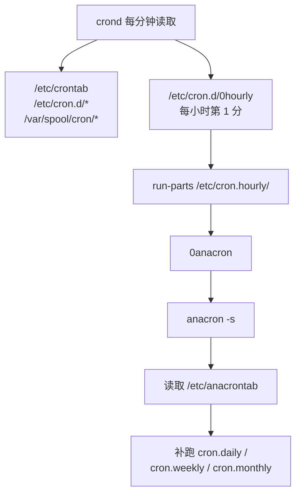

# 第十五章 周期性任务调度(crontab)

> [!info] 关于本章
> 本章以鸟哥《Linux 私房菜 — 基础学习篇》第十五章为骨架，已更新到当前 **Rocky/AlmaLinux 9 / RHEL 9** 状态，术语统一为大陆通行写法。关键现代化：补充 **systemd timer**（`.timer` 单元）作为当前推荐的定时任务方式之一；临时文件清理由 `systemd-tmpfiles` 取代旧版 `tmpwatch`；服务通过 `systemctl` 管理。CentOS 7 已于 2024-06-30 EOL，仅作历史对照。

Linux 经常需要"在指定时间自动执行某项任务"——定时备份、日志轮转、索引更新等。这类需求分两种：

- **突发性任务**：只执行一次（如明晚 23:00 关机），用 `at`。
- **周期性任务**：按固定周期重复执行（如每天凌晨备份），用 `crontab`。

此外，现代发行版还推荐使用 **systemd timer**（`.timer` 单元）作为更强大的方案。

## 15.1 什么是周期性任务调度

### 15.1.1 Linux 任务调度的种类：at、cron、systemd timer

| 类型 | 工具 | 守护进程/机制 | 特点 |
|---|---|---|---|
| 仅执行一次 | `at` | `atd` | 指定时间执行一次后结束 |
| 循环执行 | `crontab` | `crond`（cronie 软件包） | 按分/时/日/周/月/年周期重复 |
| 系统级定时 | `systemd timer` | `systemd` | 当前发行版推荐，精度到秒、支持依赖与失败重试 |

> [!note] crond 与 atd 默认状态
> Rocky/AlmaLinux 9 中 **cronie 默认安装且 `crond` 默认启用**；`at` 软件包默认可能已安装，但 **`atd` 通常需手动启用**：`systemctl enable --now atd`。

### 15.1.2 系统上常见的周期性任务

Linux 默认会自动执行一系列维护任务：

| 任务 | 作用 |
|---|---|
| **日志轮转（logrotate）** | 防止日志无限增长，定期切割、压缩、归档旧日志 |
| **日志分析（logwatch）** | 汇总系统日志，定时邮件通知管理员 |
| **locate 数据库更新** | `updatedb` 建立 `/var/lib/mlocate/`（新版多为 `plocate`）文件名索引，供 `locate` 快速查询 |
| **man page 数据库** | `mandb` 建立手册页索引 |
| **RPM 包数据库维护** | 记录软件包变更，便于追踪 |
| **清理临时文件** | 由 `systemd-tmpfiles` 定时清理 `/tmp`、`/var/tmp` 等过期文件 |
| **网络服务日志分析** | 如 Web 服务器日志统计、证书过期检查 |

> [!tip] 现代化：systemd-tmpfiles 取代 tmpwatch
> CentOS 7 时代清理临时文件用 `tmpwatch`；RHEL 9 / Rocky 9 已改用 **`systemd-tmpfiles`**（配置在 `/usr/lib/tmpfiles.d/` 与 `/etc/tmpfiles.d/`），由 `systemd-tmpfiles-clean.timer` 定时触发，功能更统一。

实际运行的任务数量与所装软件相关。可用 `systemctl list-timers` 查看当前所有定时任务（含 systemd timer 与部分 cron 入口）。

## 15.2 仅执行一次的任务调度

### 15.2.1 atd 的启动与 at 运行方式

使用 `at` 前需确保 `atd` 服务已运行：

```bash
systemctl enable --now atd   # 启用并立即启动 atd
systemctl status atd         # 查看状态（应显示 enabled 且 active running）
```

**at 的运行机制**：执行 `at TIME` 后，系统把任务以文本文件形式写入 `/var/spool/at/`，由 `atd` 守护进程在指定时间取回执行。

**访问控制**（按优先级判断，只匹配其一）：

| 顺序 | 文件 | 规则 |
|---|---|---|
| 1 | `/etc/at.allow` | 存在时，仅其中用户可用 `at`（最严格） |
| 2 | `/etc/at.deny` | `at.allow` 不存在时才检查，其中用户被禁用 |
| 3 | 都不存在 | 仅 `root` 可用 |

> [!note] 默认策略
> 多数发行版默认只保留一个空的 `/etc/at.deny`，即允许所有用户使用 `at`。要禁用某用户，把账号写入 `/etc/at.deny`（一行一个）即可。

### 15.2.2 实际运行单次任务

**基本语法**：

```bash
at [-mldv] TIME
at -c 工作编号
```

| 选项 | 作用 |
|---|---|
| `-m` | 任务完成后无论是否有输出，都发邮件通知 |
| `-l` | 列出当前用户的 at 任务（等同 `atq`） |
| `-d` | 删除一个任务（等同 `atrm`） |
| `-v` | 用更清晰的时间格式列出任务 |
| `-c` | 显示指定任务的完整指令内容 |

**时间格式**：

| 格式 | 示例 | 含义 |
|---|---|---|
| `HH:MM` | `04:00` | 今日该时刻；已过则明日 |
| `HH:MM YYYY-MM-DD` | `04:00 2026-08-04` | 指定年月日的时刻 |
| `HH:MM[am\|pm] [Month] [Date]` | `04pm July 30` | 自然语言指定 |
| `now + number [minutes\|hours\|days\|weeks]` | `now + 5 minutes` | 从当下推迟一段时间 |

**示例**：

```bash
# 5 分钟后把 /root/.bashrc 寄给 root
at now + 5 minutes
at> /bin/mail -s "testing at job" root < /root/.bashrc
at> <Ctrl+D>     # 按 Ctrl+D 结束输入，显示 <EOT>
job 2 at Thu Aug  4 19:35:00 2026

# 查看 2 号任务内容
at -c 2

# 2026-08-04 23:00 关机（一个任务可输入多条指令）
at 23:00 2026-08-04
at> /bin/sync
at> /sbin/shutdown -h now
at> <Ctrl+D>
```

> [!warning] 使用绝对路径
> `at` 会进入"下达 `at` 时所在工作目录"的 at shell 环境。建议指令一律使用**绝对路径**，避免因 `PATH` 与工作目录差异找不到文件（如在 `/tmp` 下 `at now` 输入 `mail -s "test" root < .bashrc`，`.bashrc` 指的是 `/tmp/.bashrc`）。

> [!tip] 输出去向
> `at` 任务的标准输出/错误**不会显示在终端**，而是发到执行者的 mailbox。想在终端显示，需重定向到对应终端设备，如 `echo "Hello" > /dev/tty1`。任务无输出时默认不发邮件；加 `-m` 则无论如何都发。

**任务管理**：

```bash
atq            # 查询所有 at 任务
atrm 3         # 删除 3 号任务
```

### batch：系统空闲时才执行

`batch` 本质是 `at` 的变体，唯一区别：**仅在 CPU 工作负载低于 0.8 时才执行**任务。

> [!note] 工作负载（load average）≠ CPU 使用率
> - **CPU 使用率**：CPU 被占用的时间比例。
> - **工作负载（load average）**：单位时间内 CPU 需处理任务数的平均值，含等待 I/O 的进程。
>
> 例如 1 个满载 CPU 的进程，使用率约 100%、负载约 1；两个这样的进程，使用率仍约 100%，负载约 2。用 `uptime` 查看 1/5/15 分钟平均负载。

```bash
# 系统负载降下来后才执行 updatedb
batch
at> /usr/bin/updatedb
at> <Ctrl+D>
```

> [!info] 整分钟检查
> `at`、`crontab`、`batch` 的最小时间单位都是**分钟**，`atd`/`crond` 每分钟检查一次任务队列。即便负载已低于阈值，也要等到下一个整分钟才触发。

## 15.3 循环执行的周期性任务调度

周期性任务由 `crond`（cronie 软件包）守护进程控制，默认开机自启。用户用 `crontab` 命令管理自己的任务。

### 15.3.1 用户的设置

**访问控制**（与 `at` 同理，只匹配其一）：`/etc/cron.allow` > `/etc/cron.deny` > 仅 `root` 可用。建议只保留一个文件，多数发行版默认保留空的 `/etc/cron.deny`。

> [!note] 任务存储位置
> 用户执行 `crontab -e` 后，任务以**账号名**为文件名存入 `/var/spool/cron/`（如用户 `dmtsai` 对应 `/var/spool/cron/dmtsai`）。**不要用 `vi` 直接编辑这些文件**——语法错误会导致任务不执行。每次执行的记录写入 `/var/log/cron`。

**crontab 命令**：

```bash
crontab [-u 用户名] [-l | -e | -r]
```

| 选项 | 作用 |
|---|---|
| `-u` | 仅 root 可用，代其他用户管理任务 |
| `-e` | 编辑任务 |
| `-l` | 列出任务 |
| `-r` | **删除所有任务**（删单个用 `-e` 编辑） |

**时间字段格式**（每行一条任务，共 6 个字段）：

| 字段 | 分钟 | 小时 | 日 | 月 | 周 | 指令 |
|---|---|---|---|---|---|---|
| 范围 | 0–59 | 0–23 | 1–31 | 1–12 | 0–7 | 命令 |

> [!note] 周字段
> 周字段 `0` 与 `7` 都表示**星期日**；也可用 `sun`、`mon` 等英文缩写。

**特殊字符**：

| 字符 | 含义 | 示例 |
|---|---|---|
| `*` | 任意时刻 | `* * * * *` 每分钟 |
| `,` | 分隔多个不连续值 | `0 3,6 * * *` 每天 3:00 与 6:00 |
| `-` | 连续范围 | `20 8-12 * * *` 8–12 点每小时的第 20 分 |
| `/n` | 每隔 n 单位 | `*/5 * * * *` 每 5 分钟 |

**示例**：

```bash
crontab -e
# 每天 12:00 发信给自己
0  12  *  *  * mail -s "at 12:00" dmtsai < /home/dmtsai/.bashrc
# 每年 5 月 1 日 23:59 生日提醒
59 23  1  5  * mail kiki < /home/dmtsai/lover.txt
# 每 5 分钟执行脚本
*/5 *  *  *  * /home/dmtsai/test.sh
# 每周五 16:30 发信提醒
30 16  *  *  5 mail friend@his.server.name < /home/dmtsai/friend.txt
```

```bash
crontab -l    # 查看任务
crontab -r    # 删除所有任务（谨慎！）
```

> [!warning] -r 会清空全部任务
> `crontab -r` 删除该用户的**所有**任务。只想删一项，用 `crontab -e` 删除该行。指令同样建议用**绝对路径**。

### 15.3.2 系统配置文件：/etc/crontab、/etc/cron.d/*

`crontab -e` 是 `/usr/bin/crontab` 命令（面向用户）；而 `/etc/crontab` 是纯文本文件（面向系统管理员），可用 `vim` 直接编辑。

`crond` 每分钟读取一次以下位置：

| 位置 | 用途 |
|---|---|
| `/etc/crontab` | 系统级周期任务 |
| `/etc/cron.d/*` | 各软件包自带的任务脚本 |
| `/var/spool/cron/*` | 用户任务 |

**/etc/crontab 内容**：

```bash
cat /etc/crontab
SHELL=/bin/bash
PATH=/sbin:/bin:/usr/sbin:/usr/bin
MAILTO=root

# .---------------- minute (0 - 59)
# |  .------------- hour (0 - 23)
# |  |  .---------- day of month (1 - 31)
# |  |  |  .------- month (1 - 12)
# |  |  |  |  .---- day of week (0 - 6) (Sunday=0 or 7)
# *  *  *  *  * user-name  command to be executed
```

> [!note] 与用户 crontab 的差异
> `/etc/crontab` 与 `/etc/cron.d/*` 中每行有 **7 个字段**——比用户 `crontab` 多一个**执行身份**字段（位于五个时间字段与指令之间）。`SHELL` 指定执行 shell，`PATH` 是可执行文件搜索路径，`MAILTO` 决定任务输出（STDOUT/STDERR）与错误通知的收件人。

**run-parts 与周期目录**：

`/etc/cron.d/0hourly` 在每小时第 1 分通过 `run-parts /etc/cron.hourly` 执行该目录下所有可执行脚本。

| 目录 | 执行方式 |
|---|---|
| `/etc/cron.hourly/` | crond 每小时通过 `run-parts` 执行 |
| `/etc/cron.daily/` | 由 anacron 每天执行 |
| `/etc/cron.weekly/` | 由 anacron 每周执行 |
| `/etc/cron.monthly/` | 由 anacron 每月执行 |

放在这些目录下的文件必须是**可直接执行**的脚本，而非"分时日月周"配置。

**配置落点建议**：

| 场景 | 推荐方式 |
|---|---|
| 个人任务 | `crontab -e` |
| 系统维护任务 | 编辑 `/etc/crontab` |
| 自开发软件自带任务 | 放 `/etc/cron.d/软件名` |
| 固定周期简单脚本 | 放 `/etc/cron.{hourly,daily,weekly,monthly}/` |

### 15.3.3 一些注意事项

**资源分配不均**：多个周期相同的耗资源任务若同时启动，会造成瞬时负载尖峰。应错开执行时间（注意逗号分隔的值之间不要留空格）：

```bash
# 把四个"每 5 分钟"的任务错开到不同分钟
1,6,11,16,21,26,31,36,41,46,51,56 * * * * root CMD1
2,7,12,17,22,27,32,37,42,47,52,57 * * * * root CMD2
3,8,13,18,23,28,33,38,43,48,53,58 * * * * root CMD3
4,9,14,19,24,29,34,39,44,49,54,59 * * * * root CMD4
```

**取消不必要的输出**：任务输出会发邮件给 `MAILTO`。若任务可能持续报错（如 DNS 探测时上层主机挂掉），用重定向丢弃输出：

```bash
*/3 * * * * root /usr/local/bin/ping.sh > /dev/null 2>&1
```

**安全检查**：木马常通过定时任务驻留。定期检查 `/var/log/cron`，确认没有来源不明的任务被执行。

> [!warning] 周与"日+月"不可同时并存
> `30 12 11 9 5 ...`（期望"9 月 11 日且为周五才执行"）这种写法**语义不确定**——cron 会按"每周五"和"每年 9 月 11 日"**各执行一次**，而非只在两者重合时执行。需要"具体日期且为某星期"的逻辑，应在脚本内自行判断。

## 15.4 可唤醒停机期间的任务：anacron

### 15.4.1 什么是 anacron

设想：某任务安排在每周日凌晨 2 点执行，但周六到周一期间机器关机——该任务就**永久错过**了。`anacron` 正是为此设计：**检测因关机等原因错过的周期任务，并在开机后补执行**。

`anacron` 不是守护进程，而是被 `crond` 每小时调用的程序（经 `/etc/cron.hourly/0anacron`）。它按天/周/月为周期，对比 `/var/spool/anacron/` 中的时间戳，发现过期未执行的任务就补跑。

> [!note] crontab vs anacron
> - `crontab` 是**定时**执行，错过即错过，不补。
> - `anacron` 是**定期**执行，会补跑停机期间错过的任务。
>
> 两者并行不冲突：放在 `/etc/crontab` 的任务错过不补；放在 `/etc/cron.daily/` 等目录的任务由 anacron 保证周期内补执行。

### 15.4.2 anacron 与 /etc/anacrontab

**anacron 语法**：

```bash
anacron [-sfn] [job]
anacron -u [job]
```

| 选项 | 作用 |
|---|---|
| `-s` | 串行执行各项工作，按时间戳判断是否执行 |
| `-f` | 强制执行，不看时间戳 |
| `-n` | 立即执行未完成任务，不延迟 |
| `-u` | 仅更新时间戳，不执行任务 |

**/etc/anacrontab 内容**：

```bash
cat /etc/anacrontab
SHELL=/bin/sh
PATH=/sbin:/bin:/usr/sbin:/usr/bin
MAILTO=root
RANDOM_DELAY=45           # 最大随机延迟（分钟）
START_HOURS_RANGE=3-22    # 允许执行的时间段

1        5       cron.daily    nice run-parts /etc/cron.daily
7        25      cron.weekly   nice run-parts /etc/cron.weekly
@monthly 45      cron.monthly  nice run-parts /etc/cron.monthly
# 天数   延迟    工作名称       实际指令
```

**四个字段含义**（以 `cron.daily` 为例）：

| 字段 | 值 | 含义 |
|---|---|---|
| 天数 | `1` | 距上次执行超过 1 天则触发 |
| 延迟时间 | `5` | 触发后随机延迟（叠加 `RANDOM_DELAY`）执行，避免资源冲突 |
| 工作名称 | `cron.daily` | 记入日志的任务名 |
| 指令 | `nice run-parts /etc/cron.daily` | 实际执行的命令 |

> [!note] 为什么隔段时间开机后磁盘狂转
> 开机约 1 小时后 `anacron` 被触发，它会补跑 `/etc/cron.daily/`、`/etc/cron.weekly/`、`/etc/cron.monthly/` 中停机期间错过的所有任务，因此会有一段时间磁盘繁忙。

**整体执行链路**：



## 15.5 现代化补充：systemd timer

> [!info] 当前发行版推荐：systemd timer
> RHEL 9 / Rocky 9 等现代发行版中，许多发行版内置任务已迁移到 **systemd timer**（`.timer` 单元）。相比 cron，它具备：精度到秒、支持任务依赖、失败自动重试、日志经 `journalctl` 查询、可用 `systemctl list-timers` 统一查看。

**最小示例**：编写 `.service` 定义任务、`.timer` 定义触发时间。

```ini
# /etc/systemd/system/backup.service
[Unit]
Description=Daily backup

[Service]
Type=oneshot
ExecStart=/usr/local/bin/backup.sh
```

```ini
# /etc/systemd/system/backup.timer
[Unit]
Description=Run backup daily

[Timer]
OnCalendar=daily            # 每天 00:00
Persistent=true             # 开机后补跑错过的执行（类似 anacron）

[Install]
WantedBy=timers.target
```

```bash
systemctl enable --now backup.timer   # 启用定时器
systemctl list-timers                 # 查看所有定时任务
systemctl status backup.timer         # 查看某个定时器状态
```

> [!tip] Persistent=true 等价 anacron
> `.timer` 中设置 `Persistent=true` 后，若关机期间错过了触发时间，开机会自动补执行——这正是 anacron 的功能。新部署的定时任务可优先考虑 systemd timer。

## 15.6 重点回顾

- `at` 用于单次任务，依赖 `atd` 服务；访问控制走 `/etc/at.allow` > `/etc/at.deny`；用 `atq`/`atrm` 管理任务。
- `batch` 与 `at` 相同，但仅在系统负载低于 0.8 时执行。
- `crontab` 用于循环任务，依赖 `crond` 服务；用户任务存于 `/var/spool/cron/`，每行 6 字段（分时日月周指令）。
- `/etc/crontab` 与 `/etc/cron.d/*` 为系统级配置，每行 7 字段（多一个**执行身份**字段）。
- `crond` 每分钟读取 `/etc/crontab`、`/etc/cron.d/*`、`/var/spool/cron/*`。
- 周与"日+月"不可同时并存；任务输出走 `MAILTO`，不重要输出重定向到 `/dev/null`。
- `anacron` 补跑停机期间错过的 `/etc/cron.{daily,weekly,monthly}/` 任务，配置在 `/etc/anacrontab`。
- 现代发行版推荐 **systemd timer**（`.timer` 单元），`Persistent=true` 可替代 anacron 的补跑功能；`systemd-tmpfiles` 取代旧版 `tmpwatch`。

## 15.7 本章习题

**简答题**

- 某脚本 `/usr/local/bin/ping.sh` 每 3 分钟执行一次，但输出过多导致 root 每天收到数百封邮件，如何处理？
  - 用数据流重导向丢弃不重要输出：`*/3 * * * * root /usr/local/bin/ping.sh > /dev/null 2>&1`。
- 下达 `crontab -e` 后输入 `* 15 * * 1-5 /usr/local/bin/tea_time.sh`，代表什么？有何问题？
  - 含义是"每周一至周五 15:00 的**每分钟**"各执行一次，共 60 次，通常是错误写法；应为 `30 15 * * 1-5 /usr/local/bin/tea_time.sh`。
- 用 `vim` 编辑 `/etc/crontab` 写入 `25 00 * * 0 /usr/local/bin/backup.sh`，为何无效？
  - `/etc/crontab` 每行**必须有执行身份字段**；应改为 `25 00 * * 0 root /usr/local/bin/backup.sh`。
- 每周六凌晨 3 点搜索系统中所有含 SUID/SGID 的文件，结果存入 `/tmp/uidgid.files`，如何写？
  - 在 `/etc/crontab` 中加：`0 3 * * 6 root find / -perm /6000 > /tmp/uidgid.files`。

## 延伸阅读

- [cron — Wikipedia](https://en.wikipedia.org/wiki/Cron)
- [anacron — Wikipedia](https://en.wikipedia.org/wiki/Anacron)
- [systemd.timer — 官方手册](https://www.freedesktop.org/software/systemd/man/systemd.timer.html)
- [crontab(5) — man page](https://man7.org/linux/man-pages/man5/crontab.5.html)
- [Rocky Linux 文档：cronie 定时任务](https://docs.rockylinux.org/10/guides/automation/cronie/)
