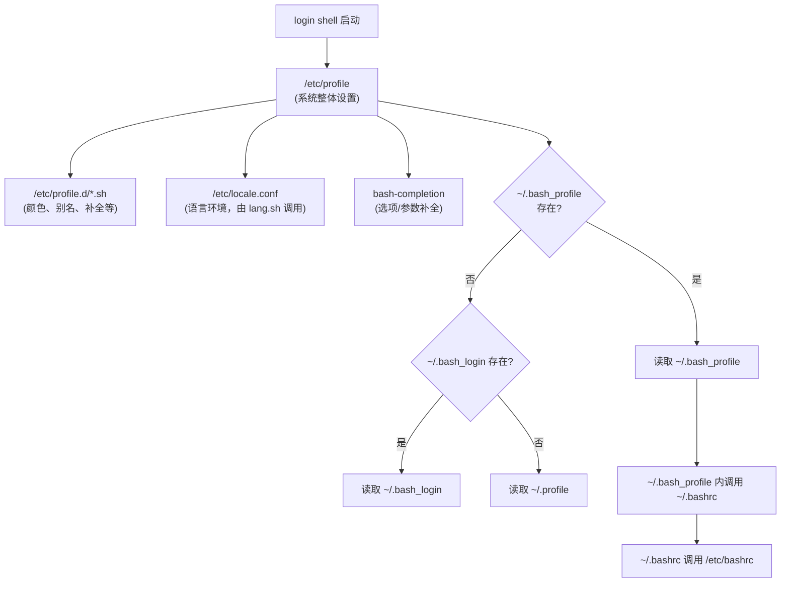

# 第十章 认识与学习BASH

> [!info] 关于本章
> 本章以鸟哥《Linux 私房菜 — 基础学习篇》第十章为骨架，已将原基于 CentOS 7（bash 4.2）的内容更新至 **Rocky/AlmaLinux 9（bash 5.1、内核 5.14）** 当前状态，术语统一为大陆通行写法。bash 语法本身高度稳定，本章绝大多数命令与示例在当前主流发行版上仍然适用。

在 Linux 环境下，终端机中输入的命令都是通过 bash 处理的。这一章是命令行操作与主机维护管理的重要基础。

## 10.1 认识 BASH 这个 Shell

操作系统的内核（kernel）是需要被保护的，普通用户只能通过 shell 与内核沟通，让内核控制硬件完成工作。

### 10.1.1 硬件、内核与 Shell

要让计算机输出"音乐"，需要三个条件：

1. **硬件**：声卡芯片等物理设备；
2. **内核管理**：操作系统能驱动该芯片；
3. **应用程序**：用户输入发声命令。

用户输入的命令通过 **shell** 传给内核，内核再控制硬件工作。

![[vbird-553f069554b444fb.webp]]
*图：硬件、内核与用户的关系*

操作系统是一组控制硬件、监测系统活动的软件。为防止误用导致系统崩溃，内核运行在受保护的内存区域；应用程序位于最外层，如同蛋壳，因此被称为**壳程序（shell）**。

> [!note] 狭义与广义 shell
> 凡能操作应用程序的接口都可称为 shell。狭义 shell 指命令行界面的程序（如 bash）；广义 shell 也包括图形界面程序。本章主要讨论 bash。

### 10.1.2 为何要学文本界面的 shell

- **跨发行版通用**：各发行版使用的 bash 几乎一致，掌握后可在不同发行版间无障碍切换。图形界面工具（如 Webmin）虽方便，但不同发行版设计各异，升级或换用其它包管理（tarball 而非 rpm）时易出问题。
- **远程管理更快更稳**：Linux 管理常通过远程连接进行，文本界面传输快、断线风险低、不易信息外泄。
- **系统管理的根本**：良好的 shell 脚本能力是管理主机的基础，借助数据流重定向与管道命令可在极短时间内分析多台主机的日志。

### 10.1.3 系统的合法 shell 与 /etc/shells

早年 Unix 年代发展出多种 shell，Linux 默认使用 **Bourne Again Shell（bash）**——Bourne Shell（sh）的增强版，基于 GNU 计划发展而来。

| shell | 说明 |
|---|---|
| **sh**（Bourne Shell） | 最早的 shell，已被 bash 取代 |
| **csh**（C Shell） | 语法类似 C 语言，BSD 系统流行；已被 tcsh 取代 |
| **tcsh** | csh 的增强版 |
| **ksh**（Korn Shell） | 商业 Unix 常用 |
| **bash**（Bourne Again SHell） | **Linux 默认 shell**，GNU 计划核心工具之一 |
| **zsh** | 功能丰富的现代 shell，macOS Catalina 起为默认 |

系统合法的 shell 列表写入 `/etc/shells`：

```bash
[dmtsai@study ~]$ cat /etc/shells
/bin/sh
/bin/bash
/sbin/nologin
/usr/bin/sh
/usr/bin/bash
/usr/sbin/nologin
```

> [!info] /etc/shells 的作用
> 系统某些服务（如 FTP）会检查用户可用的 shell；`/sbin/nologin` 是一个特殊 shell，让用户无法登录主机但可使用特定服务（如 FTP）。

用户登录后取得的 shell 记录在 `/etc/passwd` 每一行的最后一个字段：

```bash
[dmtsai@study ~]$ cat /etc/passwd
root:x:0:0:root:/root:/bin/bash
bin:x:1:1:bin:/bin:/sbin/nologin
daemon:x:2:2:daemon:/sbin:/sbin/nologin
```

`root` 的 shell 是 `/bin/bash`，系统账号 `bin`、`daemon` 等使用 `/sbin/nologin`。

### 10.1.4 Bash shell 的功能

bash 是 GNU 计划的重要工具，也是各 Linux 发行版的默认 shell。主要功能：

**命令历史（history）**

bash 能记忆使用过的命令，按 `↑`/`↓` 键即可调出前/后一条。默认记录约 1000 条（受 `HISTSIZE` 控制）。记录文件为 `~/.bash_history`——但它记录的是**上一次登录前**执行过的命令，本次登录所执行的命令暂存在内存中，注销后才写入。

> [!warning] 命令历史的安全风险
> 若被入侵，攻击者可翻阅你曾执行的命令；若命令行中含明文密码（如 MySQL 密码），风险极大。

**命令与文件补全（[Tab] 键）**

`[Tab]` 是 bash 的重要功能，能少打字并保证输入正确：

- `[Tab]` 接在命令的第一个字后面：命令补全；
- `[Tab]` 接在第二个字以后：文件补全；
- 安装 `bash-completion` 后，还可对命令的选项/参数补全。

**命令别名（alias）**

如 `alias lm='ls -al'`，为常用命令串自定义简短别名。

**作业控制（job control）**

可在前台/后台控制工作，单一登录环境达到多任务目的（详见进程管理章节）。

**脚本编程（shell scripts）**

将连续命令写入文件，结合变量、条件判断形成小型程序语言。

**通配符（wildcard）**

如 `ls -l /usr/bin/X*` 列出以 `X` 开头的文件。

### 10.1.5 查询命令是否为 bash 内建命令：type

`type` 用于判断命令是外部命令还是 bash 内建命令：

```bash
[dmtsai@study ~]$ type [-tpa] name
# 不加选项时，显示 name 是外部命令还是内建命令
# -t：以 file / alias / builtin 显示类型
# -p：name 为外部命令时显示完整文件名
# -a：列出 PATH 中所有含 name 的命令，包含 alias

[dmtsai@study ~]$ type ls
ls is aliased to `ls --color=auto'
[dmtsai@study ~]$ type -t ls
alias
[dmtsai@study ~]$ type -a ls
ls is aliased to `ls --color=auto'
ls is /usr/bin/ls
[dmtsai@study ~]$ type cd
cd is a shell builtin
```

`type` 也可像 `which` 一样查找命令，因为它只查找"可执行文件"。

### 10.1.6 命令的下达与快速编辑按键

命令过长时可用反斜线 `\` + `[Enter]` 换行继续输入（反斜线必须紧贴 `[Enter]`，中间不能有空格）。换行后系统会自动出现 `>` 提示符。

```bash
[dmtsai@study ~]$ cp /var/spool/mail/root /etc/crontab \
> /etc/fstab /root
```

常用快速编辑组合键：

| 组合键 | 功能 |
|---|---|
| `[Ctrl]+u` / `[Ctrl]+k` | 从光标处向前 / 向后删除命令串 |
| `[Ctrl]+a` / `[Ctrl]+e` | 光标移动到命令串最前 / 最后 |

登录后，Linux 根据 `/etc/passwd` 分配 shell（默认 bash），即可通过 `man` 查询命令用法。

## 10.2 Shell 的变量功能

Linux 是多用户多任务环境，变量（如 `MAIL`）让 bash 知道每个用户的邮件信箱路径。

### 10.2.1 什么是变量

变量就是**用一个字符串代表不固定的内容**。例如设定 `myname=VBird`，读取 `myname` 即得 `VBird`。

变量的好处：

- **可变性与方便性**：如 `MAIL` 变量，不同用户登录取得各自的 `MAIL`（`/var/spool/mail/用户名`），`mail` 命令只需读取 `MAIL` 变量即可分辨。
- **影响 bash 操作环境**：如 `PATH` 决定命令搜索路径；`HOME`、`SHELL` 等环境变量影响 shell 行为。
- **脚本编程的助手**：将易变值（如路径）定义为变量，修改一处即全局生效。

![[vbird-d13191a26f731caf.gif]]
*图：程序、变量与不同用户的关系*

### 10.2.2 变量的取用与设定：echo、设定规则、unset

**取用变量：echo**

变量取用时前面需加 `$`，或用 `${变量}`：

```bash
[dmtsai@study ~]$ echo $PATH
/usr/local/bin:/usr/bin:/usr/local/sbin:/usr/sbin:/home/dmtsai/.local/bin:/home/dmtsai/bin
[dmtsai@study ~]$ echo ${PATH}   # 推荐写法
```

**设定变量**

用等号 `=` 连接变量名与内容：

```bash
[dmtsai@study ~]$ echo ${myname}    # 未设定时为空
[dmtsai@study ~]$ myname=VBird
[dmtsai@study ~]$ echo ${myname}
VBird
```

**变量设定规则**

1. 变量与内容以等号 `=` 连接：`myname=VBird`
2. 等号两边**不能**直接接空格：`myname = VBird` 错误
3. 变量名只能用英文字母与数字，且**开头不能是数字**：`2myname=VBird` 错误
4. 变量内容含空格时用双引号或单引号：
    - **双引号**保留特殊字符特性：`var="lang is $LANG"` → `echo $var` 得 `lang is zh_CN.UTF-8`
    - **单引号**内特殊字符为纯文本：`var='lang is $LANG'` → `echo $var` 得 `lang is $LANG`
5. 用转义字符 `\` 还原特殊字符：`myname=VBird\ Tsai`
6. 在一串命令中引用其它命令的输出，用反引号 `` `命令` `` 或 `$(命令)`：`version=$(uname -r)`
7. 扩增变量内容用 `"${变量}"`：`PATH=${PATH}:/home/bin`
8. 让变量在子进程可用，需 `export`：`export PATH`
9. 系统默认变量通常大写，自定义变量可用小写
10. 取消变量用 `unset`：`unset myname`

**示例**

```bash
# 错误：以数字开头
[dmtsai@study ~]$ 12name=VBird
bash: 12name=VBird: command not found...

# 正确
[dmtsai@study ~]$ name=VBird

# 变量内容含特殊字符
[dmtsai@study ~]$ name="VBird's name"
[dmtsai@study ~]$ name='VBird's name'   # 错误！前两个单引号已配对

# 累加 PATH
[dmtsai@study ~]$ PATH=${PATH}:/home/dmtsai/bin

# 累加普通变量
[dmtsai@study ~]$ name=${name}yes
```

> [!tip] 推荐用 $(命令) 而非反引号
> `$(uname -r)` 比反引号 `` `uname -r` `` 更易读、可嵌套，是现代写法。

**export 与子进程**

在当前 shell 中再启动一个 shell，新的就是**子进程**。默认情况下，父进程的自定义变量在子进程中不可用；通过 `export` 将其转为环境变量后即可：

```bash
[dmtsai@study ~]$ name=VBird
[dmtsai@study ~]$ bash          # 进入子进程
[dmtsai@study ~]$ echo $name    # 空
[dmtsai@study ~]$ exit
[dmtsai@study ~]$ export name
[dmtsai@study ~]$ bash
[dmtsai@study ~]$ echo $name    # VBird
[dmtsai@study ~]$ exit
```

**命令内含命令**

```bash
# 进入当前内核模块目录
[dmtsai@study ~]$ cd /lib/modules/$(uname -r)/kernel
```

每台 Linux 可有多个内核版本，用 `$(uname -r)` 先取得当前版本再拼接路径。

```bash
# 取消变量
[dmtsai@study ~]$ unset name
```

**例题：单引号与双引号的区别**

```bash
[dmtsai@study ~]$ name=VBird
[dmtsai@study ~]$ myname="$name its me"
[dmtsai@study ~]$ echo $myname
VBird its me
[dmtsai@study ~]$ myname='$name its me'
[dmtsai@study ~]$ echo $myname
$name its me
```

单引号内的 `$name` 失去变量内容，仅为纯文本。

### 10.2.3 环境变量的功能

环境变量影响家目录、提示符、命令搜索路径等。可用 `env`、`export`、`set` 查看。

**用 env 观察环境变量**

```bash
[dmtsai@study ~]$ env
HOSTNAME=study.rocky.vbird
SHELL=/bin/bash
HISTSIZE=1000
USER=dmtsai
MAIL=/var/spool/mail/dmtsai
PATH=/usr/local/bin:/usr/bin:/usr/local/sbin:/usr/sbin:/home/dmtsai/.local/bin:/home/dmtsai/bin
PWD=/home/dmtsai
LANG=zh_CN.UTF-8
HOME=/home/dmtsai
LOGNAME=dmtsai
```

常见环境变量：

| 变量 | 含义 |
|---|---|
| `HOME` | 用户家目录（`cd ~` 即取用此值） |
| `SHELL` | 当前使用的 shell 程序（默认 `/bin/bash`） |
| `HISTSIZE` | 历史命令记录笔数 |
| `MAIL` | 邮件信箱路径 |
| `PATH` | 可执行文件搜索路径，以 `:` 分隔，顺序重要 |
| `LANG` | 主语言环境（影响编码与显示） |
| `RANDOM` | 随机数变量，取值 0~32767 |

`RANDOM` 示例：

```bash
[dmtsai@study ~]$ declare -i number=$RANDOM*10/32768; echo $number
8   # 取 0~9 的随机数
```

**用 set 观察所有变量**

`set` 除环境变量外，还显示 bash 操作相关的变量与自定义变量：

```bash
[dmtsai@study ~]$ set
BASH=/bin/bash
BASH_VERSION='5.1.8(1)-release'      # RHEL 9 自带的 bash 版本
HISTFILE=/home/dmtsai/.bash_history
HISTSIZE=1000
PS1='[\u@\h \W]\$ '                  # 命令提示符
$                                    # 当前 shell 的 PID
?                                    # 上一个命令的回传值
```

**PS1：命令提示符**

`PS1` 控制命令行提示符。常用特殊符号：

| 符号 | 含义 |
|---|---|
| `\d` | "星期 月 日" 日期 |
| `\H` | 完整主机名 |
| `\h` | 主机名第一个小数点前的部分 |
| `\t` / `\T` | 24 / 12 小时制时间 `HH:MM:SS` |
| `\u` | 当前用户名 |
| `\w` / `\W` | 完整 / 仅末尾目录名（家目录显示为 `~`） |
| `\#` | 本次登录下达的第几个命令 |
| `\$` | 提示符（root 为 `#`，普通用户为 `$`） |

```bash
[dmtsai@study ~]$ PS1='[\u@\h \w \A #\#]\$ '
[dmtsai@study /home 17:02 #85]$
```

**$（关于本 shell 的 PID）**

`$$` 代表当前 shell 的进程标识符（PID）：`echo $$`。

**?（命令回传值）**

`$?` 是上一个命令的回传值。成功执行为 `0`，错误为非 `0`：

```bash
[dmtsai@study ~]$ echo $SHELL
/bin/bash
[dmtsai@study ~]$ echo $?
0
[dmtsai@study ~]$ 12name=VBird
bash: 12name=VBird: command not found...
[dmtsai@study ~]$ echo $?
127
```

> [!note] $? 只与"上一个命令"有关
> 上面再执行 `echo $?` 得 0，因为上一个命令（`echo $?`）执行成功。

**OSTYPE / HOSTTYPE / MACHTYPE**

反映主机硬件与操作系统等级，当前主流为 `x86_64`。

**export：自定义变量转环境变量**

环境变量与自定义变量的差异在于**是否被子进程引用**。子进程仅继承父进程的环境变量，不继承自定义变量。`export` 将自定义变量转为环境变量：

```bash
[dmtsai@study ~]$ export 变量名       # 单个转换
[dmtsai@study ~]$ export              # 不接变量时，列出所有环境变量
```

![[vbird-9b3bbb8b2d5bdb4b.gif]]
*图：进程相关性示意*

### 10.2.4 影响显示结果的语言环境变量（locale）

不同语言环境下，`man`、`ls` 输出的字符编码可能不同，编码不匹配会产生乱码。

```bash
[dmtsai@study ~]$ locale -a | grep zh
zh_CN
zh_CN.gb18030
zh_CN.gbk
zh_CN.utf8
zh_TW
zh_TW.utf8
```

查看当前设置：

```bash
[dmtsai@study ~]$ locale
LANG=en_US
LC_CTYPE="en_US"
LC_TIME="en_US"
LC_ALL=
```

若其它语言变量未设，`LANG` 或 `LC_ALL` 会作为默认值。系统整体默认语言定义在 `/etc/locale.conf`：

```bash
[dmtsai@study ~]$ cat /etc/locale.conf
LANG=zh_CN.UTF-8
```

> [!tip] 乱码处理
> Linux 终端（tty1~tty6）默认无法显示中文，远程连接工具（如 SSH 客户端）则可正常显示。出现乱码时，将 `LANG` / `LC_ALL` 设为 `en_US.utf8` 通常即可解决。系统支持的语言文件在 `/usr/lib/locale/`。

### 10.2.5 变量的有效范围

- **环境变量** = 全局变量：可被子进程引用；
- **自定义变量** = 局部变量：仅存在于当前 shell。

原理：启动 shell 时操作系统分配一块内存给 shell，被 `export` 的变量写入此区块；启动子 shell 时，子 shell 将父 shell 的环境变量区块导入自己的环境变量区块。

> [!note]
> `PS1` 影响 bash 操作环境但**不是**环境变量（不会被子进程继承），需区分。

### 10.2.6 变量键盘读取、数组与声明：read、array、declare

**read：读取键盘输入**

```bash
[dmtsai@study ~]$ read [-pt] variable
# -p：后接提示符
# -t：后接等待秒数

[dmtsai@study ~]$ read atest
This is a test
[dmtsai@study ~]$ echo ${atest}
This is a test

[dmtsai@study ~]$ read -p "Please keyin your name: " -t 30 named
Please keyin your name: VBird Tsai
[dmtsai@study ~]$ echo ${named}
VBird Tsai
```

**declare / typeset：声明变量类型**

```bash
[dmtsai@study ~]$ declare [-aixr] variable
# -a：数组类型
# -i：整数类型
# -x：用法同 export，转为环境变量
# -r：只读，不可更改、不可 unset
# +：取消相应属性（如 +x 取消环境变量）
# -p：单独列出变量类型

[dmtsai@study ~]$ sum=100+300+50
[dmtsai@study ~]$ echo ${sum}
100+300+50                  # 默认为字符串
[dmtsai@study ~]$ declare -i sum=100+300+50
[dmtsai@study ~]$ echo ${sum}
450
```

> [!note] bash 数值运算的限制
> bash 默认把变量当字符串处理，所以 `1+2` 是字符串而非算式；bash 数值运算**仅支持整数**，`1/3` 结果为 `0`。

**数组（array）**

bash 提供一维数组：

```bash
[dmtsai@study ~]$ var[1]="small min"
[dmtsai@study ~]$ var[2]="big min"
[dmtsai@study ~]$ var[3]="nice min"
[dmtsai@study ~]$ echo "${var[1]}, ${var[2]}, ${var[3]}"
small min, big min, nice min
```

读取数组元素用 `${var[index]}`。

### 10.2.7 与文件系统及进程的限制：ulimit

为防止单个用户耗尽系统资源（如同时打开过多大文件），bash 可用 `ulimit` 限制用户的系统资源：

```bash
[dmtsai@study ~]$ ulimit [-SHacdfltu] [配额]
# -a：列出所有限制
# -f：此 shell 可建立的最大文件容量（KB）
# -d：进程可用的最大数据段内存
# -t：可使用的最大 CPU 时间（秒）
# -u：单一用户可使用的最大进程数

[dmtsai@study ~]$ ulimit -a
core file size          (blocks, -c) 0
file size               (blocks, -f) unlimited
open files                      (-n) 1024
max user processes              (-u) 4096
...

# 限制用户只能建立 10 MB 以下的文件
[dmtsai@study ~]$ ulimit -f 10240
[dmtsai@study ~]$ dd if=/dev/zero of=123 bs=1M count=20
File size limit exceeded (core dumped)
```

> [!tip] 恢复 ulimit
> 最简单的方法是注销再登录。普通用户设置 `-f` 后**只能继续减小**文件容量上限，不能增大。要持久化限制可用 `/etc/security/limits.conf`（通过 PAM 生效）。

### 10.2.8 变量内容的删除、取代与替换（Optional）

**删除与取代**

以 `PATH` 为例：

```bash
[dmtsai@study ~]$ path=${PATH}
[dmtsai@study ~]$ echo ${path}
/usr/local/bin:/usr/bin:/usr/local/sbin:/usr/sbin:/home/dmtsai/.local/bin:/home/dmtsai/bin

# 从前向后删除最短匹配
[dmtsai@study ~]$ echo ${path#/*local/bin:}
/usr/bin:/usr/local/sbin:/usr/sbin:/home/dmtsai/.local/bin:/home/dmtsai/bin

# 从前向后删除最长匹配
[dmtsai@study ~]$ echo ${path##/*:}
/home/dmtsai/bin

# 从后向前删除最短匹配
[dmtsai@study ~]$ echo ${path%:*bin}
/usr/local/bin:/usr/bin:/usr/local/sbin:/usr/sbin:/home/dmtsai/.local/bin

# 从后向前删除最长匹配
[dmtsai@study ~]$ echo ${path%%:*bin}
/usr/local/bin

# 替换第一个匹配
[dmtsai@study ~]$ echo ${path/sbin/SBIN}
/usr/local/bin:/usr/bin:/usr/local/SBIN:/usr/sbin:/home/dmtsai/.local/bin:/home/dmtsai/bin

# 替换所有匹配
[dmtsai@study ~]$ echo ${path//sbin/SBIN}
```

| 语法 | 说明 |
|---|---|
| `${变量#关键字}` / `${变量##关键字}` | 从前向后删除**最短** / **最长**匹配 |
| `${变量%关键字}` / `${变量%%关键字}` | 从后向前删除**最短** / **最长**匹配 |
| `${变量/旧/新}` / `${变量//旧/新}` | 替换**第一个** / **全部**匹配 |

**例题**

```bash
# 假设 MAIL=/var/spool/mail/dmtsai
[dmtsai@study ~]$ echo ${MAIL##/*/}    # 仅保留文件名 → dmtsai
[dmtsai@study ~]$ echo ${MAIL%/*}      # 仅保留目录 → /var/spool/mail
```

**变量的测试与内容替换**

```bash
[dmtsai@study ~]$ echo ${username}      # 空
[dmtsai@study ~]$ username=${username-root}
[dmtsai@study ~]$ echo ${username}
root                                  # username 未设定时给默认值 root

[dmtsai@study ~]$ username=""
[dmtsai@study ~]$ username=${username-root}
[dmtsai@study ~]$ echo ${username}
                                     # 空字符串时不替换
[dmtsai@study ~]$ username=${username:-root}
[dmtsai@study ~]$ echo ${username}
root                                 # 加冒号后，空字符串也替换
```

| 设定方式 | str 没设定 | str 为空字符串 | str 已设定非空 |
|---|---|---|---|
| `var=${str-expr}` | `var=expr` | `var=` | `var=$str` |
| `var=${str:-expr}` | `var=expr` | `var=expr` | `var=$str` |
| `var=${str+expr}` | `var=` | `var=expr` | `var=expr` |
| `var=${str:+expr}` | `var=` | `var=` | `var=expr` |
| `var=${str=expr}` | `str=expr; var=expr` | `str 不变; var=` | `str 不变; var=$str` |
| `var=${str:=expr}` | `str=expr; var=expr` | `str=expr; var=expr` | `str 不变; var=$str` |
| `var=${str?expr}` | expr 输出至 stderr | `var=` | `var=$str` |
| `var=${str:?expr}` | expr 输出至 stderr | expr 输出至 stderr | `var=$str` |

## 10.3 命令别名与历史命令

### 10.3.1 命令别名设置：alias、unalias

```bash
[dmtsai@study ~]$ alias lm='ls -al | more'
[dmtsai@study ~]$ alias rm='rm -i'    # root 防误删的常用做法
[dmtsai@study ~]$ alias               # 列出当前所有别名
[dmtsai@study ~]$ unalias lm          # 取消别名
```

别名的定义规则与变量相同。注意：**命令别名是创建新命令可直接执行，变量则需通过 `echo` 等才能取用**，两者不同。

**例题**

```bash
[dmtsai@study ~]$ alias cls='clear'
[dmtsai@study ~]$ alias dir='ls -l'
```

### 10.3.2 历史命令：history

```bash
[dmtsai@study ~]$ history [n]          # 列出最近 n 笔
[dmtsai@study ~]$ history [-c]         # 清除当前 shell 所有历史
[dmtsai@study ~]$ history [-raw] histfiles
# -a：追加新增历史到 histfiles（默认 ~/.bash_history）
# -r：读取 histfiles 到当前 shell
# -w：将当前内存中的历史写入 histfiles

[dmtsai@study ~]$ history 3
 1019  history
 1020  history
 1021  history 3
```

历史命令的读取与记录机制：

- 登录 bash 时，从 `~/.bash_history` 读取上次登录前的历史命令；
- 本次登录执行的命令暂存在内存中；
- 注销时，将最近 `HISTFILESIZE` 笔更新到 `~/.bash_history`（旧记录被覆盖）。

**快速执行历史命令**：

```bash
[dmtsai@study ~]$ !number     # 执行第 n 笔
[dmtsai@study ~]$ !command    # 执行最近以 command 开头的命令
[dmtsai@study ~]$ !!          # 执行上一个命令
```

> [!warning] 同一账号多次登录的历史写入问题
> 多个 bash 同时以同一身份登录时，最后注销的那个 bash 才会写入 `~/.bash_history`，其它 bash 的操作会被覆盖。建议单一 bash 登录配合作业控制（job control）切换不同工作。

> [!note] history 默认不记录时间
> 早期 bash 历史命令不记录时间。bash 5.x 支持 `HISTTIMEFORMAT` 变量为历史命令加上时间戳：
> ```bash
> export HISTTIMEFORMAT="%F %T "
> ```

## 10.4 Bash Shell 的操作环境

### 10.4.1 路径与命令搜索顺序

当一个命令被下达时，bash 按以下顺序查找执行：

1. 以相对/绝对路径执行（如 `/bin/ls` 或 `./ls`）；
2. 由 `alias` 别名找到；
3. 由 bash 内建（builtin）命令执行；
4. 通过 `$PATH` 顺序搜索到的第一个命令。

```bash
[dmtsai@study ~]$ alias echo='echo -n'
[dmtsai@study ~]$ type -a echo
echo is aliased to `echo -n'
echo is a shell builtin
echo is /usr/bin/echo
```

### 10.4.2 bash 的进站与欢迎信息：/etc/issue、/etc/motd

登录终端机时显示的提示字符串写在 `/etc/issue`：

```bash
[dmtsai@study ~]$ cat /etc/issue
\S
Kernel \r on an \m
```

`/etc/issue` 支持的反斜线代码：

| 代码 | 含义 |
|---|---|
| `\d` | 本地日期 |
| `\l` | 第几个终端机接口 |
| `\m` | 硬件等级 |
| `\n` | 主机网络名称 |
| `\r` | 内核版本（相当于 `uname -r`） |
| `\t` | 本地时间 |
| `\S` | 操作系统名称 |
| `\v` | 操作系统版本 |

`/etc/issue.net` 用于 telnet 远程登录；`/etc/motd` 在用户登录后显示公告信息：

```bash
[root@study ~]# vim /etc/motd
Hello everyone,
Our server will be maintained at 2026/08/10 0:00 ~ 24:00.
```

### 10.4.3 bash 的环境配置文件

配置 bash 的环境变量、别名等若想持久化，需写入配置文件。

**login shell 与 non-login shell**

| 类型 | 说明 | 读取的配置文件 |
|---|---|---|
| **login shell** | 取得 bash 需完整登录流程（输入账号密码），如 tty1~tty6 登录、SSH 登录 | `/etc/profile` → `~/.bash_profile`（或 `~/.bash_login`、`~/.profile`） |
| **non-login shell** | 不需登录即取得 bash，如图形界面启动终端机、在 bash 中再执行 `bash` | 仅读取 `~/.bashrc` |

**login shell 读取流程**

![[vbird-6dadafeae2a5522b.gif]]
*图：login shell 的配置文件读取流程*



- `/etc/profile`：系统整体设置，依据 UID 决定 `PATH`、`MAIL`、`USER`、`HOSTNAME`、`HISTSIZE`、`umask` 等，**最好不要修改**。
- `/etc/profile.d/*.sh`：该目录下所有 `.sh` 文件被调用，规范颜色、语言环境、`ll`/`ls`/`vi`/`which` 等别名。自定义系统级别名可在此目录新建 `.sh` 文件。
- `~/.bash_profile`：用户个人设置，通常追加 `~/bin` 到 `PATH`，并调用 `~/.bashrc`。

```bash
[dmtsai@study ~]$ cat ~/.bash_profile
# .bash_profile
if [ -f ~/.bashrc ]; then
        . ~/.bashrc
fi
PATH=$PATH:$HOME/.local/bin:$HOME/bin
export PATH
```

> [!tip] source：不注销即重读配置
> 修改配置文件后无需注销，用 `source`（或 `.`）即可读入当前 shell：
> ```bash
> [dmtsai@study ~]$ source ~/.bashrc
> [dmtsai@study ~]$ . ~/.bashrc
> ```

**non-login shell 读取 ~/.bashrc**

`~/.bashrc` 会调用 `/etc/bashrc`（Red Hat 系特有），后者定义不同 UID 的 `umask`、`PS1`，并调用 `/etc/profile.d/*.sh`。

**其他相关配置文件**

- `/etc/man_db.conf`：`man` 命令查找 man page 的路径配置；用 tarball 安装的软件若 man page 在非标准路径，需手动加入此文件。
- `~/.bash_history`：历史命令记录文件。
- `~/.bash_logout`：注销后执行的命令（默认清屏）。

### 10.4.4 终端机的环境设置：stty、set

**stty：终端机按键设置**

```bash
[dmtsai@study ~]$ stty [-a]
[dmtsai@study ~]$ stty -a
speed 38400 baud; rows 24; columns 80; line = 0;
intr = ^C; quit = ^\; erase = ^?; kill = ^U; eof = ^D; eol = <undef>;
start = ^Q; stop = ^S; susp = ^Z; werase = ^W;
```

`^` 表示 `[Ctrl]` 键。常用设置项：

| 设置 | 含义 |
|---|---|
| `intr` | 发送中断信号（终止进程） |
| `quit` | 发送 quit 信号 |
| `erase` | 向后删除字符 |
| `kill` | 删除命令行上所有文字 |
| `eof` | End of file（结束输入） |
| `start` / `stop` | 重新启动 / 停止屏幕输出 |
| `susp` | 发送 terminal stop 信号（暂停进程） |

> [!tip] vim 中误按 Ctrl+S 画面冻结怎么办
> `Ctrl+S` 是 `stop`（暂停屏幕输出），用 `Ctrl+Q`（`start`）即可恢复。

**set：bash 自身的设置**

```bash
[dmtsai@study ~]$ set [-uvCHhmBx]
# -u：使用未设定变量时报错
# -v：输出前先显示原始内容
# -x：执行命令前先显示命令内容（前面加 +）
# -h / -H：与历史命令有关（默认启用）
# -m：与作业管理有关（默认启用）
# -B：与括号展开有关（默认启用）
# -C：使用 > 时已有文件不被覆盖

[dmtsai@study ~]$ echo $-
himBH                                # bash 默认设置
[dmtsai@study ~]$ set -u
[dmtsai@study ~]$ echo $vbirding
-bash: vbirding: unbound variable
```

**bash 默认组合键**

| 组合键 | 执行结果 |
|---|---|
| `Ctrl+C` | 终止当前命令 |
| `Ctrl+D` | 输入结束（EOF） |
| `Ctrl+M` | 相当于 Enter |
| `Ctrl+S` | 暂停屏幕输出 |
| `Ctrl+Q` | 恢复屏幕输出 |
| `Ctrl+U` | 在提示符下删除整行命令 |
| `Ctrl+Z` | 暂停当前命令 |

### 10.4.5 通配符与特殊符号

**通配符**

| 符号 | 意义 |
|---|---|
| `*` | 0 个到无穷多个任意字符 |
| `?` | 一定有一个任意字符 |
| `[ ]` | 一定有一个括号内的字符，如 `[abcd]` |
| `[ - ]` | 编码顺序内的所有字符，如 `[0-9]` |
| `[^ ]` | 反向选择，如 `[^abc]` 表示非 a/b/c |

```bash
[dmtsai@study ~]$ LANG=C

# 找出 /etc/ 下以 cron 开头的文件
[dmtsai@study ~]$ ll -d /etc/cron*

# 找出文件名正好五个字母的
[dmtsai@study ~]$ ll -d /etc/?????

# 找出含数字的
[dmtsai@study ~]$ ll -d /etc/*[0-9]*

# 找出开头非小写字母的
[dmtsai@study ~]$ ll -d /etc/[^a-z]*
```

**bash 常见特殊符号**

| 符号 | 含义 |
|---|---|
| `#` | 注释 |
| `\` | 转义符号 |
| `|` | 管道 |
| `;` | 连续命令分隔符 |
| `~` | 用户家目录 |
| `$` | 取用变量前缀 |
| `&` | 作业控制（后台工作） |
| `!` | 逻辑非 |
| `/` | 路径分隔符 |
| `>` / `>>` | 输出重定向（覆盖 / 追加） |
| `<` / `<<` | 输入重定向 |
| `' '` | 单引号，不置换变量 |
| `" "` | 双引号，保留变量功能 |
| `` ` ` `` | 反引号，内为命令替换（等价 `$( )`） |
| `( )` | 子 shell 起止 |
| `{ }` | 命令区块组合 |

## 10.5 数据流重定向

数据流重定向将命令执行结果传送到屏幕以外的地方（文件或设备）。

### 10.5.1 什么是数据流重定向

![[vbird-dd6929a0b05f05fc.webp]]
*图：命令执行过程的数据传输*

命令执行时，可能从文件读入数据，处理后输出到屏幕。**标准输出（stdout）**指命令执行回传的正确信息，**标准错误输出（stderr）**指错误信息。

| 数据流 | 代码 | 重定向符号 |
|---|---|---|
| 标准输入（stdin） | 0 | `<` / `<<` |
| 标准输出（stdout） | 1 | `>` / `>>` |
| 标准错误输出（stderr） | 2 | `2>` / `2>>` |

**stdout 与 stderr**

```bash
# 标准输出覆盖到文件
[dmtsai@study ~]$ ll / > ~/rootfile

# 标准输出追加
[dmtsai@study ~]$ ll / >> ~/rootfile

# 区分 stdout 与 stderr
[dmtsai@study ~]$ find /home -name .bashrc > list_right 2> list_error
```

| 符号 | 行为 |
|---|---|
| `1>` / `1>>` | 覆盖 / 追加正确数据 |
| `2>` / `2>>` | 覆盖 / 追加错误数据 |

**/dev/null：黑洞设备**

```bash
# 丢弃错误信息，屏幕只显示正确结果
[dmtsai@study ~]$ find /home -name .bashrc 2> /dev/null
/home/dmtsai/.bashrc
```

**stdout 与 stderr 写入同一文件**

```bash
[dmtsai@study ~]$ find /home -name .bashrc > list 2> list       # 错误：数据交叉写入顺序混乱
[dmtsai@study ~]$ find /home -name .bashrc > list 2>&1          # 正确
[dmtsai@study ~]$ find /home -name .bashrc &> list              # 正确（现代写法）
```

**标准输入：< 与 <<**

```bash
# 用文件取代键盘输入
[dmtsai@study ~]$ cat > catfile < ~/.bashrc

# << 指定结束输入字符
[dmtsai@study ~]$ cat > catfile << "eof"
> This is a test.
> OK now stop
> eof
```

> [!note] 何时使用数据流重定向
> - 屏幕输出信息需保存时；
> - 后台进程不希望干扰屏幕时；
> - 定时任务的执行结果需保存时；
> - 已知某些错误可忽略时用 `2> /dev/null` 丢弃；
> - 错误与正确信息需分别输出时。

### 10.5.2 命令执行的判断依据：; 、&& 、||

**cmd; cmd（不考虑相关性，连续执行）**

```bash
[root@study ~]# sync; sync; shutdown -h now
```

**$?（回传值）与 && / ||**

| 命令形式 | 说明 |
|---|---|
| `cmd1 && cmd2` | 若 cmd1 成功（`$?=0`），执行 cmd2；否则不执行 |
| `cmd1 \|\| cmd2` | 若 cmd1 成功，不执行 cmd2；否则执行 cmd2 |

```bash
# 若 /tmp/abc 存在则建立 hehe 文件
[dmtsai@study ~]$ ls /tmp/abc && touch /tmp/abc/hehe

# 若 /tmp/abc 不存在则建立它
[dmtsai@study ~]$ ls /tmp/abc || mkdir /tmp/abc

# 不论 /tmp/abc 是否存在，都建立 hehe
[dmtsai@study ~]$ ls /tmp/abc || mkdir /tmp/abc && touch /tmp/abc/hehe
```

![[vbird-02856d09a3572fc5.gif]]
*图：命令依序执行的关系*

> [!warning] && 与 || 的顺序不能搞错
> 判断式通常写为 `cmd1 && cmd2 || cmd3`（cmd2、cmd3 为肯定能执行成功的命令）。若写成 `ls /tmp/vbirding || echo "not exist" && echo "exist"`，当 `/tmp/vbirding` 不存在时会同时输出 "not exist" 与 "exist"。

## 10.6 管道命令（pipe）

管道命令 `|` 把前一个命令的 stdout 作为后一个命令的 stdin：

```bash
[dmtsai@study ~]$ ls -al /etc | less
```

![[vbird-33269694e323b9ed.webp]]
*图：管道命令的处理示意*

> [!note] 管道命令的两个要点
> - 管道命令**仅处理 stdout**，对 stderr 默认忽略（若需处理 stderr，先用 `2>&1` 合并）；
> - 管道命令必须能接受 stdin，如 `less`、`more`、`head`、`tail`；`ls`、`cp`、`mv` 等不接受 stdin，不能直接作为管道命令。

### 10.6.1 截取命令：cut、grep

**cut：切分行数据**

```bash
[dmtsai@study ~]$ cut -d'分隔字符' -f fields    # 按分隔字符
[dmtsai@study ~]$ cut -c 字符区间                # 按字符位置

# 取 PATH 第 5 个路径
[dmtsai@study ~]$ echo ${PATH} | cut -d ':' -f 5
/home/dmtsai/.local/bin

# 取 export 输出第 12 个字符之后
[dmtsai@study ~]$ export | cut -c 12-

# 取 last 第一字段（账号）
[dmtsai@study ~]$ last | cut -d ' ' -f 1
```

> [!note] cut 处理多空格较吃力
> 当字段间有多个连续空格时，`cut` 输出可能不理想，此时可用 `awk`（见下一章）。

**grep：分析行数据**

```bash
[dmtsai@study ~]$ grep [-acinv] [--color=auto] '搜索字符串' filename
# -a：将 binary 文件当 text 搜索
# -c：计算匹配次数
# -i：忽略大小写
# -n：输出行号
# -v：反向选择（不包含搜索字符串的行）
# --color=auto：关键字着色

[dmtsai@study ~]$ last | grep 'root'
[dmtsai@study ~]$ last | grep -v 'root'
[dmtsai@study ~]$ grep --color=auto 'MANPATH' /etc/man_db.conf
```

### 10.6.2 排序命令：sort、wc、uniq

**sort**

```bash
[dmtsai@study ~]$ sort [-fbMnrtuk] [file or stdin]
# -f：忽略大小写
# -b：忽略前导空格
# -M：按月份名排序
# -n：纯数字排序（默认按字符串）
# -r：反向排序
# -u：uniq，相同数据仅保留一行
# -t：分隔符（默认 [tab]）
# -k：按第几个字段排序

# 按 UID（第三字段）数字排序
[dmtsai@study ~]$ cat /etc/passwd | sort -t ':' -k 3,3 -n
```

> [!tip] sort 排序受语言环境影响
> 排序结果与编码相关，建议排序前先 `LANG=C` 统一语言环境。

**uniq：去重**

```bash
[dmtsai@study ~]$ uniq [-ic]
# -i：忽略大小写
# -c：计数

[dmtsai@study ~]$ last | cut -d ' ' -f1 | sort | uniq -c
      6 (unknown
     47 dmtsai
      4 reboot
      7 root
```

`uniq` 需配合**已排序**的数据使用。

**wc：统计**

```bash
[dmtsai@study ~]$ wc [-lwm]
# -l：仅列行数
# -w：仅列字数
# -m：字符数

[dmtsai@study ~]$ cat /etc/man_db.conf | wc
    131     723    5171
# 依次为：行、字数、字符数

# 统计系统账号数
[dmtsai@study ~]$ cat /etc/passwd | wc -l
```

### 10.6.3 双向重定向：tee

`tee` 将数据流同时送到文件和 stdout（屏幕），后续命令可继续处理。

![[vbird-29c40240fd8232d1.webp]]
*图：tee 的工作流程*

```bash
[dmtsai@study ~]$ tee [-a] file
# -a：追加而非覆盖

[dmtsai@study ~]$ last | tee last.list | cut -d " " -f1
[dmtsai@study ~]$ ls -l /home | tee ~/homefile | more
[dmtsai@study ~]$ ls -l / | tee -a ~/homefile | more
```

### 10.6.4 字符转换命令：tr、col、join、paste、expand

**tr：删除或替换字符**

```bash
[dmtsai@study ~]$ tr [-ds] SET1
# -d：删除信息中的 SET1
# -s：取代重复字符

# 小写转大写
[dmtsai@study ~]$ last | tr '[a-z]' '[A-Z]'

# 删除冒号
[dmtsai@study ~]$ cat /etc/passwd | tr -d ':'

# 删除 DOS 换行符 ^M（即 \r）
[dmtsai@study ~]$ cat ~/passwd | tr -d '\r' > ~/passwd.linux
```

**col：转换 tab 为空格**

```bash
[dmtsai@study ~]$ col [-x]
# -x：将 tab 转为对等的空格

[dmtsai@study ~]$ cat /etc/man_db.conf | col -x | cat -A | more
```

**join：按相同字段合并两文件**

```bash
[dmtsai@study ~]$ join [-ti12] file1 file2
# -t：分隔符（默认空格）
# -i：忽略大小写
# -1：file1 使用的字段
# -2：file2 使用的字段

# 整合 /etc/passwd 与 /etc/shadow（都以账号为关联）
[root@study ~]# join -t ':' /etc/passwd /etc/shadow | head -n 3

# 整合 /etc/passwd（第 4 字段 GID）与 /etc/group（第 3 字段 GID）
[root@study ~]# join -t ':' -1 4 /etc/passwd -2 3 /etc/group | head -n 3
```

> [!warning] join 前需先排序
> 使用 `join` 前，两个文件必须先经 `sort` 处理，否则部分比对项会被跳过。

**paste：直接粘贴两文件**

```bash
[dmtsai@study ~]$ paste [-d] file1 file2
# -d：分隔符（默认 [tab]）
# -：表示来自 stdin

[root@study ~]# paste /etc/passwd /etc/shadow
```

`paste` 不比对数据相关性，直接将两文件同行粘贴，中间用 `[tab]` 分隔。

**expand：tab 转空格**

```bash
[dmtsai@study ~]$ expand [-t] file
# -t：一个 tab 用多少个字符代替（默认 8）

[dmtsai@study ~]$ grep '^MANPATH' /etc/man_db.conf | head -n 3 | expand -t 6 -
```

### 10.6.5 分割命令：split

`split` 按大小或行数分割大文件：

```bash
[dmtsai@study ~]$ split [-bl] file PREFIX
# -b：分割大小，可加单位（b/k/m）
# -l：按行数分割
# PREFIX：分割文件前导文字

# 按 300K 分割 /etc/services
[dmtsai@study ~]$ cd /tmp; split -b 300k /etc/services services
[dmtsai@study tmp]$ ll -k services*
-rw-rw-r--. 1 dmtsai dmtsai 307200 Jul  9 22:52 servicesaa
-rw-rw-r--. 1 dmtsai dmtsai 307200 Jul  9 22:52 servicesab
-rw-rw-r--. 1 dmtsai dmtsai  55893 Jul  9 22:52 servicesac

# 合并
[dmtsai@study tmp]$ cat services* >> servicesback

# 按每 10 行分割
[dmtsai@study tmp]$ ls -al / | split -l 10 - lsroot
```

### 10.6.6 参数代换：xargs

`xargs` 读取 stdin，以空格或断行分隔成参数传给后接命令。许多命令（如 `id`、`ls`）不支持管道，可用 `xargs` 桥接。

```bash
[dmtsai@study ~]$ xargs [-0epn] command
# -0：还原 stdin 中的特殊字符（如 ` `、`\`、空格）
# -e：EOF，后接字符串，分析到该字符串时停止
# -p：每次执行前询问
# -n：每次传几个参数

# id 只能接受一个参数，用 -n 1 每次传一个
[dmtsai@study ~]$ cut -d ':' -f 1 /etc/passwd | head -n 3 | xargs -n 1 id
uid=0(root) gid=0(root) groups=0(root)
uid=1(bin) gid=1(bin) groups=1(bin)
uid=2(daemon) gid=2(daemon) groups=2(daemon)

# 找出具有特殊权限的文件并列出属性
[dmtsai@study ~]$ find /usr/sbin -perm /7000 | xargs ls -l
```

### 10.6.7 关于减号 - 的用途

管道中常把前一个命令的 stdout 作为下一个命令的 stdin；某些命令需要文件名（如 `tar`）时，可用减号 `-` 代替：

```bash
[root@study ~]# mkdir /tmp/homeback
[root@study ~]# tar -cvf - /home | tar -xvf - -C /tmp/homeback
```

前一个 `tar` 把 `/home` 打包到 stdout，后一个 `tar` 从 stdin 解包到 `/tmp/homeback`，无需中间文件。

## 10.7 重点回顾

- 内核在内存中受保护，用户通过 **shell** 与内核沟通，让内核控制硬件；
- 学 shell 的原因：各发行版的 bash 通用、远程管理快、是 Linux 系统管理的根本；
- 系统合法 shell 写在 `/etc/shells`；用户默认登录 shell 记录在 `/etc/passwd` 最后一字段；
- bash 功能：命令历史、命令与文件补全、命令别名、作业控制、脚本编程、通配符；
- `type` 判断命令是外部命令还是内建命令；
- 变量：以一组文字或符号取代设置或保留数据；分环境变量（全局）与自定义变量（局部）；
- `env` / `export` 查看环境变量；`export` 把自定义变量转为环境变量；`set` 查看所有变量；
- `$?` 是上一个命令的回传值，`0` 代表成功；
- `locale` 查看语言环境；
- `read` 由键盘读入变量；`declare` / `typeset` 声明变量类型；`ulimit` 限制系统资源；
- bash 配置文件分 **login shell**（读 `/etc/profile` 与 `~/.bash_profile`）与 **non-login shell**（仅读 `~/.bashrc`）；
- vim 中误按 `Ctrl+S` 冻结画面，用 `Ctrl+Q` 解除；
- 通配符：`*`、`?`、`[]` 等；
- 数据流重定向：`>`、`2>`、`<` 等；
- 连续命令：`;`、`&&`、`||`；
- 管道命令仅处理 stdout，必须能接受 stdin；
- 本章管道命令：`cut`、`grep`、`sort`、`wc`、`uniq`、`tee`、`tr`、`col`、`join`、`paste`、`expand`、`split`、`xargs`。

## 10.8 本章习题

**情境模拟题：注销时记录时间与最近 50 笔历史命令**

修改 `~/.bash_logout`，借助 `date` 与数据流重定向实现：

```bash
[dmtsai@study ~]$ vim ~/.bash_logout
date >> ~/.myhistory
history 50 >> ~/.myhistory
clear
```

**简答题**

1. Linux 上有哪些 shell（举三个）？哪个文件记录可用 shell？默认 shell 是？
    - bash、tcsh、zsh；`/etc/shells`；默认 `/bin/bash`。
2. 输入一长串命令后发现前面错了，如何删除光标到最前？
    - `[Ctrl]+u`。
3. 如何修改命令提示符？默认内容是？
    - 改 `PS1` 变量；默认 `[\u@\h \W]\$`。
4. 如何显示 `HOME` 环境变量？
    - `echo $HOME`。
5. 如何查看所有变量与环境变量？
    - 环境变量用 `env` 或 `export`；所有变量用 `set`。
6. 变量名能否为 `3myhome`？
    - 不行，不能以数字开头。
7. `;`、`&&`、`||` 有何不同？
    - `;` 连续执行，不考虑前一个命令状态；`&&` 在前一个命令成功（`$?=0`）时才执行后一个；`||` 相反。
8. 如何从 `last` 输出中独立出登录过的账号？
    - `last | cut -d ' ' -f1 | sort | uniq`。
9. `foo1 && foo2 | foo3 > foo4` 中哪些是指令、哪些是文件？整串意义？
    - `foo1`、`foo2`、`foo3` 是指令，`foo4` 是文件 / 设备。意义：若 `foo1` 成功，则执行 `foo2 | foo3 > foo4`；若 `foo1` 失败，整串结束。
10. 如何列出 `/bin` 下以 `a` 开头的文件详细资料？
    - `ls -ld /bin/a*`。
11. 如何列出 `/bin` 下文件名正好四个字符的文件？
    - `ls -ld /bin/????`。
12. 修改终端机登录提示符应改哪个文件？登录后才显示的欢迎信息改哪个文件？
    - `/etc/issue`；`/etc/motd`。

## 延伸阅读

- [Bash (Unix shell) — Wikipedia](https://en.wikipedia.org/wiki/Bash_(Unix_shell))
- [GNU Bash Manual](https://www.gnu.org/software/bash/manual/bash.html)
- [POSIX shell — Wikipedia](https://en.wikipedia.org/wiki/POSIX_shell)
- [Internationalization and localization — Wikipedia](https://en.wikipedia.org/wiki/Internationalization_and_localization)
- `man bash`
