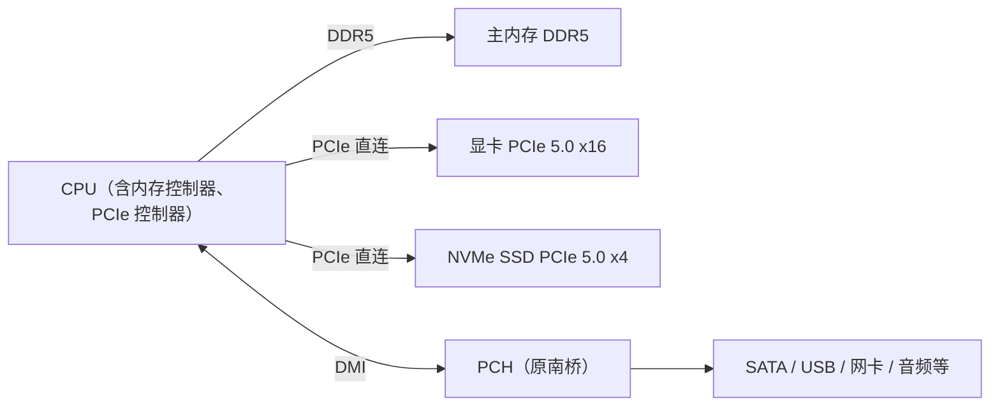

# 第零章 计算机概论

> [!info] 关于本章
> 本章以鸟哥《Linux 私房菜 — 基础学习篇》第零章为骨架，已将原基于 2014—2015 年的硬件示例更新至 **2026 年当前状态**（DDR5、PCIe 5.0/6.0、NVMe、UEFI、ATX 3.0 等），术语统一为大陆通行写法。

操作系统与硬件关系密切，不了解计算机概论，就很难快速建立 Linux 的底层概念。

## 0.1 计算机：辅助人脑的工具

计算机的定义：**接受使用者输入的指令与资料，经 CPU 的运算与逻辑单元处理后，产生或储存成有用的信息**。只要有输入设备（键盘、触摸屏）与输出设备（屏幕、打印机），能输入资料并产出信息的机器，就是计算机。

![[vbird-f8777432360eb38a.gif]]
*图：计算机的功能（输入 → 处理 → 输出）*

常见的计算机包括：台式机、笔记本、平板、智能手机、单板计算机（如 Raspberry Pi 5）、智能手表等。

### 0.1.1 计算机硬件的五大单元

按外观，台式机可分为三部分：

- **输入单元**：键盘、鼠标、读卡器、扫描仪、触摸屏等；
- **主机部分（系统单元）**：机箱内一片主板上，插有 CPU、主内存、硬盘及各种接口卡；
- **输出单元**：屏幕、打印机等。

主机核心是 **CPU（中央处理器，Central Processing Unit）**——一片含微指令集的芯片。CPU 内部分两个主要单元：

- **算术逻辑单元**：负责运算与逻辑判断；
- **控制单元**：协调各单元与周边设备的工作。

> [!note] 关键概念：资料都流经主内存
> CPU 处理的所有资料都来自**主内存**：输入单元 → 主内存 → CPU → 主内存 → 输出单元。资料流经主内存转发，进出由 CPU 的控制单元发布命令。这就是为什么**内存不足时系统性能极差**——资料无法完整载入。Linux 服务器环境下，内存容量常常比 CPU 速度更重要。

![[vbird-79a7725098850d0c.gif]]
*图：计算机的五大单元*

因此计算机由五大单元组成：输入单元、输出单元、CPU 内的控制单元与算术逻辑单元、主内存。CPU 是整个系统的核心。

### 0.1.2 CPU 的架构：RISC 与 CISC

CPU 内部的微指令集设计分两种理念：

| 架构 | 全称 | 特点 | 代表 |
|---|---|---|---|
| **RISC**（精简指令集） | Reduced Instruction Set Computer | 指令精简、执行时间短、效能高；复杂操作由多条指令组合完成 | **ARM**（手机、嵌入式、网络设备；近年也进服务器：AWS Graviton、Ampere）；Oracle SPARC；IBM Power |
| **CISC**（复杂指令集） | Complex Instruction Set Computer | 指令多而复杂、长度不等、单条指令可完成丰富工作；每次执行时间较长 | Intel / AMD / VIA 的 **x86 / x86_64**（个人电脑与服务器主流） |

> [!tip] x86_64 的由来
> Intel 早期 CPU 代号 8086，后续 80286、80386……故称 x86。2003 年前 x86 由 8 位升级到 16、32 位；之后 AMD 在此基础上推出 64 位扩展，为区别称为 **x86_64**（也称 AMD64）。现今个人电脑与服务器几乎都是 x86_64。

> [!note] 现代视角：RISC 与 CISC 的界限已模糊
> 现代 x86 处理器在芯片内部会把复杂的 CISC 指令**解码成类似 RISC 的微操作**（micro-ops）再执行，后端执行单元已是 RISC 风格；ARM 也在不断扩充指令。RISC/CISC 更多是**历史设计理念**的区分，而非当代实现的严格对立。

**位宽（字长，word size）**：CPU 一次能处理的资料量。32 位 CPU 最多定址约 4 GB 内存；64 位 CPU 理论可定址空间远超此（x86_64 实际支持 TB 级物理内存）。现今主流为 64 位。

x86 处理器等级演进：i386（80386）→ i586（Pentium MMX / K6）→ i686（Pentium II 之后）→ x86_64。软件包常标注架构（如 `x86_64`），x86_64 硬件可向下兼容运行 i686 软件，反之不行。

现代 x86 处理器常见的扩展指令集：

| 类别 | 代表指令集 |
|---|---|
| 多媒体 / 科学计算 | MMX、SSE、SSE2/3/4、**AVX、AVX2、AVX-512** |
| 虚拟化 | **Intel VT-x、AMD-V** |
| 省电 | Intel SpeedStep、AMD PowerNow!、C/P-states |
| 64 位 | AMD64、Intel EM64T |

### 0.1.3 其他单元的设备

机箱内的设备大多通过主板连接，主板上的芯片组负责沟通所有设备。除 CPU 外：

- **系统单元**：CPU、内存、主板及其接口卡（PCIe 网卡、阵列卡、显卡等）。显卡对 3D 渲染至关重要，与分辨率、色彩、刷新率相关。
- **存储单元（辅助内存）**：硬盘、光盘、U 盘、磁带等持久存储；主内存是挥发性内存。
- **输入 / 输出单元**：触摸屏兼具输入输出；输入有键盘鼠标、体感设备；输出有屏幕、打印机、音箱、投影等。

### 0.1.4 运作流程

![[vbird-5b8a0c81f221d48c.gif]]
*图：各元件运作（人体类比）*

| 元件 | 人体类比 | 作用 |
|---|---|---|
| CPU | 大脑 | 判断与控制全身活动 |
| 主内存 | 大脑中正在思考的资料区 | 暂存当前处理的资讯 |
| 硬盘 | 大脑中的回忆区 | 长期记录重要资料 |
| 主板 | 神经系统 | 连接并传导各元件 |
| 显卡 | 大脑中的影像 | 将刺激转为影像呈现 |
| 电源 | 心脏 | 供给所有元件电力 |
| 周边设备 | 手、脚、眼、皮肤 | 与外界互动 |

核心：**CPU 与主内存是一切活动的中心**。外界资讯先入主内存，CPU 据此判断后命令各设备；需要过往经验时，再从硬盘读入主内存。

### 0.1.5 计算机的分类

| 类型 | 特点 | 典型场景 |
|---|---|---|
| 超级计算机 | 速度最快、维护成本最高 | 国防、气象、太空、大规模模拟（参考 [Top500 榜单](https://www.top500.org/)；中美均有百亿亿次 / exascale 级机器） |
| 大型计算机（Mainframe） | 多高速 CPU，处理海量资料 | 大企业主机、证券交易所、大型数据库服务器 |
| 迷你计算机 | 支持多用户，无需特殊机房 | 科研、工程分析、工厂流程管理 |
| 工作站 | 强调稳定性与计算正确性 | 学术研究、工程分析（现多被高端 PC 取代） |
| 微计算机 | 体积小、价格低、功能完整 | 个人电脑（台式机、笔记本）——本章主要对象 |

> [!note]
> 如今高端个人电脑的性能已不输过去的工作站，但工作站以上等级仍强调 **7×24 稳定运行**与 **ECC 内存**等可靠性设计，售价更高。

### 0.1.6 计算单位

**容量单位**

计算机以通电与否记录 0/1，最小的二进制单位是 **bit（位）**。8 个 bit 组成 **Byte（字节）**：

> 1 Byte = 8 bits

更大的单位因进制不同而数值不同：

| 进制 | Kilo | Mega | Giga | Tera | Peta | Exa | Zetta |
|---|---|---|---|---|---|---|---|
| 二进制（1024） | 1024 | 1024K | 1024M | 1024G | 1024T | 1024P | 1024E |
| 十进制（1000） | 1000 | 1000K | 1000M | 1000G | 1000T | 1000P | 1000E |

为避免歧义，常用 **GB（十进制）** 与 **GiB（二进制）** 区分：`1 GB = 10⁹ Byte`，`1 GiB = 2³⁰ Byte`。文件容量多用二进制，速度多用十进制。

> [!tip] 为什么 500 GB 硬盘格式化后只剩约 466 GB？
> 硬盘厂商按十进制标注（500 GB = 500×10⁹ Byte），系统按二进制显示（÷1024³ ≈ 466 GiB）。这是单位换算差异，并非厂商欺骗。

**速度单位**

CPU 速度用 MHz / GHz（`1 GHz = 10⁹ Hz`）。网络传输以 bit 为单位，常用 **Mbps（Mbit/s）**。例如 "1000 M / 300 M 光纤"，换算成字节：下行 1000 Mbps ÷ 8 ≈ **125 MB/s**。

## 0.2 个人电脑架构与设备元件

Linux 早期基于个人电脑（x86）架构发展。x86 两大供应商 Intel 与 AMD 架构已趋同，均采用 Intel 自 2008 年起推动的"北桥整合进 CPU"设计。

> [!info] 架构演进：北桥的消失
> 早期芯片组分 **北桥**（连接高速设备：CPU、内存、显卡）与 **南桥**（连接慢速设备：硬盘、USB、网卡）。由于 CPU↔内存 经北桥会占用带宽，现代平台已将**内存控制器与 PCIe 控制器整合进 CPU 封装**，北桥消失；仅保留相当于南桥的 **PCH（Platform Controller Hub）**，通过 **DMI（Direct Media Interface）** 与 CPU 通信。

![[vbird-0aec868b4d4f857b.webp]]
*图：早期 Intel 芯片组的北桥 / 南桥架构（现代已将北桥整合进 CPU，仅保留 PCH）*

### 0.2.1 CPU

CPU 发热量大，通常配散热风扇。x86 主流供应商 Intel 与 AMD，当前均为多核架构。

**多核与超线程**

- **多核**：一个 CPU 封装内含多个物理核心。
- **超线程（Hyper-Threading, HT）**：Intel 技术，把每个物理核心的寄存器分成两群，让一个物理核心模拟两个逻辑核心，操作系统可见核心数翻倍（如 4 核 8 线程）。HT 在 CPU 未满载时提升吞吐，但在争用执行单元的负载下可能无收益甚至略降。AMD 对应技术称 SMT（同步多线程）。

**时脉（频率）**：CPU 每秒可进行的工作次数，单位 GHz。如 3.6 GHz ≈ 每秒 36 亿次工作。

> [!warning] 不能仅凭时脉跨型号比较性能
> 不同 CPU 的微架构、缓存、每周期执行指令数（IPC）不同，时脉只适合比较**同代同型号**的 CPU。

**外频、倍频与睿频**：早期 CPU 主频 = 外频 × 倍频。北桥整合进 CPU 后，基频（外频）多为 100 MHz，倍频可达 30+。现代 CPU 支持**睿频（Turbo Boost / Precision Boost）**——负载高时自动超频到标称最高频，空闲时降频省电，无需手动超频。

**字长（位宽）**：见 [0.1.2](#)，主流 64 位（x86_64）。

> [!tip] 查看自己的 CPU
> Linux 下用 `cat /proc/cpuinfo` 查看 CPU 详细信息，`lscpu` 查看架构概要，`lspci` 查看各设备型号。

### 0.2.2 内存

主内存是 CPU 读取资料的来源，所有程序与资料须先载入内存才能被 CPU 处理。主内存主要元件为 **DRAM（动态随机存取存储器）**，只在通电时记录，断电即失——又称挥发性内存。个人电脑用 **DDR SDRAM（Double Data Rate）**，每个周期传输两次资料。

| 代际 | 常见速率（MT/s） | 现状 |
|---|---|---|
| DDR3 | 1066–2133 | 已退出主流 |
| DDR4 | 2133–3200（可超至 4000+） | 仍广泛使用 |
| **DDR5** | **4800–8400** | **当前新机主流** |

> [!note] DDR5 的变化
> DDR5 单根模组内部分成两个独立的 32 位子通道（DDR4 单根为单一 64 位通道），并把基础纠错（on-die ECC）做进颗粒，提升了可靠性。

**多通道**：把多根内存并联加宽总线（64 位 → 128 位双通道），提升带宽。启用双通道须插两根（或四根）容量、规格一致的内存到对应同色插槽。服务器可达四通道、八通道。

**SRAM 与 CPU 缓存**：CPU 内部的缓存（L1 / L2 / L3）速度需接近 CPU 主频，DRAM 达不到，故用 **SRAM（静态随机存取存储器）**——速度快、功耗低，但密度低、价格高，适合小容量缓存。现代 CPU 多含三级缓存：L1 / L2 每核私有，L3 全核共享。

![[vbird-3f00f9d308ba2d21.gif]]
*图：CPU、缓存与主内存的关系*

**ROM 与 BIOS / UEFI**：主板上有一块 CMOS 芯片（靠纽扣电池供电）记录硬件参数（系统时间、电压、频率、I/O 与中断配置）。读取与修改这些参数的程序是 **BIOS（基本输入输出系统）**，写入 **ROM / EEPROM / Flash** 等非易失存储。

> [!info] BIOS → UEFI
> 传统 BIOS 已被 **UEFI（统一可扩展固件接口）** 取代：支持图形界面、鼠标操作、大于 2 TB 的 **GPT 分区表**、安全启动（Secure Boot）与更快的启动。2026 年的 x86 主板几乎全部使用 UEFI（仍兼容 Legacy BIOS 模式作为旧选项）。UEFI 程序同样存储在主板 Flash 中。

**固件（firmware）**：写在硬件内部、控制硬件底层行为的程序。BIOS / UEFI 是典型固件；网卡、阵列卡、交换机也有各自的固件。

### 0.2.3 显卡

显卡（含 **GPU**，Graphics Processing Unit）负责图形图像显示，重点在分辨率、色彩深度、刷新率。3D 游戏与 **AI / GPU 通用计算**使显卡的并行运算能力愈发重要。

显卡通过 **PCIe** 与 CPU 通信，规格演进：

| 规格 | 单通道（x1）带宽 | 全速（x16）带宽 |
|---|---|---|
| PCIe 3.0 | ~1 GB/s | ~16 GB/s |
| PCIe 4.0 | ~2 GB/s | ~32 GB/s |
| **PCIe 5.0** | **~4 GB/s** | **~64 GB/s** |
| PCIe 6.0 | ~8 GB/s | ~128 GB/s |

> [!note] PCIe 通道与插槽
> PCIe 用"通道（lane）"串行点对点传输，常见 x1 / x4 / x8 / x16。x16 的卡插在只有 x4 电气连接的 x16 插槽上仍能工作，但带宽降至 1/4。CPU 提供的直连通道有限（如 16 条），其余由 PCH 扩展。

显卡输出接口演进：

| 接口 | 信号类型 | 现状 |
|---|---|---|
| VGA（D-Sub） | 模拟 | 已淘汰 |
| DVI | 数字（部分兼容模拟） | 基本淘汰 |
| **HDMI（2.1）** | 数字，音视同传 | 电视与显示器主流 |
| **DisplayPort（2.1）** | 数字，音视同传 | PC 显示器主流 |
| **USB-C / Thunderbolt 4·5** | 数字，音视 + 数据 + 供电 | 新型设备统一接口 |

### 0.2.4 硬盘与存储设备

存储设备持久保存资料。类型：机械硬盘（HDD）、固态硬盘（SSD）、光盘、U 盘、磁带、NAS / SAN 等。

**机械硬盘（HDD）的物理结构**

![[vbird-ffaacf474d6687c8.webp]]
*图：机械硬盘的物理构造*

HDD 内部由圆形盘片、机械臂、磁头、主轴马达组成。盘片涂有磁性物质，主轴马达带动盘片旋转，磁头在机械臂上读写。

![[vbird-3eb3198d8e515077.webp]]
*图：盘片上的资料格式*

盘片以同心圆划分存储区：

- **扇区（sector）**：最小物理存储单位（传统 512 Byte，现代先进格式化 4 K Byte）；
- **磁道（track）**：同一同心圆上的扇区集合；
- **柱面（cylinder）**：多盘片同一磁道的组合。

外圈周长大、扇区多（Zone Bit Recording），资料通常从外圈开始写入。

**接口**

| 接口 | 典型用途 | 备注 |
|---|---|---|
| **SATA 3.0** | HDD、SATA SSD | 600 MB/s（6 Gbit/s），向下兼容 |
| **SAS（SAS-4）** | 企业 HDD / SSD | 24 Gbit/s，支持热插拔，昂贵 |
| **NVMe（PCIe）** | 高性能 SSD | PCIe 5.0 x4 ≈ 14 GB/s，当前性能王者 |

> [!note] 从 SATA SSD 到 NVMe
> SATA 接口的 SSD 受限于 600 MB/s 上限。**NVMe** 协议直接走 PCIe 通道，PCIe 4.0 x4 约 7 GB/s、PCIe 5.0 x4 约 14 GB/s，是当前高性能存储主流，形态多为 **M.2** 小卡。

USB 演进：

| 版本 | 带宽 | 速度（约） |
|---|---|---|
| USB 2.0 | 480 Mbit/s | 60 MB/s |
| USB 3.2 Gen 2 | 10 Gbit/s | ~1.25 GB/s |
| USB 3.2 Gen 2x2 | 20 Gbit/s | ~2.5 GB/s |
| **USB4 / Thunderbolt 4** | **40 Gbit/s** | **~5 GB/s** |
| **USB4 v2 / Thunderbolt 5** | **80 Gbit/s** | **~10 GB/s** |

**固态硬盘（SSD）**

SSD 用闪存芯片存储，无机械部件：随机读写快、省电、抗震。早期受闪存写入次数限制，寿命是关注点；现代 SSD 通过**磨损均衡（wear leveling）**、超量配置（OP）与 DRAM 缓存大幅延长寿命，常用 **TBW（写入总字节数）** 与 **DWPD（每日全盘写入次数）** 衡量寿命。

> [!tip] 性能指标：IOPS
> 衡量小文件随机读写的指标是 **IOPS（每秒输入输出操作次数）**。NVMe SSD 可达百万级 IOPS，远超机械硬盘的百级。

**选购要点**

- **HDD vs SSD**：SSD 作系统盘（快），HDD 作大容量数据盘（便宜）已成标配。2026 年消费级 SSD 常见 1–4 TB，企业级 30 TB+；HDD 可达 20+ TB。
- **容量**：硬盘是消耗品，重要资料务必备份。
- **接口**：性能优先选 NVMe（PCIe），大容量冷数据选 HDD（SATA / SAS）。机械硬盘的转速（笔记本 5400 rpm，台式机 7200 rpm，企业 10k/15k rpm）与缓存影响其性能。

### 0.2.5 扩展卡与接口

主板通过 PCIe 扩展槽连接额外设备卡（多端口网卡、阵列卡、采集卡、GPU 计算卡等）。现代主板多已集成声卡、网卡、USB 控制器、甚至显卡。需要扩展时优先选 PCIe（x1 / x4 / x8 / x16），插槽长度对应通道数。

### 0.2.6 主板

- **插槽位置影响性能**：插在 CPU 直连的 PCIe 插槽（如 x16）性能最佳；经 PCH（原南桥）转接的插槽受 DMI 带宽限制（如 DMI 4.0 ≈ 8 GB/s），多设备争用时会成瓶颈。选购前应查阅主板的芯片组逻辑图。
- **I/O 地址与 IRQ**：每个设备有唯一 I/O 地址（门牌号），IRQ（中断）是设备向 CPU 报告状态的通道。现代设备多用 MSI / MSI-X 与 PCIe，传统共享 IRQ 已较少见。
- **CMOS 与 UEFI**：见 [0.2.2](#)。
- **外设接口**：主板后置面板常见 USB、RJ-45 网口、HDMI / DisplayPort（若有集显）、音频孔；PS/2、VGA 已基本淘汰。

![[vbird-92b4815fa492a645.webp]]
*图：主板后置的外设接口*

### 0.2.7 电源

电源为所有元件供电，稳定性直接影响系统稳定。电源转换率 = 输出功率 ÷ 输入功率，用 **80 PLUS** 认证分级（白牌、铜牌、银牌、金牌、铂金、钛金），等级越高越省电。

> [!tip] 电源功率怎么选
> 按系统实际功耗 × 1.5 左右取整，并预留显卡升级余量。2026 年高端独显（如 RTX 50 系）瞬时功耗高，需配 850 W–1200 W 电源与 **ATX 3.0 / 3.1** 规范的 12V-2x6（原 12VHPWR）显卡供电线。

### 0.2.8 选购与稳定性

> [!note] 木桶效应
> 系统速度受**最慢的设备**限制。再快的 CPU 配上慢硬盘 / 网卡，整体仍被卡住。升级时应全盘考量各接口，而非只换某一部件。

**系统不稳定的常见原因**：超频、电源不稳、内存故障、过热。排查时优先检查电源稳定性与散热。

## 0.3 资料表示方式

计算机只认识 0 与 1，所有资料都以二进制记录。数值与文字需经编码转换。

### 0.3.1 数字系统（二进制）

二进制（binary）逢二进一。十进制 `3456 = 3×10³ + 4×10² + 5×10¹ + 6×10⁰`。

**二进制转十进制**：

`1101010 = 1×2⁶ + 1×2⁵ + 0×2⁴ + 1×2³ + 0×2² + 1×2¹ + 0×2⁰ = 64 + 32 + 8 + 2 = 106`

**十进制转二进制**：除二取余，逆序排列。

![[vbird-791d986abf2d4577.gif]]
*图：十进制转二进制（短除法）*

### 0.3.2 文字编码

文字也以 0/1 存储，通过**编码表**（字码对照表）在字符与数字间转换：写入时字符 → 编码 → 数字 → 存储；读取时反过来。编码表选错就会出现乱码。

![[vbird-328d3ce0208b356e.gif]]
*图：依编码表存取资料的过程*

| 编码 | 说明 | 现状 |
|---|---|---|
| **ASCII** | 英文 / 数字 / 符号，每个 1 Byte（2⁸ = 256） | 英文环境基础，至今通用 |
| **Big5** | 繁体中文，每字 2 Byte | 台湾 / 香港遗留系统；大陆不用 |
| **GB2312 / GBK / GB18030** | 简体中文编码，**GB18030 为大陆强制标准** | 大陆中文环境 |
| **Unicode（UTF-8）** | 统一码，覆盖全球文字 | **当前绝对主流**，互联网默认编码 |

> [!tip] 统一用 UTF-8
> UTF-8 兼容 ASCII、可表示全球文字，是互联网与 Linux 系统的默认编码。新建文件、数据库、网页都应使用 UTF-8，避免乱码。

## 0.4 软件与操作系统

没有软件，通电的电脑也无法工作。软件分两大类：**系统软件**（操作系统等）与**应用程序**。

### 0.4.1 机器程序与编译器

CPU 只认微指令集（机器码）。直接写机器码有四大难题：要学机器语言、要了解硬件功能函数、程序不可移植、程序针对特定硬件。解决方案：用人类可读的**高级编程语言**（C / C++ / Java / Go 等）编写，再由**编译器**翻译成机器码。

![[vbird-46d53fe9fae85aa8.gif]]
*图：编译器的角色*

但仍需直接管理硬件细节（如内存分配），于是有了**操作系统**。

### 0.4.2 操作系统

操作系统（Operating System, OS）也是一组程序，核心作用是**管理电脑所有活动、驱动所有硬件**，并提供开发接口。

**内核（Kernel）**

内核管理硬件并提供能力：让 CPU 运算、内存读写、硬盘存取、网卡传输、外设运转。电脑能做到什么取决于内核支持的功能（如内核不支持 TCP/IP，再好的网卡也无法联网）。内核运行在受保护的内存区域，开机后常驻内存，用户不能直接操作内核。

**系统调用（System Call）**

内核提供一组统一的开发接口——**系统调用**。程序员只需按系统调用规范开发（如用 C 语言的库函数），系统调用会转译成内核能理解的任务。因此应用程序与内核强相关，与具体硬件关系不大。

![[vbird-3f72bf2f914e9337.gif]]
*图：操作系统在硬件与应用之间的角色*

> [!note] 关键概念
> - 内核直接依据硬件规格编写，同一操作系统不能跨硬件架构运行（如 x86 版 Windows 不能直接跑在 ARM 上，除非有针对该架构的版本）；
> - 操作系统只管理硬件资源，没有应用程序则只能让主机"就绪"（Ready）；
> - 应用程序依据操作系统的开发接口编写，只能在该操作系统上运行。

**内核的职责**

- **系统调用接口**：方便程序员调用内核能力；
- **进程管理（Process control）**：调度多任务，分配 CPU 资源；
- **内存管理**：管理所有程序与资料，提供虚拟内存与交换（swap）；
- **文件系统管理**：资料的 I/O、不同文件系统格式的支持；
- **设备驱动**：硬件驱动；现代内核支持**可加载模块**，驱动编译成模块即可使用，无需重编内核。

**操作系统与驱动**

硬件不断更新，操作系统不可能预置所有硬件的驱动。操作系统提供驱动开发接口，由**硬件厂商**为自家硬件编写驱动，用户安装后即可在对应操作系统上使用该硬件。因此驱动与操作系统绑定——Windows 的驱动不能用于 Linux。

![[vbird-d717fdc52977510b.webp]]
*图：驱动程序与操作系统的关系*

### 0.4.3 应用程序

应用程序依据操作系统的开发接口开发，让用户完成特定功能（办公、图像处理、浏览器等）。购买软件前须确认其支持的操作系统。

## 0.5 重点回顾

- 计算机：接受输入，经 CPU 运算处理，产生或储存信息；
- 五大单元：输入、输出、控制、算术逻辑、内存；CPU 含控制与算术逻辑单元；资料都流经主内存转发；
- CPU 按设计分 RISC（ARM 等）与 CISC（x86_64）；现代 x86 内部解码为类 RISC 微操作，二者界限已模糊；
- CPU 频率 = 基频 × 倍频；睿频自动超频 / 降频；只有同代 CPU 才能比频率；
- 现代平台北桥已整合进 CPU，仅保留 PCH（原南桥）经 DMI 与 CPU 通信；
- 字长：主流 64 位（x86_64）；
- 主内存用 DRAM（DDR4 / DDR5），CPU 缓存用 SRAM；
- 主板固件：BIOS 已被 **UEFI** 取代（支持 GPT、Secure Boot）；
- 外设接口主流 PCIe（5.0 / 6.0），存储主流 NVMe（PCIe），USB 至 USB4 / Thunderbolt 5；
- 编码：UTF-8 是当前绝对主流，大陆简体中文用 GB18030；
- 操作系统内核管理系统资源（进程、内存、文件系统、设备驱动），通过系统调用给应用程序提供接口。

## 延伸阅读

- [Top500 超级计算机榜单](https://www.top500.org/)
- [PCI Express — Wikipedia](https://en.wikipedia.org/wiki/PCI_Express)
- [DDR SDRAM — Wikipedia](https://en.wikipedia.org/wiki/DDR_SDRAM)
- [USB — Wikipedia](https://en.wikipedia.org/wiki/USB)
- [UEFI — Wikipedia](https://en.wikipedia.org/wiki/UEFI)
