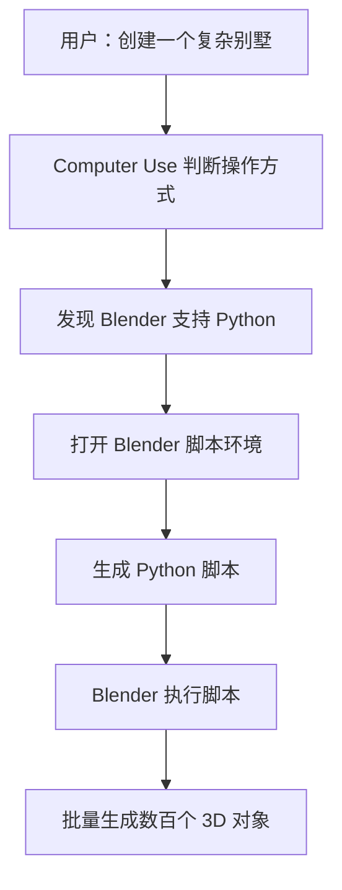
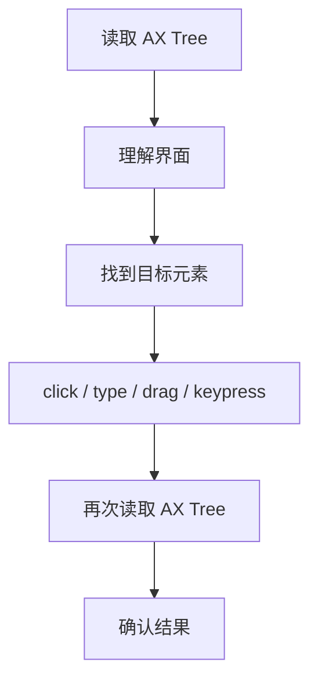
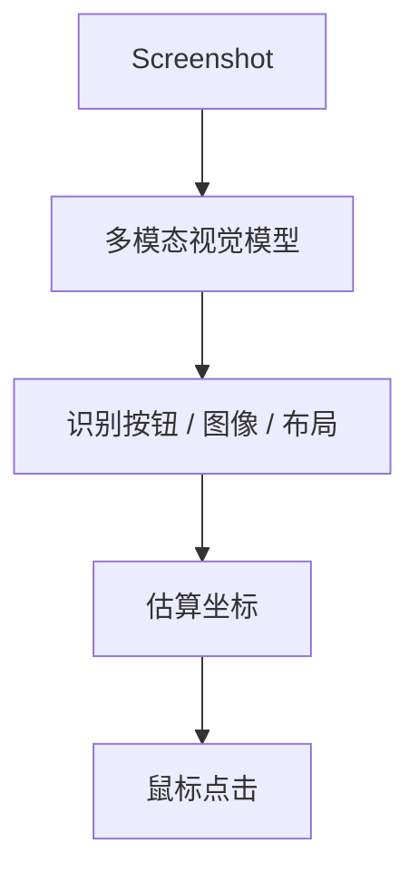

# computer use原理（审图可参考）

## Computer Use 的核心原理

**Computer Use 并不等于“AI 像人一样一直看屏幕、点鼠标”。**  
更准确地说，成熟的 Computer Use 实现是一个**自动选择最佳电脑操作通道的 Agent 执行系统**。

典型优先级可以理解为：

> **API / MCP / CLI / 脚本 > 无障碍接口 > 视觉截图 + 鼠标键盘**

### 1. 优先走结构化接口

如果目标软件提供：

- API
- MCP
- CLI
- Python / JavaScript 脚本
- AppleScript 等自动化接口

Agent 通常优先使用这些方式。

例如 Blender：



因此你看到的是：

**鼠标只负责进入脚本环境，真正的大量建模由代码完成。**

这比模拟人类鼠标操作效率高很多。

---

### 2. GUI 操作时，也不一定主要靠“看截图”

在 macOS 上，Computer Use 可以利用 **Accessibility / AX 无障碍接口**。

应用会提供类似这样的结构化信息：

```text
Keynote
└── Window
    ├── Toolbar
    │   ├── Add Shape
    │   ├── Text
    │   └── Media
    └── Canvas
        ├── Circle
        └── Line
```

Agent 实际获取的是：

> **GUI 的结构化文本树**

然后通过元素的位置、类型、状态进行：



所以很多所谓的“AI 看着屏幕操作电脑”，实际上更接近：

> **AI 在读取 GUI 的 DOM。**

只是桌面应用这里不是 HTML DOM，而是 **Accessibility Tree**。

---

### 3. 截图视觉是补充能力

当 Accessibility Tree 无法提供足够信息时，才需要真正依赖截图，例如：



这种方式通常：

- Token 成本更高
- 定位精度更低
- 更慢
- UI 改变容易失败

因此通常不是首选。

---

## 可以把 Computer Use 理解成 4 层

| 层级 | 操作方式 | 示例 | 效率 |
| --- | --- | --- | --- |
| ① | API / MCP | 调用软件接口 | ⭐⭐⭐⭐⭐ |
| ② | CLI / Script | Blender Python、AppleScript | ⭐⭐⭐⭐⭐ |
| ③ | Accessibility Tree | macOS AX、Windows UI Automation | ⭐⭐⭐⭐ |
| ④ | Vision + Mouse | 截图识别 + 坐标点击 | ⭐⭐ |

所以真正成熟的 Computer Use 并不是：

> **“AI 的眼睛 + 鼠标”**

而更像：

> **LLM 负责规划，系统提供多种执行工具，Agent 根据任务动态选择成本最低、可靠性最高的通道。**

## 一句话总结

**Computer Use 本质是一个“多通道电脑操作 Agent”：优先通过 API、CLI、脚本和无障碍树读取结构化信息，只有无法结构化操作时，才退化到截图视觉 + 鼠标键盘模拟。**

因此 **MCP、CLI、API、脚本并没有因为 Computer Use 出现而过时，反而是 Computer Use 实现高效率、高可靠性的核心基础。**
