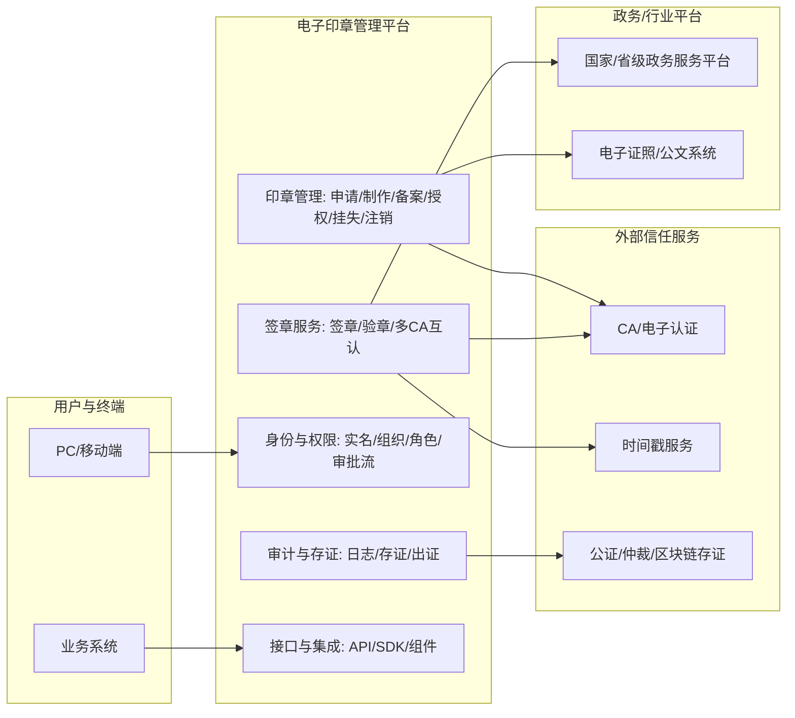

# 相关资源

下面按“法规与规范 → 标准（国标/行标/地标）→ 成熟平台与厂商 → 延伸阅读与文章”来系统梳理，并穿插对电子签章/电子印章/电子印章管理平台的概念与架构理解。

---

## 一、核心结论（先给结论）

1. 法律层面：电子签章/电子印章的效力基础是《电子签名法》+《民法典》，只要满足“可靠电子签名”四要件，就与手写签名/盖章具有同等法律效力；例外情形（婚姻、收养、继承等）不能使用电子签名。
2. 规章层面：2025 年国务院办公厅《电子印章管理办法》（国办发〔2025〕33号）是当前最核心的专门规章，明确电子印章定义、与实物印章同等效力、全生命周期管理（申请/制作/备案/使用/注销）以及“统筹推进、分级管理、规范标准、安全可控”等原则。
3. 标准层面：
   - 密码与安全：GM/T 0031-2014《安全电子签章密码技术规范》、GB/T 38540-2020《信息安全技术 安全电子签章密码技术规范》是电子印章/签章数据结构、生成/验证流程的“技术基本法”。
   - 政务与公文：GB/T 33481-2016《党政机关电子印章应用规范》、国家政务服务平台 C0119/C0120 系列规范，以及电子证照 GB/T 36901~36906 系列标准，构成政务场景的“标准簇”。
   - 地方/行业：如 DB36/T 1349-2020《统一电子印章平台应用接入技术规范》、人社 LDT 01.1-2022 等行业/地方标准，细化平台接入与架构。
4. 成熟实现：
   - 基础设施型：e签宝统一印章平台（政务版+公众版）、安证通“统一电子印章认证管理平台/一签通”、国脉信安等省级统一电子印章平台，多为政务/集团化“印章中台”。
   - 企业签署型：法大大、腾讯电子签、上上签、君子签、放心签等，以电子合同/签章 SaaS 为主，叠加印章管理能力。
   - 印控一体型：契约锁、章管家、矩网动码等，强调“电子章+实体章+智能硬件”一体化管控。

---

## 二、概念与整体架构（先统一语言）

### 1. 基本概念

- **电子签名（Electronic Signature）**：法律概念，《电子签名法》第 13 条给出“可靠电子签名”四要件：签名数据专有、签署时仅由签名人控制、签名改动可发现、内容改动可发现。
- **电子签章（Electronic Seal Signature）**：电子签名的一种可视化表现形式，将数字证书、数字签名与印章图形/手写签名样式结合，实现“看得见的可靠电子签名”。
- **电子印章（Electronic Seal）**：特指代表机构（企业/机关等）的电子签章，通常要求印模与公安备案实物印章一致，并按《电子印章管理办法》等管理。
- **电子印章管理平台**：对电子印章+（部分含实体印章）进行全生命周期管理（申请/制作/备案/授权/使用/审计/注销）和签章/验章服务的中台系统，通常与 CA、时间戳、存证等组件集成。

### 2. 典型平台架构（示意）

下面是一个典型的“电子印章管理平台”逻辑架构，既覆盖政务/企业内部系统，也对接第三方 CA/存证/政务平台：

---

## 三、法规与规章体系

### 1. 法律层面

1）《中华人民共和国电子签名法》（2015 修正）
- 核心条款：
  - 第 3 条：民事活动中的合同等文书，当事人可以约定使用电子签名/数据电文，不得仅因电子形式否定其法律效力；例外情形包括婚姻、收养、继承等，以及法律、行政法规规定不适用的情形。
  - 第 13 条：给出“可靠电子签名”四要件（签名数据专有、签署时仅由签名人控制、签名和内容改动可发现）。
  - 第 14 条：可靠的电子签名与手写签名或者盖章具有同等法律效力。

2）《中华人民共和国民法典》
- 第 469 条：以电子数据交换、电子邮件等方式能够有形地表现所载内容，并可以随时调取查用的数据电文，视为书面形式，为电子合同/电子签章提供“书面形式”基础。

3）相关法律：
- 《密码法》：明确密码管理职责，为电子印章中密码应用与合规提供上位法依据。
- 《网络安全法》《数据安全法》《个人信息保护法》：对电子印章/签章系统中的数据安全、个人信息保护、等保/密评提出要求。

### 2. 行政规章与国务院文件

1）《电子印章管理办法》（国办发〔2025〕33号）——当前最核心的专门规章
- 定义：电子印章是基于密码技术和相关数字技术表征印章的特定格式数据，用于实现电子文件的可靠电子签名；包含印章图像数据、印章名称、所有者信息、电子签名认证证书及关联的签名制作数据等。
- 适用范围：行政机关、企事业单位、社会组织等组织的法定名称章、内设机构章/分支机构章/业务专用章、个人名章等电子印章的管理和应用活动。
- 效力：符合本办法规定的电子印章与实物印章具有同等法律效力。
- 原则：统筹推进、分级管理、规范标准、安全可控；国家密码管理局负责密码管理和电子政务电子认证服务监督，推动标准化和互信互认。
- 管理环节：申请、制作、备案、使用、注销等全生命周期管理，强调信息系统安全和信息保护。

2）《国务院关于在线政务服务的若干规定》
- 明确政务服务中可靠的电子签名、电子印章、电子证照、电子档案的法律效力，与手写签名/盖章具有同等效力。

3）地方/行业暂行办法
- 如《西安市电子印章管理暂行办法》《漯河市一体化在线政务服务平台电子印章管理暂行办法》等，在国办《办法》框架下细化本地流程、备案、应用场景等。

---

## 四、标准与规范体系

### 1. 密码与安全标准（电子签章/印章的“技术基本法”）

1）GM/T 0031-2014《安全电子签章密码技术规范》
- 性质：密码行业标准，国家密码管理局发布。
- 内容：
  - 规定电子印章和电子签章的数据结构、密码处理流程。
  - 定义电子印章（electronic stamp）、电子签章（electronic seal）、电子签章数据、电子印章系统等核心术语。
  - 明确密码应用安全机制与密码应用协议，包括电子印章/签章的数据格式、生成与验证流程。
- 适用：电子印章系统的开发和使用，是后续国标 GB/T 38540 和政务平台标准的重要基础。

2）GM/T 0047-2024《安全电子签章密码检测规范》
- 规定安全电子签章密码技术的检测内容、方法、合格判定条件，用于按 GM/T 0031 研制的电子印章系统的密码检测。

3）GB/T 38540-2020《信息安全技术 安全电子签章密码技术规范》
- 性质：国家推荐性标准，全国信息安全标准化技术委员会归口。
- 内容：
  - 规定采用密码技术实现电子印章和电子签章的数据结构定义，以及相应的生成与验证流程。
  - 明确电子印章（electronic seal）是“由电子印章制章者数字签名的安全数据，包括所有者信息和图形化内容”；电子签章是“使用电子印章签署电子文件的过程”。
- 作用：为电子印章系统开发、检测和互认提供统一技术依据，是当前各类电子印章平台必须遵循的核心国标。

4）相关密码与算法标准（被上述标准引用）
- GB/T 32905 SM3、GB/T 32918 SM2、GB/T 32907 SM4 等国密算法标准。
- GB/T 20518 信息安全技术 公钥基础设施 数字证书格式等。

### 2. 政务与公文标准

1）GB/T 33481-2016《党政机关电子印章应用规范》
- 规定党政机关电子公文中应用电子印章的通用要求、制章/用章/验章要求及安全要求，以及签章组件应用接口。
- 适用于非涉密电子印章系统建设，其他场景可参照执行。

2）党政机关电子公文标准体系（GB/T 33476~33482 等）
- 包括：
  - GB/T 33476.1~3 电子公文格式规范（结构、显现、实施指南）
  - GB/T 33478~33480 应用接口/交换接口/元数据规范
  - GB/T 33481 电子印章应用规范
  - GB/T 33482 电子公文系统建设规范
- 其中电子印章部分与 GB/T 38540、GM/T 0031 一起，构成电子公文“签章与验章”的完整技术规范。

3）国家政务服务平台统一电子印章标准（C0118~C0122）
- C0118-2019：统一电子印章总体技术架构
- C0119-2019：统一电子印章签章技术要求
- C0120-2019：统一电子印章印章技术要求
- C0121-2019：统一电子印章接入测试方法
- C0122-2019：统一电子印章系统接口要求
- 这些标准基于 GM/T 0031 及其国标报批稿制定，明确了国家政务服务平台电子印章的数据格式、签章/验章流程、接口与测试方法，是各省统一电子印章平台建设的直接依据。

4）电子证照系列标准（GB/T 36901~36906-2018）
- GB/T 36901：电子证照 总体技术架构
- GB/T 36902：目录信息规范
- GB/T 36903：元数据规范
- GB/T 36904：标识规范
- GB/T 36905：文件技术要求
- GB/T 36906：共享服务接口规范
- 标准明确：电子证照系统应用支撑层包含“统一身份认证、统一电子印章、版式文档处理”等共性服务，电子印章为证照签发提供法律效力保障。

5）版式文档标准 GB/T 33190-2016《电子文件存储与交换格式 版式文档》
- 规定版式电子文件（OFD）的存储与交换格式，是电子公文、电子证照、电子合同等“签章载体”的格式基础，电子签章通常在 OFD/PDF 上可视化呈现。

### 3. 地方/行业/团体标准

1）DB36/T 1349-2020《统一电子印章平台应用接入技术规范》（江西）
- 规定省统一电子印章平台的组成、接入架构、接口说明、接入流程与通用要求。
- 引用标准：GB/T 20518、GB/T 32905、GB/T 32918、GM/T 0031-2014、C0118~C0122 等。
- 明确“分散式用章”（UKey+客户端）和“集中式用章”（平台侧签章）两种模式，并给出获取印章信息、签章、验章等接口规范。

2）人社行业 LDT 01.1-2022《人力资源社会保障电子印章体系 第1部分：总体技术架构》
- 面向人社领域，规定电子印章体系总体架构、业务适配层、安全防护等，与社保、就业等业务系统对接。

3）DB37/T 4563-2022《电子印章系统接入规范》等地方标准
- 规范本省/行业范围内电子印章系统接入、互认、安全等要求。

4）团体标准如 T/CQAE 11034-2025 等，在《电子印章管理办法》和 GB/T 38540 框架下，细化电子签章合规要求、检测指标等。

---

## 五、现有成熟实现与厂商/平台

### 1. 基础设施型：统一电子印章平台（政务/集团）

1）e签宝 统一印章平台
- 定位：面向党政机关和社会公众的电子印章基础设施平台，分为政务版和公众版。
- 功能：
  - 政务版：机关内部电子印章申请、制发、管理、使用，向上对接国办，向下服务全域党政机关与政务应用。
  - 公众版：面向企业/个人提供在线申领电子印章、多端签署、一键核验文件真伪等。
- 特点：
  - 已在浙江省、云南省、内蒙古自治区、中山市等多地建设省级/市级统一电子印章平台，实现“政企一体化印章平台”。
  - 支持信创生态，适配国产密码算法、OFD 版式文档等。

2）安证通 统一电子印章认证管理平台 / 一签通
- 定位：综合电子签名服务运营商，承建多地统一电子印章认证平台（如长沙市统一电子签章认证平台）。
- 功能：
  - 统一电子印章认证管理平台：电子印章全生命周期管理（申请/审核/制作/挂起/注销）、多 CA 数字证书互验互认、标准接口对接业务系统、司法存证取证服务。
  - 智慧印章一体化管理平台：涵盖电子印章、实物印章和“智联印章”的集中统一管控，支持用印审批、远程视频核验、全流程日志审计等。
- 特点：
  - 参与多项国家标准/行业标准起草，如《公安信息网电子签章技术规范》《电子合同在线订立流程规范》等。
  - 支持信创、国密算法、OFD，适合政务/央国企/工程建设等高合规场景。

3）国脉信安 电子印章平台
- 面向江苏省、广东省、四川省等建设政务服务平台电子印章系统，完成全省各级政务部门电子印章制发，并构建政企一体化电子印章管理平台，为企业和自然人提供电子印章服务。

4）省级/市级统一电子印章平台
- 如海南省统一电子印章公共服务平台、多地“一网通办”平台中的电子印章子系统，通常遵循国家政务服务平台 C0118~C0122 和 DB36/T 1349 等标准建设。
- 部分已上线平台：
  - [杭州市区块链电子印章场景应用平台](https://yz.hangzhou.gov.cn/)
  - [深圳市统一电子印章管理平台](https://dzyz.sz.gov.cn/#/officialHome)
  - [江苏智慧数字认证有限公司](https://online.smartcert.cn/#/index)

### 2. 企业签署型：电子合同/签章 SaaS

1）法大大
- 定位：电子合同/电子签名/电子签章云平台，提供电子合同在线签署、存证、管理等服务。
- 功能：
  - 企业/个人实名认证、数字证书服务、电子印章管理、合同签署、合同查询、证据保全等。
  - 开放平台提供 API/SDK，支持与企业 OA、HR、ERP 等系统集成。
- 特点：
  - 强调合规，严格遵照《电子签名法》，联合权威 CA、公证处等提供司法存证和出证服务。

2）腾讯电子签
- 定位：面向企业/个人的电子合同签约及证据保存服务，依托腾讯云和“至信链”区块链存证。
- 功能：
  - 合同起草、审批、签署、归档全流程管理；
  - 印章管理（公章/合同专用章/财务专用章/人事专用章等），支持模板印章和图片上传；
  - 企业版提供网页端、小程序、企业微信、API/SDK 等多端接入。
- 特点：
  - 区块链存证、AES256 加密，强调防篡改和合规；
  - 多份判决认可其电子合同效力，司法实践较丰富。

3）上上签、安心签、众信签、放心签等
- 以 SaaS 电子签约为主，提供电子签名/签章、合同管理、存证等服务，部分支持 API/SDK 集成。

4）君子签
- 定位：区块链电子签约平台，主打“区块链+司法+电子签约”。
- 功能：
  - 身份认证、数字证书、电子合同发起/签署、时间戳、区块链存证、在线司法服务；
  - 电子签章系统支持在线制作、授权、使用、撤销、管理、维护等一站式管理。
- 特点：
  - 强调金融级安全、等保三级、ISO27001、多家 CA 机构对接；
  - 在金融、地产、物流等行业有较多落地案例。

### 3. 印控一体型：电子章+实体章+智能硬件

1）契约锁
- 定位：为政府机关及中大型组织提供“电子签章+印章管控+数字身份+数字存档”一体化解决方案。
- 功能：
  - 电子签章：合法有效的电子印章，满足在线签署需求；
  - 印章管控：电子章+实体章统一管理，支持授权、审批、风险预警；
  - 数字身份：基于 CA 数字证书的身份认证与核验；
  - 数字存档：全链路存档、防篡改、可查可验。
- 特点：
  - 提供公有云、私有化部署、API 开放平台、智能印控硬件等多种交付形态；
  - 与用友、泛微、广联达等 100+ 管理软件有标准化集成方案。

2）章管家智能印章平台
- 定位：结合智能硬件的印章管控平台，实现“事前防控、事中拦截、事后留证”。
- 功能：
  - 物理层面“人章分离”，智能终端自动锁章、异常行为告警；
  - 司法级全要素可信存证：实人身份、实章操作轨迹、实页文件影像三者绑定，一盖一码、时间戳防篡改；
  - 支持外勤用印远程视频核验、用印申请审批等。

3）矩网动码智慧印章
- 通过“物电同源一体化”技术，构建物理印章与电子印章统一管理体系，结合动态防伪码、区块链存证等，为医院、政务等场景提供全生命周期印章管理解决方案。

---

## 六、相关文章与延伸阅读

### 1. 法律与合规解读

- 《电子签章有法律效力吗？权威依据+合规指南全解析》——契约锁基于《电子签名法》《民法典》《电子印章管理办法》等，系统梳理电子签章法律效力与合规要点。
- 《电子签名、电子签章与电子印章：法律概念、技术分野与应用场景解析》——从法律与技术两个维度区分电子签名/电子签章/电子印章，并分析其与 GB/T 38540、GM/T 0031 的关系。

### 2. 标准与规范解读

- 《国内首个安全电子签章标准说了啥？数字认证为你划重点》——对 GB/T 38540-2020 的核心内容进行解读，强调电子印章/签章的数据结构、生成与验证流程等。
- 《电子签章国家标准出台：注意这几点，政企安全签署有保障！》——结合 GB/T 38540 和《电子签名法》，总结政企应用电子签章时的合规要点。
- 《GM/T 0031-2014 安全电子签章密码技术规范》专题研究报告——从密码算法、数据结构、安全机制、密钥管理、检测等角度深入解读该标准。

### 3. 平台选型与行业综述

- 《2026年企业电子签平台测评：12款常见系统怎么选》——对比 e签宝、法大大、契约锁、君子签、腾讯电子签等，从 CA 资质、存证能力、合同管理、部署方式、系统集成等维度给出选型建议。
- 《最新测评：2026年国内电子签章软件十大品牌详解》——从产品矩阵、安全合规、信创适配、AI 能力等维度对主流品牌进行分类与点评。
- 《电子签章平台评测与选型操作手册（2026最新版）》——从合规性、安全可控、系统适配、服务稳定性等维度给出选型方法论与主流厂商特征速览。

### 4. 系统架构与方案设计

- 《电子印章系统应用架构设计》——结合国家政务服务平台对接，介绍电子印章制作系统、状态发布系统、应用系统、接口等组成与架构。
- 《智慧印章管理系统设计方案》——从智能印章设备、服务器端软件、客户端软件三部分设计智慧印章管理系统，涵盖申请/审批/领用/归还/轨迹记录等功能。
- 《电子签章技术方案》《电子印章系统方案》等文档——从 PKI 体系、UKey 密钥载体、B/S+C/S 架构、与 OA/ERP 集成等角度给出系统设计方案。

### 5. 行业与地方实践

- 《专家解读：以标准引领筑牢电子印章互信互认根基》——结合《电子印章管理办法》强调标准体系对互信互认的关键作用，提出构建覆盖全链条的标准体系。
- 《“四电融合”破壁垒 “三免服务”畅市场》——信阳市建设全市电子印章共享互认服务平台，打破多 CA、跨平台互认壁垒，实现电子证照、电子印章、电子签名、电子档案融合应用。
- 《人社电子印章体系 第1部分：总体技术架构》实施指南——从人社行业视角解读电子印章体系架构与业务适配层设计。

---

## 七、落地建议（简要）

如果你是要做“电子印章管理平台”的建设或选型，可以按以下思路：

1. **合规先行**：
   - 确保平台满足《电子签名法》《电子印章管理办法》和 GB/T 38540、GM/T 0031 等标准，特别是“可靠电子签名”四要件和密码算法合规（SM2/SM3/SM4 等）。

2. **对标政务/行业标准**：
   - 政务场景：对标 GB/T 33481、C0119/C0120、DB36/T 1349 等接入规范，确保与国家/省级政务服务平台对接互认。
   - 行业场景：如人社、不动产、金融等，关注对应行业/地方标准（如 LDT 01.1、DB37/T 等）。

3. **架构选型**：
   - 小型/轻量：可直接采用 SaaS 电子签章平台（法大大、腾讯电子签、君子签等），通过 API/SDK 集成到现有业务系统。
   - 中大型/政务/集团：优先考虑统一印章平台（e签宝、安证通、国脉信安等），支持私有化部署、多 CA 互认、信创适配、与政务平台对接。
   - 高风险场景：增加智能印控硬件（契约锁、章管家、矩网动码等），实现“电子章+实体章+智能硬件”一体化管控。

4. **安全与证据**：
   - 引入 CA 数字证书、可信时间戳、区块链/公证存证，确保签署过程可追溯、内容防篡改、司法可出证。
