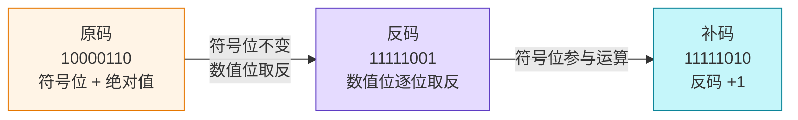
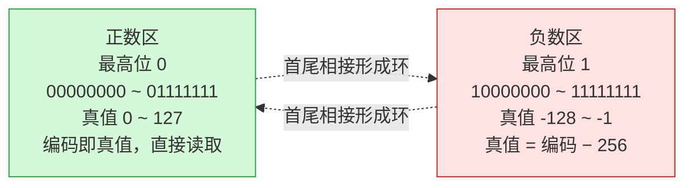
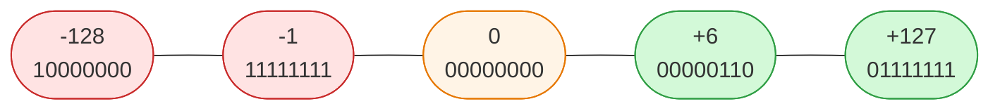

# 原码反码补码🚧

二进制有三种表现形式：`原码`、`反码`、`补码`。原码最符合人类直觉，计算机底层则统一采用补码。本节由浅入深：先认识三种码的写法，再走一遍完整转换，最后揭示补码的本质。

> [!note] 前置：符号位
> 三种码都遵循同一约定——`最高位`是`符号位`：`0` 代表正数，`1` 代表负数，其余位表示数值。

## 三种码的写法

**原码** —— 最直观：符号位 + 数值位的二进制绝对值。负数只需把绝对值的最高位改为 `1`。

**反码** —— 在原码基础上，符号位不变，其余位==逐位取反==（`0` 变 `1`，`1` 变 `0`）。

**补码** —— 在反码基础上 `+1`（符号位参与运算）。这是计算机底层真正存储的形式。

三种码中，==正数的三码完全相同==，无需任何转换；只有负数才需要按「原码 → 反码 → 补码」三步走。几个典型值对照如下：

| 十进制 | 原码 | 反码 | 补码 | 说明 |
|---|---|---|---|---|
| `+6` | `00000110` | `00000110` | `00000110` | 正数三码相同 |
| `-6` | `10000110` | `11111001` | `11111010` | 负数需逐步转换 |
| `+1` | `00000001` | `00000001` | `00000001` | 正数三码相同 |
| `-1` | `10000001` | `11111110` | `11111111` | 负数需逐步转换 |
| `+0` | `00000000` | `00000000` | `00000000` | — |
| `-0` | `10000000` | `11111111` | `00000000` | ==补码里 `-0` 变成 `00000000`，与 `+0` 合并== |

> [!warning] 原码的「双 0」问题
> 原码和反码里 `0` 都有两种写法（`+0` / `-0`），编码不同却数值相等，导致运算结果不唯一。补码通过 `+1` 让 `-0` 溢出成 `00000000`，==0 只有一种表示==，这是补码能正确运算的基础。

## 负数转换：以 -6 为例

以 `-6`（8 位）为例，走一遍完整的「原码 → 反码 → 补码」链路：



```text
  第一步 原码：绝对值 6 = 00000110，最高位置 1
            原码：1 0000110

  第二步 反码：符号位不变，数值位逐位取反
            反码：11111001

  第三步 补码：反码 +1（符号位参与运算）
            反码：11111001
                 +       1
            ─────────
            补码：11111010
```

最终 `-6` 在计算机中以补码 `11111010` 存储。转换是==可逆==的：对补码再做一次「逐位取反、+1」，就回到原码。

## 补码的本质：模 2ⁿ 的补数

前面三步是「怎么算」，现在看「为什么」。

> [!important] 一句话看透本质
> 负数 `−x` 在 n 位系统中的补码，等于 ==`2ⁿ − x`==（8 位下即 `256 − x`）。「逐位取反、再加一」只是**求这个补数的电路实现方式**——每一步都对应确定的数学运算。

把这两步代入公式，转换的每一步都有了确定的数学含义：

```text
  取反：  ~x  =  (2ⁿ − 1) − x       ← 用「全 1」去减，得到反码
  加一：  ~x + 1  =  (2ⁿ − 1) − x + 1  =  2ⁿ − x   ← 抬到 2ⁿ，得到补码
```

以 `-6` 验算：取反 = `255 − 6 = 249`（`11111001`），加一 = `249 + 1 = 250`（`11111010`），即 `256 − 6`，与本质 `2ⁿ − x` 完全吻合。英文术语也由此而来：反码 ones' complement（对 `2ⁿ−1` 求补）、补码 two's complement（对 `2ⁿ` 求补）。

**为什么正数三码相同** —— 补码把 n 位空间看作一个模 `2ⁿ` 的环，编码分两区：



正数 `+x` 天然落在「直接读取」的正数区，编码就是 `x`，无需任何映射。而「取反加一」是**专门把负数搬到 `2ⁿ − x` 位置**的手段——正数根本不需要被映射，自然三码一致。

## 速查表：8 位补码对照

读这张表抓住两条规律：==正数区（最高位 0）直接读取==；==负数区（最高位 1）真值 = 编码 − 256==。



| 真值 | 补码 | 无符号值 | 换算 | 要点 |
|---|---|---|---|---|
| `-128` | `10000000` | 128 | `128 − 256` | ==最小值，只有补码、无原码/反码== |
| `-6` | `11111010` | 250 | `250 − 256` | 上文推演的例子 |
| `-1` | `11111111` | 255 | `255 − 256` | ==全 1 就是 -1== |
| `0` | `00000000` | 0 | 直接读取 | 补码中 0 唯一 |
| `+6` | `00000110` | 6 | 直接读取 | 与 `-6` 对照 |
| `+127` | `01111111` | 127 | 直接读取 | 最大值，与 `-128` 对称 |

> [!tip] 速算规律
> - **全 1 即 −1**：任意位数下，==全 1 都代表 −1==（`Integer.toBinaryString(-1)` 输出 32 个 1）。
> - **相反数相加为 0**：`+x` 与 `-x` 的补码相加恰为 `2ⁿ`，进位丢弃后为 0。

> [!warning] -128 没有原码和反码
> byte 的取值范围是 ==-128 ~ 127==。其中 `-128` 是补码的**特例**：8 位下它只有补码 `10000000`，**没有对应的原码和反码**（原码/反码的范围仅 -127 ~ +127）。

## 为什么计算机采用补码

| 原因 | 说明 |
|---|---|
| 简化电路 | 补码把减法统一成加法，加减法共用一套电路 |
| 消除双 0 | 原码中 `0` 有 `+0`/`-0` 两种表示，补码只有一种 `00000000` |
| 扩大范围 | 省掉 `-0` 后多出的 `10000000` 用于表示 `-128` |

以 `(-3) + 2`（8 位）为例，直观对比原码与补码的差异，期望结果 `-1`：

```text
  【原码计算 — 失败】
    10000011   ← -3 原码
  + 00000010   ← +2 原码
  ─────────
    10000101   ← 解读为 -5，错！

  【补码计算 — 成功】
    11111101   ← -3 补码（256 − 3 = 253）
  + 00000010   ← +2 补码
  ─────────
    11111111   ← 解读为 -1，对！
```

> [!info] 为什么补码能算对
> 补码把最高位的权值从 `+128` 改成了 ==`-128`==，于是负数 `x` 被存成 `256 + x`（如 `-3` 存为 `253`）。加法时超出 8 位的进位被自然丢弃（即对 256 取模），结果天然等于真实的 `a + b`；减法 `a − b` 变成 `a + (−b 的补码)`，==减法被统一成了加法==。CPU 因此只需一套加法器即可同时完成加减运算。

## 代码验证

Java 中整数一律以补码存储，`Integer.toBinaryString()` 直接输出补码串：

```java
--8<-- "code/java/basics/javase-demo/src/main/java/com/luguosong/basicsyntax/datatype/ComplementDemo.java"
```
