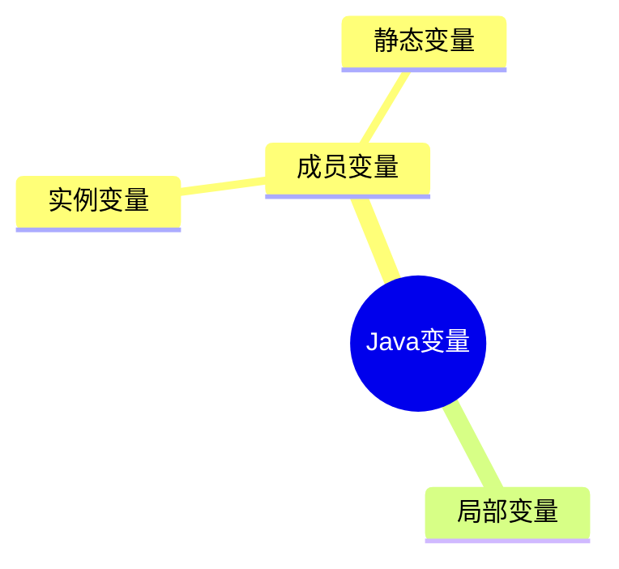

---
分类:
  - "[[01-JavaSE]]"
关联笔记:
描述:
排序: 2000
分组:
创建时间: 2026年06月26日
---
# 基本语法
## 标识符

> [!note] 定义
> Java标识符（Identifier）是程序中用来`命名`变量、方法、类、接口、包等元素的`名称`。

```java
// 变量名
int age = 18;
String name = "张三";

// 方法名
public void printInfo() {
    System.out.println(name);
}

// 类名、接口名、枚举名、注解名
class Student { }
interface Runnable { }
enum Color { RED, GREEN, BLUE }
@interface MyAnnotation { }

// 包名
package com.luguosong.demo;

// 常量名（约定全大写，单词间用下划线分隔）
static final int MAX_SIZE = 100;
static final double PI = 3.14;
```

### 命名规则和规范

> [!note] 规则 vs 规范
> - **规则**：需要==强制执行==的要求，违反会导致编译不通过。
> - **规范**：良好的习惯和约定，遵守可提升代码可读性，但不强制。

#### 命名规则

由字母、数字、下划线 `_`、美元符号 `$` 组成；不能以数字开头、不能是关键字、区分大小写、长度无限制。其中"字母"指任意国家文字（Java 支持 Unicode）。

```java
// 合法标识符只能包含：字母、数字、下划线、美元符
int age = 1;
int _count = 2;
int $price = 3;

// Java 支持 Unicode，"字母"可以是中文等任意文字
int 年龄 = 18;
String 姓名 = "张三";

// 不能以数字开头（编译报错）
// int 1name = 1;

// 不能是关键字，如 public、class、void（编译报错）
// int class = 1;

// 区分大小写：Foo 与 foo 是两个不同的标识符
int Foo = 1;
int foo = 2;
```

#### 命名规范

总则：==见名知意==，采用==驼峰式==命名。各类标识符约定如下：

| 适用对象 | 命名规范 | 示例 |
|---|---|---|
| 类、接口、枚举、注解 | 大驼峰（每个单词首字母大写） | `StudentService`、`UserService` |
| 变量、方法 | 小驼峰（首字母小写，后续单词首字母大写） | `doSome`、`doOther` |
| 常量 | 全大写，单词间用下划线连接 | `LOGIN_SUCCESS`、`SYSTEM_ERROR` |
| 包名 | 全部小写 | `com.luguosong.demo` |

## 关键字

> [!note] 定义
> Java 语言规范预定义的`保留字`，编译器赋予其特殊语义，**不可用作`标识符`**。

其中一部分随 JDK 版本演进而引入的关键字为「上下文关键字」——仅在特定语法位置作为关键字，其它位置仍可作标识符（Java 借此在不破坏既有代码的前提下演进语言）。

下面按用途分类整理，新引入的关键字在括号内标注版本。

> [!note] `true` / `false` / `null` 不是关键字
> 它们看起来像关键字，其实是**字面量**（literals），同样不能作为标识符使用。

### 数据类型

| | | | | |
|---|---|---|---|---|
| `boolean` | `byte` | `char` | `short` | `int` |
| `long` | `float` | `double` | `void` | |

### 流程控制

| | | | | |
|---|---|---|---|---|
| `if` | `else` | `switch` | `case` | `default` |
| `when`（JDK 21，模式匹配守卫） | `for` | `do` | `while` | `break` |
| `continue` | `return` | `yield`（JDK 14，switch 表达式返回值） | `assert`（JDK 1.4 新增） | |

### 访问修饰符

| | | | | |
|---|---|---|---|---|
| `public` | `protected` | `private` | |

### 类、接口与对象

| | | | | |
|---|---|---|---|---|
| `class` | `interface` | `enum`（JDK 5.0 新增） | `record`（JDK 16，记录类） | `value`（JDK 26 预览，值类） |
| `extends` | `implements` | `sealed`（JDK 17，密封类） | `permits`（JDK 17，授权子类型） | `non-sealed`（JDK 17，取消密封） |
| `new` | `this` | `super` | `instanceof` | |

### 成员修饰符

| | | | | |
|---|---|---|---|---|
| `final` | `abstract` | `static` | `native` | `transient` |
| `volatile` | `synchronized` | `strictfp`（JDK 1.2 新增） | | |

### 异常处理

| | | | | |
|---|---|---|---|---|
| `try` | `catch` | `finally` | `throw` | `throws` |

### 包与声明

| | | | | |
|---|---|---|---|---|
| `package` | `import` | `var`（JDK 10，局部变量类型推断） | `_`（JDK 22，未命名变量） | |

### 模块系统

均为 JDK 9 引入：

| | | | | |
|---|---|---|---|---|
| `module` | `open` | `requires` | `transitive` | `exports` |
| `opens` | `to` | `uses` | `provides` | `with` |

### 保留未使用

| | | | | |
|---|---|---|---|---|
| `const` | `goto` | | | |
## 字面量

> [!note] 定义
> `字面量`是源代码中值的直接表示，编译器在编译期即可确定其`类型`和`值`，无需运算或方法调用。

```java
// 整数型字面量
int dec = 100;           // 十进制
int oct = 0144;          // 八进制（以 0 开头）
int hex = 0x64;          // 十六进制（以 0x 开头）
int bin = 0b1100100;     // 二进制（以 0b 开头，JDK 7+）
int big = 1_000_000;     // 下划线分隔，便于阅读（JDK 7+）
long l = 100L;           // long 型需加 L 后缀

// 浮点型字面量
double d = 3.14;         // 默认为 double
double d2 = 3.14D;       // D 后缀（可省略）
float f = 3.14F;         // float 型必须加 F 后缀
double sci = 1.5e3;      // 科学计数法，等价于 1500.0

// 布尔型字面量
boolean flag = true;
boolean done = false;

// 字符型字面量（使用单引号）
char letter = 'A';       // 普通字符
char newline = '\n';     // 转义字符
char unicode = '\u0041'; // Unicode 表示，等价于 'A'

// 字符串型字面量（使用双引号）
String name = "张三";
String path = "C:\\Users";            // 转义反斜杠
String json = """
        {"name": "张三"}              // 文本块（JDK 15+），保留换行与缩进
        """;
```

## 变量

> [!note] 定义
> `变量`是程序在运行期间可以改变其`值`的命名存储单元。
>
> 本质上是：一块`内存空间`的符号化引用。

变量三要素：

- 数据类型
- 变量名
- 变量值

```java
// 变量三要素：数据类型、变量名、变量值
int age = 18;
//  类型   名字   值
```

```java
// 声明变量
int age;

// 赋值变量
age = 18;

// 访问变量：读取
System.out.println(age);

// 访问变量：修改
age = 20;

// 声明时同时赋值（最常用）
int score = 100;
```

> [!tip] 变量的作用
> - 便于代码的维护
> - 增强代码的可读性

```java
// 变量使用细节代码示例

// 必须先声明、再赋值，才能访问（方法体自上而下逐行执行）
// System.out.println(age);  // 错：此时 age 还没声明
int age;
age = 18;
System.out.println(age);      // 对：声明并赋值后再访问

// 一行可以声明多个变量
int a, b, c;
int x = 1, y = 2, z = 3;

// 同作用域内变量名不能重名，但可以重新赋值
int count = 0;
count = 5;                    // 对：重新赋值
// int count = 10;            // 错：重名

// 变量值的数据类型必须和变量类型一致
// String name = 100;         // 错：类型不匹配
```

### 作用域

> [!note] 定义
> `作用域`（Scope）是变量在程序中`可见`且`可被访问`的代码区域。变量只在声明它的作用域内有效，出了作用域就不再存在、也无法引用。

```java
public class ScopeDemo {

    // 成员变量：整个类的方法都能访问
    private String name = "张三";

    public void demo(int param) {   // 方法参数：整个方法体可见
        int age = 18;               // 局部变量：从此处到方法 } 结束
        System.out.println(name + age + param);   // 对：都在作用域内

        {
            int blockVar = 100;     // 局部变量：仅在此 {} 内
        }
        // System.out.println(blockVar);  // 错：已超出 blockVar 的作用域
    }

    public void other() {
        // System.out.println(age);        // 错：age 属于 demo 方法，这里不可见
    }
}
```
### 变量分类

> [!note] 定义
> Java 变量按`声明位置`分为两大类：`成员变量`（类中、方法外）和`局部变量`（方法 / 代码块内）。`成员变量`又按是否有 `static` 修饰，细分为`实例变量`和`静态变量`。



| 变量类型 | 声明位置 | static | 属于 | 默认值 |
|---|---|---|---|---|
| `局部变量` | 方法体 / 代码块 `{}` | 不可加 | 方法调用 | 无，必须显式初始化 |
| `实例变量` | 类中、方法外 | 无 | 对象实例 | 有（`0` / `null` / `false`） |
| `静态变量` | 类中、方法外 | 有 | 类本身 | 有（`0` / `null` / `false`） |

> [!note] 成员变量 = 实例变量 + 静态变量
> `成员变量`是总称，指所有声明在「类中、方法外」的变量。其中不带 `static` 的是`实例变量`，带 `static` 的是`静态变量`（又称类变量）。三者是**包含关系**，不是并列。

```java
public class VariableDemo {

    // 静态变量（类变量）：属于类，所有实例共享同一份
    static String country = "中国";

    // 实例变量：属于对象，每个对象各有一份
    String name;
    int age;

    public void show() {
        // 局部变量：方法内，方法执行完即销毁
        String msg = "hello";
        System.out.println(country + name + age + msg);
    }

    public static void main(String[] args) {
        // 实例变量：通过对象访问
        VariableDemo v = new VariableDemo();
        v.name = "张三";

        // 静态变量：通过类名访问（推荐），也可通过对象访问
        System.out.println(VariableDemo.country);
    }
}
```
## 计算机底层存储数据原理

### 二进制

二进制「逢二进一」，只使用 `0` 和 `1` 两个数字。

计算机底层只能识别二进制。其内部电子元件只有两种物理状态——开 / 关（或高电平 / 低电平），恰好对应二进制的 `0` 和 `1`。因此无论使用何种编程语言、处理何种数据类型，所有数据最终都要转化为二进制形式，才能被计算机识别、处理和存储。

#### 十进制与二进制对照

| 十进制 | 二进制 |
|---|---|
| 1 | 1 |
| 2 | 10 |
| 3 | 11 |
| 4 | 100 |
| 5 | 101 |
| 6 | 110 |
| 7 | 111 |
| 8 | 1000 |
| 9 | 1001 |
| 10 | 1010 |

#### 权值

> [!note] 定义
> `权值`指二进制中每一位所代表的数值大小，即该位置上的数字实际表示的十进制值。

8 位二进制从最高位（第 7 位）到最低位（第 0 位），各位的权值依次为：

| 位次 | 权值 |
|---|---|
| 第 7 位（最高位） | 128 |
| 第 6 位 | 64 |
| 第 5 位 | 32 |
| 第 4 位 | 16 |
| 第 3 位 | 8 |
| 第 2 位 | 4 |
| 第 1 位 | 2 |
| 第 0 位（最低位） | 1 |

#### 二进制转十进制

==按权展开求和==：把二进制每一位乘以该位的权值，再相加。

以二进制 `1101` 为例（各位权值 `8 4 2 1`）：

```text
  1×8 + 1×4 + 0×2 + 1×1
= 8 + 4 + 0 + 1
= 13

即 1101（二进制）= 13（十进制）
```

#### 十进制转二进制

==除 2 取余，逆序输出==：用十进制数不断除以 2，记录每次余数，直到商为 0，最后将余数从下往上排列。

以十进制 `13` 为例：

```text
       运算         余数
  13 ÷ 2 = 6   →    1
   6 ÷ 2 = 3   →    0
   3 ÷ 2 = 1   →    1
   1 ÷ 2 = 0   →    1   ← 从下往上读

  结果：1101（13 的二进制）
```

### 八进制

八进制「逢八进一」，使用 `0`～`7` 八个数字。每 ==3 位二进制正好对应 1 位八进制==，因此常作为二进制的简写。

#### 十进制与八进制对照

| 十进制 | 八进制 |
|---|---|
| 1 | 1 |
| 2 | 2 |
| 3 | 3 |
| 4 | 4 |
| 5 | 5 |
| 6 | 6 |
| 7 | 7 |
| 8 | 10 |
| 9 | 11 |
| 10 | 12 |

#### 八进制转十进制

==按权展开求和==：把八进制每一位乘以该位的权值，再相加。

以八进制 `15` 为例（各位权值 `8 1`）：

```text
  1×8 + 5×1
= 8 + 5
= 13

即 15（八进制）= 13（十进制）
```

#### 十进制转八进制

==除 8 取余，逆序输出==：用十进制数不断除以 8，记录每次余数，直到商为 0，最后将余数从下往上排列。

以十进制 `13` 为例：

```text
       运算         余数
  13 ÷ 8 = 1   →    5
   1 ÷ 8 = 0   →    1   ← 从下往上读

  结果：15（13 的八进制）
```

### 十六进制

十六进制「逢十六进一」，使用 `0`～`9` 和 `A`～`F` 共十六个符号（`A`=10 … `F`=15）。每 ==4 位二进制正好对应 1 位十六进制==，比八进制更紧凑，常用于表示内存地址、颜色值等。

#### 十进制与十六进制对照

| 十进制 | 十六进制 |
|---|---|
| 1 | 1 |
| 2 | 2 |
| 3 | 3 |
| 4 | 4 |
| 5 | 5 |
| 6 | 6 |
| 7 | 7 |
| 8 | 8 |
| 9 | 9 |
| 10 | A |
| 11 | B |
| 12 | C |
| 13 | D |
| 14 | E |
| 15 | F |
| 16 | 10 |

#### 十六进制转十进制

==按权展开求和==：把十六进制每一位乘以该位的权值，再相加（字母先换算成对应十进制数）。

以十六进制 `2F` 为例（各位权值 `16 1`，`F`=15）：

```text
  2×16 + F(15)×1
= 32 + 15
= 47

即 2F（十六进制）= 47（十进制）
```

#### 十进制转十六进制

==除 16 取余，逆序输出==：用十进制数不断除以 16，记录每次余数（10～15 改写成 `A`～`F`），直到商为 0，最后将余数从下往上排列。

以十进制 `47` 为例：

```text
       运算          余数
  47 ÷ 16 = 2   →    15 → F
   2 ÷ 16 = 0   →    2       ← 从下往上读

  结果：2F（47 的十六进制）
```

#### 十六进制转二进制

==逐位展开，每位转 4 位二进制==：将十六进制的每一个数字独立转换为 4 位二进制（不足 4 位在左侧补 0），再按原顺序拼接即可。

以十六进制 `2F` 为例（`2`→`0010`，`F`→`1111`）：

```text
  2   →  0010
  F   →  1111

  拼接：0010 1111

  即 2F（十六进制）= 00101111（二进制）
```

#### 二进制转十六进制

==四位一组，逐组转十六进制==：将二进制数从右往左每 4 位分为一组（最左端不足 4 位则在左侧补 0），再把每组 4 位二进制转换为对应的十六进制数，最后按原顺序拼接。

以二进制 `101111` 为例：

```text
  从右往左分组：10 | 1111
  最左端补 0 ：0010 | 1111
  逐组转换 ： 2   |   F

  拼接：2F

  即 101111（二进制）= 2F（十六进制）
```

### 比特和字节

> [!note] 定义
> `比特`（bit）是计算机中最小的存储单位。`字节`（byte）由 8 个比特组成，数据通常以字节为单位进行存储和传输。

存储单位从小到大换算（每级均为前一级的 ==1024== 倍）：

| 单位 | 换算关系 |
|---|---|
| 1 KB | 1024 byte |
| 1 MB | 1024 KB |
| 1 GB | 1024 MB |
| 1 TB | 1024 GB |

### 原码反码补码

二进制有三种表现形式：`原码`、`反码`、`补码`。其中原码最符合人类直观认知，而计算机底层统一采用补码。

> [!note] 定义
> 在带符号数中，`最高位`是`符号位`：`0` 代表正数，`1` 代表负数，其余位表示数值。

三种码中，**正数的原码、反码、补码==三码相同==**，无需任何转换；只有负数需要从原码出发、经反码、最终得到补码。

> [!important] 一句话看透本质
> 负数 `−x` 在 n 位系统中的补码，等于 ==`2ⁿ − x`==（例如 8 位下 `256 − x`）。「逐位取反、再加一」只是**求这个补数的电路实现方式**——每一步都对应确定的数学运算，不是凑出来的口诀。下面从这一本质出发，逐步拆解。

**原码** —— 最直观的表示：符号位 + 数值位的二进制绝对值。负数原码的取法是「先把绝对值转为二进制，再把最高位改为 `1`」。

| 十进制 | 原码（8 位） | 说明 |
|---|---|---|
| `+6` | `00000110` | 符号位 0，数值位为 6 |
| `-6` | `10000110` | 符号位 1，数值位仍为 6 |
| `+1` | `00000001` | 符号位 0，数值位为 1 |
| `-1` | `10000001` | 符号位 1，数值位为 1 |
| `+0` | `00000000` | 0 的正数表示 |
| `-0` | `10000000` | 0 的负数表示 |

> [!warning] 原码的「双 0」问题
> 原码里 `0` 有两种写法：`+0`（`00000000`）和 `-0`（`10000000`），数学上相等但编码不同。这会导致运算结果不唯一，是原码无法直接用于运算的重要原因之一。

**反码** —— 在原码基础上：符号位不变，其余位==逐位取反==（`0` 变 `1`，`1` 变 `0`）。

> [!info] 「取反」的本质：用全 1 去减
> n 位==全 1== 的值是 `2ⁿ − 1`（8 位即 `11111111` = 255）。逐位取反等价于用这个「全 1」去减原值：
>
> ```
> 取反：  ~x  =  (2ⁿ − 1) − x
> ```
>
> 所以「取反」本质是**求 `2ⁿ − 1` 的补数**（对「全 1」求补）。这正是反码英文叫 ones' complement（对 1 求补）的原因——它是原码通往补码的中间产物。

| 十进制 | 原码 | → 反码 | 取反的本质 |
|---|---|---|---|
| `+6` | `00000110` | `00000110` | 正数，反码 = 原码 |
| `-6` | `10000110` | `11111001` | 数值位 `0000110` → `1111001` |
| `+1` | `00000001` | `00000001` | 正数，反码 = 原码 |
| `-1` | `10000001` | `11111110` | 数值位 `0000001` → `1111110` |
| `+0` | `00000000` | `00000000` | — |
| `-0` | `10000000` | `11111111` | 反码依然有两个 0 |

**补码** —— 在反码基础上 `+1`（符号位参与运算），这就是计算机底层真正存储的形式。

> [!info] 「加一」的本质：把基底从 2ⁿ−1 抬到 2ⁿ
> 反码只减了 `2ⁿ − 1`，离目标 `2ⁿ − x` 还差 1。补上这一步：
>
> ```
> 取反加一：  ~x + 1  =  (2ⁿ − 1) − x + 1  =  2ⁿ − x
> ```
>
> 于是结果 ==`2ⁿ − x`==，恰好等于负数 `−x` 在模 `2ⁿ` 下的补数。「加一」就是补上「取反少减的那一个 1」。补码英文 two's complement（对 2ⁿ 求补）即由此而来。

| 十进制 | 反码 | → 补码 | 加一的本质 |
|---|---|---|---|
| `+6` | `00000110` | `00000110` | 正数，补码 = 原码 |
| `-6` | `11111001` | `11111010` | `255 − 6 + 1` = `256 − 6` = 250 |
| `+1` | `00000001` | `00000001` | 正数，补码 = 原码 |
| `-1` | `11111110` | `11111111` | `255 − 1 + 1` = `256 − 1` = 255 |
| `+0` | `00000000` | `00000000` | — |
| `-0` | `11111111` | `00000000` | ==+1 后溢出，变成 +0== |

> [!tip] 补码消灭了「双 0」
> 上表最后一行是关键：`-0` 的反码 `11111111` 再 `+1` 得到 `1 00000000`，最高位进位被丢弃，结果变成 `00000000`，与 `+0` 完全相同。于是补码里 ==0 只有一种表示==，这正是补码能正确运算的基础。

**完整转换链路** —— 以 `-6`（8 位，`2⁸ = 256`）为例，把三步连起来，每一步标注对应的数学本质：

```text
  第一步 原码：绝对值 6 = 00000110，最高位置 1
            → 原码：1 0000110
                       ↑ 符号位 1 表示负数

  第二步 反码：符号位不变，数值位逐位取反
            原码：1 0000110
            反码：1 1111001     本质 = 255 − 6 = 249

  第三步 补码：反码 +1（符号位参与运算）
            反码：11111001
                 +       1
            ─────────
            补码：11111010     本质 = 249 + 1 = 256 − 6 = 250
```

最终 `-6` 在计算机中以补码 `11111010`（= 250）存储。三码对照小结：

| 表示 | 值（8 位） | 十进制 | 本质 |
|---|---|---|---|
| 原码 | `10000110` | — | 符号位 + 绝对值 |
| 反码 | `11111001` | 249 | `2⁸−1 − 6`（对全 1 求补） |
| 补码 | `11111010` | 250 | `2⁸ − 6`（对 2⁸ 求补） |

> [!tip] 补码还原原码
> 对补码再做一次「逐位取反、+1」，即可还原为原码（与原码转补码步骤完全相同）。即转换是可逆的：原码 →（取反 +1）→ 补码 →（取反 +1）→ 原码。从本质看：对 `2ⁿ − x` 再求一次 `2ⁿ` 补数，得到 `2ⁿ − (2ⁿ − x)` = `x`，回到原值。

> [!warning] byte 取值范围与 -128 特例
> byte 的取值范围是 ==-128 ~ 127==，补码从 `10000000` 到 `01111111`。其中 `-128` 是补码的**特例**：8 位下它只有补码 `10000000`（= `256 − 128` = 128），**没有对应的原码和反码**（原码/反码的范围仅 -127 ~ +127）。

**代码验证** —— 在 Java 中，整数在底层一律以补码存储。下面每一步都直接对照数学本质：

```java
public class ComplementDemo {
    public static void toBin(int num) {
        // 输出 num 的补码二进制（int 为 32 位，正数省略前导 0）
        System.out.println(num + " 的补码：" + Integer.toBinaryString(num));
    }

    public static void main(String[] args) {
        // 正数：补码 = 原码，省略前导 0
        toBin(6);     //  6 的补码：110
        toBin(1);     //  1 的补码：1

        // 负数：输出 32 位补码，高位全是 1
        toBin(-6);    // -6 的补码：11111111111111111111111111111010
        toBin(-1);    // -1 的补码：11111111111111111111111111111111

        // 逐位取反：本质是用全 1 去减，~6 = 255 − 6 = 249（低 8 位 11111001）
        System.out.println("~6  = " + (~6));        // ~6  = -7

        // 取反加一：本质是从 2⁸ 减，(~6 & 0xFF) + 1 = 250 = 11111010
        int invert = (~6 & 0xFF) + 1;               // 249 + 1 = 250
        System.out.println("(~6 & 0xFF) + 1 = " + invert);   // 250
        System.out.println("即 2⁸ − 6 = " + (256 - 6));      // 256 − 6 = 250

        // 验证：-6 的 32 位补码低 8 位正是 11111010，与手算结果一致
        byte b = -6;
        String s = Integer.toBinaryString(b & 0xFF);
        System.out.println("-6 的 8 位补码：" + String.format("%8s", s).replace(' ', '0'));
        // 输出：-6 的 8 位补码：11111010
    }
}
```

> [!note] 为什么 `~6` 等于 `-7` 而不是 `249`
> Java 中 `~` 是对 32 位 `int` 取反，`~6` 得到的是 `2³² − 1 − 6` = `2³² − 7`，作为带符号 int 解读正是 `-7`。而上面讲反码时说的「249」是限制在 8 位内的结果（`& 0xFF` 截取低 8 位）。这正是下一步用 `& 0xFF` 的原因。

> [!note] 为什么 `byte` 要 `& 0xFF`
> `byte` 在参与运算时会先==提升为 int==（符号扩展：负数高位补 1），直接 `toBinaryString(b)` 会得到 32 位结果。`b & 0xFF` 相当于只取低 8 位，再格式化为 8 位，就能看到与手算一致的 `11111010`。

#### 为什么采用补码

| 原因 | 说明 |
|---|---|
| 简化电路设计 | 补码将减法统一为加法，加减法共用同一套电路，运算更高效 |
| 统一 +0 / -0 | 原码中 0 有两种表示（`+0`、`-0`），补码只有一种 `00000000`，保证运算结果唯一 |
| 扩大负数范围 | 省掉 `-0` 后多出一个编码 `10000000`，恰好用于表示 `-128`，使 byte 范围扩展到 -128 ~ 127 |

下面以 `(-3) + 2` 为例，分别用原码和补码进行实际计算（均为 8 位），直观对比两者差异。期望结果：`-3 + 2 = -1`。

**用原码计算（结果错误）**

先写出两个数的原码：

```text
  -3 的原码：10000011
  +2 的原码：00000010
```

若直接按位相加（符号位也参与）：

```text
    10000011   ← -3 的原码
  + 00000010   ← +2 的原码
  ─────────
    10000101   ← 符号位 1（负），数值位 0000101 = 5，解读为 -5
```

得到 `-5`，与正确答案 `-1` 不符，==计算失败==。

原因：原码的符号位只是「正 / 负」的标记，并不表示数值大小。直接相加时，符号位被当成普通比特参与运算，丢失了正负语义；数值位也无法正确对齐。因此用原码做减法，必须先比较两数绝对值大小、再决定做加还是做减、最后修正符号——无法用一套统一的加法电路完成。

**用补码计算（结果正确）**

先求出两个数的补码：

```text
  -3 的补码：原码 10000011 → 反码 11111100 → 补码 11111101
  +2 的补码：00000010   （正数三码相同）
```

按位相加，符号位一并参与运算：

```text
    11111101   ← -3 的补码
  + 00000010   ← +2 的补码
  ─────────
    11111111   ← 结果的补码
```

结果 `11111111` 符号位为 `1`（负数），还原为原码：逐位取反得 `00000000`，再 `+1` 得 `00000001`，故原码为 `10000001`，即 ==-1==，与 `-3 + 2 = -1` 完全吻合，==计算成功==。

> [!info] 为什么补码能算对，而原码不行？
> 补码的关键在于：把最高位的权值从 `+128` 改成了 ==`-128`==。于是负数 `x` 被存储成 `256 + x`（例如 `-3` 存为 `253 = 11111101`），相当于用「模 256 的补数」来表示负数。
>
> 这样一来，加法中超出 8 位范围的进位会被自然丢弃（即对 256 取模），结果天然等于真实的 `a + b`；减法 `a - b` 也只需算 `a + (-b 的补码)`，==减法被统一成了加法==。CPU 因此只需一套加法器即可同时完成加减运算，电路大大简化。
>
> 而原码因符号位不参与数值、存在 `+0` / `-0` 双重表示等问题，无法做到这一点。

## 数据类型


## 运算符

### 算数匀速阿福

```java
// 加号运算符如果两边是数字，则进行求和运算

// 加号两边只要有一边是字符串，则进行字符串拼接操作

```

## 控制语句

## 方法
