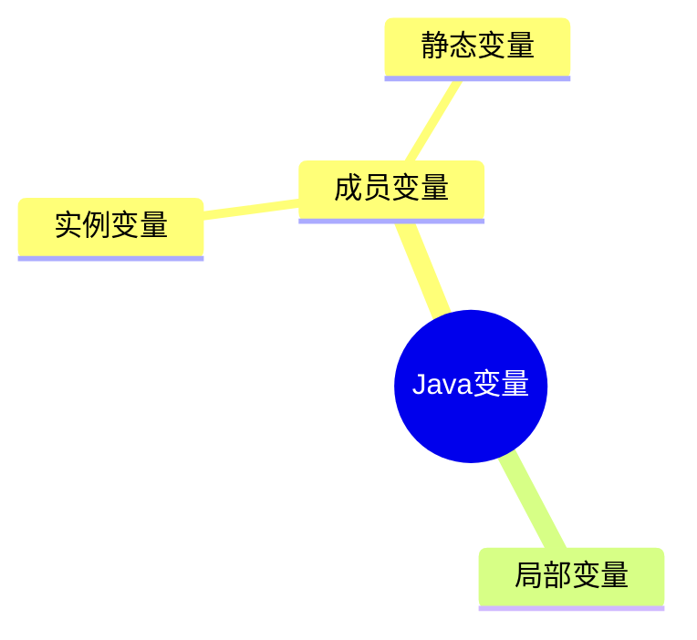
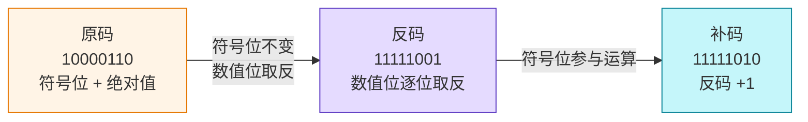
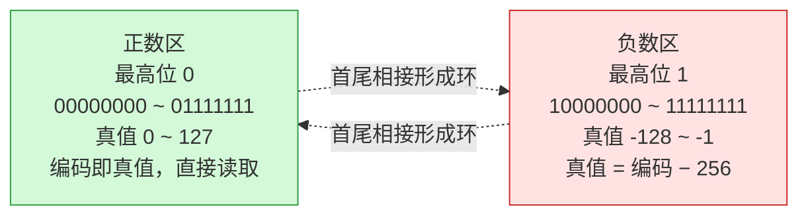
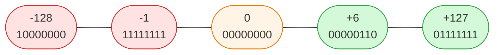

---
分类:
  - "[[01-JavaSE]]"
关联笔记:
描述:
排序: 2000
分组:
创建时间: 2026年06月26日
---
# 基本语法
## 标识符

> [!note] 定义
> Java标识符（Identifier）是程序中用来`命名`变量、方法、类、接口、包等元素的`名称`。

```java
// 变量名
int age = 18;
String name = "张三";

// 方法名
public void printInfo() {
    System.out.println(name);
}

// 类名、接口名、枚举名、注解名
class Student { }
interface Runnable { }
enum Color { RED, GREEN, BLUE }
@interface MyAnnotation { }

// 包名
package com.luguosong.demo;

// 常量名（约定全大写，单词间用下划线分隔）
static final int MAX_SIZE = 100;
static final double PI = 3.14;
```

### 命名规则和规范

> [!note] 规则 vs 规范
> - **规则**：需要==强制执行==的要求，违反会导致编译不通过。
> - **规范**：良好的习惯和约定，遵守可提升代码可读性，但不强制。

#### 命名规则

由字母、数字、下划线 `_`、美元符号 `$` 组成；不能以数字开头、不能是关键字、区分大小写、长度无限制。其中"字母"指任意国家文字（Java 支持 Unicode）。

```java
// 合法标识符只能包含：字母、数字、下划线、美元符
int age = 1;
int _count = 2;
int $price = 3;

// Java 支持 Unicode，"字母"可以是中文等任意文字
int 年龄 = 18;
String 姓名 = "张三";

// 不能以数字开头（编译报错）
// int 1name = 1;

// 不能是关键字，如 public、class、void（编译报错）
// int class = 1;

// 区分大小写：Foo 与 foo 是两个不同的标识符
int Foo = 1;
int foo = 2;
```

#### 命名规范

总则：==见名知意==，采用==驼峰式==命名。各类标识符约定如下：

| 适用对象 | 命名规范 | 示例 |
|---|---|---|
| 类、接口、枚举、注解 | 大驼峰（每个单词首字母大写） | `StudentService`、`UserService` |
| 变量、方法 | 小驼峰（首字母小写，后续单词首字母大写） | `doSome`、`doOther` |
| 常量 | 全大写，单词间用下划线连接 | `LOGIN_SUCCESS`、`SYSTEM_ERROR` |
| 包名 | 全部小写 | `com.luguosong.demo` |

## 关键字

> [!note] 定义
> Java 语言规范预定义的`保留字`，编译器赋予其特殊语义，**不可用作`标识符`**。

其中一部分随 JDK 版本演进而引入的关键字为「上下文关键字」——仅在特定语法位置作为关键字，其它位置仍可作标识符（Java 借此在不破坏既有代码的前提下演进语言）。

下面按用途分类整理，新引入的关键字在括号内标注版本。

> [!note] `true` / `false` / `null` 不是关键字
> 它们看起来像关键字，其实是**字面量**（literals），同样不能作为标识符使用。

### 数据类型

| | | | | |
|---|---|---|---|---|
| `boolean` | `byte` | `char` | `short` | `int` |
| `long` | `float` | `double` | `void` | |

### 流程控制

| | | | | |
|---|---|---|---|---|
| `if` | `else` | `switch` | `case` | `default` |
| `when`（JDK 21，模式匹配守卫） | `for` | `do` | `while` | `break` |
| `continue` | `return` | `yield`（JDK 14，switch 表达式返回值） | `assert`（JDK 1.4 新增） | |

### 访问修饰符

| | | | | |
|---|---|---|---|---|
| `public` | `protected` | `private` | |

### 类、接口与对象

| | | | | |
|---|---|---|---|---|
| `class` | `interface` | `enum`（JDK 5.0 新增） | `record`（JDK 16，记录类） | `value`（JDK 26 预览，值类） |
| `extends` | `implements` | `sealed`（JDK 17，密封类） | `permits`（JDK 17，授权子类型） | `non-sealed`（JDK 17，取消密封） |
| `new` | `this` | `super` | `instanceof` | |

### 成员修饰符

| | | | | |
|---|---|---|---|---|
| `final` | `abstract` | `static` | `native` | `transient` |
| `volatile` | `synchronized` | `strictfp`（JDK 1.2 新增） | | |

### 异常处理

| | | | | |
|---|---|---|---|---|
| `try` | `catch` | `finally` | `throw` | `throws` |

### 包与声明

| | | | | |
|---|---|---|---|---|
| `package` | `import` | `var`（JDK 10，局部变量类型推断） | `_`（JDK 22，未命名变量） | |

### 模块系统

均为 JDK 9 引入：

| | | | | |
|---|---|---|---|---|
| `module` | `open` | `requires` | `transitive` | `exports` |
| `opens` | `to` | `uses` | `provides` | `with` |

### 保留未使用

| | | | | |
|---|---|---|---|---|
| `const` | `goto` | | | |
## 字面量

> [!note] 定义
> `字面量`是源代码中值的直接表示，编译器在编译期即可确定其`类型`和`值`，无需运算或方法调用。

```java
// 整数型字面量
int dec = 100;           // 十进制
int oct = 0144;          // 八进制（以 0 开头）
int hex = 0x64;          // 十六进制（以 0x 开头）
int bin = 0b1100100;     // 二进制（以 0b 开头，JDK 7+）
int big = 1_000_000;     // 下划线分隔，便于阅读（JDK 7+）
long l = 100L;           // long 型需加 L 后缀

// 浮点型字面量
double d = 3.14;         // 默认为 double
double d2 = 3.14D;       // D 后缀（可省略）
float f = 3.14F;         // float 型必须加 F 后缀
double sci = 1.5e3;      // 科学计数法，等价于 1500.0

// 布尔型字面量
boolean flag = true;
boolean done = false;

// 字符型字面量（使用单引号）
char letter = 'A';       // 普通字符
char newline = '\n';     // 转义字符
char unicode = '\u0041'; // Unicode 表示，等价于 'A'

// 字符串型字面量（使用双引号）
String name = "张三";
String path = "C:\\Users";            // 转义反斜杠
String json = """
        {"name": "张三"}              // 文本块（JDK 15+），保留换行与缩进
        """;
```

## 变量

> [!note] 定义
> `变量`是程序在运行期间可以改变其`值`的命名存储单元。
>
> 本质上是：一块`内存空间`的符号化引用。

变量三要素：

- 数据类型
- 变量名
- 变量值

```java
// 变量三要素：数据类型、变量名、变量值
int age = 18;
//  类型   名字   值
```

```java
// 声明变量
int age;

// 赋值变量
age = 18;

// 访问变量：读取
System.out.println(age);

// 访问变量：修改
age = 20;

// 声明时同时赋值（最常用）
int score = 100;
```

> [!tip] 变量的作用
> - 便于代码的维护
> - 增强代码的可读性

```java
// 变量使用细节代码示例

// 必须先声明、再赋值，才能访问（方法体自上而下逐行执行）
// System.out.println(age);  // 错：此时 age 还没声明
int age;
age = 18;
System.out.println(age);      // 对：声明并赋值后再访问

// 一行可以声明多个变量
int a, b, c;
int x = 1, y = 2, z = 3;

// 同作用域内变量名不能重名，但可以重新赋值
int count = 0;
count = 5;                    // 对：重新赋值
// int count = 10;            // 错：重名

// 变量值的数据类型必须和变量类型一致
// String name = 100;         // 错：类型不匹配
```

### 作用域

> [!note] 定义
> `作用域`（Scope）是变量在程序中`可见`且`可被访问`的代码区域。变量只在声明它的作用域内有效，出了作用域就不再存在、也无法引用。

```java
public class ScopeDemo {

    // 成员变量：整个类的方法都能访问
    private String name = "张三";

    public void demo(int param) {   // 方法参数：整个方法体可见
        int age = 18;               // 局部变量：从此处到方法 } 结束
        System.out.println(name + age + param);   // 对：都在作用域内

        {
            int blockVar = 100;     // 局部变量：仅在此 {} 内
        }
        // System.out.println(blockVar);  // 错：已超出 blockVar 的作用域
    }

    public void other() {
        // System.out.println(age);        // 错：age 属于 demo 方法，这里不可见
    }
}
```
### 变量分类

> [!note] 定义
> Java 变量按`声明位置`分为两大类：`成员变量`（类中、方法外）和`局部变量`（方法 / 代码块内）。`成员变量`又按是否有 `static` 修饰，细分为`实例变量`和`静态变量`。



| 变量类型 | 声明位置 | static | 属于 | 默认值 |
|---|---|---|---|---|
| `局部变量` | 方法体 / 代码块 `{}` | 不可加 | 方法调用 | 无，必须显式初始化 |
| `实例变量` | 类中、方法外 | 无 | 对象实例 | 有（`0` / `null` / `false`） |
| `静态变量` | 类中、方法外 | 有 | 类本身 | 有（`0` / `null` / `false`） |

> [!note] 成员变量 = 实例变量 + 静态变量
> `成员变量`是总称，指所有声明在「类中、方法外」的变量。其中不带 `static` 的是`实例变量`，带 `static` 的是`静态变量`（又称类变量）。三者是**包含关系**，不是并列。

```java
public class VariableDemo {

    // 静态变量（类变量）：属于类，所有实例共享同一份
    static String country = "中国";

    // 实例变量：属于对象，每个对象各有一份
    String name;
    int age;

    public void show() {
        // 局部变量：方法内，方法执行完即销毁
        String msg = "hello";
        System.out.println(country + name + age + msg);
    }

    public static void main(String[] args) {
        // 实例变量：通过对象访问
        VariableDemo v = new VariableDemo();
        v.name = "张三";

        // 静态变量：通过类名访问（推荐），也可通过对象访问
        System.out.println(VariableDemo.country);
    }
}
```
## 计算机底层存储数据原理

### 二进制

二进制「逢二进一」，只使用 `0` 和 `1` 两个数字。

计算机底层只能识别二进制。其内部电子元件只有两种物理状态——开 / 关（或高电平 / 低电平），恰好对应二进制的 `0` 和 `1`。因此无论使用何种编程语言、处理何种数据类型，所有数据最终都要转化为二进制形式，才能被计算机识别、处理和存储。

#### 十进制与二进制对照

| 十进制 | 二进制 |
|---|---|
| 1 | 1 |
| 2 | 10 |
| 3 | 11 |
| 4 | 100 |
| 5 | 101 |
| 6 | 110 |
| 7 | 111 |
| 8 | 1000 |
| 9 | 1001 |
| 10 | 1010 |

#### 权值

> [!note] 定义
> `权值`指二进制中每一位所代表的数值大小，即该位置上的数字实际表示的十进制值。

8 位二进制从最高位（第 7 位）到最低位（第 0 位），各位的权值依次为：

| 位次 | 权值 |
|---|---|
| 第 7 位（最高位） | 128 |
| 第 6 位 | 64 |
| 第 5 位 | 32 |
| 第 4 位 | 16 |
| 第 3 位 | 8 |
| 第 2 位 | 4 |
| 第 1 位 | 2 |
| 第 0 位（最低位） | 1 |

#### 二进制转十进制

==按权展开求和==：把二进制每一位乘以该位的权值，再相加。

以二进制 `1101` 为例（各位权值 `8 4 2 1`）：

```text
  1×8 + 1×4 + 0×2 + 1×1
= 8 + 4 + 0 + 1
= 13

即 1101（二进制）= 13（十进制）
```

#### 十进制转二进制

==除 2 取余，逆序输出==：用十进制数不断除以 2，记录每次余数，直到商为 0，最后将余数从下往上排列。

以十进制 `13` 为例：

```text
       运算         余数
  13 ÷ 2 = 6   →    1
   6 ÷ 2 = 3   →    0
   3 ÷ 2 = 1   →    1
   1 ÷ 2 = 0   →    1   ← 从下往上读

  结果：1101（13 的二进制）
```

### 八进制

八进制「逢八进一」，使用 `0`～`7` 八个数字。每 ==3 位二进制正好对应 1 位八进制==，因此常作为二进制的简写。

#### 十进制与八进制对照

| 十进制 | 八进制 |
|---|---|
| 1 | 1 |
| 2 | 2 |
| 3 | 3 |
| 4 | 4 |
| 5 | 5 |
| 6 | 6 |
| 7 | 7 |
| 8 | 10 |
| 9 | 11 |
| 10 | 12 |

#### 八进制转十进制

==按权展开求和==：把八进制每一位乘以该位的权值，再相加。

以八进制 `15` 为例（各位权值 `8 1`）：

```text
  1×8 + 5×1
= 8 + 5
= 13

即 15（八进制）= 13（十进制）
```

#### 十进制转八进制

==除 8 取余，逆序输出==：用十进制数不断除以 8，记录每次余数，直到商为 0，最后将余数从下往上排列。

以十进制 `13` 为例：

```text
       运算         余数
  13 ÷ 8 = 1   →    5
   1 ÷ 8 = 0   →    1   ← 从下往上读

  结果：15（13 的八进制）
```

### 十六进制

十六进制「逢十六进一」，使用 `0`～`9` 和 `A`～`F` 共十六个符号（`A`=10 … `F`=15）。每 ==4 位二进制正好对应 1 位十六进制==，比八进制更紧凑，常用于表示内存地址、颜色值等。

#### 十进制与十六进制对照

| 十进制 | 十六进制 |
|---|---|
| 1 | 1 |
| 2 | 2 |
| 3 | 3 |
| 4 | 4 |
| 5 | 5 |
| 6 | 6 |
| 7 | 7 |
| 8 | 8 |
| 9 | 9 |
| 10 | A |
| 11 | B |
| 12 | C |
| 13 | D |
| 14 | E |
| 15 | F |
| 16 | 10 |

#### 十六进制转十进制

==按权展开求和==：把十六进制每一位乘以该位的权值，再相加（字母先换算成对应十进制数）。

以十六进制 `2F` 为例（各位权值 `16 1`，`F`=15）：

```text
  2×16 + F(15)×1
= 32 + 15
= 47

即 2F（十六进制）= 47（十进制）
```

#### 十进制转十六进制

==除 16 取余，逆序输出==：用十进制数不断除以 16，记录每次余数（10～15 改写成 `A`～`F`），直到商为 0，最后将余数从下往上排列。

以十进制 `47` 为例：

```text
       运算          余数
  47 ÷ 16 = 2   →    15 → F
   2 ÷ 16 = 0   →    2       ← 从下往上读

  结果：2F（47 的十六进制）
```

#### 十六进制转二进制

==逐位展开，每位转 4 位二进制==：将十六进制的每一个数字独立转换为 4 位二进制（不足 4 位在左侧补 0），再按原顺序拼接即可。

以十六进制 `2F` 为例（`2`→`0010`，`F`→`1111`）：

```text
  2   →  0010
  F   →  1111

  拼接：0010 1111

  即 2F（十六进制）= 00101111（二进制）
```

#### 二进制转十六进制

==四位一组，逐组转十六进制==：将二进制数从右往左每 4 位分为一组（最左端不足 4 位则在左侧补 0），再把每组 4 位二进制转换为对应的十六进制数，最后按原顺序拼接。

以二进制 `101111` 为例：

```text
  从右往左分组：10 | 1111
  最左端补 0 ：0010 | 1111
  逐组转换 ： 2   |   F

  拼接：2F

  即 101111（二进制）= 2F（十六进制）
```

### 比特和字节

> [!note] 定义
> `比特`（bit）是计算机中最小的存储单位。`字节`（byte）由 8 个比特组成，数据通常以字节为单位进行存储和传输。

存储单位从小到大换算（每级均为前一级的 ==1024== 倍）：

| 单位 | 换算关系 |
|---|---|
| 1 KB | 1024 byte |
| 1 MB | 1024 KB |
| 1 GB | 1024 MB |
| 1 TB | 1024 GB |

### 原码反码补码🚧

二进制有三种表现形式：`原码`、`反码`、`补码`。原码最符合人类直觉，计算机底层则统一采用补码。本节由浅入深：先认识三种码的写法，再走一遍完整转换，最后揭示补码的本质。

> [!note] 前置：符号位
> 三种码都遵循同一约定——`最高位`是`符号位`：`0` 代表正数，`1` 代表负数，其余位表示数值。

#### 三种码的写法

**原码** —— 最直观：符号位 + 数值位的二进制绝对值。负数只需把绝对值的最高位改为 `1`。

**反码** —— 在原码基础上，符号位不变，其余位==逐位取反==（`0` 变 `1`，`1` 变 `0`）。

**补码** —— 在反码基础上 `+1`（符号位参与运算）。这是计算机底层真正存储的形式。

三种码中，==正数的三码完全相同==，无需任何转换；只有负数才需要按「原码 → 反码 → 补码」三步走。几个典型值对照如下：

| 十进制 | 原码 | 反码 | 补码 | 说明 |
|---|---|---|---|---|
| `+6` | `00000110` | `00000110` | `00000110` | 正数三码相同 |
| `-6` | `10000110` | `11111001` | `11111010` | 负数需逐步转换 |
| `+1` | `00000001` | `00000001` | `00000001` | 正数三码相同 |
| `-1` | `10000001` | `11111110` | `11111111` | 负数需逐步转换 |
| `+0` | `00000000` | `00000000` | `00000000` | — |
| `-0` | `10000000` | `11111111` | `00000000` | ==补码里 `-0` 变成 `00000000`，与 `+0` 合并== |

> [!warning] 原码的「双 0」问题
> 原码和反码里 `0` 都有两种写法（`+0` / `-0`），编码不同却数值相等，导致运算结果不唯一。补码通过 `+1` 让 `-0` 溢出成 `00000000`，==0 只有一种表示==，这是补码能正确运算的基础。

#### 负数转换：以 -6 为例

以 `-6`（8 位）为例，走一遍完整的「原码 → 反码 → 补码」链路：



```text
  第一步 原码：绝对值 6 = 00000110，最高位置 1
            原码：1 0000110

  第二步 反码：符号位不变，数值位逐位取反
            反码：11111001

  第三步 补码：反码 +1（符号位参与运算）
            反码：11111001
                 +       1
            ─────────
            补码：11111010
```

最终 `-6` 在计算机中以补码 `11111010` 存储。转换是==可逆==的：对补码再做一次「逐位取反、+1」，就回到原码。

#### 补码的本质：模 2ⁿ 的补数

前面三步是「怎么算」，现在看「为什么」。

> [!important] 一句话看透本质
> 负数 `−x` 在 n 位系统中的补码，等于 ==`2ⁿ − x`==（8 位下即 `256 − x`）。「逐位取反、再加一」只是**求这个补数的电路实现方式**——每一步都对应确定的数学运算。

把这两步代入公式，转换的每一步都有了确定的数学含义：

```text
  取反：  ~x  =  (2ⁿ − 1) − x       ← 用「全 1」去减，得到反码
  加一：  ~x + 1  =  (2ⁿ − 1) − x + 1  =  2ⁿ − x   ← 抬到 2ⁿ，得到补码
```

以 `-6` 验算：取反 = `255 − 6 = 249`（`11111001`），加一 = `249 + 1 = 250`（`11111010`），即 `256 − 6`，与本质 `2ⁿ − x` 完全吻合。英文术语也由此而来：反码 ones' complement（对 `2ⁿ−1` 求补）、补码 two's complement（对 `2ⁿ` 求补）。

**为什么正数三码相同** —— 补码把 n 位空间看作一个模 `2ⁿ` 的环，编码分两区：



正数 `+x` 天然落在「直接读取」的正数区，编码就是 `x`，无需任何映射。而「取反加一」是**专门把负数搬到 `2ⁿ − x` 位置**的手段——正数根本不需要被映射，自然三码一致。

#### 速查表：8 位补码对照

读这张表抓住两条规律：==正数区（最高位 0）直接读取==；==负数区（最高位 1）真值 = 编码 − 256==。



| 真值 | 补码 | 无符号值 | 换算 | 要点 |
|---|---|---|---|---|
| `-128` | `10000000` | 128 | `128 − 256` | ==最小值，只有补码、无原码/反码== |
| `-6` | `11111010` | 250 | `250 − 256` | 上文推演的例子 |
| `-1` | `11111111` | 255 | `255 − 256` | ==全 1 就是 -1== |
| `0` | `00000000` | 0 | 直接读取 | 补码中 0 唯一 |
| `+6` | `00000110` | 6 | 直接读取 | 与 `-6` 对照 |
| `+127` | `01111111` | 127 | 直接读取 | 最大值，与 `-128` 对称 |

> [!tip] 速算规律
> - **全 1 即 −1**：任意位数下，==全 1 都代表 −1==（`Integer.toBinaryString(-1)` 输出 32 个 1）。
> - **相反数相加为 0**：`+x` 与 `-x` 的补码相加恰为 `2ⁿ`，进位丢弃后为 0。

> [!warning] -128 没有原码和反码
> byte 的取值范围是 ==-128 ~ 127==。其中 `-128` 是补码的**特例**：8 位下它只有补码 `10000000`，**没有对应的原码和反码**（原码/反码的范围仅 -127 ~ +127）。

#### 为什么计算机采用补码

| 原因 | 说明 |
|---|---|
| 简化电路 | 补码把减法统一成加法，加减法共用一套电路 |
| 消除双 0 | 原码中 `0` 有 `+0`/`-0` 两种表示，补码只有一种 `00000000` |
| 扩大范围 | 省掉 `-0` 后多出的 `10000000` 用于表示 `-128` |

以 `(-3) + 2`（8 位）为例，直观对比原码与补码的差异，期望结果 `-1`：

```text
  【原码计算 — 失败】
    10000011   ← -3 原码
  + 00000010   ← +2 原码
  ─────────
    10000101   ← 解读为 -5，错！

  【补码计算 — 成功】
    11111101   ← -3 补码（256 − 3 = 253）
  + 00000010   ← +2 补码
  ─────────
    11111111   ← 解读为 -1，对！
```

> [!info] 为什么补码能算对
> 补码把最高位的权值从 `+128` 改成了 ==`-128`==，于是负数 `x` 被存成 `256 + x`（如 `-3` 存为 `253`）。加法时超出 8 位的进位被自然丢弃（即对 256 取模），结果天然等于真实的 `a + b`；减法 `a − b` 变成 `a + (−b 的补码)`，==减法被统一成了加法==。CPU 因此只需一套加法器即可同时完成加减运算。

#### 代码验证

Java 中整数一律以补码存储，`Integer.toBinaryString()` 直接输出补码串：

```java
public class ComplementDemo {
    public static void toBin(int num) {
        // 输出 num 的补码（int 为 32 位，正数省略前导 0）
        System.out.println(num + " 的补码：" + Integer.toBinaryString(num));
    }

    public static void main(String[] args) {
        // 正数：补码 = 原码，省略前导 0
        toBin(6);     //  6 的补码：110
        toBin(1);     //  1 的补码：1

        // 负数：输出 32 位补码，高位全是 1
        toBin(-6);    // -6 的补码：11111111111111111111111111111010
        toBin(-1);    // -1 的补码：11111111111111111111111111111111（全 1 即 -1）

        // byte 看低 8 位：-6 的 8 位补码应为 11111010
        byte b = -6;
        // & 0xFF 截取低 8 位（避免 byte 提升为 int 时符号扩展），再补齐前导 0
        String s = Integer.toBinaryString(b & 0xFF);
        System.out.println("-6 的 8 位补码：" + String.format("%8s", s).replace(' ', '0'));
        // 输出：-6 的 8 位补码：11111010
    }
}
```

## 数据类型

Java 是==强类型语言==：每个变量在使用前必须声明类型，且类型在编译期就确定。
### 基本数据类型

基本类型（primitive type）共 8 种，==直接存储数值本身==，分配在栈上（局部变量）或对象内（成员变量）。先看一张总表，掌握占用空间、取值范围与默认值：

#### 总表

| 分类  | 类型        | 占用字节 | 取值范围                                       | 默认值        | 说明                    |
| --- | --------- | ---- | ------------------------------------------ | ---------- | --------------------- |
| 整数型 | `byte`    | 1    | -128 ~ 127                                 | `0`        | 最小的整数，常用于节约内存         |
| 整数型 | `short`   | 2    | -32768 ~ 32767                             | `0`        | 很少使用                  |
| 整数型 | `int`     | 4    | -2147483648 ~ 2147483647（约 ±21 亿）          | `0`        | ==整数默认类型==，最常用        |
| 整数型 | `long`    | 8    | -9223372036854775808 ~ 9223372036854775807 | `0L`       | 表示超大整数                |
| 浮点型 | `float`   | 4    | 约 ±3.4E38（6~7 位有效数字）                       | `0.0F`     | 单精度，需加 `F` 后缀         |
| 浕点型 | `double`  | 8    | 约 ±1.8E308（15 位有效数字）                       | `0.0`      | ==浮点数默认类型==           |
| 字符型 | `char`    | 2    | 0 ~ 65535                                  | `'\u0000'` | ==无符号==，存储 Unicode 字符 |
| 布尔型 | `boolean` | —    | `true` / `false`                           | `false`    | 规范未定义位数               |

> [!warning] 
> 只有成员变量才有默认值，局部变量声明不赋值直接使用会报错

> [!note] 取值范围怎么来的
> - ==有符号整数==（byte/short/int/long）：最高位是符号位，n 位的范围是 `-2ⁿ⁻¹ ~ 2ⁿ⁻¹−1`（详见 [[基本语法#原码反码补码]]）。
> - `char` ==无符号==：16 位全部表示数值，范围 `0 ~ 2¹⁶−1 = 65535`。
> - `float` / `double` 遵循 IEEE 754，范围庞大但精度有限（见下方浮点型小节）。

> [!tip] 常量速查
> 无需死记数字，Java 提供了包装类的常量：`Byte.MAX_VALUE`、`Integer.MIN_VALUE`、`Long.MAX_VALUE` 等，直接打印即可查看。

#### 整数型

`byte`、`short`、`int`、`long` 四种，都是==有符号==的整数（Java 没有 `unsigned` 关键字）。

**整数字面量==默认是 `int`==** —— 这是贯穿下面所有赋值场景的关键事实，根据左侧类型不同，编译器的处理方式也不同：

```java
// —— int：默认类型，直接赋值 ——
int a = 2147483647;             // int 最大值
// int b = 2147483648;          // ❌ 编译错"整数太大"：超出 int 范围

// —— long：超 int 范围必须加 L 后缀（小写 l 形似数字 1，禁用）——
long small = 100;               // 不用加 L：100 在 int 范围内，自动拓宽(widening)为 long
long c = 2147483648L;           // 必须加 L：不加时字面量先按 int 解析会溢出报错
long e = 9223372036854775807L;  // long 最大值

// —— byte/short：编译期常量且在范围内，才自动收窄(JLS §5.2) ——
byte b1 = 100;                  // ✅ 常量在 [-128, 127]
short s1 = 1000;                // ✅ 常量在 [-32768, 32767]
// byte b2 = 128;               // ❌ 常量但超范围，"可能损失精度"
int i = 100;
// byte b3 = i;                 // ❌ 右侧是变量，不算常量表达式，拒绝自动收窄
final int K = 100;
byte b4 = K;                    // ✅ final 是编译期常量且在范围内
```

**日常选型** —— 几乎只用 `int`；数值可能超过 ±21 亿（人口、时间戳毫秒数）才用 `long`；`byte`/`short` 多用于节约内存或 IO/网络协议的字节处理。

> [!tip] 判断口诀
> 看到 `byte/short = ...`，问自己两个问题：**①右侧是不是编译期就能确定的常量？②这个值在不在目标类型范围内？** 两个都"是"才能省掉强转；只要有一个"否"，就得写 `(byte)`/`(short)` 强转（可能丢失精度）。

> [!warning] byte/short 运算会提升为 int
> `byte b1 = 10; byte b2 = 20; byte r = b1 + b2;` 会编译报错——两个 `byte` 相加，结果自动提升为 `int`，必须用 `int` 接收或强制转换：
>
> ```java
> byte b1 = 10, b2 = 20;
> // byte r = b1 + b2;   // 编译错：结果已是 int
> int r1 = b1 + b2;       // 正确：用 int 接收
> byte r2 = (byte)(b1 + b2);  // 或强制转换（可能丢失精度）
> ```

#### 浮点型

`float`（单精度）和 `double`（双精度），遵循 IEEE 754 标准。

**默认类型与后缀** —— 浮点字面量==默认是 `double`==。声明 `float` 必须加 `F` 后缀：

```java
double d = 3.14;       // 默认 double
// float f = 3.14;     // 编译错：3.14 默认是 double，不能赋给 float
float f = 3.14F;       // 必须加 F
double sci = 1.5e3;    // 科学计数法，等价于 1500.0
```

> [!warning] 浮点数不能精确表示十进制小数
> 浮点数采用二进制存储，`0.1` 这样的十进制小数在二进制下是无限循环，无法精确表示：
>
> ```java
> System.out.println(0.1 + 0.2);  // 输出 0.30000000000000004，不是 0.3
> ```
>
> 因此涉及金额、利率等精度敏感场景，应使用 `java.math.BigDecimal`，避免 `float`/`double` 直接运算。

#### 字符型

`char` 是==无符号==的 16 位整数，存储一个 Unicode 字符，范围 `0 ~ 65535`。

```java
char c1 = 'A';          // 直接写字符
char c2 = 65;           // 也可以写数字：65 对应 'A'
char c3 = '\u0041';     // Unicode 转义，0041 即 'A'
System.out.println(c1 == c2 && c2 == c3);  // true，三者本质相同
```

> [!note] char 与 short/byte 的区别
> 同为 16 位，`short` 是==有符号==（−32768 ~ 32767），`char` 是==无符号==（0 ~ 65535）。`char` 本质上存的是字符的 Unicode 码点，可以和 `int` 互相赋值（char 自动提升为 int 时按无符号处理）。
>
> char 只能表示一个 UTF-16 编码单元，对于超出 U+FFFF 的字符（如部分 emoji），需要用两个 char（代理对）表示。

#### 布尔型

`boolean` 只有两个值：`true` 和 `false`，用于逻辑判断。Java 规范**没有定义它的具体位数**（不像 C 的 `int` 充当布尔）：

```java
boolean flag = true;
boolean done = false;

// 布尔不能与其它类型互转
// int i = flag;       // 编译错
// boolean b = 1;      // 编译错（不像 C/C++，Java 不允许用 0/1 当布尔）
```

> [!warning] boolean 不能与整数互转
> 与 C/C++ 不同，Java 的 `boolean` 和 `int` 之间==不能自动转换==。条件判断只能用真正的布尔表达式，避免了 `if (i = 1)` 这类把赋值当条件的隐蔽 bug。

### 引用数据类型

引用类型（reference type）==存储的是对象的地址==，而不是数据本身。除 8 种基本类型外，其余都是引用类型：

| 类型 | 示例 | 说明 |
|---|---|---|
| 类 | `String`、`Student` | 对象，堆上分配 |
| 接口 | `Runnable`、`List` | 通过实现类创建对象 |
| 数组 | `int[]`、`String[]` | 也是对象，有 `length` 属性 |
| 枚举 | `enum Color` | 一种特殊的类 |

```java
// String 是最常用的引用类型
String name = "张三";              // 存的是堆中字符串对象的地址

// 数组也是引用类型
int[] arr = new int[10];           // arr 存的是数组对象的地址

// 基本类型 vs 引用类型 的核心区别
int a = 10;                        // 基本类型：直接存值
String s = "hello";                // 引用类型：存的是地址
```

> [!note] 基本类型 vs 引用类型
> - **基本类型**：变量直接存==值==，赋值/传参是==复制值==。
> - **引用类型**：变量存==地址==，赋值/传参是==复制地址==（指向同一对象），详见方法参数传递。

### 包装类

每种基本类型都有对应的==包装类==（wrapper class，位于 `java.lang`），把基本类型包装成对象，使其能用于泛型、集合等只能接受对象的场景：

| 基本类型 | 包装类 |
|---|---|
| `byte` | `Byte` |
| `short` | `Short` |
| `int` | `Integer` |
| `long` | `Long` |
| `float` | `Float` |
| `double` | `Double` |
| `char` | `Character` |
| `boolean` | `Boolean` |

```java
// 装箱：基本类型 → 包装类
Integer i = Integer.valueOf(10);   // 显式装箱
Integer i2 = 10;                   // 自动装箱（JDK 5+）

// 拆箱：包装类 → 基本类型
int n = i.intValue();              // 显式拆箱
int n2 = i;                        // 自动拆箱（JDK 5+）

// 包装类最常用的场景：String 与基本类型互转
int num = Integer.parseInt("123");          // String → int
String s = Integer.toString(123);           // int → String
int max = Integer.MAX_VALUE;                // 获取 int 的最大值
```

> [!warning] 包装类比较必须用 equals
> 包装类是对象，用 `==` 比较的是==地址==而非值。虽然 `Integer` 对 `-128~127` 有缓存（这个范围 `==` 恰好成立），但超出范围就会失败：
>
> ```java
> Integer a = 127, b = 127;
> System.out.println(a == b);   // true（命中缓存，同一对象）
>
> Integer c = 128, d = 128;
> System.out.println(c == d);   // false（超出缓存，不同对象）
> System.out.println(c.equals(d));  // true（永远用 equals 比较值）
> ```
>
> 规则：==包装类一律用 `.equals()` 比较值的大小==。

## 运算符

### 算数匀速阿福

```java
// 加号运算符如果两边是数字，则进行求和运算

// 加号两边只要有一边是字符串，则进行字符串拼接操作

```

## 控制语句

## 方法
