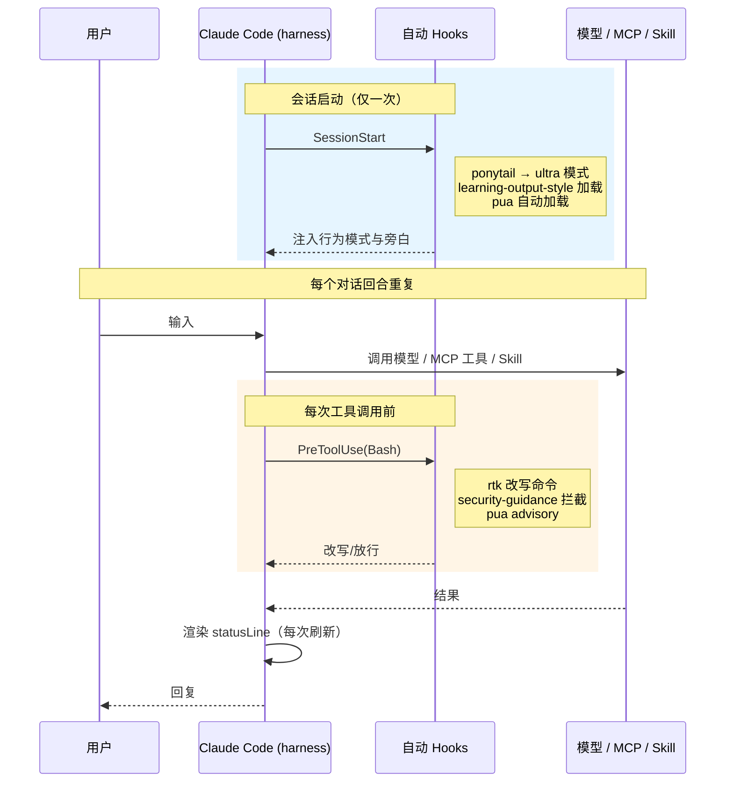

---
分类:
  - "[[Claude Code]]"
关联笔记:
  - "[[插件]]"
  - "[[MCP]]"
  - "[[Hooks]]"
  - "[[skills]]"
  - "[[斜杠命令]]"
  - "[[SubAgent]]"
描述: 本机 Windows 环境下 Claude Code 全局扩展（插件 / MCP / Hooks / 模型代理）的实测可用性、触发方式与依赖清单。
排序: 496
分组:
创建时间: 2026年07月02日
---
# 已安装扩展

> [!info] 说明
> 本文所有结论均来自 **2026-07-02 的实测**（`claude --version`、`claude mcp list`、`cat ~/.claude/settings.json`、`~/.claude/plugins/installed_plugins.json`、直接启动 MCP 进程等），非臆想。仅覆盖**全局**（user scope）扩展，不含项目级 `.claude/skills`。==2026-07-02 MCP 复测：`codebase-memory-mcp` 已卸载（exe / `mcpServers` 配置 / cbm hooks / 全局 skill 全清，零残留），MCP 由 5 个减至 4 个==。
>
> **组织方式**：每个扩展独占一个标题——插件按功能归入 `###` 分类、其下每个插件一个 `####` 标题；手写扩展直接各占一个 `###`。每个标题下彻底讲清来源 / 版本 / 提供能力 / 触发 / 用法 / 状态 / 配置位置。==用 Obsidian 大纲（TOC）按标题速查==，无需跨章节拼凑。

## 环境基线

| 项 | 实测值 |
|---|---|
| Claude Code 版本 | `2.1.197` |
| 操作系统 / Shell | Windows 11 + Git Bash (MSYS) |
| Node / npm / npx | `v24.18.0` / `11.16.0` / `11.16.0` |
| 模型 | `glm-5.2[1m]`，经 `ANTHROPIC_BASE_URL=https://open.bigmodel.cn/api/anthropic` 代理（详见 [[#模型代理]]） |
| 全局配置目录 | `~/.claude/`（`settings.json`、`~/.claude.json`、`plugins/`） |
| 运行参数（`settings.json`） | `permissions.defaultMode: bypassPermissions`（免确认，配合 `skipDangerousModePermissionPrompt`）、`effortLevel: xhigh` |

> [!warning] 全局 `~/.claude/skills/` 为空、无 `~/.claude/agents/`
> 本机**没有**手写的 `~/.claude/agents/`；`~/.claude/skills/` 为空（`codebase-memory-mcp` 卸载后，其安装的全局 skill `codebase-memory` 已一并清除）。所有 skills / sub-agents 全部来自插件或 Claude Code 内置。

## 触发方式总览

| 触发类型 | 含义 | 本机实例 |
|---|---|---|
| **自动触发** | 会话启动或工具事件时由 harness 执行，无需用户输入 | Hooks（`PreToolUse` 等）、`SessionStart`、`statusLine`、各插件事件钩子 |
| **手动触发** | 用户键入 `/命令` 才执行 | 插件提供的斜杠命令（`/pua:*`、`/ponytail-*`、`/hookify` 等） |
| **按需调用（半自动）** | 工具始终可用，由模型在相关时主动调用，或用户显式 `/` 调用 | skills、MCP 工具、sub-agents |

上图说的是「**谁**会触发」，下图说明它们在**一个回合里何时**触发（只有自动触发的项，手动斜杠命令由用户决定时机，不在其中）：

> [!example] 本次会话的自动触发实证
> - 会话首条即出现 `PONYTAIL MODE ACTIVE — level: ultra` 与 `learning output style mode` → 证明 **ponytail** 与 **learning-output-style** 的 `SessionStart` 钩子已自动执行。
> - 每次 `Bash` 调用结果里都带 `PreToolUse:Bash hook` 上下文（如 `rtk` 改写、`PUA Integrity Guard` 提醒）→ 证明 **rtk hook** 与 **pua/security-guidance** 的事件钩子在每次工具调用时自动生效。

## 一、插件（12 个）

> [!tip] 配置位置（所有插件共用）
> - 清单：`~/.claude/plugins/installed_plugins.json`
> - 启用开关：`~/.claude/settings.json` 的 `enabledPlugins`（12 个全部 `true`）
> - 市场源：`~/.claude/plugins/known_marketplaces.json`（`claude-plugins-official` 官方、`ponytail`、`pua-skills` 三家），详见 [[官方插件镜像源]]、[[插件]]

### 工作流与行为约束

#### superpowers

> 官方仓库：[obra/superpowers](https://github.com/obra/superpowers)

- **来源 / 版本**：`claude-plugins-official` / v6.1.0
- **提供**：14 skills / 5 hooks
- **触发**：半自动（skill）
- **作用与用法**：工作流骨架——`brainstorming`（动手前必先头脑风暴）、`systematic-debugging`、`test-driven-development`、`writing-plans` 等，模型在相关场景自动调用。
- **斜杠命令**（来自 `skills/`，共 14 个，均为 skill，通过 `/superpowers:名` 调用）：

| 调用 | 作用 |
|---|---|
| `/superpowers:using-superpowers` | 会话起始确立如何使用 skills（强制先调 skill 再回复） |
| `/superpowers:brainstorming` | 动手前必先头脑风暴：意图 / 需求 / 设计 |
| `/superpowers:writing-plans` | 有规格 / 需求、动代码前先写实施计划 |
| `/superpowers:executing-plans` | 在独立会话执行已写好的计划（含审查检查点） |
| `/superpowers:subagent-driven-development` | 当前会话执行含独立任务的计划 |
| `/superpowers:dispatching-parallel-agents` | 2+ 个无共享状态的独立任务并行派发 |
| `/superpowers:systematic-debugging` | bug / 测试失败 / 异常行为，提方案前先用 |
| `/superpowers:test-driven-development` | 实现任何功能 / 修复前先写测试 |
| `/superpowers:requesting-code-review` | 完成任务 / 大功能 / 合并前请求代码审查 |
| `/superpowers:receiving-code-review` | 收到审查反馈、实施建议前（重技术严谨，非盲从） |
| `/superpowers:verification-before-completion` | 声称完成 / 通过前先跑验证：证据先于断言 |
| `/superpowers:finishing-a-development-branch` | 实现完成且测试过，决定如何集成（merge / PR / 清理） |
| `/superpowers:using-git-worktrees` | 需要隔离工作区或执行计划前确保 worktree |
| `/superpowers:writing-skills` | 新建 / 编辑 / 验证 skill |

#### ponytail

> 官方仓库：[DietrichGebert/ponytail](https://github.com/DietrichGebert/ponytail)

- **来源 / 版本**：`ponytail` / v4.8.4
- **提供**：6 skills / 6 cmds / 10 hooks
- **触发**：SessionStart 自动 + 手动
- **作用与用法**："最懒解"编码守则；`/ponytail-help` 查全部命令，`/ponytail-review` 审过度设计，`/ponytail-audit` 全仓库审计，`/ponytail-debt` 汇总 `ponytail:` 注释欠账。
- **斜杠命令**（`commands/*.toml` + `skills/`，6 个名字，命令与 skill 同名合并）：

| 调用 | 作用 |
|---|---|
| `/ponytail` | 切换 ponytail 强度等级（lite / full / ultra / off） |
| `/ponytail-help` | 速查卡：等级、skills、命令一览（只读，不改状态） |
| `/ponytail-review` | 审查**当前改动**的过度设计（只论该不该删，不论正确性） |
| `/ponytail-audit` | **全仓库**过度设计审计，按可删行数排序 |
| `/ponytail-debt` | 把 `ponytail:` 注释汇总成可追踪的欠账台账 |
| `/ponytail-gain` | 展示 ponytail 实测收益榜（代码 / 成本 / 速度，基准中位数） |

#### pua

> 官方仓库：[tanweai/pua](https://github.com/tanweai/pua)

- **来源 / 版本**：`pua-skills` / v3.5.0
- **提供**：12 skills / 22 cmds / 7 agents / 11 hooks
- **触发**：自动 + 手动
- **作用与用法**：生产力 coaching；`/pua:on` 常驻、`/pua:off` 关；`/pua:p7` `/pua:p9` `/pua:p10` 多 agent 协作；`/pua:kpi` 报告卡；`/pua:done-check` 完成验收；另有 `/pua:evidence` `/pua:flavor` `/pua:ding` `/pua:mama` `/pua:yes` `/pua:loop` 等。
- **提供的 Sub-Agents**：`pua:tech-lead-p9`、`pua:senior-engineer-p7`、`pua:cto-p10`、`pua:pua-action-executor`、`pua:pua-policy-guardian`、`pua:pua-self-reviewer`、`pua:pua-verifier`（与 `agents/` 计数 7 吻合，详见 [[SubAgent]]、[[Agent Teams]]）。
- **斜杠命令**（`commands/*.md` + `skills/`，共 25 项；9 个名字命令与 skill 同名合并，3 个为纯 skill）：

| 调用 | 作用 |
|---|---|
| `/pua` | 总入口，按自然语言路由到下述子命令 |
| `/pua:on` · `/pua:off` | 开启 / 关闭默认模式（新会话是否自动加载 PUA） |
| `/pua:offline` | 离线模式：关联网反馈与排行榜上报，保留本地行为 |
| `/pua:p7` | P7 骨干模式：方案驱动执行子任务 |
| `/pua:p9` | P9 Tech Lead：写 Task Prompt 管 P8 团队 |
| `/pua:p10` | P10 CTO：定战略、管 P9 |
| `/pua:pro` | PUA Pro：自进化 + Platform + 指令系统 |
| `/pua:loop` | 显式启用自动迭代辅助模式 |
| `/pua:cancel-pua-loop` | 取消当前活跃的 PUA Loop（含 state / worktree / 记录） |
| `/pua:done-check` | 完成验收（没跑测试 / 没证据别说完成） |
| `/pua:evidence` | 证据链 / 交付物核对 |
| `/pua:again` | 换本质不同的方案再试（同路径反复失败时） |
| `/pua:yes` | Yes 夸夸模式（ENFP 型鼓励） |
| `/pua:mama` | 妈妈唠叨提醒风格 |
| `/pua:ding` | 钉内 / 钉外味职场提醒 |
| `/pua:flavor` | 在 15 种味道中切换 |
| `/pua:kpi` | 生成段位 / 绩效报告卡 |
| `/pua:survey` | 7 部分交互式调研问卷 |
| `/pua:team-status` | 查看活跃 agent / team 清单、PID、TTL |
| `/pua:reap-orphans` | 扫描并清理过期 agent / state |
| `/pua:teardown-all` | 停止并清理所有活跃 agent / team 状态 |
| `/pua:pua-en`（skill） | 英文版绩效 coaching：重复失败 / 被动 / 完成质量问题 |
| `/pua:pua-ja`（skill） | 日本語版生産性コーチング（同一套方法论） |
| `/pua:shot`（skill） | PUA 精简全集，用于显式注入子 agent / 短会话 |

#### hookify

> 官方仓库：[anthropics/claude-plugins-official](https://github.com/anthropics/claude-plugins-official/tree/main/plugins/hookify)

- **来源 / 版本**：`claude-plugins-official` / vunknown
- **提供**：1 skill / 4 cmds / 1 agent / 6 hooks
- **触发**：手动
- **作用与用法**：用对话生成防错 hooks；`/hookify` 从当前会话分析行为并生成规则，`/hookify:list` 查看已配置规则，`/hookify:configure` 启停规则，`/hookify:help` 帮助。
- **提供的 Sub-Agents**：`hookify:conversation-analyzer`。
- **斜杠命令**（`commands/*.md` + `skills/`，共 5 项；4 命令 + 1 skill）：

| 调用 | 作用 |
|---|---|
| `/hookify` | 从当前会话分析或按明确指令生成防错 hook 规则 |
| `/hookify:list` | 列出已配置的全部 hookify 规则 |
| `/hookify:configure` | 交互式启用 / 禁用 hookify 规则 |
| `/hookify:help` | 查看 hookify 使用帮助 |
| `/hookify:writing-rules`（skill） | hookify 规则的语法与模式指引（创建 / 编写 / 配置规则时） |

### 设计与开发辅助

#### frontend-design

> 官方仓库：[anthropics/claude-plugins-official](https://github.com/anthropics/claude-plugins-official/tree/main/plugins/frontend-design)

- **来源 / 版本**：`claude-plugins-official` / vunknown
- **提供**：1 skill
- **触发**：半自动（skill）
- **作用与用法**：构建/重塑 UI 时的视觉设计指导（排版、审美方向）。
- **斜杠命令**（来自 `skills/`，共 1 个 skill）：

| 调用 | 作用 |
|---|---|
| `/frontend-design:frontend-design` | 构建 / 重塑 UI 时的视觉设计指导（排版、审美、避免模板化） |

#### skill-creator

> 官方仓库：[anthropics/claude-plugins-official](https://github.com/anthropics/claude-plugins-official/tree/main/plugins/skill-creator)

- **来源 / 版本**：`claude-plugins-official` / vunknown
- **提供**：1 skill
- **触发**：半自动（skill）
- **作用与用法**：新建/编辑/评测 skill。
- **斜杠命令**（来自 `skills/`，共 1 个 skill）：

| 调用 | 作用 |
|---|---|
| `/skill-creator:skill-creator` | 新建 / 编辑 / 优化 skill，跑 eval、基准评测、改触发描述 |

#### claude-md-management

> 官方仓库：[anthropics/claude-plugins-official](https://github.com/anthropics/claude-plugins-official/tree/main/plugins/claude-md-management)

- **来源 / 版本**：`claude-plugins-official` / v1.0.0
- **提供**：1 skill / 1 cmd
- **触发**：手动
- **作用与用法**：`/revise-claude-md` 用本次会话经验更新 CLAUDE.md；`claude-md-improver` skill 审计并改进 CLAUDE.md。
- **斜杠命令**（`commands/*.md` + `skills/`，共 2 项；1 命令 + 1 skill）：

| 调用 | 作用 |
|---|---|
| `/revise-claude-md` | 用本次会话的经验更新 CLAUDE.md |
| `/claude-md-management:claude-md-improver`（skill） | 审计并改进 CLAUDE.md（扫描全部、按模板评分、定向更新） |

### 浏览器与文档 MCP

> 这一组插件以 **MCP** 形式对外提供工具，命令、依赖、状态、触发工具都在各自标题下讲清。

#### chrome-devtools-mcp

> 官方仓库：[ChromeDevTools/chrome-devtools-mcp](https://github.com/ChromeDevTools/chrome-devtools-mcp)

- **来源 / 版本**：`claude-plugins-official` / v1.4.0
- **提供**：6 skills + MCP
- **触发**：半自动（skill + MCP）
- **MCP 命令**：`npx chrome-devtools-mcp@1.4.0`
- **依赖**：node/npx + Chrome
- **工具**：skills 含 `chrome-devtools`、`a11y-debugging`、`debug-optimize-lcp`、`memory-leak-debugging` 等；MCP 提供 `list_pages` / `navigate_page` / `take_snapshot` / `performance_start_trace` 等 DevTools 工具
- **状态**：✔ **Connected**（同日复测恢复）
- **斜杠命令**（来自 `skills/`，共 6 个 skill；==MCP 工具是模型 tool_use 调用，非 `/` 斜杠触发==，见上「工具」行）：

| 调用 | 作用 |
|---|---|
| `/chrome-devtools-mcp:chrome-devtools` | DevTools 调试 / 浏览器自动化 / 性能分析总入口 |
| `/chrome-devtools-mcp:chrome-devtools-cli` | 用 shell 脚本 / 命令行驱动 Chrome DevTools |
| `/chrome-devtools-mcp:a11y-debugging` | 无障碍（a11y）审计：语义 HTML / ARIA / 焦点 / 对比度 |
| `/chrome-devtools-mcp:debug-optimize-lcp` | 调试并优化 Largest Contentful Paint（LCP） |
| `/chrome-devtools-mcp:memory-leak-debugging` | JS / Node.js 内存泄漏诊断（heapsnapshot、memlab） |
| `/chrome-devtools-mcp:troubleshooting` | DevTools MCP 连接 / 目标故障排查 |

#### playwright

> 官方仓库：[microsoft/playwright-mcp](https://github.com/microsoft/playwright-mcp)

- **来源 / 版本**：`claude-plugins-official` / vunknown
- **提供**：仅 MCP
- **触发**：按需（MCP）
- **MCP 命令**：`npx @playwright/mcp@latest`
- **依赖**：node/npx + 浏览器
- **工具**：`browser_navigate` / `browser_snapshot` / `browser_click` 等浏览器自动化工具
- **状态**：✔ **Connected**（同日复测恢复）
- **斜杠命令**：无（仅 MCP 工具）

#### context7

> 官方仓库：[upstash/context7](https://github.com/upstash/context7)

- **来源 / 版本**：`claude-plugins-official` / vunknown
- **提供**：仅 MCP
- **触发**：按需（MCP）
- **MCP 命令**：`npx -y @upstash/context7-mcp`
- **依赖**：node/npx + 联网
- **工具**：`resolve-library-id` / `get-library-docs` 查第三方库文档
- **状态**：✔ **Connected**（`--help` 可正常启动）
- **斜杠命令**：无（仅 MCP 工具）。

> [!success] 浏览器类 MCP：冷启动瞬时失败 → 同日复测已连通
> 针对 chrome-devtools-mcp 与 playwright：
> - **复测结果**：同日再次 `claude mcp list`，两者均 ✔ **Connected**；会话内调 `list_pages`、`browser_tabs list` 也能正常返回，握手确已成功。
> - **根因（已证实，非「疑似」）**：失败发生在 Claude Code 健康检查的**握手窗口**内——浏览器类 MCP 依赖 `playwright-core` 等重包，**首次冷下载 + require** 耗时超出窗口；而轻量的 `context7`（同走 npx）冷启动够快，故当天唯独它连通。包一旦进入 `_npx` 缓存，热启动降到约 **2.6s**（实测 chrome-devtools-mcp `2.72s` / playwright `2.58s`），握手稳定成功。
> - **性质**：==冷启动瞬时故障，非持续性 bug==。清缓存 / 换机 / 升包版本后的**首次**启动仍可能再次瞬时失败，重连或预热即可恢复。
> - **缓存实证**：`~/AppData/Local/npm-cache/_npx/` 下已有 `chrome-devtools-mcp`、`@playwright/mcp` + `playwright-core` 的缓存副本，印证「预热后自愈」。
> - **处置**：无需改配置；若想避免下次冷启动再现，可预热包（`npx chrome-devtools-mcp@1.4.0 --help`、`npx @playwright/mcp@latest --help`）或固定包版本而非 `@latest`。

### 会话行为（自动触发）

#### learning-output-style

> 官方仓库：[anthropics/claude-plugins-official](https://github.com/anthropics/claude-plugins-official/tree/main/plugins/learning-output-style)

- **来源 / 版本**：`claude-plugins-official` / v1.0.0
- **提供**：1 SessionStart hook
- **触发**：自动
- **作用与用法**：会话启动自动加载"学习+讲解"输出风格（本次已生效）。
- **斜杠命令**：无（仅 SessionStart hook）。

#### security-guidance

> 官方仓库：[anthropics/claude-plugins-official](https://github.com/anthropics/claude-plugins-official/tree/main/plugins/security-guidance)

- **来源 / 版本**：`claude-plugins-official` / v2.0.6
- **提供**：13 hooks
- **触发**：自动
- **作用与用法**：13 个事件钩子，拦截危险命令/提示注入（本次对 playwright 路径出现的 `PUA Integrity Guard` 提醒即其一）。
- **斜杠命令**：无（仅事件 hooks）。

> [!note] 非插件、非手写：Claude Code 内置能力
> 上面的斜杠命令与 Sub-Agents 只列了**插件提供**的部分。Claude Code **内置**（非插件、非手写扩展）的能力另见专门笔记：
> - **内置斜杠命令**：`/code-review` `/simplify` `/security-review` `/init` `/loop` `/verify` `/run` `/fewer-permission-prompts` 等，详见本文 [[#三、Claude Code 内置斜杠命令（开发相关）]] 及 [[斜杠命令]]。
> - **内置 Sub-Agents**：`Explore`、`Plan`、`general-purpose`、`claude-code-guide`、`statusline-setup` 等，详见 [[SubAgent]]、[[Agent Teams]]。

## 二、手写扩展（非插件）

> [!tip] 配置位置（所有手写扩展共用）
> 不来自插件市场，手写在 `~/.claude/settings.json` 或 `~/.claude.json` 里，或依赖独立二进制。
> 手写扩展**均不提供斜杠命令**：`idea` 经 MCP 暴露**工具**（非命令），模型代理是环境变量，`rtk` / `statusLine` 是 hook / 脚本。

### 模型代理

- **配置位置**：`~/.claude/settings.json` 的 `env` 段
- **作用**：模型走第三方代理、放大超时与上下文窗口、默认开启 ponytail ultra
- **关键项**：
    - `ANTHROPIC_BASE_URL=https://open.bigmodel.cn/api/anthropic`（智谱代理）
    - `API_TIMEOUT_MS=3000000`（50 min 超时）
    - `CLAUDE_CODE_AUTO_COMPACT_WINDOW=1000000`（放大自动压缩窗口）
    - `CLAUDE_CODE_DISABLE_NONESSENTIAL_TRAFFIC=1`（关闭非必要遥测/流量）
    - `CLAUDE_CODE_ATTRIBUTION_HEADER=0`（关闭归因头）
    - `PONYTAIL_DEFAULT_MODE=ultra`（默认开启 ponytail ultra）
    - 模型映射：`ANTHROPIC_DEFAULT_HAIKU_MODEL=glm-4.5-air`；`ANTHROPIC_DEFAULT_SONNET_MODEL` / `ANTHROPIC_DEFAULT_OPUS_MODEL` / `ANTHROPIC_MODEL` 均为 `glm-5.2[1m]`

### idea MCP

- **配置位置**：`~/.claude.json` 的 `mcpServers` 段（手写 HTTP）
- **MCP 命令**：HTTP `http://127.0.0.1:64342/stream`
- **依赖**：==JetBrains IDE 必须运行==（IDE 内置 MCP 插件监听 64342）
- **工具**：`read_file` / `search_symbol` / `analyze_calls` / `lint_files` / 调试器等，操作 IDE 工程
- **状态**：✔ **Connected**（`netstat` 确认 64342 已建立连接）

### rtk

- **配置位置**：`~/.claude/settings.json` 的 `hooks.PreToolUse[Bash]` → `rtk hook claude`
- **依赖**：`rtk` 二进制（v0.43.0，`rtk hook` 子命令可用）
- **作用**：每次 Bash 调用自动改写为 `rtk` 令牌优化代理（据 RTK.md 称 60–90% 节省）。✅ 本次每次 Bash 结果均带 rtk 上下文

### statusLine 脚本

- **配置位置**：`~/.claude/settings.json` 的 `statusLine` → `bash ~/.claude/statusline-command.sh`
- **作用**：每次渲染状态栏时执行该脚本

## 三、Claude Code 内置斜杠命令（开发相关）

> [!info] 范围与来源
> 本节列 Claude Code **自带 default skills**（无插件前缀、非项目级 `.claude/skills`），均可在 REPL 用 `/命令` 调用，描述取自会话 Skill 工具列表（==非臆想==）。`claude --help` 中 `--disable-slash-commands` 注为 "Disable all skills"，亦印证**斜杠命令即 skills**。
> 另有一类 **REPL 会话原生命令**（`/clear` `/compact` `/model` `/context` `/rewind` 等，管上下文 / 会话 / 模型）硬编码在 CLI、非 skill 型、无法从文件索引，此处不展开，详见 [[斜杠命令]]。

### 代码审查与质量

| 调用 | 作用 |
|---|---|
| `/code-review` | 审查**当前工作 diff**：正确性 bug + 复用 / 简化 / 效率清理；可选 `--comment` 发 PR 行内评论、`--fix` 直接应用 |
| `/simplify` | 只做质量清理（复用 / 简化 / 效率 / altitude）并直接改，==不查 bug==；找 bug 用 `/code-review` |
| `/security-review` | 对当前分支待提交改动做完整安全审查（注入 / XSS / 密钥等） |
| `/review` | 审查 **GitHub PR**；本地工作 diff 用 `/code-review` |

### 运行与验证

| 调用 | 作用 |
|---|---|
| `/run` | 启动并驱动本项目 app，看改动在真实应用里跑起来 |
| `/verify` | 验证改动确实生效：跑应用 + 观察行为（确认修复 / 手动测试 / 本地改动验证） |
| `/loop` | 按固定间隔循环跑 prompt 或斜杠命令（如 `/loop 5m /foo`，默认 10m）；用于轮询 CI / 部署 / 状态，**非一次性任务** |

### 项目初始化与配置

| 调用 | 作用 |
|---|---|
| `/init` | 为代码库初始化 `CLAUDE.md`（生成项目文档） |
| `/update-config` | 配置 `settings.json`：权限、env、hooks、状态线等（"允许 X"、"设 X=Y"、hook 排错） |
| `/fewer-permission-prompts` | 扫描历史里常见的只读 Bash / MCP 调用，加进项目 allowlist 减少权限弹窗 |
| `/keybindings-help` | 自定义键位 / 和弦（`~/.claude/keybindings.json`） |

### API 参考

| 调用 | 作用 |
|---|---|
| `/claude-api` | Claude API / Anthropic SDK 速查：模型 ID、定价、参数、流式、tool use、MCP、agents、缓存、计 token、迁移 |

## 结论

- **可用（实测通过）**：12 个插件全部加载；MCP 4 个全部连通（`context7`、`idea`、`playwright`、`chrome-devtools-mcp`，后两者为冷启动瞬时失败后同日复测恢复）；rtk 及各事件 hook、SessionStart 钩子均按预期自动触发。
- **已卸载**：`codebase-memory-mcp`（2026-07-02 复测）——本地 exe、`~/.claude.json` 的 `mcpServers` 配置、`~/.claude/hooks/cbm-*` 两个脚本、全局 `~/.claude/skills/codebase-memory/` skill 已全部清除，零残留；MCP 总数由 5 减至 4。
- **瞬时故障（已自愈）**：`playwright`、`chrome-devtools-mcp` 两个浏览器类 MCP 首次冷启动握手超时，**同日复测已 Connected**；清缓存/换机首次仍可能再现，重连或预热即恢复，非持续性 bug。
- **依赖核心**：node 24 / npx 11（驱动所有 npx 型 MCP）、JetBrains IDE 运行（驱动 idea MCP）、`rtk` 二进制（驱动 Bash 代理 hook）、外网到 `open.bigmodel.cn`（驱动模型）。
