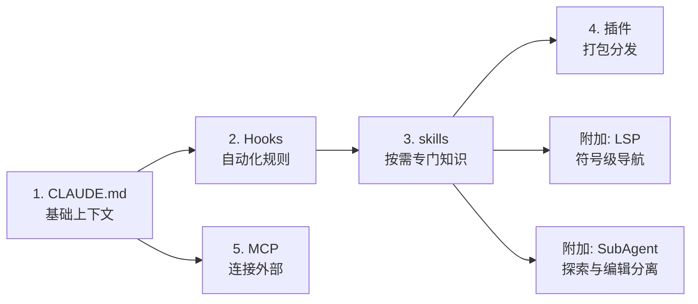

---
分类:
  - "[[Claude Code]]"
关联笔记:
  - "[[Hooks]]"
  - "[[skills]]"
  - "[[MCP]]"
  - "[[SubAgent]]"
  - "[[上下文管理]]"
描述: Claude Code 在大型代码库的最佳实践——harness 五扩展点的协作与三种部署模式
排序: 500
分组:
创建时间: 2026年06月26日
---
# 最佳实践

> 本篇是对 [[ClaudeCode在大型代码库中的工作方式：最佳实践与入门]] 的整理与提炼，原文已裁剪入库，此处只写自己的理解。

## 是什么：harness 与模型同等重要

一个常见误解是：Claude Code 的能力完全由所用**模型**决定。实际上，围绕模型构建的生态系统——**harness（驱动组件）**——比单独的模型更能决定 Claude Code 的表现。

harness 由**五个扩展点**构成，每个承担不同功能，且**构建顺序重要**（每层建立在前者之上）：

| 顺序 | 扩展点 | 它是什么 | 何时加载 | 最佳适用场景 |
| --- | --- | --- | --- | --- |
| 1 | **CLAUDE.md** | Claude 自动读取的上下文文件 | 每个会话 | 项目约定、代码库知识 |
| 2 | **[[Hooks]]** | 在关键时刻运行的脚本 | 由事件触发 | 自动化一致行为、捕捉会话学习 |
| 3 | **[[skills]]** | 为特定任务打包的指令 | 按需使用 | 可跨会话复用的专门知识 |
| 4 | **插件** | 捆绑 skills + hooks + MCP 配置 | 配置后始终可用 | 在组织内分发可行方案 |
| 5 | **[[MCP]]** | 连接外部工具与数据 | 配置后始终可用 | 赋予 Claude 对内部工具的访问权 |

另有**两项附加能力**完善配置：

| 能力 | 说明 | 常见混淆 |
| --- | --- | --- |
| **LSP 集成** | 通过插件层访问，提供符号级代码智能（转到定义、查找引用） | 以为它是自动的——其实需要手动装语言服务器插件 |
| **[[SubAgent]]** | 为特定任务派生的独立 Claude 实例 | 在同一会话里同时做探索和编辑（应分离） |

## 在哪配：三种部署模式

如何配置取决于代码库结构，但成功部署中反复出现三种模式。

### 模式一：使代码库在大规模下可导航

Claude 的表现受限于其「找到正确上下文」的能力。加载过多会降低性能，过少则如盲人摸象。前期投入让代码库对 Claude 可读：

| 做法 | 要点 |
| --- | --- |
| **CLAUDE.md 精简且分层** | 根目录放整体概览与关键注意事项，子目录放局部约定。Claude 会自动向上遍历加载沿途文件 |
| **在子目录初始化，而非仓库根** | Claude 限定在与任务相关的代码部分时效果最佳；根级上下文不会丢失（自动向上遍历） |
| **为每个子目录限定测试 / lint 命令** | 改了一个服务却跑完整测试套件会超时、浪费上下文。子目录级 `CLAUDE.md` 指定本部分适用命令 |
| **用 `.claude/settings.json` 提交排除规则** | `permissions.deny` 规则排除生成文件、构建产物、第三方代码，团队每人共享同样的噪声减少 |
| **目录结构无法发挥作用时构建代码库映射** | 仓库根放轻量 Markdown，列出每个顶级文件夹并用一行描述 |
| **运行 LSP 服务器按符号搜索** | 对常见函数名 Grep 会返回数千匹配，LSP 只返回指向同一符号的引用，过滤在读取前完成 |

### 模式二：随模型演进积极维护 CLAUDE.md

为当前模型写的指令，可能对未来的模型产生不利影响——曾经必要的约束，在新模型上可能变成主动束缚。**每 3-6 个月做一次有意义的审查**，主要模型发布后若性能达平台期也值得审查。

### 模式三：为 Claude Code 管理和采用指定所有权

仅靠技术配置无法推动采用，组织层面也要投入：

- **部署前先有基础设施投入**：让开发者的首次体验是高产而非令人沮丧，采用率由此扩散。
- **指定 DRI（直接负责人）**：哪怕只有一人，也要有权限就设置、权限策略、插件市场、`CLAUDE.md` 约定做决策。
- **集中有效做法**：自下而上会带来热情，但无人汇总则导致碎片化。需有人推广标准化的 `CLAUDE.md` 层级、精选的 skills 与 plugins。

## 怎么配 / 怎么用：扩展点的协作顺序

构建 harness 时**按顺序逐层搭建**，这是最关键的实践：

| 实践 | 说明 |
| --- | --- |
| **CLAUDE.md 文件优先** | 它是其他一切的基础，每次会话加载。保持精简分层，避免把可复用的专门知识塞进来（那是 skills 的职责） |
| **用 Hooks 让设置自我改进** | 不要只当「阻止 Claude 出错」的脚本——`Stop` hook 可反思会话并建议更新 `CLAUDE.md`；`SessionStart` hook 动态加载团队特定上下文 |
| **用 skills 卸载专门知识** | 几十种任务类型不必都进每个会话。skills 通过渐进式披露按需加载，可限定到特定路径 |
| **用插件分发可行方案** | 把 skills + hooks + MCP 打包，新工程师第一天装插件即获得与老成员相同的上下文。避免「优秀配置停留在部落式传承」 |
| **LSP 在多语言 / 强类型代码库优先** | 对 C/C++、Java 这类语言，符号级导航是大规模下可靠性的关键投资 |
| **MCP 在基础功能就绪后再建** | 别在基础功能未就绪前就急着构建 MCP 连接 |
| **SubAgent 分离探索与编辑** | 启动只读子代理映射子系统、把发现写入文件，主代理掌握全貌后再编辑 |

> [!warning] 常见反模式
> - 把所有规则塞进 `CLAUDE.md` → 应拆给 [[skills]] 按需加载。
> - 把本该自动运行的规则写成提示词 → 应交给 [[Hooks]] 确定性执行。
> - 在同一会话里同时做探索和编辑 → 应交给 [[SubAgent|子代理]] 隔离。
> - 优秀配置停留在部落传承 → 应打包成插件分发。
> - 假设 LSP 集成是自动的 → 需手动安装语言服务器插件。

## 相关

- 原文（已裁剪）：[[ClaudeCode在大型代码库中的工作方式：最佳实践与入门]] —— 完整论述含三种配置模式、harness 架构图、企业部署清单
- 各扩展点详解：[[Hooks]]、[[skills]]、[[MCP]]、[[SubAgent]]、[[官方插件镜像源]]
- 上下文健康：[[上下文管理]] —— 压缩与 CLAUDE.md 精简互为表里
