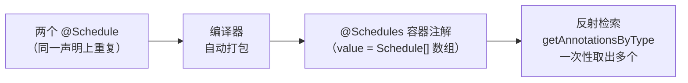

---
分类:
  - "网页裁剪"
  - "[[注解]]"
标题: "重复注解（Repeating Annotations）"
描述: "Java SE 8 引入的重复注解：声明、容器注解类型与通过反射检索"
来源: "https://docs.oracle.com/javase/tutorial/java/annotations/repeating.html"
发布者: "docs.oracle.com-Oracle"
发布时间:
创建时间: "2026-06-28T19:28:23+08:00"
---

## 重复注解

在某些情况下，你会希望将同一个注解多次应用于某个声明或类型使用。从 Java SE 8 版本开始，*重复注解(repeating annotation)* 使你能够做到这一点。

例如，你正在编写使用定时器服务的代码，该服务让你能够在给定时间或按某个调度运行某个方法，类似于 UNIX 的 cron 服务。现在你希望设置一个定时器，让 `doPeriodicCleanup` 方法在每月的最后一天以及每周五晚上 11 点各运行一次。要设置定时器运行，需创建一个 `@Schedule` 注解并将其两次应用于 `doPeriodicCleanup` 方法。第一次指定每月的最后一天，第二次指定周五晚上 11 点，如下面的代码示例所示：

```java
@Schedule(dayOfMonth="last")
@Schedule(dayOfWeek="Fri", hour="23")
public void doPeriodicCleanup() { ... }
```

上面的例子将注解应用于一个方法。你可以在任何使用标准注解的地方重复注解。例如，你有一个处理未授权访问异常的类。你用一个供管理员的 `@Alert` 注解和另一个供系统管理员的 `@Alert` 注解来标注该类：

```java
@Alert(role="Manager")
@Alert(role="Administrator")
public class UnauthorizedAccessException extends SecurityException { ... }
```

出于兼容性原因，重复注解存储在一个由 Java 编译器自动生成的*容器注解(container annotation)*中。为了让编译器做到这一点，你的代码中需要两处声明。整个过程如下：



## 第 1 步：声明一个可重复的注解类型

该注解类型必须用 `@Repeatable` 元注解标记。下面的示例定义了一个自定义的 `@Schedule` 可重复注解类型：

```java
import java.lang.annotation.Repeatable;

@Repeatable(Schedules.class) // 指定容器注解的类型
public @interface Schedule {
  String dayOfMonth() default "first";
  String dayOfWeek() default "Mon";
  int hour() default 12;
}
```

`@Repeatable` 元注解在括号中的值，是 Java 编译器为存储重复注解而生成的容器注解的类型。在本例中，容器注解类型是 `Schedules`，因此重复的 `@Schedule` 注解会被存储在一个 `@Schedules` 注解中。

在未事先声明某个注解为可重复的情况下，就将该注解多次应用于同一声明，会导致编译期错误。

## 第 2 步：声明容器注解类型

容器注解类型必须具有一个数组类型的 `value` 元素。该数组类型的组件类型必须是那个可重复的注解类型。`Schedules` 容器注解类型的声明如下：

```java
public @interface Schedules {
    Schedule[] value(); // 数组的组件类型 = 可重复注解类型
}
```

## 检索注解

Reflection API 中有若干方法可用于检索注解。返回单个注解的那些方法（例如 `getAnnotation`）的行为保持不变：仅当所请求类型的注解*恰好有一个*时才返回单个注解。如果所请求类型的注解有多个，你可以先获取其容器注解来获得它们——这样一来，遗留代码仍能继续工作。Java SE 8 中引入了其它一些方法，它们会扫描容器注解以一次性返回多个注解。两者对照如下：

| 方法 | 行为 | 适用场景 |
|---|---|---|
| [`getAnnotation(Class<T>)`](https://docs.oracle.com/javase/8/docs/api/java/lang/reflect/AnnotatedElement.html#getAnnotation-java.lang.Class-) | 仅当注解*恰好有一个*时返回单个 | 遗留代码，保持向下兼容 |
| [`getAnnotationsByType(Class<T>)`](https://docs.oracle.com/javase/8/docs/api/java/lang/reflect/AnnotatedElement.html#getAnnotationsByType-java.lang.Class-) | 扫描容器注解，一次性返回多个 | Java SE 8 引入，用于重复注解 |

有关所有可用方法的信息，请参见 [`AnnotatedElement`](https://docs.oracle.com/javase/8/docs/api/java/lang/reflect/AnnotatedElement.html) 类规范。

## 设计考量

在设计注解类型时，必须考虑该类型注解的*基数(cardinality)*：

> [!note] 重复注解的基数
> 某个注解可以被使用：
> - **零次** —— 完全不使用；
> - **一次** —— 普通注解；
> - **多次** —— 仅当其类型被标记为 `@Repeatable` 时。

还可以通过使用 `@Target` 元注解来限制注解类型可使用的位置。例如，你可以创建一个只能用于方法和字段的可重复注解类型。仔细设计你的注解类型非常重要，以确保*使用*该注解的程序员觉得它尽可能灵活且强大。
